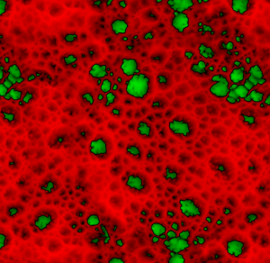

# Pintura de mapa de heights

## Ideia geral

Trabalhar em um mapa de altura em vez de trabalhar diretamente em um normal oferece várias vantagens, como melhor qualidade, melhor controle, flexibilidade e melhor consistência entre os recursos.

O processo é o seguinte:

* Um mapa normal, assado a partir de uma malha poli alta, é carregado na malha poli baixa.
* Você pintará detalhes adicionais no canal do mapa de altura.
* O Height que você pinta é composto por todas as camadas e convertido em um mapa normal em tempo real e, finalmente, mesclado com o normal da malha de alta poli.

Tudo que você tem que se preocupar é pintar aquele height, todo o resto é feito automaticamente.

### Formato HDR do height

O canal de Height usa um formato de cor **HDR**, que permite pintar valores positivos e negativos sem nunca atingir um limite de brilho, diferentemente dos mapas de height tradicionais, que saturarão entre 0 e 255.

* Ao pintar com um bitmap ou substância em um height, essa origem é remapeada de seu intervalo original [0,255] para um intervalo [-1,1].

Um cinza médio será remapeado para 0. Portanto, valores abaixo de 127 **subtrairão** do mapa de altura, enquanto valores acima de 127 **adicionarão** a ele ao usar o modo de mistura padrão definido para os mapas de height, **Subexposição Linear (Adicionar)**.

* Ao pintar com cor simples, você poderá selecionar valores entre -1 e 1 diretamente.

### Visualização de height

Ao visualizar o mapa de Heights no modo Solo, a visualização padrão mostrará apenas valores positivos, com forte saturação em preto para valores negativos.

A configuração **+/- cor** permite visualizar o intervalo completo usando uma cor diferente para os valores positivos e negativos.

A configuração de **Escala** permite modificar o intervalo visível desse mapa HDR caso você tenha adicionado ou subtraído mais do que o intervalo padrão [-1,1].

<table>
<tr style="border: 0;">
<td style="border: 0;" valign="top">

</td>
<td style="border: 0;" valign="top">

</td>
</tr>
</table>
