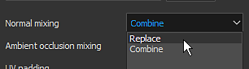
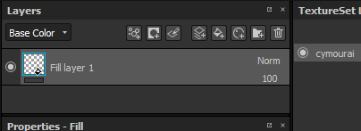

# Pintura de mapa normal

Os detalhes da pintura podem ser feitos pintando diretamente os dados do Mapa normal diretamente na malha. Esta página agrupa maneiras diferentes de gerenciar a pintura de mapa normal.

## Detalhes do mapa normal de pintura

Para tinta detalhes do mapa normal:

1. Adicionar um canal normal no Conjunto de Texturas atual (se ainda não estiver presente)
1. Ativar o canal normal na ferramenta de pintura atual
1. Carregue um recurso Normal no slot Normal da seção Material da ferramenta de pintura atual.

A partir daí, pintar com um mapa normal é muito semelhante à [Pintura em mapa de altura](height-map-painting.md), com a precisão adicional de um normal feito bake.

## Modos de mesclagem normais

Os mapas normais têm seus próprios modos de mesclagem na pilha de camadas:

* **Detalhes do Mapa normal** (padrão)
* **Detalhes Inversos do Mapa normal**
* **Combinação de Mapas normais**

Para saber mais sobre eles, consulte a página [Modos de mesclagem](../../interface/layer-stack/blending-modes.md).

## Espaço de cor normal

Ao carregar uma mapa normal no slot de um material (propriedades da ferramenta ou camada de preenchimento), é possível alterar o espaço de cores padrão.

Essa configuração pode ser usada para especificar o Formato de mapa normal, pois, por padrão, um mapa normal de DirectX (Y-) é esperado (não é afetado pela configuração do projeto). Portanto, ao usar um mapa normal OpenGL (Y+), é necessário clicar na seta pequena para abrir o menu de espaço de cores e alterar o espaço de cores do bitmap.

## Pintura sobre uma mapa normal feita bake

Em algumas situações, pode ser útil tinta sobre o mapa normal feito bake para ocultar detalhes (ou até mesmo corrigir problemas de fça bake).\
A configuração padrão de um projeto no Substance 3D Painter não permite isso, pois calcula o canal normal e o normal feito bake separadamente. Esse comportamento pode ser alterado por meio das [configurações do Conjunto de Texturas](../../interface/texture-set/texture-set-settings.md).

### 1 - Alterar o modo de mesclagem do conjunto de texturas

Por padrão, um Conjunto de Texturas é criado com a configuração **mistura normal** definida como **combinação**.

Para substituir/tinta o mapa normal, é importante definir essa configuração como **substituir**. O mapa normal desaparecerá da viewport, mas isso é esperado. Alterar esse modo para **substituir** indica que o Substance 3D Painter deve considerar apenas o canal normal e o canal de height ao gerar o mapa normal final.

### 2 - Definir uma camada de preenchimento com a mapa normal feita bake

Crie uma nova camada de preenchimento e coloque o normal feito bake dentro do slot “normal” por meio do painel de propriedades. Não se esqueça de alterar a divisão padrão da camada de preenchimento se não estiver definida como 1.

### 3 - Alterar o modo de mesclagem da camada de preenchimento

Por padrão, o modo de mesclagem do canal normal em qualquer nova camada é definido como “detalhes do Mapa normal”. Como é preferível usar a camada de preenchimento como base, escolhemos o modo de mesclagem “normal”, pois o bitmap não tem nenhum alfa, ele substituirá tudo abaixo (incluindo a cor padrão do sombreador).

### 4 - Criar uma camada para tinta sobre a mapa normal feita bake

Crie uma nova camada (normal ou de preenchimento) e altere o modo de mesclagem para “normal” para o canal normal. Depois que essa configuração for concluída, qualquer coisa pintada no canal normal assumirá o controle do mapa normal feito bake que estiver na camada abaixo.

