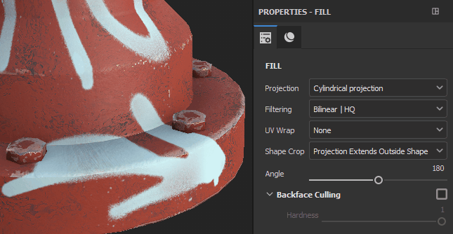

# Projeção cilíndrica

A projeção cilíndrica do preenchimento permite projetar imagens e padrões ao redor de um objeto. Pode ser útil para ajustar pilares ou colunas, bem como formas orgânicas como braços.

## Propriedades

| Configuração | Descrição |
| --- | --- |
| **Filtragem** | Controla como a textura ou o material será filtrado. Essa configuração pode afetar a aparência da textura quando repetida várias vezes. Com valores de dimensionamento altos, o uso de um filtro diferente do padrão pode produzir resultados com melhor aparência. Configurações atuais disponíveis:<ul data-preserve-html="true"><li data-preserve-html="true"><strong>HQ `\|` bilinear</strong> (padrão): uma filtragem bilinear avançada que tenta melhorar a qualidade da textura quando os valores de divisão em blocos gráficos são altos.</li><li data-preserve-html="true"><strong>Bilinear `\|` Sharp</strong>: filtragem bilinear simples que suaviza ligeiramente a textura, mas tenta preservar os detalhes.</li><li data-preserve-html="true"><strong>Mais próximo</strong>: sem filtragem, útil se a filtragem Bilinear fornecer um resultado desfocado e quebrar detalhes finos. É possível introduzir suavização na textura.</li></ul> |
| **Envoltório UV** | Controla como a textura se repete dentro da projeção. Os valores possíveis são:<ul data-preserve-html="true"><li data-preserve-html="true"><strong>Nenhuma</strong>: a textura não se repete. Qualquer item fora da textura é preto/transparente.</li><li data-preserve-html="true"><strong>Repetir horizontalmente</strong>: a textura se repete apenas horizontalmente.</li><li data-preserve-html="true"><strong>Repetir verticalmente</strong>: a textura só se repete verticalmente.</li><li data-preserve-html="true"><strong>Repetição</strong> (padrão): a textura se repete em ambos os eixos.</li></ul> 

 **Observação:** na imagem acima, a configuração de ângulo é definida como 90, limitando até onde a projeção se aplica. |
| **Corte da forma** | Defina se a textura projetada deve ser visível fora da área de projeção. Os valores possíveis são:<ul data-preserve-html="true"><li data-preserve-html="true"><strong>Projeto cortado na forma</strong>: a projeção está confinada dentro da área de projeção.</li><li data-preserve-html="true"><strong>A projeção se estende para fora da forma</strong> (padrão): a projeção continua além da área de projeção.</li></ul> 

 |
| **Ângulo** | Controla o tamanho da projeção no perímetro do cilindro. 

 |
| **Remoção de Backface** | Habilitar Backface Culling permite selecionar a projeção em um ângulo perpendicular ao cilindro. O controle deslizante Dureza define a suavidade da projeção em ângulos intermediários (que não são um 90 graus completo). 

 |

### Transformação UV

As configurações de transformação UV controlam a textura/material dentro da projeção.

<table data-preserve-html="true" style="width: 100.0%;"><colgroup> <col style="width: 40.0%;"/> <col style="width: 20.0%;"/> <col style="width: 40.0%;"/> </colgroup><tbody><tr><th>Modo de dimensionamento</th><th>Configuração</th><th>Descrição</th></tr><tr><td>
<strong>Divisão em blocos gráficos</strong> (padrão)<strong>  </strong>

Permite definir manualmente o valor de repetição para a textura atual.
</td><td><strong>Revestimento</strong></td><td>Controla o número de vezes que a textura é repetida.</td></tr><tr><td rowspan="2">  </td><td colspan="1"><strong>Giro</strong></td><td colspan="1">Controla o ângulo em que a textura é projetada na malha.</td></tr><tr><td colspan="1"><strong>Deslocamento</strong></td><td colspan="1">Controla a partir de onde a textura será projetada. O valor padrão significa que o centro da textura está no centro dos UVs da malha.</td></tr><tr><th colspan="1"> </th><th colspan="1"> </th><th colspan="1"> </th></tr><tr><td rowspan="4">
<strong>Tamanho físico</strong>

Ajuste automático de uma textura de acordo com o tamanho da malha e o tamanho físico incorporado. Ele usa a largura e o comprimento (medidas X e Y) para calcular o tamanho físico correto. A medição Z não é levada em conta.

(Para obter mais informações, consulte a [página de documentação](https://experienceleague.adobe.com/pt-br/docs/substance-3d-painter/using/features/physical-size) dedicada
</td><td><strong>Tamanho personalizado</strong></td><td>
Se ativada, permite inserir um tamanho físico manualmente e substituir o fornecido por um ativo.

Ela é selecionada automaticamente se nenhum tamanho físico for detectado ou se vários ativos com tamanhos físicos diferentes forem usados na mesma camada/efeito.
</td></tr><tr><td colspan="1"><strong>Tamanho (cm)</strong></td><td colspan="1">Os tamanhos físicos incorporados são expressos em centímetros. É possível trabalhar com um arquivo de malha que foi criado usando diferentes unidades de medida - ele reterá as proporções corretas. No entanto, o tamanho do ativo é exibido atualmente apenas em centímetros.</td></tr><tr><td colspan="1"><strong>Giro</strong></td><td colspan="1">Controla o ângulo em que a textura é projetada na malha.</td></tr><tr><td colspan="1"><strong>Deslocamento</strong></td><td colspan="1">
Controla a partir de onde a textura será projetada. O valor padrão significa que o centro da textura está no centro dos UVs da malha.
</td></tr></tbody></table>

### Configurações de projeção 3D

As configurações de projeção 3D controlam a transformação da projeção no espaço 3D.

| Configuração | Descrição |
| --- | --- |
| **Deslocamento** | Posição da origem da projeção no espaço 3D. As unidades são baseadas na caixa delimitadora de toda a cena. 0 é o centro desta caixa. |
| **Rotação** | Ângulos em graus para girar toda a projeção em cada eixo. |
| **Escala** | Tamanho de toda a projeção em cada eixo. |

## Barra de ferramentas Contextual

Várias configurações e ferramentas estão disponíveis na [barra de ferramentas contextual](../../interface/toolbars.md) localizada na parte superior da viewport, que fornece controles sobre o manipulador e a projeção:

| Ícone | Nome | Descrição |
| --- | --- | --- |
| 

 | Mostrar/Ocultar manipulador | Se ativado, o manipulador fica visível e é controlável na viewport. |
| 

 | Configurações do manipulador | Esse menu contém três configurações:<ul data-preserve-html="true"><li data-preserve-html="true"><strong>Tamanho do manipulador</strong>: controla o tamanho do manipulador no visor.</li><li data-preserve-html="true"><strong>Etapas de grade</strong>: defina o tamanho da etapa ao traduzir com uma restrição.</li><li data-preserve-html="true"><strong>Etapas de ângulo</strong>: defina o ângulo da etapa ao girar com uma restrição.</li></ul> |
| 

 | Manipulador de tradução | Permitir mover a projeção na cena ao longo dos eixos principais (X, Y, Z). |
| 

 | Manipulador de rotação | Permitir girar a projeção na cena ao longo dos eixos principais (X, Y, Z). |
| 

 | Manipulador de escala | Permitir dimensionar a projeção na cena ao longo dos eixos principais (X, Y, Z). |
| 

 | Manipulador de superfície | Permita mover a projeção ajustando-a à superfície do modelo 3D.  **Observação:** este manipulador só está disponível com os tipos de projeção Planar e Distorcer. |
| 

 | Espaço do manipulador | Defina em qual espaço a transformação é executada. Os valores possíveis são:<ul data-preserve-html="true"><li data-preserve-html="true"><strong>Espaço local</strong>: os eixos estão alinhados com a transformação atual.</li><li data-preserve-html="true"><strong>Espaço global</strong>: os eixos estão alinhados com a cena.</li></ul> |
| 

 | Espelho em X | Vire a transformação no eixo X. |
| 

 | Espelho em Y | Vire a transformação no eixo Y. |
| 

 | Espelho em Z | Vire a transformação no eixo Z. |
| 

 | Redefinir transformação | Restaure a transformação de projeção de volta ao seu estado padrão. |

## Manipulador

Este manipulador de projeção só está disponível no [visor 3D](../../interface/viewport/3d-view.md).

| Ação | Atalho | Descrição |
| --- | --- | --- |
| **Tradução** | Clique do mouse | Com o manipulador de tradução, clique nos eixos para mover a projeção:<ul data-preserve-html="true"><li data-preserve-html="true"><strong>Um eixo</strong>: mover apenas em uma direção a projeção.</li><li data-preserve-html="true"><strong>Dois eixos</strong>: mova a projeção nos planos alinhados aos eixos.</li><li data-preserve-html="true"><strong>Três eixos</strong>: mova a projeção no espaço da câmera (plano de frente para ela).</li></ul>   <table> <tr style="border: 0;"> <td style="border: 0;" valign="top">  

  </td> <td style="border: 0;" valign="top">  

  </td> <td style="border: 0;" valign="top">  

  </td> </tr> </table> |
| **Tradução restrita** | Clique com a tecla SHIFT pressionada | Com o manipulador Translação, mova a projeção ao longo dos eixos selecionados, mas somente em intervalos específicos (revisão). O tamanho do intervalo é definido através das configurações do manipulador. 

 |
| **Rotação** | Clique do mouse | Com o manipulador de rotação, clique em um eixo para girar a projeção. Clique entre os eixos para girar todos os eixos ao mesmo tempo.   <table> <tr style="border: 0;"> <td style="border: 0;" valign="top">  

  </td> <td style="border: 0;" valign="top">  

  </td> </tr> </table> |
| **Rotação restrita** | Clique com a tecla SHIFT pressionada | Com o manipulador de rotação, clicar em um eixo para girar a projeção só acontecerá em intervalos específicos. O passo é definido por um ângulo através das configurações do manipulador. 

 |
| **Escala** | Clique do mouse | Com o manipulador de Escala, clique em uma alça de eixo para redimensionar a projeção ao longo do eixo fornecido.   <table> <tr style="border: 0;"> <td style="border: 0;" valign="top">  

  </td> <td style="border: 0;" valign="top">  

  </td> <td style="border: 0;" valign="top">  

  </td> </tr> </table> |
| **Escala restrita** | Clique com a tecla SHIFT pressionada | Com o manipulador de Escala, clicar em uma alça de eixo enquanto mantém o atalho redimensionará a projeção em etapas. O tamanho da etapa é o mesmo usado para o manipulador de tradução. 

 |
| **Superfície** | Clique do mouse | Com o manipulador de Superfície, clicar e arrastar sobre o modelo 3D o ajustará à superfície. 

 **Observação:** este manipulador só está disponível com os tipos de projeção **Planar** e **Distorcer**. |
