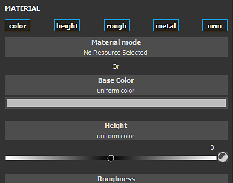

# Preencher projeções

A camada de preenchimento e os efeitos de preenchimento projetam uma textura diretamente na malha com base em um modo específico. Esse tipo de camada/efeito evita pintar manualmente texturas no modelo 3D. As configurações da projeção podem ser editadas por meio da janela Propriedades.

As propriedades estão divididas em duas categorias: **Propriedades de preenchimento** e **Material**.

## Propriedades de preenchimento

As Propriedades de preenchimento controlam como o material é aplicado e/ou projetado na malha. O modo de projeção pode ser alterado pelo menu suspenso **Projeção** na janela [Propriedades](../../interface/properties.md).

Os modos de projeção atuais disponíveis são:

* [Preenchimento (corresponder por Bloco UV)](fill-match-per-uv-tile.md)
* [Projeção UV](uv-projection.md)
* [Projeção triplanar](tri-planar-projection.md)
* [Projeção planar](planar-projection.md)
* [Projeção esférica](spherical-projection.md)
* [Projeção cilíndrica](cylindrical-projection.md)
* [Distorcer projeção](warp-projection.md)

## Material (e tons de cinza)

Os controles Material/Tons de cinza são idênticos às outras ferramentas. Consulte a [documentação da ferramenta de pintura](../tool-list/paint-brush.md) para obter mais detalhes.
