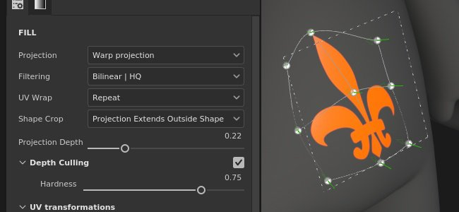
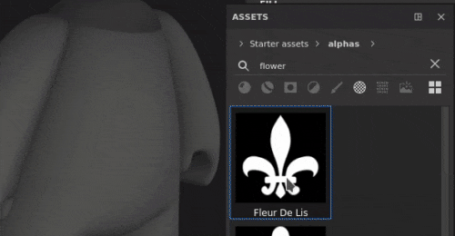
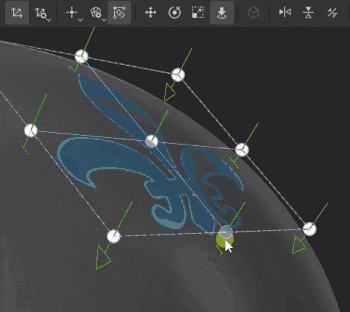

# Distorcer projeção

A projeção Distorcer do preenchimento é uma projeção 3D que permite deformar uma textura editando pontos de uma grade. Pode ser usado para ajustar padrões e logotipos em uma superfície não planar.

## Configuração rápida

É possível configurar rapidamente uma camada com a projeção de distorção arrastando e soltando um recurso da [janela Ativos](../../interface/assets/assets.md) na malha. Ao soltar o mouse, será aberto um menu que permite escolher em que canal o recurso deverá ser atribuído.

Os tipos de recursos compatíveis são:

* **Alpha**
* **Procedimento**
* **Textura**
* **Material** (requer pressionar a tecla ALT)

## Propriedades

| Configuração | Descrição |
| --- | --- |
| **Filtragem** | Controla como a textura ou o material será filtrado. Essa configuração pode afetar a aparência da textura quando repetida várias vezes. Com valores de dimensionamento altos, o uso de um filtro diferente do padrão pode produzir resultados com melhor aparência. Configurações atuais disponíveis:<ul data-preserve-html="true"><li data-preserve-html="true"><strong>HQ `\|` bilinear</strong> (padrão): uma filtragem bilinear avançada que tenta melhorar a qualidade da textura quando os valores de divisão em blocos gráficos são altos.</li><li data-preserve-html="true"><strong>Bilinear `\|` Sharp</strong>: filtragem bilinear simples que suaviza ligeiramente a textura, mas tenta preservar os detalhes.</li><li data-preserve-html="true"><strong>Mais próximo</strong>: sem filtragem, útil se a filtragem Bilinear fornecer um resultado desfocado e quebrar detalhes finos. É possível introduzir suavização na textura.</li></ul> |
| **Envoltório UV** | Controla como a textura se repete dentro da projeção. Os valores possíveis são:<ul data-preserve-html="true"><li data-preserve-html="true"><strong>Nenhuma</strong>: a textura não se repete. Qualquer item fora da textura é preto/transparente.</li><li data-preserve-html="true"><strong>Repetir horizontalmente</strong>: a textura se repete apenas horizontalmente.</li><li data-preserve-html="true"><strong>Repetir verticalmente</strong>: a textura só se repete verticalmente.</li><li data-preserve-html="true"><strong>Repetição</strong> (padrão): a textura se repete em ambos os eixos.</li></ul> |
| **Corte da forma** | Defina se a textura projetada deve ser visível fora da área de projeção. Os valores possíveis são:<ul data-preserve-html="true"><li data-preserve-html="true"><strong>Projeto cortado na forma</strong>: a projeção está confinada dentro da área de projeção.</li><li data-preserve-html="true"><strong>A projeção se estende para fora da forma</strong> (padrão): a projeção continua além da área de projeção.</li></ul> 

 |
| **profundidade de projeção** | Controla o quanto a projeção vai ao longo do eixo Z. Essa configuração ajuda a alcançar a superfície da malha quando o ponto da grade ou o plano de projeção estiver muito longe.As setas verdes indicam a direção e a distância da projeção para cada ponto da grade. 

 **Alerta:** um valor alto pode afetar gravemente o desempenho. É recomendável manter esse parâmetro no nível mais baixo possível. |
| **Seleções de profundidade** | Esmaecer a projeção com base na distância. Um parâmetro está disponível:<ul data-preserve-html="true"><li data-preserve-html="true"><strong>Dureza</strong>: controle a intensidade ou a suavidade da transição de atenuação.</li></ul> 

 |

### Transformação UV

As configurações de transformação UV controlam a textura/material dentro da projeção.

<table data-preserve-html="true" style="width: 100.0%;"><colgroup> <col style="width: 40.0%;"/> <col style="width: 20.0%;"/> <col style="width: 40.0%;"/> </colgroup><tbody><tr><th>Modo de dimensionamento</th><th>Configuração</th><th>Descrição</th></tr><tr><td>
<strong>Divisão em blocos gráficos</strong> (padrão)<strong>  </strong>

Permite definir manualmente o valor de repetição para a textura atual.
</td><td><strong>Revestimento</strong></td><td>Controla o número de vezes que a textura é repetida.</td></tr><tr><td rowspan="2">  </td><td colspan="1"><strong>Giro</strong></td><td colspan="1">Controla o ângulo em que a textura é projetada na malha.</td></tr><tr><td colspan="1"><strong>Deslocamento</strong></td><td colspan="1">Controla a partir de onde a textura será projetada. O valor padrão significa que o centro da textura está no centro dos UVs da malha.</td></tr><tr><th colspan="1"> </th><th colspan="1"> </th><th colspan="1"> </th></tr><tr><td rowspan="4">
<strong>Tamanho físico</strong>

Ajuste automático de uma textura de acordo com o tamanho da malha e o tamanho físico incorporado. Ele usa a largura e o comprimento (medidas X e Y) para calcular o tamanho físico correto. A medição Z não é levada em conta.

(Para obter mais informações, consulte a [página de documentação](https://experienceleague.adobe.com/pt-br/docs/substance-3d-painter/using/features/physical-size) dedicada
</td><td><strong>Tamanho personalizado</strong></td><td>
Se ativada, permite inserir um tamanho físico manualmente e substituir o fornecido por um ativo.

Ela é selecionada automaticamente se nenhum tamanho físico for detectado ou se vários ativos com tamanhos físicos diferentes forem usados na mesma camada/efeito.
</td></tr><tr><td colspan="1"><strong>Tamanho (cm)</strong></td><td colspan="1">Os tamanhos físicos incorporados são expressos em centímetros. É possível trabalhar com um arquivo de malha que foi criado usando diferentes unidades de medida - ele reterá as proporções corretas. No entanto, o tamanho do ativo é exibido atualmente apenas em centímetros.</td></tr><tr><td colspan="1"><strong>Giro</strong></td><td colspan="1">Controla o ângulo em que a textura é projetada na malha.</td></tr><tr><td colspan="1"><strong>Deslocamento</strong></td><td colspan="1">
Controla a partir de onde a textura será projetada. O valor padrão significa que o centro da textura está no centro dos UVs da malha.
</td></tr></tbody></table>

### Configurações de projeção 3D

As configurações de projeção 3D controlam a transformação da projeção no espaço 3D.

| Configuração | Descrição |
| --- | --- |
| **Deslocamento** | Posição da origem da projeção no espaço 3D. As unidades são baseadas na caixa delimitadora de toda a cena. 0 é o centro desta caixa. |
| **Rotação** | Ângulos em graus para girar toda a projeção em cada eixo. |
| **Escala** | Tamanho de toda a projeção em cada eixo. |

## Barra de ferramentas Contextual

Várias configurações e ferramentas estão disponíveis na [barra de ferramentas contextual](../../interface/toolbars.md) localizada na parte superior da viewport, que fornece controles sobre o manipulador e a projeção:

| Ícone | Nome | Descrição |
| --- | --- | --- |
| 

 | Mostrar/Ocultar manipulador | Se ativado, o manipulador fica visível e pode ser controlado na viewport para editar a transformação de projeção ou os pontos de grade. Se estiver desabilitado, o manipulador e a grade ficarão ocultos. |
| 

 | Configurações do manipulador | Esse menu contém três configurações:<ul data-preserve-html="true"><li data-preserve-html="true"><strong>Tamanho do manipulador</strong>: controla o tamanho do manipulador no visor.</li><li data-preserve-html="true"><strong>Etapas de grade</strong>: defina o tamanho da etapa ao traduzir com uma restrição.</li><li data-preserve-html="true"><strong>Etapas de ângulo</strong>: defina o ângulo da etapa ao girar com uma restrição.</li></ul> |
| 

 | Menu de edição de distorção | Esse menu contém cinco ações:<ul data-preserve-html="true"><li data-preserve-html="true"><strong>Distorção de transformação</strong>: edite a transformação de distorção. Permitir a manipulação da posição, rotação e escala da grade global.</li><li data-preserve-html="true"><strong>Editar vértices</strong>: edite os pontos de grade de distorção individualmente (ou em grupo).</li><li data-preserve-html="true"><strong>Dividir distorção cruzada</strong>: inicie a ferramenta dividir distorção para inserir uma nova divisão de grade horizontal e verticalmente.</li><li data-preserve-html="true"><strong>Dividir distorção horizontalmente</strong>: inicie a ferramenta dividir distorção para inserir uma nova divisão de grade horizontalmente.</li><li data-preserve-html="true"><strong>Dividir distorção verticalmente</strong>: inicie a ferramenta dividir distorção para inserir uma nova divisão de grade verticalmente.</li></ul> |
| 

 | Configurações de projeção de distorção | Este menu reagrupa as configurações que afetam apenas a projeção atual de distorção:<ul data-preserve-html="true"><li data-preserve-html="true"><strong>Linha e colunas</strong>: especifique o número de divisões que a grade de distorção possui. Essa configuração só pode ser editada se nenhum ponto da grade tiver sido modificado.</li><li data-preserve-html="true"><strong>Tamanho do identificador</strong>: defina o tamanho dos pontos da grade no modo <strong>Editar vértices</strong>.</li><li data-preserve-html="true"><strong>Cor da grade</strong>: defina a cor das linhas de grade de distorção.</li></ul> |
| 

 | Tangentes automáticas | Se esta opção estiver ativada, alinhe as tangentes de um ponto automaticamente em direção aos pontos vizinhos quando movidas. |
| 

 | Manipulador de tradução | Permitir mover a projeção ou os pontos de grade ao longo dos eixos principais (X, Y, Z). |
| 

 | Manipulador de rotação | Permita girar a projeção ou os pontos de grade ao longo dos eixos principais (X, Y, Z). |
| 

 | Manipulador de escala | Permitir dimensionar a projeção na cena ao longo dos eixos principais (X, Y, Z). |
| 

 | Manipulador de superfície | Permita mover a projeção ou os pontos de grade ajustando-os à superfície do modelo 3D. |
| 

 | Espaço do manipulador | Definir em qual espaço as transformações são executadas. Valores possíveis:<ul data-preserve-html="true"><li data-preserve-html="true"><strong>Espaço local</strong>: os eixos estão alinhados com a transformação atual.</li><li data-preserve-html="true"><strong>Espaço global</strong>: os eixos estão alinhados com a cena.</li></ul> |
| 

 | Espelho em X | Vire a transformação no eixo X. |
| 

 | Espelho em Y | Vire a transformação no eixo Y. |
| 

 | Espelho em Z | Vire a transformação no eixo Z. |
| 

 | Redefinir transformação | Esse menu contém três ações:<ul data-preserve-html="true"><li data-preserve-html="true"><strong>Restaurar a transformação global</strong>: redefinir a posição, a rotação e a escala da projeção de volta aos valores iniciais. Essa ação não afeta os pontos de grade em si.</li><li data-preserve-html="true"><strong>Redefinir todos os vértices</strong>: redefine todas as posições e tangentes dos pontos de grade da grade de distorção.</li><li data-preserve-html="true"><strong>Redefinir vértices selecionados</strong>: redefine a posição e as tangentes somente dos pontos selecionados da grade de distorção.</li></ul> |

## Manipulador

Este manipulador de projeção só está disponível no [visor 3D](../../interface/viewport/3d-view.md).

| Ação | Atalho | Descrição |
| --- | --- | --- |
| **Tradução** | Clique do mouse | Com o manipulador de tradução, clique nos eixos para mover a projeção:<ul data-preserve-html="true"><li data-preserve-html="true"><strong>Um eixo</strong>: mover apenas em uma direção a projeção.</li><li data-preserve-html="true"><strong>Dois eixos</strong>: mova a projeção nos planos alinhados aos eixos.</li><li data-preserve-html="true"><strong>Três eixos</strong>: mova a projeção no espaço da câmera (plano de frente para ela).</li></ul>   <table> <tr style="border: 0;"> <td style="border: 0;" valign="top">  

  </td> <td style="border: 0;" valign="top">  

  </td> <td style="border: 0;" valign="top">  

  </td> </tr> </table> |
| **Tradução restrita** | Clique com a tecla SHIFT pressionada | Com o manipulador Translação, mova a projeção ao longo dos eixos selecionados, mas somente em intervalos específicos (revisão). O tamanho do intervalo é definido através das configurações do manipulador. 

 |
| **Rotação** | Clique do mouse | Com o manipulador de rotação, clique em um eixo para girar a projeção. Clique entre os eixos para girar todos os eixos ao mesmo tempo.   <table> <tr style="border: 0;"> <td style="border: 0;" valign="top">  

  </td> <td style="border: 0;" valign="top">  

  </td> </tr> </table> |
| **Rotação restrita** | Clique com a tecla SHIFT pressionada | Com o manipulador de rotação, clicar em um eixo para girar a projeção só acontecerá em intervalos específicos. O passo é definido por um ângulo através das configurações do manipulador. 

 |
| **Escala** | Clique do mouse | Com o manipulador de Escala, clique em uma alça de eixo para redimensionar a projeção ao longo do eixo fornecido.   <table> <tr style="border: 0;"> <td style="border: 0;" valign="top">  

  </td> <td style="border: 0;" valign="top">  

  </td> <td style="border: 0;" valign="top">  

  </td> </tr> </table> |
| **Escala restrita** | Clique com a tecla SHIFT pressionada | Com o manipulador de Escala, clicar em uma alça de eixo enquanto mantém o atalho redimensionará a projeção em etapas. O tamanho da etapa é o mesmo usado para o manipulador de tradução. 

 |
| **Superfície** | Clique do mouse | Com o manipulador de Superfície, clicar e arrastar sobre o modelo 3D o ajustará à superfície. 

 **Observação:** este manipulador só está disponível com os tipos de projeção **Planar** e **Distorcer**. |

## Edição de pontos de grade

A projeção de distorção é representada por um plano e uma grade de pontos. Cada ponto pode ser modificado para que a projeção se ajuste melhor ao modelo 3D, mas também para distorcer a textura.

Para editar o ponto de grade, alterne o modo de edição para **Editar vértices** da barra de ferramentas contextual:

>[!NOTE]
>
> Um atalho de teclado está disponível para alternar rapidamente entre **Distorção de transformação** e **Editar vértices**. Consulte o **Alternar modo de edição de distorção** na página [Atalhos](../../interface/settings/shortcuts.md).

### Seleção de pontos

| Ação | Descrição |
| --- | --- |
| 

 | <ul data-preserve-html="true"><li data-preserve-html="true">Um único clique em um ponto o selecionará.</li><li data-preserve-html="true">Clicar fora de um ponto ou o manipulador desmarcará os pontos.</li><li data-preserve-html="true">Clicar nos pontos enquanto pressiona o <strong>SHIFT</strong> permite selecionar vários pontos.</li><li data-preserve-html="true">Clicar em um ponto enquanto pressiona <strong>CTRL</strong> permite desmarcar apenas este ponto e não o outro.</li></ul> |
| 

 | <ul data-preserve-html="true"><li data-preserve-html="true">Clicar e arrastar permite fazer uma seleção retangular. Todos os pontos dentro do retângulo serão selecionados quando o mouse for solto.</li><li data-preserve-html="true">Clicar e arrastar ao pressionar <strong>SHIFT</strong> permite adicionar mais pontos à seleção atual.</li><li data-preserve-html="true">Clicar e arrastar ao pressionar <strong>CTRL</strong> permite remover pontos da seleção atual.</li></ul> |

### Pontos de movimento

| Ação | Descrição |
| --- | --- |
| 

 | <ul data-preserve-html="true"><li data-preserve-html="true">Use o manipulador de Tradução para mover um ponto.</li><li data-preserve-html="true">Use o manipulador de Superfície para mover-se em pontos na superfície do modelo 3D.</li></ul> |
| 

 | <ul data-preserve-html="true"><li data-preserve-html="true">Clique e arraste um ponto para movê-lo rapidamente sem precisar selecioná-lo primeiro.</li><li data-preserve-html="true">Clicar e arrastar um ponto o moverá como o Manipulador de superfície.</li><li data-preserve-html="true">Clicar e arrastar um ponto enquanto pressiona <strong>CTRL</strong> o moverá como o manipulador de Tradução (no espaço da câmera em três eixos).</li></ul> |

### Ajuste de tangentes

A grade de projeção de Distorção é um [trecho de Bézier](https://en.wikipedia.org/wiki/B%C3%A9zier_surface), isso significa que cada ponto tem seu próprio conjunto de tangentes para controlar a curva das linhas que unem pontos. O ajuste de tangentes oferece mais controle sobre como a textura é deformada.

| Ação | Descrição |
| --- | --- |
| 

 | <ul data-preserve-html="true"><li data-preserve-html="true">Para modificar as tangentes de um ponto (exibido em vermelho), basta selecionar o ponto fornecido e, em seguida, usar o manipulador Rotação ou Escala.</li></ul> |

>[!NOTE]
>
> A tangente será redefinida e ajustada automaticamente ao mover os pontos se a configuração **Tangentes automáticas** da barra de ferramentas contextual estiver habilitada.
> 
> 

### Aumentar ou diminuir o número de pontos

A grade de distorção pode ser subdividida para aumentar o número de pontos e dar mais controle sobre como deformar a textura.

| Ação | Descrição |
| --- | --- |
| 

 | <ul data-preserve-html="true"><li data-preserve-html="true">Divida a grade por linhas e colunas no menu de configurações de distorção. (Isso só é possível se nenhum ponto tiver sido movido)</li><li data-preserve-html="true">Subdivida a grade usando uma das três ferramentas de divisão.</li><li data-preserve-html="true">É possível cancelar qualquer uma das ferramentas de divisão pressionando <strong>Esc</strong>.</li></ul> |
