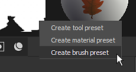

# Criar e salvar predefinições

Use a [janela Propriedades](../../interface/properties.md) para ajustar os parâmetros do pincel e salve a configuração como uma predefinição para reutilização rápida no futuro.

>[!NOTE]
>
> Com a [ferramenta Caminho](../tool-list/path.md) equipada, uma seção Predefinições está disponível no [painel Propriedades](../../interface/properties.md), onde você pode acessar rapidamente as predefinições relacionadas ao Caminho. Você também pode adicionar predefinições de caminho aos seus favoritos. Saiba mais sobre o gerenciamento de suas [predefinições de caminho favoritas aqui](../tool-list/path.md).

## Criar uma nova predefinição

As predefinições podem ser criadas clicando com o botão direito do mouse na janela Propriedades quando as propriedades da ferramenta estiverem disponíveis (camada de pintura ou efeito de pintura).

Clique com o botão direito do mouse na janela Propriedades para abrir um menu de contexto com as seguintes opções:

* <b>Criar predefinição de ferramenta</b>: salve os parâmetros do pincel e os materiais com todos os recursos necessários no mesmo arquivo de predefinição.
* <b>Criar predefinição de material</b>: salve apenas as propriedades e os recursos de material dentro de um arquivo de predefinição.
* <b>Criar predefinição de pincel</b>: salve apenas os parâmetros do pincel e os recursos de alfa e estêncil dentro de um arquivo de predefinição.

## Atualizar uma predefinição existente

É possível atualizar uma predefinição existente com base nos valores atuais na janela Propriedades. Clique com o botão direito no ativo na janela [Ativos](../../interface/assets/assets.md) e selecione “Atualizar da ferramenta atual” para atualizar a predefinição.
