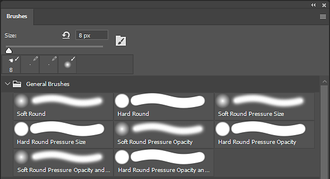

# Exportação de predefinições de pincel do Photoshop

Arquivos ABR (predefinições do Pincel Photoshop) podem ser criados somente a partir do Adobe Photoshop. Para criar um ABR contendo predefinições, basta seguir as etapas abaixo:

1. <b>Abra o Adobe Photoshop.</b>

   Os arquivos ABR só podem ser criados no Photoshop.
1. <b>Abra o painel Pincéis.</b>

   Abra o painel Pincéis em <b>Janela > Pincéis. </b>

   {width="500px"}
1. <b>Selecione as predefinições de pincel (ou grupos) para exportar.</b>

   Pressione e segure CTRL para selecionar vários pincéis ou predefinições.

   {width="500px"}
1. <b>Exportar para um arquivo ABR.</b>

   Abra o menu de configurações da Janela de Pincel e selecione <b>Exportar pincéis selecionados</b>.

   Será exibida uma caixa de diálogo solicitando um nome de arquivo e um local para salvar o arquivo ABR exportado.

   
