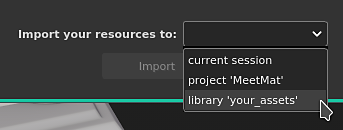

# Importação de predefinições de pincel do Photoshop

Esta página fornece um passo a passo sobre como importar um arquivo ABR para o Substance 3D Painter.

1. <b>Abra a janela de importação de recursos.</b>

   A janela Importar Recurso pode ser aberta de três maneiras diferentes:

   * Arraste e solte o arquivo ABR no painel Ativos.
   * Use <b>Arquivo > Importar recursos </b> no menu Principal.
   * Use o botão <b>+ </b> no painel Ativos.
1. <b>Adicione o arquivo ABR à janela Importar recursos.</b>

   Se você não tiver arrastado e soltado o arquivo ABR na janela Ativos para abrir a janela de importação, ele ficará vazio por padrão.

   Para adicionar o arquivo ABR, você pode:

   * **Arraste e solte** o arquivo ABR na janela.
   * Clique no botão **Adicionar recursos** para selecionar e carregar o arquivo ABR.

   >[!NOTE]
   >
   > 
   > 
   > Um ícone de aviso poderá ser exibido ao lado do arquivo ABR se houver problemas. Tais como:
   > 
   > * Nenhuma predefinição compatível encontrada. Consulte a lista [Compatibilidade de Parâmetros do Pincel do Photoshop](photoshop-brush-parameters-compatibility.md) para obter mais informações.
   > * O arquivo não pode ser lido (por exemplo, está corrompido).
1. <b>Selecione como importar o arquivo ABR.</b>

   Na parte inferior da janela Import Resources (Recursos de importação), escolha onde carregar o arquivo ABR:

   * <b> Projeto</b>: o arquivo ABR será carregado no projeto aberto no momento. Os pincéis só estarão disponíveis quando o projeto atual estiver aberto e serão anexados ao arquivo de projeto.
   * <b> Sessão</b>: o arquivo ABR será carregado na memória. As predefinições de pincel estarão disponíveis até que o aplicativo seja fechado.
   * <b> Biblioteca</b>: o arquivo ABR será copiado para a Prateleira no disco. As predefinições de pincel estarão disponíveis sempre que o Painter for aberto para todos os projetos.

   
1. <b>Acesse as predefinições de pincel da Prateleira.</b>

   

   Se não houver problemas ao importar as Predefinições de pincel, elas aparecerão na janela [Ativos](../../../interface/assets/assets.md).

   >[!NOTE]
   >
   > Se uma predefinição de pincel for baseada em um bitmap, a imagem que ela usa também estará disponível na seção Alpha da Prateleira com o mesmo nome da predefinição de pincel.
