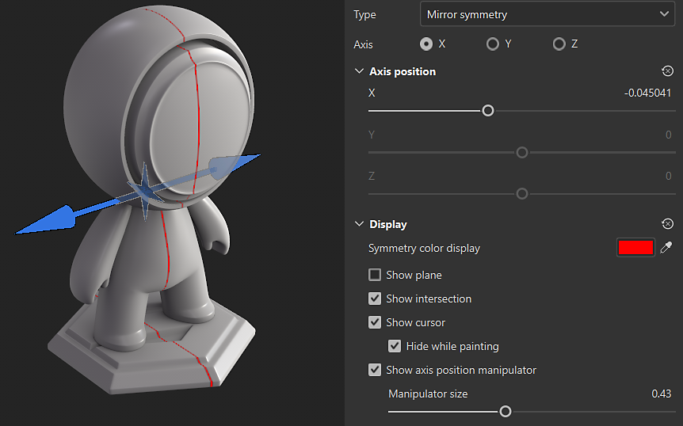

# Simetria de espelho

A simetria espelhada é uma simetria axial que pode ser habilitada na barra de ferramentas contextual:

## Use o manipulador para posicionar o eixo de simetria

Você pode acessar as configurações de exibição da Simetria no <b>botão de configurações de Simetria</b> na barra de ferramentas Contextual na parte superior da exibição 3D. Nas configurações de exibição, você pode ativar e personalizar a manipulador. Arraste as alças da manipulador na visualização 3D para alterar a posição do eixo de simetria.

## Parâmetros de simetria espelhada

{width="300px"}

| *Parâmetro* | *Descrição* |
| --- | --- |
| <b>Eixo</b> | Define qual eixo da cena é usado para executar a simetria. |
| <b>Posição do eixo</b> | Define o deslocamento do eixo no projeto. Esse valor pode ser editado com os controles deslizantes ou com a Manipulador (veja acima). |
| <b>Mostrar plano</b> | Se ativada, um plano transparente será visível na viewport para delimitar cada lado da simetria espelhada. |
| <b>Mostrar Interseção</b> | Se ativada, uma linha será desenhada na malha do visor para delimitar cada lado da simetria espelhada. |
| <b>Mostrar Cursor</b> | Se habilitada, um segundo cursor será mostrado no outro lado da simetria para indicar quando a pintura será executada. |
| <b>Ocultar ao Pintar</b> | Se habilitada, o segundo cursor ficará oculto enquanto a pintura estiver em andamento (até que o botão do mouse seja solto). |
| <b>Tamanho do Manipulador</b> | Controla o tamanho da Manipulador no visor. |
