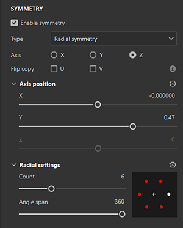

# Simetria radial

A simetria radial duplica radialmente o conteúdo da camada de traçados ou preenchimento ao redor de um eixo:

## Use o manipulador para posicionar o eixo de simetria

Você pode acessar as configurações de exibição da Simetria no <b>botão de configurações de Simetria</b> na barra de ferramentas Contextual na parte superior da exibição 3D. Nas configurações de exibição, você pode ativar e personalizar a manipulador. Arraste as alças da manipulador na visualização 3D para alterar a posição do eixo de simetria.

{width="600px"}

## Parâmetros de simetria radial

{width="300px"}

| *Parâmetro* | *Descrição* |
| --- | --- |
| <b>Eixo</b> | Define qual eixo da cena é usado para executar a simetria. |
| <b>Virar cópia</b> | Virar cópias alternadas no eixo U ou V. Isso ajuda ao usar a simetria em conteúdo que tem direção como texto. |
| <b>Posição do eixo: X, Y, Z</b> | Define o deslocamento do eixo no projeto. Esse valor pode ser editado com os controles deslizantes ou com a Manipulador (veja acima). |
| <b>Mostrar Eixo</b> | Se habilitada, uma linha transparente será visível na janela que representa o eixo de simetria. |
| <b>Mostrar Interseção</b> | Se habilitada, um ponto será desenhado na malha no visor para mostrar onde o eixo de simetria faz interseção com a malha. |
| <b>Mostrar cursor (ferramenta pincel)</b> | Se habilitada, um segundo cursor será mostrado no outro lado da simetria para indicar quando a pintura será executada. |
| <b>Ocultar ao Pintar (ferramenta pincel)</b> | Se habilitada, o segundo cursor ficará oculto enquanto a pintura estiver em andamento (até que o botão do mouse seja solto). |
| <b>Mostrar manipulador de posição de eixo</b> | Alterna a visibilidade da Manipulador na viewport. |
| <b>Tamanho do Manipulador</b> | Controla o tamanho da Manipulador no visor. |
