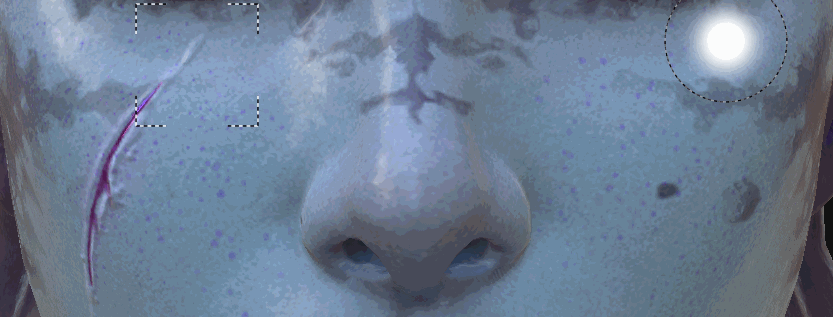

# Ferramenta Clonar

Introduzida no Substance 3D Painter 2, a ferramenta Clonar compartilha o mesmo tipo de parâmetros da [ferramenta Pintar](https://support.allegorithmic.com/documentation/display/SPDOC/Paint+brush). Como seu nome sugere, a ferramenta clone permite duplicar o conteúdo de uma camada específica ou de toda a pilha de camadas de um ponto para o outro.

## Uso

A maneira mais simples de usar a ferramenta Clonar é usá-la no conteúdo de uma camada de pintura.

Isso pode ser feito em duas etapas:

* Selecione o local de origem colocando o mouse no modelo e pressionando a tecla &quot; **V** “.
* Em seguida, posicione o mouse onde a área duplicada será exibida e comece a pintar.

É possível atualizar a origem a qualquer momento pressionando &quot; **V** &quot; novamente.

Por padrão, ao pintar com a ferramenta clone, o local de origem seguirá e atualizará seu local depois que o pincel for liberado. Ao desabilitar o botão usado para o &quot; **Comportamento da origem do clone** “, a origem retornará onde foi definida ao pressionar &quot; **V** “. Isso pode ser útil ao pintar várias vezes com a mesma área de origem.

Uma maneira mais inteligente de usar a ferramenta Clonar é criar uma camada de pintura e definir o modo de mesclagem de todos os canais como “Passagem”. Isso permitirá duplicar todas as informações de uma forma não destrutiva de todas as camadas localizadas abaixo da “camada Clone”. As camadas abaixo permanecem intactas e quaisquer modificações aplicadas posteriormente serão levadas em conta pela camada Clonar:

