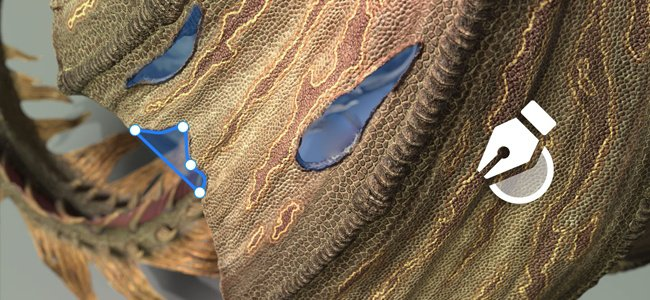
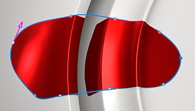
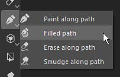

# Caminho preenchido

A ferramenta Caminho preenchido é um tipo de ferramenta de caminho que permite criar formas na superfície do modelo 3D preenchidas com uma cor uniforme.

A ferramenta <b>Caminho preenchido</b> pode ser acessada no menu de ferramentas Caminho:

## Configurações

As configurações de Preenchimento de caminho são:

| Configuração | Descrição |
| --- | --- |
| Opacidade | Controla a opacidade final da forma de preenchimento. |
