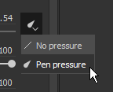
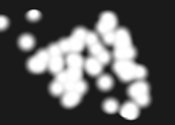
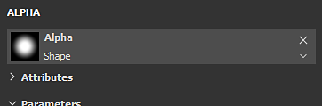
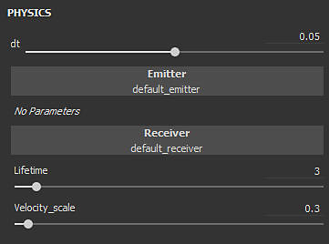
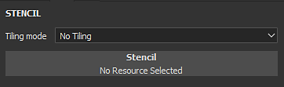

# Pincel

A ferramenta Pintura é a ferramenta padrão do Substance 3D Painter para aplicar cores e propriedades do material em uma malha 3D. Ele tem parâmetros específicos que podem ser editados por meio de [Propriedades](../../interface/properties.md).

A ferramenta Pintura simula traçados de pincel por meio de vários comportamentos e configurações para dar a sensação de pintura na malha 3D.

## Barra de ferramentas

As [Barras de Ferramentas](../../interface/toolbars.md) exibirão os seguintes atalhos (veja sua explicação nas próximas seções):

* Tamanho
* Fluxo
* Opacidade do traçado
* Espaçamento

Atalhos adicionais estão disponíveis, que são comuns em algumas outras ferramentas:

* [Mouse lento](../lazy-mouse.md)
* [Simetria](../symmetry/symmetry.md)

## Visualização

Na parte superior das [Propriedades](../../interface/properties.md) estão as visualizações de pincel e material. Eles podem ser usados para conferir rapidamente como a ferramenta atual é configurada.

| *Nome* | *Descrição* |
| --- | --- |
| **Visualização do pincel** | A visualização do pincel mostra como ele se comportará com base nos parâmetros do pincel. É possível clicar na visualização para desenhar um traçado personalizado.   <table> <tr style="border: 0;"> <td style="border: 0;" valign="top">  

  </td> <td style="border: 0;" valign="top">  

  </td> </tr> </table>   **Observação:** a visualização do Pincel não oferece suporte à pressão da Caneta. |
| **Visualização de material** | A visualização do material mostra as propriedades do material usado atualmente para pintar. É possível clicar na visualização para girar a iluminação e ver melhor como o material se comportará antes de pintar.   <table> <tr style="border: 0;"> <td style="border: 0;" valign="top">  

  </td> <td style="border: 0;" valign="top">  

  </td> </tr> </table> |

## Pincel

Os parâmetros Pincel são o que define a aparência do traçado do pincel quando executado na malha 3D.

>[!NOTE]
>
> Alguns parâmetros podem ser controlados pela Pressão da Caneta ao usar uma mesa digitalizadora gráfica. Estas informações também podem ser salvas em [Predefinições](../presets/presets.md).\
> Clique no botão dedicado para ativar ou desativar a pressão:
> 
> 

| Nome | Descrição |
| --- | --- |
| **Tamanho** | Controla o tamanho dos carimbos dentro de um traçado de pincel. O tamanho do pincel é relativo e pode ser alterado dependendo do espaço relativo definido no (consulte o parâmetro Espaço do tamanho do alinhamento abaixo). *Este parâmetro pode ser controlado pela Pressão da Caneta.* |
| **Fluxo** | Intensidade ou opacidade de carimbos individuais dentro do traçado do pincel. *Este parâmetro pode ser controlado pela Pressão da Caneta.* |
| **Opacidade do traçado** | Opacidade global máxima de um traçado de pincel. Ao contrário do parâmetro Fluxo, a Opacidade do traçado não pode ser controlada pela Pressão da caneta, pois é aplicada ao final do processo de desenho do traçado.Diferença entre o fluxo e a opacidade do traçado:<ul data-preserve-html="true"><li data-preserve-html="true"><strong> Saiu de </strong>: Fluxo em 50%, Opacidade do Traçado em 100%</li><li data-preserve-html="true"><strong> Direita </strong>: Fluxo em 100%, Opacidade do Traço 50%</li></ul> 

 **Observação:** é possível continuar com um traçado anterior, como na animação acima, pressionando o atalho “A”. |
| **Espaçamento** | Distância entre os carimbos individuais de um traçado de pincel. Valores pequenos permitem criar linhas contínuas, mas são mais expansivos para calcular, pois desenham muito mais carimbos no total. Valores altos permitem criar um espaço entre o carimbo, que pode ser mais adequado para padrões específicos (como pregos em madeira). |
| **Ângulo** | Orientação dos carimbos dentro do traçado do pincel. Útil para girar o Alpha se não estiver alinhado corretamente. Pode ser combinado com o comando Seguir caminho. |
| **Seguir caminho** | Orienta os carimbos dentro do traçado de pincel para seguir a direção da pintura. 

 **Observação:** para calcular a direção do traçado, o Substance 3D Painter compara o carimbo anterior com o atual. Por isso, quando a opção Seguir caminho está habilitada, um único clique para pintar não produzirá nenhum resultado. Pelo menos dois carimbos são necessários para pintar um traçado de pincel com esse recurso ativado. |
| **Tremulação de tamanho** | Aplique um valor de tamanho aleatório por carimbo dentro do traçado do pincel. Um valor de 0 significa que não há aleatoriedade, e um valor de 1 significa que há aleatoriedade completa. 

 |
| **Tremulação de fluxo** | Aplique um valor de fluxo aleatório por carimbo dentro do traçado do pincel. Um valor de 0 significa que não há aleatoriedade, e um valor de 1 significa que há aleatoriedade completa. 

 |
| **Tremulação de ângulo** | Aplique um ângulo de rotação adicional aleatório por carimbo dentro do traçado do pincel. Um valor de 0 significa que não há aleatoriedade, e um valor de 1 significa que há aleatoriedade completa. 

 |
| **Tremulação de Posição** | Aplique um deslocamento de posição aleatório por carimbo dentro do traçado do pincel. Um valor de 0 significa que não há aleatoriedade, e um valor de 1 significa que há aleatoriedade completa. 

 |
| **Alinhamento** | Determina como os carimbos dentro do traçado do pincel serão projetados/orientados na superfície da malha 3D. Os seguintes valores estão disponíveis:<ul data-preserve-html="true"><li data-preserve-html="true"><strong> Câmera </strong> : orienta o carimbo em direção ao ponto de vista do visor</li><li data-preserve-html="true"><strong> Tangente | Quebra automática (padrão) </strong> : orienta o carimbo para alinhar com a superfície de malha 3D. O carimbo também será deformado para se adequar à superfície.</li><li data-preserve-html="true"><strong> Tangente | Planar </strong> : Oriente o carimbo para alinhá-lo com a superfície de malha 3D. O carimbo esmaecerá sua borda se estiver muito longe da superfície da malha 3D. </li><li data-preserve-html="true"><strong> UV </strong> : orienta o carimbo com base nos UVs de malha 3D.</li></ul> |
| **Remoção de Backface** | Permite ignorar superfícies na malha 3D que não estão alinhadas com a estampa. Para calcular quais partes da malha 3D devem ser ignoradas, o mecanismo de pintura olha para o normal na superfície da malha 3D e compara seu ângulo com o valor definido. |
| **Tamanho de espaço** | Controla em qual espaço relativo o tamanho do pincel é calculado. Os valores possíveis são:<ul data-preserve-html="true"><li data-preserve-html="true"><strong> Objeto (padrão) </strong> : o tamanho do pincel está sincronizado com o tamanho da malha 3D. Mover a câmera no visor afetará o tamanho para mantê-la relativa à malha 3D.</li><li data-preserve-html="true"><strong> Viewport </strong> : O tamanho do pincel está vinculado ao visor. O redimensionamento da interface afetará o tamanho do pincel. Mover a câmera não terá nenhum efeito.</li><li data-preserve-html="true"><strong> Textura </strong>: O tamanho do pincel está vinculado ao nível de zoom do visor 2D.</li></ul> |

## Alfa

O Alpha é a máscara de tons de cinza aplicada sobre cada estampa dentro do traçado do pincel. Pode ser um arquivo Substance ou um bitmap.

>[!NOTE]
>
> Se um gráfico de Substance tiver um parâmetro “hardness” (identificador) exposto, ele poderá ser controlado com os [Atalhos](../../interface/settings/shortcuts.md) de Dureza.

## Física

As propriedades da Física permitem controlar as partículas que são projetadas ao pintar.

Por padrão, as propriedades de Física não estão disponíveis, mas podem ser ativadas por dois meios:

* Alternando a ferramenta para “Físico” nas [Barras de Ferramentas](../../interface/toolbars.md) (ou por meio do atalho de teclado).
* Clicando em uma predefinição de Pincel de partícula na janela [Ativos](../../interface/assets/assets.md).

## Estêncil

O Estêncil é uma máscara de tons de cinza adicional para o traçado do pincel. Ao contrário do alfa aplicado a cada carimbo individual, o Estêncil é uma máscara global aplicada do ponto de vista [Visor](../../interface/viewport/viewport.md).

>[!NOTE]
>
> É possível redefinir a transformação de Estêncil pressionando a tecla **S** e clicando no botão &quot; **Redefinir** &quot; no canto superior direito da viewport:
> 
> 

| *Modo* | *Visor* |
| --- | --- |
| **Nenhum recurso carregado** | Quando nenhum recurso é carregado, o estêncil não tem efeito. 

 **Observação:** é possível desabilitar temporariamente a máscara de Estêncil sem remover o recurso pressionando e mantendo os [Atalhos](../../interface/settings/shortcuts.md) “N”. |
| **Mover Estêncil** | Mover o Estêncil pode ser feito pressionando a tecla **S** e clicando e arrastando com o botão do **Meio do Mouse**. 

 |
| **Girar Estêncil** | A rotação do Estêncil pode ser feita pressionando a tecla **S** e clicando e arrastando com o botão **Botão esquerdo do mouse**. Além disso, pressionar a tecla **Shift** permite ajustar a rotação a cada **90 graus**. 

 |
| **Redimensionar Estêncil** | O redimensionamento do Estêncil pode ser feito pressionando a tecla **S** e clicando e arrastando com o botão direito do mouse **.**

 |

A configuração do modo de divisão em blocos gráficos controla como a máscara de Estêncil é repetida na viewport (essa configuração também afeta a texturização):

| *Modo de divisão em blocos gráficos* | *Descrição* |
| --- | --- |
| **Sem Lado a Lado (padrão)** | A máscara de Estêncil não é repetida. 

 |
| **Lado a lado horizontal** | Repita a máscara de estêncil somente no eixo horizontal. 

 |
| **Divisão em blocos verticais** | Repita a máscara de estêncil somente no eixo vertical. 

 |
| **Divisão em blocos gráficos** | Repita a máscara de estêncil nos eixos horizontal e vertical. 

 |

## Material

Um material é composto de vários canais nos quais cada um retém propriedades específicas. A lista de canais depende daquelas definidas nas [configurações do Conjunto de Texturas](../../interface/texture-set/texture-set-settings.md).

O botão **Modo de material** é uma maneira fácil de carregar arquivos de Substance ou uma predefinição para atribuir e editar rapidamente vários canais de uma só vez.

Clicar em um botão do canal irá selecioná-lo ou desmarcá-lo. Quando desmarcada, a propriedade de canal não pode ser modificada e não será usada durante o processo de pintura.

