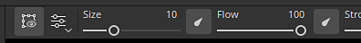
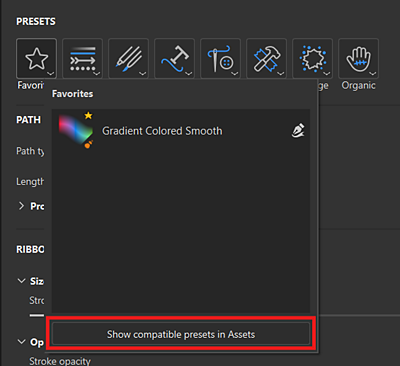

# Visão geral da ferramenta Caminho

As **ferramentas de caminho** permitem definir uma curva com pontos na superfície da malha. Depois que a curva é criada, as diferentes ferramentas de Caminho permitem criar diferentes efeitos ao longo da curva.

## Criação de um caminho

Caminhos podem ser criados em efeitos do camada de tinta e do tinta. Há duas maneiras de acessar a ferramenta Caminho:

* **Pela interface**: navegue até a barra de ferramentas da ferramenta no lado esquerdo e clique no terceiro ícone na parte superior.
* **Por meio de um atalho de teclado**: por padrão, a ferramenta não tem nenhuma atribuída. Isso pode ser alterado no menu Configurações ao editar o atalho “Selecionar ferramenta tinta ao longo do caminho”.

Depois que a ferramenta é selecionada, os pontos podem ser colocados clicando na superfície do modelo 3D na janela de visualização 3D. Pelo menos dois pontos (ou vértices) são necessários para criar um caminho.

A ferramenta Caminho tem modos diferentes, que podem ser semelhantes às outras ferramentas de tinta disponíveis no aplicativo:

* Tinta ao longo do caminho: desenhe um traçado de pincel regular ao longo de um caminho definido.
* [Caminho da faixa](ribbon-tool.md): desenha uma imagem repetida ou esticada ao longo de um caminho.
* [Caminho preenchido](filled-path.md): preencha o interior de um caminho com uma cor uniforme.
* Apagar ao longo do caminho: desenhe um traçado que apaga/remove informações ao longo de um caminho definido.
* Borrar ao longo do caminho: desenhe um traçado que borra/desfoca as informações ao longo de um caminho definido.

Por exemplo, esta é a ferramenta de caminho no modo **Borrar** afetando outras informações da pintura:

>[!NOTE]
>
> As **ferramentas de caminho** funcionam somente no espaço 3D na superfície da geometria. No momento, não é possível criar um caminho no espaço UV ou como uma projeção de espaço de tela.

### Edição de um demarcador

Os pontos de caminho (ou vértices) aderem automaticamente à superfície da malha. Eles podem ser movidos e ajustados a qualquer momento. É possível adicionar novos vértices a um caminho existente clicando em qualquer lugar ao longo da linha.

* Pressionar **Esc** ou **Enter** sairá da edição de caminho.
* Uma vez encerrado, clicar em uma superfície em branco da malha iniciará um novo caminho.
* Passar o mouse e clicar em um caminho existente o selecionará, permitindo continuar ou editar esse caminho. Os caminhos também podem ser selecionados novamente por meio do painel **Caminhos** (veja abaixo).

Algumas propriedades são específicas de um caminho como um todo. Este é o caso das opções encontradas na janela **Propriedades**. Assim como com um traçado regular (consulte a [documentação da ferramenta de Tinta](paint-brush.md)), é possível definir as seguintes propriedades para um caminho:

* **Pincel**
* **Alpha**
* **Material**

A seção **pincel** contém opções adicionais que estão disponíveis apenas com a ferramenta Caminho:

| **Configuração** | **Descrição** |
| --- | --- |
| **profundidade de projeção** | Determina o quão próximo o caminho precisa estar da superfície da malha para que as marcas de pincel sejam exibidas. Para ver esse feedback visual diretamente no visor, é possível habilitar **Normais** nas **configurações de exibição do caminho** (veja abaixo). |
| **Eixo para cima** | O eixo usado para orientar carimbos de pincel quando **Seguir caminho** está desativado.   Em algum contexto, faz mais sentido ter todos os carimbos alinhados ao longo de um eixo/direção global e não ao longo do caminho. Por exemplo, com rebites em uma superfície metálica. |

Outras propriedades são definidas por pontos (vértices) no caminho, como a pressão. Para editar um ponto específico, basta clicar nele (ou usar a seleção retangular). Em seguida, use a barra de ferramentas contextual para editar os valores de pontos selecionados.

### Controle de tangentes

Pode haver momentos em que um caminho suave não é ideal, seja porque não segue da melhor maneira a superfície de modelo 3D ou porque não se ajusta a uma aparência específica. Para resolver esses problemas, é possível modificar as tangentes de um determinado vértice. As tangentes são as direções de um ponto que controlam a curvatura do caminho.

Para alternar entre tangentes suaves ou lineares/quebradas, basta clicar duas vezes em um vértice (ou usar o botão dedicado na barra de ferramentas contextual):

Para controlar com mais precisão a orientação das tangentes, use o botão Tangentes personalizadas na barra de ferramentas contextual para substituí-las manualmente:

Use o atalho de teclado **ALT** para quebrar as tangentes enquanto se move, se o ponto ainda não estiver pronto.

Use o atalho de teclado **CTRL** para dimensionar as duas tangentes ao mesmo tempo.

>[!NOTE]
>
> Os controles de tangente são definidos ao longo do plano, alinhados com o normal do ponto especificado no caminho. Isso significa que as tangentes não podem se curvar em algumas direções.

### Barra de ferramentas contextual

A **barra de ferramentas contextual** quando a ferramenta **Caminho** está selecionada fornece várias configurações que permitem controlar o caminho atualmente selecionado:

<table>
  <tr>
    <th><strong>Parâmetro</strong></th>
    <th><strong>Descrição</strong></th>
  </tr>
  <tr>
    <td><strong>Mostrar/ocultar a interface do visor</strong> </td>
    <td>Se ativada, a sobreposição de caminhos e vértices ficará visível na viewport.</td>
  </tr>
  <tr>
    <td><strong>Configurações do visor</strong> </td>
    <td>Controle a aparência do feedback visual do caminho na viewport: <ul><li><strong>Tamanho da alça</strong>: controla o tamanho dos pontos do caminho.</li><li><strong>Largura do caminho</strong>: controle o thickness da linha do caminho. </li><li><strong>Cor do caminho</strong>: controle a cor da linha do caminho. </li><li><strong>Cor de caminho não selecionada</strong>: controle a cor dos caminhos não ativos. </li><li><strong>Normais</strong>: se habilitado, mostra a direção de projeção em cada ponto de um caminho. </li><li><strong>Tangentes</strong>: se habilitada, mostra a direção da curva dos pontos de controle do caminho. </li><li><strong>Direção do caminho</strong>: se habilitada, mostra uma pequena seta no final do caminho para indicar a direção da pintura. Isso é útil para saber como os carimbos dentro do traçado serão orientados.</li></ul> </td>
  </tr>
  <tr>
    <td><strong>Inverter direção do caminho</strong> </td>
    <td>Inverter a direção do caminho atual. A direção define a orientação geral usada para tinta os carimbos dentro do traçado. Inverter o caminho pode ajudar a reorientar o padrão desenhado.</td>
  </tr>
  <tr>
    <td><strong>Alternar canto/suavizar</strong> </td>
    <td>Quebre ou alinhe a tangente dos vértices selecionados atualmente, permitindo alternar entre uma curva suave ou linear.  <strong>Observação:</strong> a alternância entre o comportamento de canto/suave também pode ser feita clicando duas vezes em um ponto diretamente no caminho.</td>
  </tr>
  <tr>
    <td><strong>Tangentes personalizadas</strong> </td>
    <td>Se habilitada, permite controlar manualmente as tangentes de um determinado ponto no caminho. </td>
  </tr>
  <tr>
    <td><strong>Abrir/fechar caminho</strong> </td>
    <td>Abrir ou fechar o caminho atual. Para fechar um caminho, um dos dois pontos finais do caminho atual precisa ser selecionado primeiro. </td>
  </tr>
  <tr>
    <td><strong>Excluir vértice</strong> </td>
    <td>Remove os vértices atualmente selecionados de um caminho.</td>
  </tr>
  <tr>
    <td><strong>Simetria</strong> </td>
    <td>Habilite ou desabilite a simetria para o caminho atual. Consulte a <a href="../symmetry/symmetry.md">documentação de simetria</a> para obter mais informações. </td>
  </tr>
  <tr>
    <td><strong>Ocultar/ignorar geometria excluída</strong> </td>
    <td>Se esta opção estiver ativada, faça com que o caminho atual tinta pela geometria oculta. Consulte a <a href="../../interface/layer-stack/geometry-mask.md">Documentação de máscara de geometria</a> para obter mais informações.</td>
  </tr>
</table>

### Painel Demarcadores

>[!NOTE]
>
> O painel fica oculto quando a ferramenta atual não for a ferramenta Caminho ou se uma camada/pasta de preenchimento estiver selecionada.

Dentro do visor está o painel **Caminhos**, onde são listados todos os caminhos da camada de tinta/efeito atualmente selecionado. Ele fornece uma maneira fácil de selecionar e gerenciar caminhos.

Com esse painel, é possível:

* Clique duas vezes em um caminho para **renomear**.
* **Exclua** um caminho selecionando-o e pressionando a tecla Delete.
* **Copiar**/**Colar**/**Duplicar** um caminho com os atalhos de teclado dedicados.
* **Mostre** ou **oculte** um caminho com o ícone de olho (que controla se o caminho é aplicado à texturização).

Por conveniência, também é possível clicar com o botão direito do mouse em um caminho para abrir o menu contextual que oferece as mesmas ações:

O menu de contexto também abre ações para copiar as propriedades ou a posição de um caminho em outro caminho. Isso permite compartilhar ou sincronizar recursos facilmente entre diferentes caminhos:

>[!NOTE]
>
> As propriedades de copiar e colar só funcionam quando os caminhos se baseiam na mesma ferramenta de pintura. Por exemplo, não é possível compartilhar propriedades entre um caminho usando as configurações de borrar e outro usando as configurações de pincel.

## Predefinições de ferramenta

{width="400px"}

Quando uma ferramenta de demarcador é selecionada, uma seção Predefinições fica disponível na parte superior do painel Propriedades. A partir daí, você pode acessar rapidamente as predefinições de várias ferramentas de caminho.

### Adicionar predefinições de caminho aos favoritos

A opção Favoritos na seção Predefinições contém apenas as predefinições que você favoritou para um acesso ainda mais rápido. Para começar a adicionar favoritos, selecione Favoritos e, em seguida, “Mostrar predefinições compatíveis em ativos” para obter uma lista completa de predefinições de caminho disponíveis.

Para adicionar uma predefinição aos favoritos, clique com o botão direito na predefinição no painel Ativos ou na seção Predefinições do painel Propriedades e selecione “Adicionar aos favoritos”.

Você também pode remover predefinições da lista de favoritos. Clique com o botão direito do mouse em uma predefinição Favorita e selecione “Remover dos favoritos”.

{width="400px"}

### Criação de predefinições de caminho

Como outras ferramentas, as predefinições podem ser criadas para restaurar rapidamente as configurações/definições do pincel. Para fazer isso, basta clicar com o botão direito do mouse na janela **Propriedades** e escolher a predefinição de ferramenta **Criar.** Esta predefinição recém-criada mudará automaticamente para a ferramenta Caminho quando selecionada na janela **Ativos**.