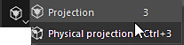

# Projeção

{width="50px"}

A projeção é uma ferramenta que permite tinta um material projetando-o no espaço da tela/janela de visualização. Ele compartilha controles semelhantes aos do estêncil.

É possível editar a transformação de projeção pressionando o **atalho S**:

* Use **S + clique com o botão esquerdo do mouse** para girar o estêncil.
* Use **S + clique com o botão esquerdo do mouse + SHIFT** para ajustar/restringir à rotação do estêncil.
* Use **S + clique com o botão direito do mouse** para aplicar zoom/desfazer zoom no estêncil.
* Use o **S + botão do meio do mouse** para converter o estêncil.

<table>
<tr style="border: 0;">
<td style="border: 0;" valign="top">

</td>
<td style="border: 0;" valign="top">

</td>
<td style="border: 0;" valign="top">

</td>
</tr>
</table>

* **Projeção** : ferramenta de Tinta baseada na projeção de espaço de tela. Essa ferramenta exibirá e repetirá um padrão no visor.
* **Projeção física**: ferramenta de tinta de projeção com propriedades físicas baseadas em predefinições de partículas.
