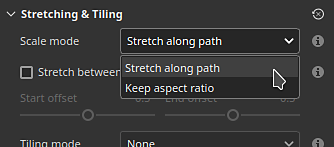
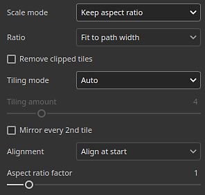

# Caminho da fita

A ferramenta de caminho <b>Faixa de opções </b> permite criar padrões que se deformam ao longo de uma curva definida por pontos na superfície do modelo 3D. A Faixa de opções também pode ser usada para escrever texto em uma curva.

A ferramenta Faixa de Opções pode ser selecionada no menu de ferramentas Caminho na barra de ferramentas:

Ou por meio do botão <b>Tipo de caminho</b>:

## Visão geral

A ferramenta Caminho da faixa difere da ferramenta Pintar ao longo do caminho no modo como desenha imagens e materiais.

Embora com a ferramenta baseada em pintura/pincel uma imagem seja repetida várias vezes em um caminho, com a Faixa de opções a imagem é repetida ao longo do caminho e deformada para seguir suas curvas. Os componentes individuais de um Pincel são chamados de <b>carimbos</b>, enquanto os da Faixa de Opções são chamados de <b>patches</b>.

## Configurações

### Tamanho

| Parâmetro | Descrição |
| --- | --- |
| <b>Largura do traçado</b> | Controla a largura global do traçado atual. |

### Opacidade

| Parâmetro | Descrição |
| --- | --- |
| <b>Opacidade do traçado</b> | Controla a opacidade final do traçado atual. |

### Traçado

| Parâmetro | Descrição |
| --- | --- |
| <b>Orientação da imagem</b> | Defina a direção da imagem de entrada. Essa direção controla como a imagem é colocada no caminho. |
| <b>Virar imagem</b> | Vire a imagem ao longo do eixo/largura do caminho. |
| <b>Canto</b> | Defina como os cantos nítidos (tangentes divididas) devem aparecer no caminho. Os possíveis comportamentos são:<ul data-preserve-html="true"> <li data-preserve-html="true"><b>Junção de mitra</b>: canto pontiagudo</li> <li data-preserve-html="true"><b>Junção redonda</b>: canto suave/arredondado</li> <li data-preserve-html="true"><b>Junção chanfrada</b>: canto quadrado/plano</li> <li data-preserve-html="true"><b>Junção de corte</b>: inicie o caminho novamente. Esse modo criará um novo caminho com seções de início/fim dedicadas.</li> </ul>Veja abaixo como são os cantos, em ordem:  

 |
| <b>A omissão termina quando fechada</b> | Se habilitada, as seções de início/fim serão removidas quando um caminho for fechado para fazer um loop contínuo. Isso se aplica a deslocamentos de amplificação e traçados dinâmicos. |

### Esticamento e revestimento

O Caminho da faixa pode usar dois modos diferentes para controlar como uma imagem é repetida e esticada ao longo de um caminho:

* <b>Esticar ao longo do caminho</b>: (padrão) a imagem repetida ao longo do caminho será esticada para se ajustar ao comprimento do caminho
* <b>Manter a proporção</b>: a imagem repetida ao longo do caminho terá sua proporção preservada. Se a imagem for muito longa em comparação com o caminho, ela será cortada.

#### Esticar ao longo do caminho

| Parâmetro | Descrição |
| --- | --- |
| <b>Alongar apenas entre deslocamentos</b> | Se ativada, essa opção mantém as seções inicial e final de uma imagem intactas enquanto estica o meio. Use os parâmetros <b>Deslocamento inicial</b> e <b>Deslocamento final</b> para definir o tamanho dessas seções. A seção do meio será calculada automaticamente com base no início/fim.  

 |
| <b>Modo lado a lado</b> | Defina como uma imagem é repetida ao longo do caminho. Os valores possíveis são:<ul data-preserve-html="true"> <li data-preserve-html="true"><b>Nenhum</b>: a imagem não será repetida. Ela será esticada ao longo de todo o caminho.</li> <li data-preserve-html="true"><b>Automático</b>: (padrão) a imagem é repetida automaticamente um determinado número de vezes com base em seu tamanho e na largura do traçado.</li> <li data-preserve-html="true"><b>Personalizado</b>: a imagem é repetida pelo número de vezes definido pelo parâmetro <b>Valor de divisão em blocos gráficos</b>.</li> </ul> |
| <b>Valor de divisão em blocos gráficos</b> | Especifique quantas vezes uma imagem é repetida no modo de divisão em blocos <b>Personalizado</b>. |
| <b>Espelhar cada 2º bloco</b> | Vire a imagem usada ao longo do comprimento do caminho a cada segunda repetição. |
| <b>Fator de proporção</b> | Esticar ou comprimir a proporção da imagem atual. |

#### Manter a proporção

| Parâmetro | Descrição |
| --- | --- |
| <b>Proporção</b> | Defina como a imagem é dimensionada, preservando sua proporção:<ul data-preserve-html="true"> <li data-preserve-html="true"><b>Ajustar à largura do caminho</b>: (padrão) Dimensione a imagem para se ajustar à largura do caminho. Isso pode resultar no corte da imagem por muito tempo.</li> <li data-preserve-html="true"><b>Ajustar ao comprimento do caminho</b>: adapte a dimensão da imagem para que um número exato se ajuste ao longo do caminho, mantendo aproximadamente a proporção.</li> </ul> |
| <b>Remover blocos recortados</b> | Se habilitada, removerá as repetições ao longo do caminho que não podem ser totalmente visíveis (se estiverem cortadas). Esta configuração será desabilitada se a configuração <b>Proporção</b> for definida como <b>Ajustar ao comprimento do caminho</b>. |
| <b>Modo lado a lado</b> | Defina como uma imagem é repetida ao longo do caminho. Os valores possíveis são:<ul data-preserve-html="true"> <li data-preserve-html="true"><b>Nenhum</b>: a imagem não será repetida. Ela será esticada ao longo de todo o caminho.</li> <li data-preserve-html="true"><b>Automático</b>: (padrão) a imagem é repetida automaticamente um determinado número de vezes com base em seu tamanho e na largura do traçado.</li> <li data-preserve-html="true"><b>Personalizado</b>: a imagem é repetida pelo número de vezes definido pelo parâmetro <b>Valor de divisão em blocos gráficos</b>.</li> </ul> |
| <b>Espelhar cada 2º bloco</b> | Vire a imagem usada ao longo do comprimento do caminho a cada segunda repetição. |
| <b>Alinhamento</b> | Defina onde a imagem deve começar ao longo do caminho. Os valores possíveis são:<ul data-preserve-html="true"> <li data-preserve-html="true"><b>Alinhar no início</b>: a imagem é desenhada a partir do primeiro ponto no caminho.</li> <li data-preserve-html="true"><b>Alinhar ao centro</b>: a imagem é desenhada no meio do caminho.</li> <li data-preserve-html="true"><b>Alinhar ao final</b>: a imagem é desenhada a partir do último ponto no caminho.</li> </ul> |
| <b>Fator de proporção</b> | Esticar ou comprimir a proporção da imagem atual. |

### Mesclagem de canais

Esta seção controla o resultado da mesclagem para quando o caminho se sobrepõe a si mesmo.

| Parâmetro | Descrição |
| --- | --- |
| <b>Alpha</b> | Controle como a seção <b>Alpha</b> do Caminho da faixa é mesclada em regiões onde ele se sobrepõe, o que afeta a intensidade da mesclagem de todos os outros canais. Os valores possíveis são:<ul data-preserve-html="true"> <li data-preserve-html="true"><b>Normal</b>: usa o alfa do segmento superior.</li> <li data-preserve-html="true"><b>Clarear (Máx)</b>: (padrão) usa o valor alfa máximo, preservando o segmento mais opaco.</li> <li data-preserve-html="true"><b>Subexposição linear (Adicionar)</b>: adiciona o alfa dos segmentos para acumulá-los juntos, resultando em um valor mais saturado.</li> </ul> |
| <b>Normal</b> | Defina como o canal <b>Normal</b> é mesclado em regiões onde o caminho se sobrepõe. Os valores possíveis são:<ul data-preserve-html="true"> <li data-preserve-html="true"><b>Normal</b>: usa o resultado do segmento superior.</li> <li data-preserve-html="true"><b>Combinação de mapa normal</b>: (padrão) combina os segmentos com intensidade igual.</li> <li data-preserve-html="true"><b>Detalhes do mapa normal</b>: considere o segmento superior como detalhes adicionais, enquanto as regiões inferiores preservarão sua intensidade.</li> </ul>Essa configuração é separada do modo de mesclagem <b>Normal</b> definido para toda a camada, que é aplicado após a mesclagem de autosobreposição do próprio caminho. <b>Observação</b>: esta configuração será desabilitada se o canal tiver uma cor uniforme. É compatível somente com recursos de bitmaps e Substance. |
| <b>Height</b> | Defina como o canal <b>Height</b> é mesclado em regiões onde o caminho se sobrepõe. Os valores possíveis são:<ul data-preserve-html="true"> <li data-preserve-html="true"><b>Normal</b>: usa o resultado do segmento superior.</li> <li data-preserve-html="true"><b>Subexposição linear (Adicionar)</b>: adiciona segmentos juntos, preservando sua intensidade original.</li> <li data-preserve-html="true"><b>Escurecer (mín.)</b>: mantenha apenas o valor mais escuro/mais baixo dos segmentos sobrepostos.</li> <li data-preserve-html="true"><b>Claro (Máx.)</b>: (padrão) mantém o valor mais leve/alto dos segmentos sobrepostos.</li> <li data-preserve-html="true"><b>Tela</b>: semelhante a <b>Doge linear</b>, mas dá um resultado menos saturado.</li> </ul>Essa configuração é separada do modo de mesclagem <b>Height</b> definido para toda a camada, que é aplicado após a mesclagem de autosobreposição do próprio caminho. <b>Observação</b>: esta configuração será desabilitada se o canal tiver uma cor uniforme. É compatível somente com recursos de bitmaps e Substance. |

Exemplo da aparência do modo de mesclagem com o canal de height:

## Texto e imagens não quadradas

Ao usar um [recurso de texto](../text-resource.md) ou uma imagem com uma proporção não quadrada, ela será automaticamente dimensionada para se ajustar à Caminho da faixa.

Esse comportamento permite gravar texto ou repetir imagens, como padrões de aparo, ao longo de um caminho.

