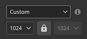

# Gráfico vetorial (.svg &amp; .ai)

Arquivos gráficos vetoriais (<b>.svg</b> e Illustrator <b>.ai</b>) podem ser importados como imagens regulares dentro do Painter. Algumas configurações estão disponíveis para ajustar a aparência do gráfico e ajustá-lo melhor ao restante da texturização.

* Para obter mais informações sobre arquivos SVG, [veja esta página](https://www.adobe.com/creativecloud/file-types/image/vector/svg-file.html).
* Para obter mais informações sobre arquivos AI, [consulte esta página](https://www.adobe.com/ie/creativecloud/file-types/image/vector/ai-file.html).

Os arquivos de SVG e AI são automaticamente convertidos em imagens em pixels quando usados dentro da [Pilha de camadas](../interface/layer-stack/layer-stack.md) (dependendo da configuração selecionada). Esse é um processo não destrutivo. Alterar a resolução ou atualizar o arquivo de origem atualizará o resultado final de acordo.

## Propriedades

Depois de importar um arquivo vetorial e carregá-lo dentro de uma camada ou propriedades de ferramenta, um conjunto de parâmetros estará disponível:

| Seção | Configuração | Descrição |
| --- | --- | --- |
| <b>Prancheta</b> | <b>Prancheta</b> | Selecione qual prancheta incluída no arquivo é usada.  **Observação:** esta configuração só está disponível com arquivos Illustrator (.ai). |
| <b>Resolução</b> | Resolução | Defina o tamanho em que o svg será convertido em uma imagem bitmap (pixels) quando usado para texturização dentro da Pilha de camadas.   Valores possíveis:<ul data-preserve-html="true"> <li data-preserve-html="true"><b>Automático</b>: a resolução é determinada pela resolução do Conjunto de Textura atual (quando usado na camada/efeito de preenchimento) ou para 512 pixels quando usado em uma ferramenta de pincel.  </li> <li data-preserve-html="true"><b>Ativo</b>: a resolução é determinada pelo tamanho de pixel definido no próprio arquivo SVG.  </li> <li data-preserve-html="true"><b>Personalizada</b>: a resolução é determinada pela configuração de resolução imediatamente abaixo na interface.</li> </ul>  

 |
|  |  |  |
| <b>Área de corte</b> | Cortar para | Defina como as formas de SVG serão limitadas à área renderizada.   Valores possíveis:<ul data-preserve-html="true"> <li data-preserve-html="true"><b>Limites do ativo</b>: a área é definida pelos limites definidos no arquivo SVG.</li> <li data-preserve-html="true"><b>Personalizado</b>: a área é definida por valores explícitos através das configurações da interface logo abaixo.  </li> </ul> |
|  | Proporção quadrada | Se a área de corte for definida por <b>Limites do ativo</b>, essa configuração garante que a proporção original seja preservada, evitando qualquer amplificação incorreta ao renderizar o SVG como uma imagem quadrada.   Esta configuração pode tornar alguns elementos inesperadamente visíveis. Para evitar esse problema, desative essa configuração e, em vez disso, ajuste as configurações UV manualmente quando estiver dentro de uma camada/efeito de preenchimento. |
|  | Superior esquerdo inferior direito | Se o corte estiver definido como Área personalizada, essas configurações permitirão definir a área manualmente, especificando os cantos superior esquerdo e inferior direito. |
|  |  |  |
| <b>Escopo</b> | Escopo | Defina quais elementos dentro do arquivo SVG são incluídos antes de renderizá-lo.   O padrão é <b>Documento</b>, o que significa que todo o conteúdo do arquivo SVG é usado. Use o botão <b>Alterar</b> para ajustar os elementos a serem incluídos. |

### Janela Escopo

Ao editar o escopo de um gráfico vetorial (consulte a configuração acima), uma janela será exibida com uma lista de elementos a serem selecionados para especificar o que incluir ou excluir da imagem renderizada final.

Use a caixa de seleção <b>Mostrar miniaturas</b> para exibir uma imagem de cada elemento.

