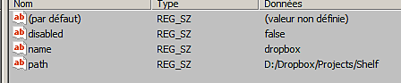

# Edição manual de caminhos de recursos

Esta página é um guia sobre como editar as preferências para adicionar ou remover caminho de recurso sem iniciar o aplicativo.

## Localização de preferências

A localização do recurso é gerenciada com as preferências do aplicativo que podem ser alteradas dependendo da plataforma:

<table data-preserve-html="true"> <colgroup> <col/> <col/> <col/> </colgroup> <tbody> <tr> <th>Sistema</th> <th>Versão</th> <th>Caminho</th> </tr> <tr> <td rowspan="2"><p><strong>Windows</strong></p><p>(registro)</p></td> <td><strong>7.2</strong> ou mais recente</td> <td>HKEY_CURRENT_USER\Software\Adobe\Adobe Substance 3D Painter</td> </tr> <tr> <td>Legado</td> <td>HKEY_CURRENT_USER\Software\Allegorithmic\Substance Painter</td> </tr> <tr> <td rowspan="2"><p><strong>Mac</strong></p><p>(biblioteca)</p></td> <td><strong>7.2</strong> ou mais recente</td> <td>/Users/[nome do usuário]/Library/Preferences/com.adobe.Adobe Substance 3D Painter.plist</td> </tr> <tr> <td>Legado</td> <td>/Users/[nome do usuário]/Library/Preferences/com.substance3d.Substance Painter.plist</td> </tr> <tr> <td rowspan="2"><strong>Linux</strong></td> <td><strong>7.2</strong> ou mais recente</td> <td>/home/[nome do usuário]/.config/Adobe/Adobe Substance 3D Painter.conf</td> </tr> <tr> <td>Legado</td> <td>/home/[nome do usuário]/.config/Allegorithmic/Substance Painter.conf</td> </tr> </tbody> </table>

## Adição de um caminho no Windows

Em Windows, os caminhos podem ser gerenciados por meio do Registro do Windows:

<table>
<tr style="border: 0;">
<td style="border: 0;" valign="top">


</td>
<td style="border: 0;" valign="top">



</td>
</tr>
</table>

1. Clique em **Iniciar > Executar** ou pressione **Windows + R**.
1. Digite “**regedit**” (sem aspas) na caixa de diálogo e pressione **OK**.
1. Navegue na exibição de árvore à esquerda da janela **Editor do Registro** e acesse a chave do Registro mencionada acima.
1. **Adicione uma Chave** abaixo de **pathInfos** com um **número** como nome. Aumente o número com base nas chaves já existentes (começando em 1).
1. Faça um **clique com o botão direito** > **novo** > **Valor da cadeia de caracteres** na parte direita da janela. Nomeie-o **desabilitado** e defina o valor como **falso**.
1. Faça um **clique com o botão direito** > **novo** > **Valor da cadeia de caracteres** na parte direita da janela. Nomeie-o **como** e insira o nome da prateleira personalizada.
1. Faça um **clique com o botão direito** > **novo** > **Valor da cadeia de caracteres** na parte direita da janela. Nomeie-o **caminho** e defina o valor como o caminho onde a prateleira está localizada.
1. Não se esqueça de incrementar em 1 a chave &quot; **size** &quot; dentro de &quot; **pathInfos** “.
1. Feche a janela.
1. Inicie o aplicativo.

É possível definir o novo caminho como o padrão (onde novos recursos são criados, como predefinições) alterando o valor da entrada **wriableShelf** para o nome do novo local.


## Adicionando um caminho no Linux

Em **Linux**, caminhos adicionais podem ser criados por meio do arquivo de configuração de preferência do aplicativo do usuário, armazenado no diretório base (consulte.

1. Navegue até o caminho mencionado acima.
1. Abra o arquivo **Substance 3D Painter.config**
1. Role até a seção **[Prateleira]**

Adicione um novo caminho de prateleira incrementando o último número visível, por exemplo:

```
pathInfos2disabled=false  

pathInfos2name=custom_resources 

pathInfos2path=/home/Username/Documents/custom_path 

writableShelf=custom_resources
```


Use a variável **wriableShelf** para especificar qual caminho será o padrão (onde novos recursos são criados, como predefinições).

Salvar as alterações e reiniciar o aplicativo.
