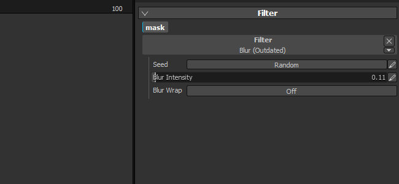

# Versão 2.2

O **Substance Painter 2.2** adiciona um novo fluxo de trabalho que é a Camadas de material dinâmico.

Data de lançamento: *21 de julho de 2016*

## Principais recursos

### Novo fluxo de trabalho de Camadas de material dinâmico

Com esta nova versão, adicionamos um novo **fluxo de trabalho** chamado **Camada de material**. Os fluxos de trabalho de texturização tradicionais contam com a criação de texturas em **alta resolução** para **preservar detalhes**, mas isso **não é conveniente** para o caso de uso. Uma abordagem mais interessante é **criar um pequeno material de revestimento** e **repeti-lo dentro de um sombreador**. Permite preservar uma determinada qualidade e a capacidade de **aplicar zoom realmente próximo** ao objeto usando este sombreador **sem perder detalhes**. O único problema é que, para visualizar o resultado final, era anteriormente obrigatório ir ao motor de jogo/renderizador que exibia o sombreador final. Isso não é mais verdade, pois nesta nova versão agora é possível usar um sombreador semelhante dentro do Substance Painter, que permite **visualizar o resultado final e pintar ao mesmo tempo**.

Um **novo projeto de amostra** chamado “**FireHydrant**” foi adicionado para mostrar o novo fluxo de trabalho.

Esse novo fluxo de trabalho abre duas formas de trabalhar:

* Os materiais são definidos no sombreador; você só pode pintar máscaras para mesclá-los
* Materiais e máscaras podem ser pintados juntos

Em qualquer caso, é possível definir cada vez uma nova pilha de camadas, o que dá mais liberdade ao criar as máscaras e os materiais. O gerenciamento de camadas é muito mais fácil dessa maneira, e cada pilha pode ter seu próprio conjunto de canais específicos que podem ser mesclados no sombreador final.\
Também temos um sombreador especial para Unity 5 e Unreal Engine 4 disponível em Compartilhar :

* [Unidade 5](https://share.allegorithmic.com/libraries/2126)
* [Unreal Engine 4](https://share.allegorithmic.com/libraries/2125)

Para obter mais detalhes, consulte a página dedicada da documentação: [Camadas de material dinâmico](../../features/dynamic-material-layering.md)

### Novo campo de pesquisa de miniprateleira

Aprimoramos a **miniprateleira** que aparece em vários locais do aplicativo com um campo de pesquisa dedicado. Essa melhoria torna a busca por recursos muito mais conveniente e agradável de usar. A pesquisa personalizada é preservada durante a sessão atual do aplicativo. Por exemplo, se você usar muitos ruídos de desgaste, usar essa palavra-chave fará com que

## Tutorial

Nosso tutorial em vídeo mais recente aborda os novos recursos:

## Notas de versão

### 2.2.0

(Lançado em 21 de julho de 2016)

**Adicionado:**

* [Prateleira] Melhorar o sistema de pesquisa e as consultas
* [Prateleira] Adicionar campo de pesquisa para miniprateleiras
* [Shader] Permite definir a precisão da etapa para controles deslizantes
* [Shader] Adiciona um botão Desfazer/Refazer para parâmetros de sombreador
* [Shader] Recarregar um sombreador não deve redefinir seus parâmetros
* [MatLayering] Adicionar suporte para Camadas de material dinâmico e subpilhas
* [MatLayering] Permite importar arquivo json para definir as configurações do sombreador
* [MatLayering] Limite de desbloqueio de classificadores de textura (alternar para texturas sem associação)
* [Script] Permitir a definição de configurações de padeiros e iniciar seu cálculo
* [Substance] Usar “uso” para conexões de entradas/saídas, além de identificadores
* [Ferramenta] Permite selecionar o canal de visualização no visor para a Ferramenta de projeção

**Corrigido:**

* Falha durante a inicialização se as substâncias estiverem localizadas na pasta errada
* O relatório de falhas às vezes não funciona devido a um arquivo de log incorreto
* [Iray] Os pós-efeitos não são atualizados quando o Iray está pausado
* [Iray] O atalho de foco automático não funciona mais
* [Iray] O comportamento do controle deslizante de abertura muda dependendo do tamanho do ativo
* [Camadas] O primeiro canal de material não é ativado por padrão se estiver desativado
* [Shader] Nenhum erro será impresso se um “param auto” estiver incorreto

**Problema Conhecido:**

* [Mac] O limite de amostras de textura está bloqueado em 16 (problema do driver de GPU)
