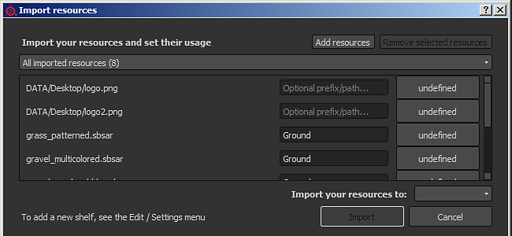

# Versão 2.4

o foco do **Substance Painter 2.4** é melhorar a janela de prateleira e o gerenciamento de recursos.

Data de Lançamento: *27 de outubro de 2016*

## Principais recursos

### Nova janela de prateleira com filtragem avançada

A nova janela de prateleira fornece uma **melhor organização** de recursos juntamente com **novas maneiras de filtrar conteúdo**. Adicionamos a possibilidade de criar **predefinições personalizadas** em que cada predefinição tem sua própria filtragem (permitindo alternar rapidamente entre consultas diferentes). Essas predefinições também podem ser i **isoladas em uma nova janela**, oferecendo uma maneira de ter **várias exibições** da prateleira e não apenas uma como antes. A filtragem também oferece uma maneira de **procurar a hierarquia de pastas no disco**, tornando-se útil ao refinar uma consulta mais geral. Também aprimoramos o **menu de contexto** (ao clicar com o botão direito do mouse em um recurso) para fornecer **mais informações úteis**.

Para criar consultas avançadas, consulte a parte dedicada da documentação: [Consultas de pesquisa avançada](../../interface/assets/advanced-search-queries.md)

### Janela Novo recurso de importação

Com o retrabalho da prateleira, também **melhoramos a janela de importação de recursos**. A janela agora está mais consistente e pode ser **chamada de três maneiras diferentes**: por meio do menu arquivo, do botão na janela da prateleira ou simplesmente como antes, arrastando e soltando um recurso na janela da prateleira. A nova janela permite **definir rapidamente o uso** de **vários recursos** de uma só vez, o que significa que você não precisa mais arrastar e soltar recursos no local certo primeiro. Também adicionamos a possibilidade a **especificar um caminho personalizado** para criar subpastas a fim de aproveitar a nova exibição de árvore.

Para obter mais detalhes, consulte a parte dedicada da documentação: [Adicionando recursos por meio da janela de importação](https://helpx.adobe.com/br/substance-3d/unlisted/documentation/spdoc/adding-content-via-the-import-window-151584824.html)

### Novas predefinições de partícula

Nós **retrabalhamos** a **predefinição de partículas** anterior para estarmos mais prontos para uso (especialmente a predefinição **Chuva**). Também aproveitamos esta oportunidade para **adicionar novas predefinições** com novos comportamentos: dê uma olhada no **Circuito Elétrico, Linhas Elétricas, Rococó e Veias Pequenas**!

## Tutorial

Os novos recursos e uso de prateleiras são abordados em nosso tutorial mais recente:

## Notas de versão

### 2.4.1

(Lançado em 28 de outubro de 2016)

**Corrigido:**

* Falha ao criar um projeto com um modelo
* Falha ao fechar a caixa de diálogo de exportação durante uma exportação
* [Mac] Erros ao salvar o projeto (falha ao salvar a predefinição de exportação)
* [Prateleira] Criar uma nova predefinição a exibirá duas vezes
* [Prateleira] As predefinições não podem ser carregadas no modo somente leitura sem direitos administrativos

### 2.4.0

(Lançado em 27 de outubro de 2016)

**Adicionado:**

* [Prateleira] Nova interface para procurar recursos (exibição de árvore, filtros e assim por diante)
* [Prateleira] Permite salvar uma pesquisa como predefinição
* [Prateleira] Permite criar uma nova janela a partir de uma predefinição
* [Prateleira] Nova interface para importar recursos
* [Prateleira] Não copiar a prateleira alegorítmica padrão na pasta Documentos
* [Prateleira] Novas predefinições de partículas: Circuito elétrico, Linhas elétricas, Rococó, Veias pequenas
* [Prateleira] Predefinições de partículas mais antigas aprimoradas para serem mais fáceis de usar (como “Chuva”)
* [Prateleira] Adicionar novas informações no menu contextual de recursos
* [Visor] Melhorar o desempenho ao carregar mapas de ambiente
* [Visor] Adicionar suporte a mapas de ambiente que não são potência de dois

**Corrigido:**

* Falha ao remover uma máscara
* Falha ao pintar após salvar uma predefinição
* Falha com desfoque de ambiente em algumas GPUs
* Falha ao atribuir um recurso errado com a miniprateleira
* [Prateleira] Limpar e salvar remove as marcas e metadados dos recursos no projeto
* [Prateleira] importar uma predefinição exibirá seus recursos na prateleira
* [Exportar] O mapa normal gerado a partir do canal de height tem uma intensidade baixa
* [Exportar] O normal da malha nem sempre está presente no mapa normal final
* [Exportar] Às vezes, a dilatação com transparência pode resultar sem transparência
* [Scripting] “alg.plugin\_root\_diretory” pode retornar um caminho de rede truncado
* [TextureSet] O botão Bloquear é ativado ao reabrir projetos não quadrados
