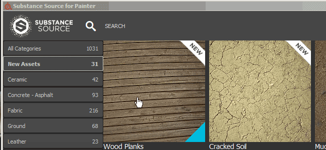
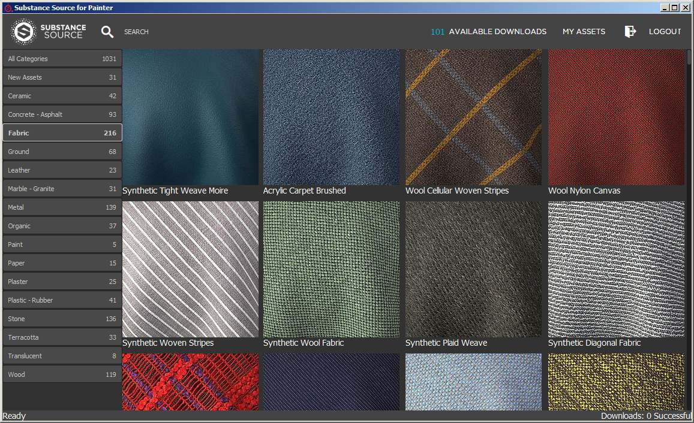
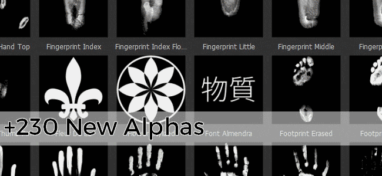
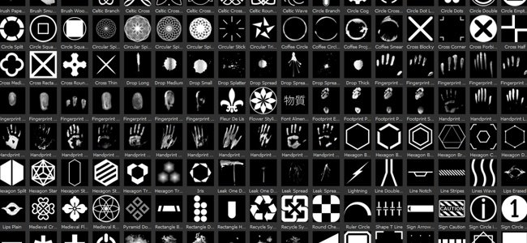
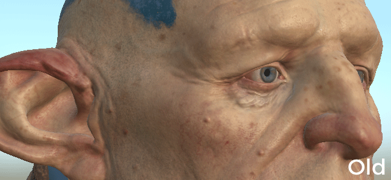

# Versão 2017.1

O Substance Painter altera seu número de versão após a nova oferta de Substance. Para obter mais detalhes, confira: <https://www.allegorithmic.com/welcome-to-substance>\
Nesta nova versão, queríamos nos concentrar no conteúdo, fornecendo um novo plug-in que permite procurar Substance Source e importar materiais diretamente para a prateleira. Também adicionamos muitos ativos novos para expandir suas possibilidades criativas.

Data de Lançamento: *20 de junho de 2017*

## Principais recursos

### Novo plug-in : Substance Source

Com este novo plug-in, agora é possível **procurar diretamente** nosso banco de dados de materiais chamado **Substance Source** e baixá-los **diretamente para a prateleira**, prontos para uso e prontos para trabalhar em seus projetos.\
Para abrir o Substance Source, basta clicar no logotipo do Substance Source **na barra de ferramentas principal** do aplicativo. Isso deve abrir uma nova janela que permita navegar na biblioteca.

{width="650px"}

### Novo conteúdo : Alpha, procedimentos, filtros e muito mais

Nesta nova versão, estamos adicionando **mais de 300 novos ativos**. Adicionamos conteúdo com temas **celtas**, **geométricos**, **medievais** ou até mesmo **celtas** nos alfabetos. Ele também inclui muitos **novos pincéis** e **impressões digitais/impressões manuais digitalizadas**. Também fornecemos alguns novos filtros úteis, como o **MatFX Detail Edge Wear**, que permitem gerar **arranhões** diretamente **das informações normais** pintadas na malha.

Veja a lista do novo conteúdo:

* **4 Novas Fontes** (Japonês, Chinês Simplificado, Máquina de Escrever, Segmento)
* **230 Novos Alpha** (Mistura de padrões e imagens digitalizadas)
* **50 Novos Procedimentos** (Principalmente padrão de tecido para roupas medievais e contemporâneas)
* **2 Novos mapas de ambiente** (Mondarrain e Villa Nova Street)
* **9 Novos filtros** (MatFX Detail Edge Wear, Restrinjo, HBAO, etc.)

Também atualizamos alguns dos ativos existentes para melhorá-los de funcionamento, como o **mapa de ambiente padrão**, que agora parece **menos amarelo:**

## Tutorial

O novo conteúdo é abordado em nosso tutorial em vídeo mais recente:

## Notas de versão

### 2017.1

(Lançado em 20 de junho de 2017)

**Adicionado:**

* [Plug-in] Novo plug-in Substance Source (permite baixar ativos na prateleira)
* [Prateleira] 4 Novas Fontes (Japonês + Chinês Simplificado, Máquina De Escrever, Segmento)
* [Prateleira] 230 novos Alpha (mistura de padrões, pincéis e digitalizações de impressão digital)
* [Prateleira] 50 Novos Procedurals (Padrões de tecido de roupas medievais e contemporâneas)
* [Prateleira] 2 Novos mapas ambientais (Mondarrain e Villa Nova Street)
* [Prateleira] 9 Novos filtros (MatFx Detalhe Edge Wear, Restrinjo, HBAO, etc.)
* [Prateleira] Mapa de ambiente de panorama padrão aprimorado
* [Prateleira] Novas predefinições de exportação para Arnold 5
* [Scripting] Permitir a importação de recursos para a Prateleira

**Problema Conhecido:**

* [Exportar] A edição de uma predefinição de exportação é muito lenta
