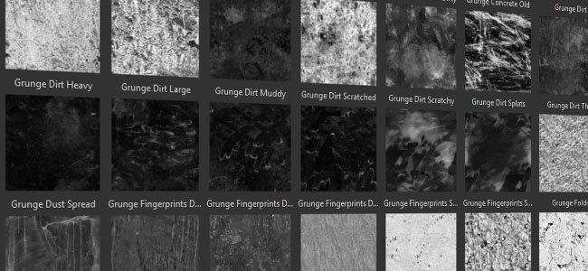

# Versão 2017.4

O **Substance Painter 2017.4** adiciona um novo recurso de fluxo de trabalho com a **instância de camada** que permite sincronizar facilmente camadas em diferentes Conjuntos de Texturas em um projeto.

Data de lançamento: *23 de novembro de 2017*

## Principais recursos

### Instância de camada

A **instância de camada** é um novo sistema que permite manter **sincronizados**, **parâmetros** em **outras camadas e Conjuntos de Texturas**. Ao criar uma instância de camada, a camada original se torna a **origem** e as instâncias **permanecerão atualizadas**, a menos que o vínculo entre elas seja quebrado. As camadas em instância são uma **ótima maneira** de **texturizar um ativo com alguns cliques** e evitar ir e voltar para atualizar camadas. Para texturizar facilmente um ativo, basta **instanciar uma pasta** em outros Conjuntos de Texturas e colocar um material inteligente ou qualquer outra camada nele. Ele será **replicado em todos os lugares** instantaneamente.

Há duas maneiras de criar uma instância:

* Escolha “**colar como instância**” (ou use o atalho CTRL+SHIFT+V), após copiar uma camada
* Escolha “**instanciar entre conjuntos de texturas**” (ou use o atalho CTRL+SHIFT+D) após selecionar uma camada

>[!NOTE]
>
> Há algumas limitações relacionadas às instâncias de camada:
> 
> * As ações de pintura estarão presentes apenas na camada de origem, as camadas instanciadas não replicarão os traçados de pincel.
> * As referências da âncora devem ter o ponto de ancoragem no mesmo nível da instância; um ponto de ancoragem não pode estar fora de uma pasta da instância caso contrário, ele será quebrado.
> * Se um material inteligente for salvo com camadas instanciadas, a camada de origem deverá estar na pasta de material inteligente; caso contrário, o vínculo da instância será quebrado.
> * Dependendo da configuração da pilha de camadas, as camadas instanciadas podem criar um ciclo, que não é suportado e quebrará o resultado da ocorrência. Exclua ou mova a instância para corrigi-la.

Para obter mais detalhes e exemplos, consulte a página dedicada: [Instâncias de camada](../../interface/layer-stack/layer-instancing.md)

### Live-link da DCC com suporte ao Unreal Engine 4

A versão beta anterior do nosso **plug-in live-link** agora foi **integrada** no Substance Painter. Aproveitamos a ocasião para apoiar o Unreal Engine 4, que agora permite ver o resultado de um projeto no motor automaticamente.

Para conectar o aplicativo com o **Unreal Engine 4** (mínimo necessário para a versão **4.18**), baixe os plug-ins de Substance aqui: <https://www.unrealengine.com/marketplace/substance-plugin>

### Novo conteúdo de prateleira

Adicionamos **20 novos materiais de procedimento** e também adicionamos **40 novos mapas de desgaste** (com alguns deles sendo de procedimento). Os novos materiais podem ser encontrados na seção “**Materiais**” da **prateleira**, como os seis novos metais, os oito novos plásticos, alguns tecidos e duas novas superfícies de madeira. Os novos mapas de desgaste podem ser encontrados diretamente na seção “**Desgaste**” da **prateleira**.

Muito obrigado a Clément Feuillet e Nicolas Longchamps por nos permitir licenciar seu conteúdo para esta nova versão.

### Exportação de Sketchfab aprimorada

Atualizamos nossa exportação do Sketchfab e adicionamos a capacidade de publicar seu projeto como rascunho e até atualizar projetos já carregados. Isso deve tornar as iterações do projeto muito mais fáceis de fazer.

### Melhorias de desempenho

Continuamos nosso trabalho em relação a melhorias de desempenho. Nesta nova versão, retrabalhamos muito da nossa renderização OpenGL nas viewports, o que deve dar um bom impulso de velocidade. Também aprimoramos a maneira como os traçados de pincel são computados e devem exigir cálculos de textura muito menos grandes na memória. No geral, ele fornecerá resultados muito mais rápidos e melhores sensações de pintura.

## Tutorial

Os novos recursos são abordados em detalhes nos nossos vídeos mais recentes:

## Notas de versão

### 2017.4.2

(Lançado em 24 de janeiro de 2018)

**Adicionado:**

* [Exportar] Obter o status de uma exportação com progresso de etapa
* [Exportar] Permitir o cancelamento de uma exportação
* [Exportar] Exportar texturas para o Sketchfab sem perder a qualidade normal do mapa
* [Exportar] Exportar no formato binário glTF (glb)
* [Exportar] Permitir o redimensionamento de colunas na guia Configuração da janela de exportação
* [Shader] Adicionar um registro de alterações para a API de sombreamento
* [Script] Adicionar funções de retorno de chamada Antes e Depois ao exportar texturas
* [Iray] Atualização para o SDK 2017.1 (suporte a Volta GPUs)

****Corrigido:****

* Falha ao sair do aplicativo antes que a janela principal seja exibida
* [MAC] Falha ao carregar mapas em tons de cinza com IRAY
* [MAC] A detecção de VRAM não está correta com o novo sistema operacional High Sierra
* [Plug-in] Baixar ativos do Substance Source não funciona mais
* [Script] Detecção de versão mínima incorreta do plug-in
* [Exportar] Falha ao salvar a predefinição de exportação após exportar as texturas
* [Instanciação] Problema em geradores instanciados em um TextureSet sem Mapas Adicionais
* [Visor] O pontilhamento não funciona com resolução acima de 4k
* [Visor] A exibição de material 2D é coberta por ruído
* [Prateleira] Melhorar o tempo de carregamento das predefinições de prateleira
* [Engine] Mesclagem incorreta ao pintar com seleção de cores

### 2017.4.1

(Lançado em 15 de dezembro de 2017)

**Adicionado:**

* [Script] Exportar malha por meio da API de script
* [Importação] Desativa a importação de formato de arquivo de malha não suportado (permitir somente obj, fbx, dae, ply)
* [Log] Indique com mais precisão o problema de TDR no arquivo de registro

**Corrigido:**

* Falha se o aplicativo for fechado antes da conclusão do rastreamento de recursos
* Falha ao abrir projetos com a ferramenta Borrar/Clonar
* Falha ao usar a ação de refazer após desfazer uma alteração de Sombreador nas Configurações do visualizador
* [Engine] A texturização difere entre o Painter 2017.2 e 2017.4
* [Visor] A separação em um mapa de ID de uma instância obtém a amostra da cor errada
* [Export] Falha ao exportar uma textura normal ou de oclusão inválida
* [Exportar] Os arquivos de PSD têm seus grupos bloqueados quando abertos no Photoshop CS6
* [Plug-in] O plug-in do Photoshop ignora a seleção de canal e sempre exporta tudo
* [Camadas] As âncoras são rompidas quando copiadas/coladas em conjuntos de texturas
* [Camadas] Algumas referências de âncora não podem ser restauradas se estiverem quebradas
* [Shader] O parâmetro de aspereza secundária revestido com pbr está danificado
* [Steam] O pop-up do verificador de versão não deve estar visível na inicialização

**Problemas conhecidos:**

* [AMD] Falha/Congela ao tentar pintar em uma malha. Pode ser corrigido com uma atualização de driver de GPU.

### 2017.4

(Lançado em 23 de novembro de 2017)

**Adicionado:**

* [Instanciação] Permite criar instâncias de parâmetros em camadas
* [Instanciação] Permite saltar entre uma camada de origem e uma instância
* [Instanciação] Adicionar uma ação “instanciar em conjuntos de texturas”
* [Instanciação] Indique na pilha de camadas instâncias reentrantes (ciclos)
* [Instância] Excluir instâncias quando uma origem é removida
* [Instanciação] Não permitir referências de Âncora de fora de uma pasta de instância
* [UI] Mova a pilha Desfazer para sua própria janela chamada “History”
* [Plug-in] Plug-in de integração de link dinâmico DCC
* [Mecanismo] Aprimorar o desempenho da pintura com pintura Esparsa
* [Exportar] Adicionar opções de rascunho e reexportação ao exportador do Sketchfab
* [Prateleira] Adicionar controle “virar” para substâncias de fonte
* [Prateleira] Adicione 20 novos materiais de procedimento
* [Prateleira] Adicione 40 novos mapas grunges (bitmap baseado e procedimento)
* [Visor] Ativar colisões de visualização de pincel em outros conjuntos de texturas visíveis
* Atualizar os requisitos mínimos dos drivers de GPU AMD

**Corrigido:**

* Falha ao computar Substance em resoluções muito grandes
* Falha ao pintar fortemente com partículas
* [Visor] Reflexo de specular incorreto na exibição 2D com malhas específicas
* [UI] Algumas ações indesejadas são exibidas na janela Histórico

**Problemas conhecidos:**

* [Camadas] Algumas referências de âncora não podem ser restauradas se estiverem quebradas
* Falha ao usar a ação de refazer após desfazer uma alteração de Sombreador nas Configurações do visualizador
