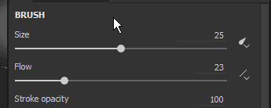
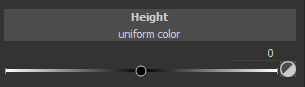
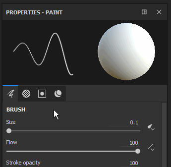
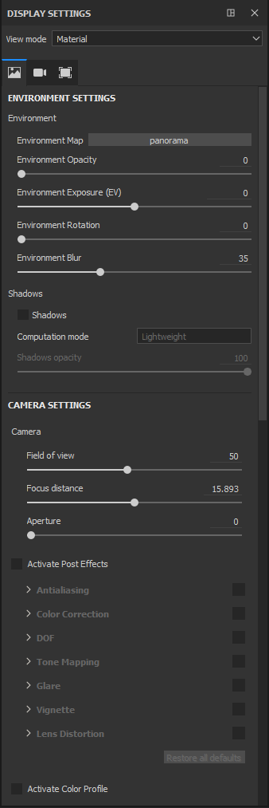
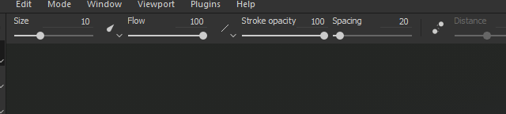
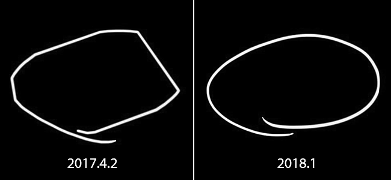
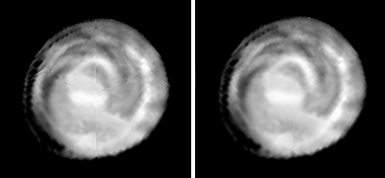
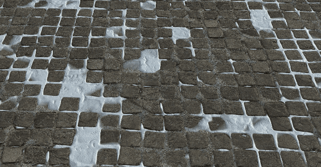
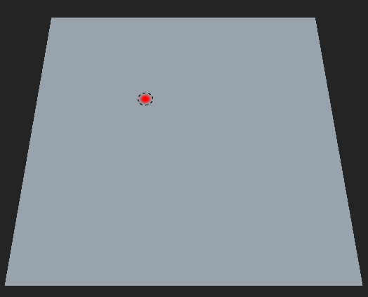

# Versão 2018.1

O **Substance Painter 2018.1** apresenta uma nova interface com vários comportamentos aprimorados. Os desempenhos também foram melhorados em muitas áreas.

Data de lançamento: *15 de março de 2018*

## Principais recursos

### Nova interface e novos comportamentos

{width="650px"}

O Substance Painter 2018.1 apresenta um **retrabalho completo da interface**, variando de cores e ícones a comportamentos de widget.

* A **nova interface** concentra-se em trazer um design totalmente novo, tornando-o mais fácil de ler e menos complicado de navegar.\
  Retrabalhamos todos os nossos ícones para sermos mais explícitos. Também reformulamos nosso esquema de cores, que agora deve ser mais consistente.\
  
* Aprimoramos vários widgets, especialmente nossos **controles deslizantes**, para que fossem mais **fáceis de usar** com uma **Caneta tablet**.\
  Você pode clicar na barra para mover o controle deslizante ou usar o campo de valor para editar os números com mais precisão.\
   
* Temos uma **nova barra de ferramentas** que permite abrir **Docks** em tempo real.\
  Clicar em um dos botões na barra de ferramentas exibirá o Dock próximo ao seu botão e flutuando acima do resto da interface, clicando novamente no botão irá fechá-lo.\
  Se o encaixe se afastar de seu botão, ele se torna uma janela flutuante regular que pode ser encaixada na interface. Se fechado, o botão estará disponível novamente na barra de ferramentas do Dock.\
  Esse novo sistema de encaixe funciona mais facilmente com tela cheia. Não há necessidade de ter cada docking station sempre presente na interface.\
  
* Os encaixes agora usam nosso novo **Layout de guia**, que organiza itens em seções enquanto ainda pode rolar rapidamente dentro dele.\
  Este layout de guia permite **janelas grandes** e pode apresentar **todas as informações** ao mesmo tempo, ao contrário dos sistemas de guia comuns que ocultam informações.\
    
* Agora há um **Menu Rápido**, que disponibiliza **propriedades da ferramenta** **diretamente no visor**.\
  Para abrir o menu rápido, basta **clicar com o botão direito no visor**. Para **fechar** o menu rápido, **clique novamente no visor**.\
  O menu só fechará ao clicar na viewport, permitindo arrastar e soltar recursos da prateleira diretamente para o menu rápido.\
  
* Agora há uma nova **Barra de Ferramentas Contextual** na parte superior do visor.\
  Esta barra de ferramentas altera os seus parâmetros, dependendo da ferramenta atual usada. É uma maneira de acessar rapidamente os recursos básicos da ferramenta (como o tamanho do pincel).\
  
* Agora é possível **reordenar efeitos** usando **arrastar e soltar** na **pilha de camadas**.\
  
* Embora os atalhos “**C**” e “**B**” permitam visualizar rapidamente o **Canal** e as **texturas cozidas** no **visor**, agora é possível usar o **menu suspenso unificado** para alterar a exibição do visor.\
  No **canto superior direito** do **visor**, agora há uma lista suspensa listando **todos os Canais e mapas de Malha** (anteriormente mapas Adicionais). Este menu suspenso unificado também está disponível no encaixe **Configurações de Exibição**.\
  
* As **Configurações de Exibição** e as **Configurações de Visualizador** foram **mescladas** em um singleDock.\
  As configurações de **Ambiente**, **Câmera** e **Visor** agora estão agrupadas **juntas**, enquanto os parâmetros de **Sombreadores** foram **movidos** para uma **Doca dedicada**.\
  As Configurações de Exibição agora tiram proveito do novo **Layout de guia** para navegar rapidamente pela janela.\
  

### Arrastar e soltar Materiais e Materiais Inteligentes no Visor

{width="650px"}

Agora você pode **arrastar e soltar** materiais e materiais inteligentes **diretamente para o visor**.\
Esta nova ação **realçará a geometria** do **conjunto de texturas de destino** ao mesmo tempo. Esta ação criará as novas camadas no topo da pilha de camadas do Conjunto de texturas.

### Comportamento aprimorado da caneta digitalizadora

Nesta versão, melhoramos a maneira como lidamos com os movimentos e entradas da caneta eletrônica gráfica, especialmente quando a Substance Painter está sob carga pesada.\
Não perdemos mais as entradas enquanto fazemos cálculos consecutivos. Isso deve permitir traçados precisos em todas as situações.

### Enchimento de costura aprimorado

Nós retrabalhamos a forma como geramos nosso preenchimento fora das Ilhas UV. Em vez de pegar o pixel atual e dilatá-lo em uma certa distância, agora procuramos o pixel vizinho do outro lado da costura UV e interpolamos os dois valores.\
Isso fornece um resultado final muito melhor e reduz a visibilidade da divisão entre Ilhas UV mesmo quando as proporções de texto não correspondem.

<table>
<tr style="border: 0;">
<td style="border: 0;" valign="top">

{width="200px"}

</td>
<td style="border: 0;" valign="top">

{width="200px"}

</td>
</tr>
</table>

Esse novo preenchimento é gerado automaticamente após cada traçado de pincel, alteração de resolução ou modificação de camada.

### Desempenho aprimorado

{width="650px"}

Também melhoramos o desempenho nesta versão em vários níveis:

* Abrir e salvar o projeto deve ser um pouco mais rápido do que antes.\
  Retrabalhamos a maneira como codificamos/decodificamos nossos **dados de pintura**. Isso afeta especialmente projetos com muitas informações de pintura (traçados de pincel).
* Agora oferecemos suporte a muitos **subobjetos** com malhas.\
  Não é mais obrigatório fundir uma malha em uma peça antes de carregá-la em Substance Painter. O desempenho deve permanecer bom mesmo com **8000 subobjetos** em um projeto.
* Alteramos a forma como nosso **visor** é **atualizado** para reduzir a carga na GPU ao pintar.\
  Isso significa que não atualizamos mais a imagem inteira, mas sim uma pequena região onde você está trabalhando no momento.\
  Você pode sentir a diferença em GPUs menos potentes ou ao usar uma alta contagem de amostras no sombreador.
* O sistema **prateleira** agora está **mais rápido para descobrir** recursos ao iniciar o aplicativo.\
  Os materiais de Substance com bitmaps incorporados são **duas vezes mais rápidos** para serem descobertos (se cozidos como não sólidos). As **Predefinições** também devem ver melhorias.

### Panificador de posição de cena global

Agora temos uma nova configuração que permite preparar um mapa de posição por conjunto de textura que leva em consideração o tamanho total da cena.\
Esse novo comportamento permite usar projeções triplanares em Geradores de máscaras que corresponderão a toda a cena em vez de criar costuras como antes. Isso é realmente útil com projetos que têm muitos conjuntos de texturas (como projetos baseados em UDIM).

Nas configurações do padeiro, altere o parâmetro “**Escala de Normalização**” de “**Por Material**” para “**Cena Completa**” para habilitar este novo comportamento.

### Novo conteúdo

Também adicionamos algum conteúdo novo nesta versão:

* Novos **ruídos 3D.**\
  Importado diretamente do Substance Designer, 4 novos ruídos 3D e totalmente contínuos foram adicionados à prateleira padrão.\
  Esses novos ruídos dependem do mapa de posição do projeto para gerar um resultado sem emendas.
* Ruídos **não quadrados**\
  Os ruídos básicos foram atualizados para a versão mais recente do Substance Designer.\
  Isso significa que o recurso de expansão não quadrada agora está disponível nos parâmetros de ruído.
* Novo gerador de máscara **3D linear gradient** Esse novo gerador de máscaras permite criar um gradiente linear em qualquer direção no espaço 3D.\
  A direção pode ser definida com duas posições 3D, que podem ser escolhidas diretamente no mapa de posições.\
  Exemplo:

1. &#x200B;
   1. Crie o gerador de máscaras **3D linear gradient** em uma de suas camadas
   1. Alterne a exibição do visor para “**Posição**” (por meio do menu suspenso do visor ou usando a tecla “**B**”)
   1. Clique no parâmetro “**Início da Posição 3D**” para abrir o pop-up **Seletor de Cores**
   1. **Escolha uma cor** na malha **no visor**
   1. Repita o processo para o segundo parâmetro “**Fim da posição 3D**”

      

* Novo modelo **Lens-studio** (aplicativo Snap Chat 3D).\
  Temos um novo modelo para criar facilmente projetos direcionados ao aplicativo Lens-Studio criado pelo Snap.\
  Um sombreador dedicado e uma predefinição de exportação também estão disponíveis. Para obter mais detalhes sobre o Lens Studio, consulte: <https://lensstudio.snapchat.com/>
* **Materiais inteligentes** e **Máscaras inteligentes** foram atualizados com a versão mais recente de nossos Geradores de máscaras.\
  Nossas predefinições inteligentes agora são compatíveis com o recurso **microdetalhes** que pode ser usado com os **Pontos de ancoragem**.

### Novo projeto de amostra

{width="650px"}

Agora há um novo projeto de amostra chamado “**TilingMaterial**” que você pode abrir por meio da ação de menu “**Arquivo > Abrir Amostra**”.\
Este projeto usa uma malha de plano simples com UVs sobrepostos que permite **pintar perfeitamente** materiais e pinceladas para **criar materiais de revestimento**.

{width="400px"}

## Tutorial

Um novo curso de tutorial foi adicionado ao Substance Academy para cobrir nossa nova interface: [Introdução ao substance painter 2018](https://academy.allegorithmic.com/courses/a97b433a5997fd800b5ed300d783cc41/youtube-e-zpEL0Wcqg)

## Notas de versão

### 2018.1.3

(Lançado em 28 de junho de 2018)

**Adicionado:**

* Resumo: Hotfix
* [Preferências] Proponha salvar o projeto quando o Painter for reiniciado

**Corrigido:**

* [Plug-in] O Substance Source de pesquisa não funciona
* [Materiais inteligentes] A importação de materiais inteligentes leva a uma falha em alguns casos
* [Materiais inteligentes] Excluir materiais inteligentes leva a uma falha em alguns casos
* [Salvar] Salvar leva a uma falha em alguns casos raros
* [Prateleira] Inverter não funciona no Células 2 e no Células 3
* [Prateleira] Erro de digitação em alguns Alpha
* [Prateleira] Alguns materiais da substância não renderizam corretamente

**Problemas Conhecidos:**

* Congelamento de computação em GPUs AMD VEGA

### 2018.1.2

(Lançado em 6 de junho de 2018)

**Adicionado:**

* Resumo: Velocidade de cozimento aprimorada, Sistema de salvamento aprimorado, Controles deslizantes atualizados, API de plug-in atualizada, Tradução para chinês, Preenchimento aprimorado agora opcional
* [Padeiros] Melhoria de desempenho com nova versão de panificação
* Forçar caixa de diálogo de exibição com GPU incompatível
* [Salvar] Expor a nova funcionalidade de projeto compacto (modo de salvamento completo/compacto)
* [Salvar] Informar o usuário em caso de erro ao salvar
* [Clean] Próxima gravação no modo completo/compacto
* [Controles deslizantes] Aprimoramento da precisão das barras e dos controles deslizantes de cor/escala de cinza
* [Controles deslizantes] Adição de controles de seta para cima ou para baixo
* [Controles deslizantes] Mesma zona de detecção para controles deslizantes de barra colorida e de tons de cinza
* [Plug-in] Salvamento automático sempre em modo incremental
* [Plug-in] Opção para alternar plug-ins para o novo estilo de interface
* [Language] Adicionar tradução para chinês
* [Preenchimento] Opção para alternar entre o preenchimento UV e vizinho de espaço 3D por Textura Definida nas Configurações do conjunto de textura
* [Script] Modo de salvamento de exposição: completo/compacto ou incremental
* [Script] Atualizar script/documentação QML
* [Log] Indica o modo de salvamento no log (completo/compacto ou incremental)

**Corrigido:**

* [Ferramenta] O slot do canal se transforma em um slot de material em preenchimentos de canal único
* Falha ao carregar uma malha (FBX) com algumas faces não atribuídas por um material
* Falha na Iray com NVIDIA GRID 5.2 na máquina virtual
* Falha ao desfazer uma exclusão de predefinição de material
* Falha ao carregar alguns projetos
* [Linha de comando] Nova linha de comando para malhas UDIM divididas por udim
* [Barra de ferramentas] Redução da barra de ferramentas
* [Instanciação] Não é possível instanciar bitmaps em vários conjuntos de texturas
* [Janela de visualização] A atualização não é concluída ao pintar na malha com UVs lado a lado
* [Iray] O mapa normal é aplicado duas vezes para dielétricos
* [Prateleira] Erros de digitação em alguns parâmetros de Substance (alfas, procedimentos e matfx)
* [Shelf] Erro de ortografia no bitmap “Somente Pessoal Autorizado”
* [Script] A função alg.shaders.materials() não funciona mais

**Problemas Conhecidos:**

* Congelamento de computação em GPUs AMD VEGA

### 2018.1.1

(Lançado em 3 de abril de 2018)

**Corrigido:**

* [Tablet] Problema ao alterar as opções de interação padrão
* [Bakers] Falha com a biblioteca Assimp
* [Bakers] Regressão no desempenho com mapa A.O.
* [Iray] A Distorção de lente não é aplicada ao canal de Alpha
* [Drivers] Atualização dos requisitos mínimos de drivers
* [3Dview] Normais não gerados corretamente em malhas UDIM sem informações normais
* [Intel] Falha com o Substance Painter 2018.1.0
* [Intel]&#x200B;[Visor] Problema com preenchimento (artefatos pretos)

**Problemas Conhecidos:**

* Congelamento de computação em GPUs AMD VEGA

### 2018.1

(Lançado em 15 de março de 2018)

**Adicionado:**

* Novo estilo geral (ícones, cor, comportamento)
* Novo layout padrão
* [Tablet] Aprimoramento da experiência do usuário ao pintar
* [Menu principal] Classificar itens nativos em exibições e barras de ferramentas primeiro
* [Menu principal] Mover ações de máscara rápida na seção do visor
* [Menu principal] Mover as ações do botão direito do mouse para a seção do visor
* [Menu principal] Renomear o menu “Exibir” como “Janela”
* [Menu rápido] Novas propriedades de ferramenta clicando com o botão direito do mouse no visor
* [Widget de encaixe] Nova barra de ferramentas de encaixe para redução/recuperação rápida
* [Configurações de exibição] Janela de configurações da câmera e do visualizador mesclada
* [Pilha de camadas] Menu contextual de clique com o botão direito
* [Pilha de camadas] Arraste e solte para mover qualquer efeito dentro da mesma camada
* [Barra de ferramentas] Reorganização da barra de ferramentas e da nova barra de ferramentas contextual
* [Barra de ferramentas Ferramentas] Dividir a ferramenta Clonar em duas ferramentas separadas
* [Propriedades das ferramentas] Valor de tons de cinza do plano de fundo mais claro na visualização
* [Propriedades das ferramentas] Organização em guias (preenchimento e ferramentas)
* [Ferramenta] O resultado da pintura corresponde ao estêncil
* [Visor] Novo cursor para camada de preenchimento
* [Visor] Navegação e pintura mais suaves (maior taxa de quadros)
* [Janela de visualização] Caixa de combinação Material/Canal/Seleção de mapa no visor
* [Visor] Reduzir cintilação ao girar (sombra ativada)
* [Prateleira] Exibir materiais por padrão ao abrir o Painter
* [Prateleira] Melhoria do tempo de carregamento de texturas e materiais de Substance (2 a 6 vezes mais rápido)
* [Prateleira] Reorganizar pastas de materiais para se ajustar à estrutura de Substance Source
* [Prateleira] Arraste e solte materiais diretamente na malha no visor
* [Prateleira] Novos ruídos 3D (Perlin, Perlin Fractal, Simplex e Worley)
* [Prateleira] Novo gerador de máscara de 3D linear gradient usando a posição da malha
* [Shelf] Ruídos básicos atualizados para suportar o expansão não quadrada
* [Prateleira] Adicionado novo modelo e predefinição de exportação para o Lens Studio (aplicativo Snap)
* [Prateleira] Materiais inteligentes e Máscaras inteligentes atualizados para usar a versão mais recente do Editor de máscaras (microdetalhes)
* [Shelf] Novo projeto de amostra “TilingMaterial” para criar materiais de revestimento perfeitos
* [Prateleira] Novas predefinições de pincel (Caligrafia, Molhado, Hachura e assim por diante)
* [Controles deslizantes] Novos controles deslizantes e estilo e comportamento de barras de tons de cinza/cores
* [Padeiros] Permitir o uso de uma caixa delimitadora de cena inteira para calcular o mapa de posição
* [Shader] Remove o parâmetro de força de height dos parâmetros de sombreador padrão
* [Engine] Mecanismo de Substance atualizado
* [Engine] Nenhuma ou menos descontinuidades em blocos UV (novo preenchimento de costura)
* [Plug-ins] Importar materiais baixados do Substance Source mais rapidamente
* [Plug-ins] Atualizar todos os plug-ins para corresponder ao novo estilo geral
* [Preferências] Visualizar alterações de cor de fundo automaticamente
* [Simples] Risco reduzido de corrupção do projeto
* [Aberto] Aperfeiçoamento do tempo do projeto de abertura
* [Novo projeto] Novo projeto - melhoria no tempo de atualização da malha
* [Salvar] Salvando a melhoria no tempo do projeto
* [Log] Tipo de licença relatado no log
* [TextureSet] Renomeie o botão “Bake Textures” como “Bake Mesh Maps”
* Renomear “Mapas adicionais” como “Mapas de malha”

**Corrigido:**

* [Visor] Maus desempenhos com malhas que contêm muitos subobjetos
* [Propriedades de ferramentas] Canal desativado ao arrastar e soltar uma imagem no slot de material
* [Propriedades das ferramentas] A visualização do pincel é interrompida com as ferramentas de borrar e clonar
* [Conjunto de texturas] A ordem dos canais está incorreta ao usar modelos
* [Prateleira] Ícone ausente para o gerador de conversão em tons de cinza
* [Prateleira] O Número de Círculo do Sinal alfa está quebrado (fonte ausente)
* Detecção incorreta de GPUs integradas na inicialização
* [Falha] Arrastar e soltar um recurso importado nomeado com um caractere #
* [Engine] Problema de detecção de Vram na GPU integrada
* [Engine] Corrigidas várias falhas no Substance Engine Linker
* [Engine] Artefatos quadrados ao alterar a resolução
* [Post Effects] O redimensionamento da interface fica lento quando os pós-efeitos estão ativados
* [Padeiros] A unidade de cena não é respeitada corretamente para valores de distância de raio
* [Bakers] A distância do Ocluder da malha é fixada em 1, independentemente do valor de entrada
* [Padeiros] Corresponder pelo nome ignora algumas malhas com nomes específicos
* [Padeiros] A cor da configuração de malha Poligrupo e ID de submalha sempre retorna uma imagem preta
* [Bakers] A cozedura de ID falha com malhas binárias FBX do Blender
* [Shader] Ruído na visualização 2D com dota-2 e brilho não pbr-spec
* [Linux] Somente um thread de CPU é usado ao assar
* [MacOS] Falha com o cursor do pincel se movendo sobre a janela de visualização

**Problemas Conhecidos:**

* Congelamento de computação em GPUs AMD VEGA
* Pós-processo de distorção não considerado ao exportar no IRay (canal alfa)
