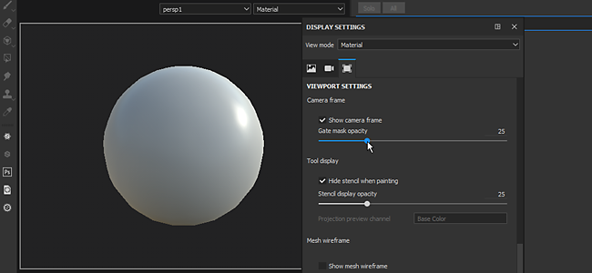
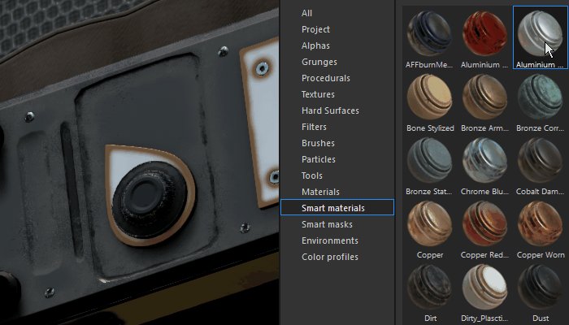

# Versão 2018.2

O **Substance Painter 2018.2** adiciona recursos muito aguardados, como a pintura de dispersão de subsuperfície, que torna a texturização ainda mais fácil do que antes.

Data de lançamento: *2 de agosto de 2018*

## Principais recursos

### Dispersão de subsuperfície

Agora, há suporte para a **dispersão da subsuperfície** no visor de **tempo real** e com o **renderizador Iray**.\
Dispersão subsuperficial é um mecanismo de luz ao penetrar em um objeto ou superfície. Em vez de ser refletida, como nas superfícies metálicas, uma porção da luz é absorvida pelo material e depois **dispersa no interior**. Muitos materiais na vida real têm dispersão subsuperficial, como pele ou cera.

Nossa implementação do efeito Subsurface coincide muito perto com as implementações em tempo real de outros mecanismos de jogo, bem como outros renderizadores offline. Tornando muito fácil criar texturas de dispersão para usar em outros aplicativos.

{width="650px"}

Veja acima um exemplo com o bem conhecido ativo Digital Emily 2. Agradecemos ao USC Institute for Creative Technologies e aos membros do projeto Wikihuman por nos permitir demonstrar nossas renderizações com os ativos da Digital Emily 2.\
(Observe que essa comparação foi feita em condições de iluminação semelhantes, mas não exatas, o que pode explicar as diferenças visuais.)

Para adicionar dispersão de subsuperfície em um projeto, siga estas etapas:

1. Vá para a janela **Configurações de Exibição** e **ative** a configuração **Dispersão da Subsuperfície**.
1. Adicionar um canal “**Dispersão**” no conjunto de textura atual
1. Use uma camada de preenchimento ou **pinte de branco** no novo canal para **revelar** o efeito de subsuperfície no visor.

Um procedimento mais detalhado pode ser encontrado na [documentação sobre dispersão de subsuperfícies](../../features/subsurface-scattering/subsurface-scattering.md).

>[!NOTE]
>
> Para oferecer suporte à Dispersão da Subsuperfície na viewport em tempo real, os **sombreadores** nos projetos devem ser **atualizados**.\
> Para sombreadores personalizados, consulte a documentação disponível no **menu Ajuda** para saber o que mudou no **API de sombreamento**.

### Manipuladores para camadas de preenchimento

Os controles de preenchimento de camadas foram aprimorados para oferecer manipuladores. Agora é mais fácil colocar e controlar com precisão as projeções de preenchimento.

Ao usar a **Projeção UV**, um manipulador aparecerá na **Exibição 2D**:

* Clicar **fora** o manipulador **girará**.
* Clicar no **quadrado** nas **bordas** irá **dimensioná-lo/redimensioná-lo**.
* Clicar **dentro** do manipulador **traduzirá**.
* Use **CTRL** para afetar vários cantos em **simetria**.
* Use o **SHIFT** para **restringir** uma transformação (converter, girar ou dimensionar).\
  

Ao usar a **Projeção tri-planar**, um manipulador aparecerá na **Exibição 3D**:

* O cubo pontilhado representa a projeção global
* Use o atalho de teclado **L**, **E** ou **R** para alternar entre o modo **Traduzir**, **Girar** e **Escala**.
* Use o atalho de teclado **T** para alternar entre as orientações Local e Mundial do manipulador.
* Use o **SHIFT** para **restringir** a transformação.
* A projeção do cubo Triplanar também pode ser modificada nas propriedades da camada de preenchimento avançada:\
  \
  

A barra de ferramentas contextual na parte superior da viewport também se adaptará dependendo do modo de projeção atual, oferecendo ferramentas e controles adicionais:

Para obter mais detalhes, consulte a [documentação sobre Preencher Camada](../../painting/fill-projections/fill-projections.md).

### Suporte a não quadrado e não inclinação para a ferramenta Estêncil e Projeção

O parâmetro estêncil e a ferramenta de projeção foram aprimorados para oferecer suporte a resoluções não quadradas e comportamentos sem inclinação.\
Por padrão, o parâmetro padrão agora é definido como sem cobrança. Esse parâmetro pode ser alterado nas propriedades da ferramenta:

O modo de inclinação pode ser definido da seguinte maneira:

* **Sem Divisão em Blocos Gráficos** (padrão)
* **Lado a lado horizontal**
* **Divisão em blocos verticais**
* **Divisão em blocos gráficos** (comportamento antigo)

Esse novo parâmetro pode ser salvo em uma ferramenta ou predefinição de pincel, facilitando o compartilhamento com conteúdo personalizado.

>[!NOTE]
>
> * A taxa de projeção também se adaptará aos arquivos de Substance que geram resoluções não quadradas. A proporção será calculada diretamente do nó de saída.
> * Com a ferramenta de projeção, se vários canais tiverem proporções diferentes, a primeira proporção encontrada será aplicada a todos os outros canais.

### Importação e gerenciamento de câmera

Agora é possível **importar câmeras personalizadas** dentro do Substance Painter junto com a importação de malha.\
As câmeras podem ser selecionadas **para olhar** através delas no **visor 3D** e usadas **para renderizar na Galeria**.

Para obter mais detalhes, consulte a [documentação sobre gerenciamento de câmera](../../interface/viewport/camera-management.md).

Para **importar câmeras** para um projeto:

1. Exporte a malha para o projeto com câmeras no mesmo arquivo (com um formato compatível, como FBX, Alembic ou glTF)
1. Selecione as configurações de “importar câmeras” na [nova janela do projeto](../../getting-started/project-creation.md) (ou na [configuração do projeto](../../interface/project-configuration.md)).\
   
1. Alterne para a câmera desejada com o menu suspenso no visor ou usando as configurações em [Configurações de exibição](../../interface/display-settings/camera-settings.md).\
   

As Configurações da câmera na janela Configurações de exibição foram estendidas para controlar as propriedades da câmera.\
É possível **alternar** entre câmeras, consulte sua **proporção** e **bloquear** suas propriedades para evitar a modificação. Um botão de restauração pode ser usado para reverter a câmera aos seus valores iniciais.

A moldura da câmera (e seu portão) também é levado em conta, possibilitando visualizar e pintar através de um ponto de vista muito específico. O quadro e o portão são exibidos sobre o Visor 3D e sua opacidade pode ser controlada nas **Configurações do Visor** da janela [Configurações de Exibição](../../interface/display-settings/camera-settings.md):

### Melhorias no comportamento da pilha de camadas

* **Arraste e Solte Materiais e Materiais Inteligentes no mapa de ID:**\
  O recurso de arrastar e soltar conteúdo da prateleira no visor foi aprimorado. Ao pressionar **CTRL** enquanto arrasta e solta um material, agora é possível escolher a cor da ID que será usada como máscara.\
  Uma máscara preta com um efeito de seleção de cor será adicionada à nova camada criada na pilha de camadas. Se o mesmo material for arrastado e solto sobre uma outra cor de ID, a camada já existente será atualizada e as cores de ID serão combinadas.\
  
* **Rolagem de arrastar e soltar da pilha de camadas:**\
  Arrastar camadas ao redor da pilha de camadas agora é possível com uma pequena janela.\
  Quando um recurso ou uma camada é arrastado próximo às bordas da janela de pilha de camadas, ele automaticamente começa a rolar seu conteúdo.\
  

### Importação de malha glTF e Alembic

Novos formatos de arquivo agora são compatíveis com a importação de malhas e a criação de novos projetos:

* **glTF**: este formato já estava disponível ao exportar texturas e agora pode ser usado durante a importação. Se um arquivo glTF contiver texturas, elas serão importadas e colocadas dentro da pilha de camadas (para o fluxo de trabalho metálico/rugosidade).
* **Alêmbico**: este formato é amplamente usado no setor de VFX/Animação para transferir malhas.

>[!NOTE]
>
> O Substance Painter não oferece uma maneira de controlar qual quadro de animação deve ser importado no momento.\
> Isso significa que, ao exportar um arquivo Alembic, o quadro de referência a ser usado para pintar no ativo já deve estar definido.

### Melhorias na integração de Substance

A integração de Substance dentro do Substance Painter foi aprimorada com solicitações muito aguardadas:

* <b>Visível Se:</b>\
  O “Visible if” é um ótimo recurso do formato de arquivo Substance que permite ocultar parâmetros com base em condições.\
  Este recurso fornece uma lista mais clara de parâmetros e configurações contextuais, fornecendo materiais e filtros gerais mais fáceis de usar.\
  Para obter mais detalhes, consulte a [documentação do Substance Designer](https://experienceleague.adobe.com/en/docs/substance-3d-designer/home).\
  
* As **Predefinições de Substance** predefinições de Substance são uma maneira fácil de fornecer ajustes avançados e variações de materiais. Muitos materiais em [Substance Source](https://source.allegorithmic.com) têm predefinições, portanto experimente!\
  Se um arquivo Substance contiver uma ou mais predefinições, uma nova lista suspensa na lista de parâmetros estará disponível. Selecione qual predefinição aplicar para atualizar os parâmetros.\
  
* **Atributos de Substance**\
  Os atributos de Substance agora são exibidos na interface, facilitando a recuperação de informações sobre um arquivo específico.\
  Os atributos podem ser exibidos em dois locais diferentes: acima dos parâmetros na janela de propriedades ou clicando com o botão direito do mouse em um ativo na prateleira.\
   

### Novo projeto de amostra “Jade Toad”

Um novo projeto de amostra chamado “**JadeToad**” foi incluído no Substance Painter. Este projeto de amostra tem o efeito **Dispersão de Subsuperfície** habilitado por padrão.\
Para localizar o projeto, use a entrada de menu **Arquivo** > **Abrir Amostra...**.

## Notas de versão

### 2018.2.3

(Lançado em 25 de setembro de 2018)

**&#x200B;**&#x200B;Corrigido:**&#x200B;**

* [2D View] A visualização 2D é quebrada com algumas malhas ao criar um novo projeto
* [Falha] Alternar de Projeção UV para projeção triplanar leva a um travamento
* [RayCollider] Várias falhas devido ao “RayCollider”
* [Ferramenta] A alternância de camadas perde as propriedades modificadas do pincel
* As configurações do pincel são redefinidas ao alternar para a borracha

**Problemas conhecidos:**

* Congelamento de computação em GPUs AMD VEGA
* Problema do tablet Huion com atalhos no sistema operacional Windows

### 2018.2.2

(Lançado em 11 de setembro de 2018)

**Adicionado:**

* Resumo: hotfix com atualização de conteúdo, novas funcionalidades de script e capacidade de desativar a atualização automática
* [Conteúdo]&#x200B;[Prateleira] Adicionar uma predefinição de prateleira de pele
* [Content]&#x200B;[shelf] Conversão de 19 normais de pele em materiais para dispersão subsuperficial
* [Script] Criar um modelo de projeto a partir de um projeto aberto
* [Script] Obter/Definir configurações de exportação de um projeto aberto
* [Atualizações] Desative o pop-up de atualização automática nas configurações e na variável de ambiente
* [Atualizações] Não exibir até a próxima versão do pop-up de manutenção desatualizada

**Corrigido:**

* [Câmera] Zoom incorreto ao alternar de ortográfico para perspectiva
* [Exibir] Alguns mapas são exibidos em linear em vez de sRGB
* [Visores] O foco da malha não se comporta corretamente
* [2D View] Projeto com câmera quebrada tem desaparecendo UVs Shells
* [SSS]&#x200B;[Dica de ferramenta] as dicas de ferramentas de dispersão da subsuperfície aparecem no registro
* Alguns projetos não podem ser abertos em 2018.2 e a mensagem de erro não pode salvar um pacote nulo do substance
* [Máscara] A cor da ferramenta de pintura pode travar em alguns casos ao trabalhar em uma máscara
* [Material] Mapas que não aparecem em situações específicas
* [Proj]&#x200B;[Ferramentas] Manipulador ativo com um gerador
* [Substance] Grupos de Substance de parâmetros ausentes
* [Scripting] Nome de software incorreto na documentação
* [UDIMs] Não há informações no log sobre shells UVs em vários blocos UVs

**Problemas conhecidos:**

* Congelamento de computação em GPUs AMD VEGA
* Problema do tablet Huion com atalhos no sistema operacional Windows

### 2018.2.1

(Lançado em 3 de agosto de 2018)

**Corrigido:**

* Parâmetros de sombreador de dispersão de subsuperfície ausentes em projetos de atualização

**Problemas Conhecidos:**

* Congelamento de computação em GPUs AMD VEGA
* Problema do tablet Huion com atalhos no sistema operacional Windows

### 2018.2

(Lançado em 2 de agosto de 2018)

**Adicionado:**

* Resumo: lançamento de verão, suporte à dispersão de subsuperfície, melhorias de projeção e preenchimento, importação e seleção de câmera, suporte a Alembic/glTF, arrastar e soltar no mapa de ID, suporte aprimorado ao formato de Substance e novo conteúdo
* [SSS]&#x200B;[Viewport]&#x200B;[Iray] Dispersão genérica de subsuperfície
* [SSS] Sincronizar parâmetros de dispersão da subsuperfície e MDL
* [SSS] Adicionado um novo canal em tons de cinza chamado “Dispersão”
* [SSS]&#x200B;[Configurações do sombreador] Parâmetro de tipo de dispersão para dispersão subsuperficial (pele ou translúcida)
* [SSS]&#x200B;[Configurações do sombreador] Parâmetro de escala de dispersão para dispersão subsuperficial
* [SSS]&#x200B;[Configurações do sombreador] Parâmetro de cor de dispersão para dispersão subsuperficial
* [SSS]&#x200B;[Configurações de exibição] Contagem de amostra de dispersão para dispersão subsuperfície
* [Shader]&#x200B;[Iray] Integrar MDL de dispersão de subsuperfície para Iray
* [Shader] Atualização do sombreador por meio do atualizador de recursos
* [Shader] Atualizar a API e a documentação do log de alterações
* [Propriedades da ferramenta]&#x200B;[Proj] Novos parâmetros para a projeção triplanar
* [Visor]&#x200B;[Proj] Controlar as propriedades da Camada de preenchimento na exibição 3D diretamente com manipuladores (projeção triplanar)
* [Shortcuts]&#x200B;[Proj] Novos atalhos Q, W, E, R, T para manipuladores de projeção triplanar
* [Viewport]&#x200B;[Proj] Controlar as propriedades da Camada de preenchimento na exibição 2D diretamente com manipuladores (Projeção UV)
* [Shortcuts]&#x200B;[Proj] Novo atalho Q para manipuladores de Projeção UV
* [Barra de ferramentas contextual]&#x200B;[Proj] Controla os manipuladores de projeção triplanar
* [Barra de ferramentas contextual]&#x200B;[Proj] Controlar manipuladores de Projeção UV
* [Propriedades da ferramenta] Desativar a divisão em blocos gráficos de textura com a ferramenta Projeção e Estêncil
* [Estêncil] Usar imagens não quadradas com a ferramenta de projeção/estêncil
* [Estêncil] Permitir o controle do modo de divisão em blocos gráficos na janela Propriedades
* [Estêncil] O zoom não está centralizado em um estêncil sem divisão em blocos gráficos
* [Câmeras] Importar câmeras do Maya, Max, Blender, Modo, DAE
* [Câmeras]&#x200B;[Visor] Selecionar e controlar câmeras importadas no visor
* [Câmeras]&#x200B;[Iray] Selecionar e controlar câmeras importadas no Iray
* [Câmeras]&#x200B;[IU]&#x200B;[Novo projeto]&#x200B;[Configuração do projeto] A opção “Importar câmeras” está marcada por padrão
* [Câmeras]&#x200B;[Atalhos] Adicione atalhos “&lt;” e “>” para alternar entre câmeras
* [Câmeras]&#x200B;[Visor] Adicionar quadro no visor
* [Câmeras]&#x200B;[Configurações do visor] Controle de opacidade de quadro
* [Câmeras]&#x200B;[Configurações da câmera] distância focal máxima em 500 mm
* [Câmeras]&#x200B;[Configurações da câmera] Taxa de exposição
* [Câmeras]&#x200B;[Configurações da câmera] Adicionar uma opção de bloqueio
* [Câmeras]&#x200B;[Configurações da câmera] Adicionar uma opção de restauração
* [Câmeras]&#x200B;[Configurações de câmera] Adicionar atributo de distância de foco
* [glTF] Importação de um arquivo glTF
* [glTF] Importar mapa de oclusão do ambiente
* [Alembic] Importar quadro Alembic 1 com geometria estática
* [Prateleira] Arraste e solte materiais diretamente na malha usando mapas de ID com um modificador (CTRL/Command)
* [Pilha de camadas] Criação automática de máscara de ID com arrastar e soltar materiais na malha com mapas de ID
* [Pilha de camadas] Rolagem automática de camadas com arrastar e soltar na pilha de camadas
* [UI]&#x200B;[Propriedades da ferramenta] Expor predefinição de Substance
* [UI]&#x200B;[Menu Ajuda] Aprimoramento do menu Ajuda
* [UI]&#x200B;[Novo projeto]&#x200B;[Configuração do projeto] Reorganização da janela
* [UI]&#x200B;[Novo projeto]&#x200B;[Configuração de projeto] Substituir o termo “Mesh” por “Arquivo”
* [UI]&#x200B;[Substance] Exibir atributos de Substance na interface
* [Atalhos] Opções “F4” entre a exibição 2D e 3D
* [Atalhos] Novos atalhos para alternar o estêncil “N” e a máscara rápida “U”
* [Integração Substance] Leve em consideração as instruções &#39;visible if&#39; nos parâmetros Substance
* [Janela de visualização] As sombras não são forçadas a serem computadas após a movimentação da câmera
* [Content] Atualizar o MeetMat com câmeras importadas
* [Content] Adicionar uma amostra com dispersão subsuperficial ativada - JadeToad
* [Content] Adicionar um novo modelo de projeto PBR com a dispersão subsuperficial ativada
* [Conteúdo] Predefinições de exportação atualizadas para adicionar um novo canal de Dispersão
* [Content]&#x200B;[Prateleira] Adicionado suporte à dispersão de subsuperfície para: pbr-metal-rough, pbr-metal-rough-alpha-test, pbr-coated, pbr-spec-gloss
* [Content]&#x200B;[Prateleira] Adicionado canal de dispersão para 5 materiais inteligentes (mármores e peles)
* [Content]&#x200B;[Shelf] 1 novo material jade
* [Conteúdo]&#x200B;[Prateleira] 1 novo material de cera

**Corrigido:**

* [CMD] Resultados diferentes usando a mesma linha de comando com versões diferentes
* [TDR] Se o TdrLevel estiver configurado, você não tem erros no seu registro
* [Baker] O mapa de oclusão do ambiente está invertido
* [Mapa de ID] Falha ao separar fora do intervalo 0-1
* [Iray] Falha ao alternar conjuntos de texturas e voltar para o modo de Pintura
* [Janela de visualização] Sincronizar áreas de soltar entre portas de visualização para arrastar e soltar
* [Engine] Artefato Moiré ao colocar camadas de preenchimento lado a lado ou pintar um pequeno pincel
* [License] Verificação de versão de software incorreta do serviço de licença
* [Licença] Reformular a maneira como lidamos com a autenticação
* [API] Chamar o evento de API de script `onNewProjectCreated` mesmo ao criar com um modelo
* [Shader] O sombreador compilado não é carregado do cache quando o arquivo de sombreador não é compilado
* [Prateleira] Exportar arquivo HDR da prateleira exibirá um arquivo com valores fixados
* [Exportar] A exportação de EXR mantém os valores de cor do RGB entre 0 e 1
* [Content] O ruído de procedimento “3D Perlin Noise Fractal” está pixelado

**Problemas Conhecidos:**

* Congelamento de computação em GPUs AMD VEGA
* Problema do tablet Huion com atalhos no sistema operacional Windows
