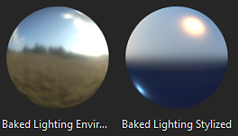
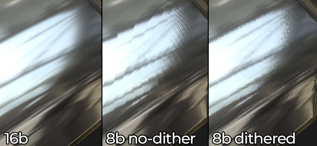
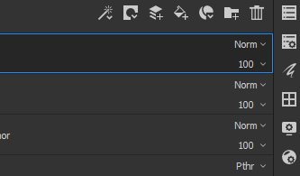
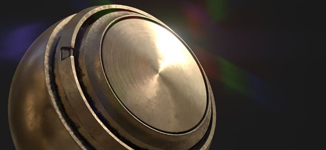

# Versão 2018.3

O **Substance Painter 2018.3** chegou e traz vários novos fluxos de trabalho e recursos de renderização.

Data de lançamento: *20 de novembro de 2018*

## Principais recursos

### Exportação de visualização 2D

Agora é possível **exportar a exibição 2D** renderizando **como uma textura**. Este recurso foi solicitado por muitas pessoas e finalmente o disponibilizamos! O processo de exportação utilizará o estado atual da **exibição 2D** para renderizar uma textura com as configurações de exportação regulares (preenchimento, formato de arquivo, profundidade de bits). Isso significa que se o modo de exibição estiver definido como **Isolar**, em vez do modo de **Material**, a exibição 2D será exportada como está.

Vá para a **janela Exportar** e escolha a nova configuração denominada “**Exibição 2D**”:\

Um novo **Mapa Convertido** chamado “**Modo de Exibição 2D**” também está disponível na guia **Configuração** da janela Exportar, caso você queira criar sua própria **predefinição de exportação**.

### Filtro de iluminação cozida aprimorado

O filtro **Ambiente de iluminação baked** foi bastante aprimorado e agora oferece suporte adequado aos **mapas de ambiente HDR**.\
Agora é possível replicar a iluminação da viewport (como vista na visualização 2D) e colocá-la no canal de Cor base. O novo filtro fornece mais controles, como **rotação** o mapa de **ambiente**, **verticalmente** e alteração da **exposição**.

### Reflexos de Specular Anisotrópico em tempo real

Nesta nova versão, apresentamos um novo sombreador chamado “**pbr-metal-rough-anisotropia-angle**”. Este sombreador dá suporte a dois canais chamados “**Ângulo de Anisotropia**” e “**Nível de Anisotropia**”, que podem ser usados para criar reflexões de specular anisotrópicas. Este sombreador também será traduzido para Iray como ele é sem a necessidade de qualquer conversão.

Este novo sombreador pode ser acessado por meio da [Janela do Sombreador](../../interface/shader-settings/shader-settings.md) clicando no botão do sombreador e abrindo a miniprateleira:

O projeto de amostra padrão “**Esfera de visualização**” foi atualizado para aproveitar esse novo sombreador e mostrar como configurar os diferentes canais.

>[!NOTE]
>
> Se você tiver uma aparência estranha com os **artefatos de linha** ao usar gradientes dentro do canal **Ângulo de Anisotropia**, tente alterar o modo de filtragem para “**Mais próximo**” no caso de uma camada de preenchimento, pois isso pode melhorar a amostragem do sombreador e eliminar o problema.

### Limpar sombreador de revestimento atualizado

O sombreador **Revestimento transparente** (**revestido com pbr**) foi aprimorado para oferecer mais controles e possibilidades de renderização. Também aproveitamos a oportunidade para torná-lo compatível com o **Iray** com um **MDL** dedicado.

Veja uma lista das alterações:

* **Controle** a camada secundária **Aspereza** (via canal **Usuário0**).
* **Mascarar** a camada secundária (via canal **Usuário1**).
* Escolha qual comportamento aplicar à camada de superfície: **Manter Detalhes Normais** (original) ou **Suavizar superfície** (novo, ignorar mapa de malha normal)

Para sua conveniência, também adicionamos um novo modelo de projeto pronto para texturizar este novo sombreador chamado: **PBR - Aspereza metálica revestida**.

### Nova Suavização de Serrilhado de Visor

O pós-processo de suavização de borda de Substance Painter foi retrabalhado e alterado para um novo método chamado “**Suavização temporal**” (**TAA**).\
Essa nova técnica oferece resultados muito melhores em cada caso por um custo mínimo. O **TAA** funciona acumulando informações em vários quadros, permitindo produzir bordas muito suaves sem perder detalhes.

Como não é mais um pós-efeito, a configuração foi movida um pouco para dentro da janela **Configurações de Exibição** e agora está **abaixo** da seção **Pós-Efeitos**.

Essa nova suavização de borda também oferece novas possibilidades quando combinada com transparência. Se um projeto estiver usando o sombreador **Alpha-Test**, tente habilitar a configuração “**Pontilhamento alfa**”:

O novo **TAA** também filtrará bem o padrão de Ruído Azul visível nos **reflexos de Specular**, bem como nas amostras de **Dispersão da Subsuperfície**.

### Texturização virtual esparsa (SVT)

Uma grande mudança nesta nova versão é a introdução das **Texturas Virtuais Esparsas** ou do **SVT**.

Esse novo sistema altera alguns conceitos básicos de Substance Painter e a maneira como o aplicativo funciona. O Substance Painter agora usa o SVT como uma maneira de manter um espaço de memória específico para o visor, permitindo **transmitir texturas de entrada e saída**. O principal benefício é a capacidade de carregar projetos maiores com mais facilidade e reduzir a pressão sobre a GPU para **melhorar o desempenho**. Isso significa que, se as coisas começarem a ficar muito grandes, descarregará algumas texturas no disco e as recuperará mais tarde, se necessário). Este é um **cache volátil** que é excluído quando o aplicativo é fechado.

Outro benefício do sistema é a introdução de **mipmaps** dentro do **visor**, que melhorará a qualidade da textura e reduzirá o efeito Moiré especialmente visível com os padrões do Fabric.

Expusemos alguns controles relacionados a esse novo sistema que podem ser editados nas preferências principais (**Editar > Configurações**):

* **Diretório de cache** : esta configuração controla onde o Substance Painter gravará seus arquivos temporários, incluindo o cache SVT.
* **Aceleração de suporte de hardware**: se habilitada, o Substance Painter usará o suporte nativo de Texturas Esparsas pela GPU (se desabilitada, fará fallback em uma implementação de software)

Para obter mais informações sobre o SVT, dê uma olhada em nossa página de documentação: [Texturas Virtuais Dispersas](../../features/sparse-virtual-textures.md)

>[!NOTE]
>
> É recomendável definir o **diretório de cache** em uma **Unidade de Estado Sólido (SSD)** para garantir o melhor desempenho ao trabalhar com o Substance Painter.
> 
> Essas configurações podem ser substituídas por meio da variável de ambiente: [Variáveis de ambiente](../../pipeline-and-integration/configuration/environment-variables.md).

### Ferramenta Simetria nova e aprimorada

A ferramenta de simetria foi reformulada e agora permite deslocar o ponto de origem. Quando um projeto é parcialmente simétrico ou descentralizado, o plano agora pode ser ajustado. O deslocamento será salvo dentro do projeto por eixo.

Também aproveitamos a oportunidade para dar um pouco de amor a esse recurso e agora temos novos feedbacks visuais:

* Uma **linha de interseção** agora é desenhada pelo **padrão** na malha para mostrar onde está o plano de simetria.
* Um **ponto espelhado** agora aparece ao mover o **cursor** para mostrar onde o traçado do pincel espelhado será aplicado.

Todos os novos elementos visuais podem ser ajustados pelo novo menu Simetria na barra de ferramentas contextual:

* **Espelho X, Espelho Y, Espelho Z** : define qual direção é usada para a simetria
* **Deslocamento** : controla o valor de deslocamento por eixo. O ícone de Seta cruzada permite redefinir todos os deslocamentos de volta para 0.
* **Plano de Simetria** : Mostrar Plano permite desenhar um plano que corta a malha. Mostrar interseção desenha uma linha na malha onde o plano corta a malha.
* **Cursor de simetria** :Show O cursor desenhará um cursor de pincel secundário onde a simetria for aplicada. Ocultar enquanto a pintura somente mostrará esse cursor quando não estiver pintando.
* **Manipulador**: o comando Mostrar Manipulador exibirá um manipulador na viewport para deslocar o plano de simetria. O **Tamanho do manipulador** controla o tamanho do controlador no visor.

Os mesmos **atalhos** para o manipulador Tri-Planar e UV podem ser usados para ocultar/mostrar o Manipulador de Simetria:

* **T** : Mostrar/Ocultar Manipulador
* **Shift** : tradução de encaixe (deslocamento discreto)
* **+ / -** : Alterar tamanho do Manipulador

### Manipulador Tri-Planar aprimorado

Além dos 3 eixos originais para controlar a rotação, também adicionamos uma nova esfera de rotação ao controlar o manipulador Triplanar. A esfera facilita a tentativa rápida de ângulos diferentes ao projetar padrões de ruído, por exemplo.

### Exportar texturas pontilhadas de 8 bits

Ao exportar texturas de mapa Normal e de Height para formatos de arquivo no modo de 8 bits, o Substance Painter agora aplicará automaticamente o **pontilhamento** para reduzir **bandas** **problemas**.

>[!NOTE]
>
> Caso uma predefinição de exportação use um mapa normal, mas algo mais na alfa (como RGB = Normal, A = Aspereza), somente o normal será pontilhado.

### Melhorias no comportamento da pilha de camadas

Algumas melhorias de fluxo de trabalho foram feitas na pilha de camadas e no gerenciamento de camadas:

* Atribua **cor** a **camadas** e **pastas** dentro da Pilha de Camadas por meio do menu de **clique com o botão direito** para organizar as camadas.\
  Entretanto, as cores da camada Substance Painter se comportam de forma um pouco diferente de outros pacotes de software:
  * As camadas dentro de uma pasta herdarão a cor da pasta (mas aparecerão esmaecidas).
  * Mover uma camada sem uma cor atribuída dentro de uma pasta que tenha uma cor herdará a cor da pasta.
  * Se uma camada tiver uma cor dedicada, ela não será substituída pela pasta.Esse comportamento original facilita a colorização e a organização da pilha de camadas, sem a necessidade de atribuir muitas cores manualmente.

* **oculte e exiba** rapidamente várias **camadas** clicando e deslizando **o mouse.**\
  Também aproveitamos essa oportunidade para refinar um pouco o comportamento de revelar camadas dentro de pastas ocultas, que agora também removerá a exibição da pasta.

* **Alterne rapidamente entre modos de mesclagem** com **atalhos** de teclado de **seta**.\
  Após **fechar** o menu pop-up de mesclagem, o **foco** **permanecerá** na camada, que pode continuar sendo alterada com o mesmo atalho anterior.

### Novas Entradas de Substance para Filtros e Geradores

Novas entradas de Substance foram expostas para geradores e filtros personalizados. Essas novas entradas de textura permitem a criação de efeitos mais avançados graças a novas informações relacionadas à malha.

As novas entradas disponíveis são:

* Posição da malha
* Espaço Mundial de Malha Normal
* Tangente do espaço mundial em malha
* Bitangent do espaço mundial da malha
* Tamanho do texel da malha
* Máscara UV de malha

Para obter mais detalhes, consulte a nova documentação: [Entrada baseada em malha](../../content/creating-custom-effects/mesh-based-input.md)

Como exemplo, agora fornecemos um novo **gerador de máscaras** chamado “**Distância da Borda UV**” que cria uma máscara em preto e branco a partir da borda das Ilhas UV do Conjunto de Texturas atual.

>[!NOTE]
>
> Essas entradas são fornecidas diretamente do mecanismo de Substance Painter com base na malha do projeto e não usam os [Padeiros](../../baking/baking.md).

### Conteúdo novo e atualizado

Nesta nova versão, incluímos um novo conteúdo:

* Novos padrões de **gradiente** de procedimento a serem usados com o novo sombreador **anisotrópico** :

  * Radial anisotrópico
  * Gradiente circular
  * Sobreposição de disco de gradiente
  * Gradiente de disco alterado
  * Flocos de gradiente
  * Alternativa de gradiente
  * Verificador de gradiente
  * Verificador de Gradiente Duplo
  * Gradient Weave
  * Gradiente em trama girado
  * Ângulo de trama de gradiente
  * Ângulo de trama de gradiente girado\
    
* Novo mapa de **ambiente** :

  * Studio Automotive Neutro\
    
* Novo **projeto** **modelos** :

  * PBR - Ângulo de Anisotropia de aspereza metálica
  * PBR - aspereza metálica revestida
* Novo **material**:

  * Mulher humana 30s Face 06 (pode ser encontrada rapidamente através da predefinição de pele na prateleira)\
    Este novo material de pele foi fornecido pelo **Texturing.XYZ** e fornece ótimos detalhes de superfície para pintar pele realista.\
    

Também atualizamos parte do conteúdo existente para refiná-lo:

* Filtro atualizador “**Ambiente de iluminação baked**” : veja acima.
* Filtro atualizado “**MatFx Shutline**” : agora permite ocultar o efeito de material e manter apenas o resultado de height/normal.
* **Projeto de amostra** atualizado: a esfera de visualização agora pode ser usada com simetria e tem um novo ângulo de câmera para renderizações personalizadas. Seu sombreador padrão agora é “Ângulo de Anisotropia”.

## Notas de versão

### 2018.3.3

(Lançado em 7 de março de 2019)

**Adicionado:**

* [Content] Integrar novo modelo de projeto: “PBR - Alpha de aspereza metálica”
* A ordem de pesquisa da biblioteca dinâmica Linux foi alterada para priorizar as bibliotecas no diretório de instalação antes do que está instalado no sistema

**Corrigido:**

* A malha às vezes desaparece da viewport 3D (pressione F para redefinir a câmera)
* [glTF] Atualize o carregador do Substance Painter Sketchfab com os novos tipos de licença do Sketchfab
* [Import][glTF] Manipulação incorreta de modulação de textura de entrada conforme definido nos arquivos glTF
* [Import][glTF] O plano horizontal é exibido incorretamente com a importação de glTF em alguns casos
* [Export][USD] A opacidade não funciona no Arkit
* [Export][USD] A exportação de USDz falha em alguns casos
* [Export][USD] Exportar para USD sem salvar leva a falha
* [Export][USD] Modo de divisão incorreto para texturas, modo de subdivisão para malhas e tipos de saída para sombreadores
* [Export][USD] Exportações esparsas de apenas alguns conjuntos de textura com toda a geometria
* [Instância] Falha ao tentar excluir uma camada de instância quebrada
* [Regressão][Exportar] Alguns mapas não são exportados na profundidade de bits escolhida
* [Linux] Problema com a biblioteca libtbb.so.2

**Problemas Conhecidos:**

* O congelamento da computação em alguns casos em GPUs AMD VEGA
* Problema do tablet Huion com atalhos no sistema operacional Windows

### 2018.3.2

(Lançado em 24 de janeiro de 2019)

**Adicionado:**

* Resumo: hotfix com novos recursos
* [Exportar] Permitir exportação para USDZ
* [Visor] Permite controlar a qualidade da textura nas Configurações de exibição
* [Visor] Configuração de polarização mip adicionada nas Configurações de exibição
* [Visor] Filtragem anisotrópica adicionada nas Configurações de Exibição
* [plugins] Atualize os plugins oficiais para usar o estilo do Substance Painter 2018
* [License] Instalar licença por padrão em uma pasta de usuário

**Corrigido:**

* Falha vinculada à descompactação
* Adicionar TAA em material solo
* Ruído com sombra, TAA e sombreador de teste alfa com pontilhamento
* Remover pontilhamento de specular para todos os sombreadores PBR clássicos
* Falha nas configurações do sombreador em alguns casos
* A ativação de dispersão não está sincronizada entre as renderizações OpenGL e Iray
* As ferramentas Borrar e Clonar não funcionam mais em malhas específicas
* Alguns conjuntos de texturas não podem aparecer na renderização Iray
* Os conjuntos de texturas renomeados não são salvos após o fechamento do projeto
* Artefatos de wireframe ao arrastar e soltar materiais em mapas de ID
* [Script] Criação de caminho de arquivo não forçada ao salvar um projeto
* [Scripting] O retorno de chamada “onProjectAboutToSave()” não funciona mais
* Links do fórum quebrados na janela de erro do relatório

**Problemas Conhecidos:**

* O congelamento da computação em alguns casos em GPUs AMD VEGA
* Problema do tablet Huion com atalhos no sistema operacional Windows

### 2018.3.1

(Lançado em 06 de dezembro de 2018)

**Adicionado:**

* Resumo: hotfix
* [Simetria][Janela de visualização] A pintura de simetria na exibição 2D está de volta e agora apresenta uma visualização de pincel de clone corrigida

**Corrigido:**

* [Exportar] A exportação de exibição 2D gera uma textura preta em alguns casos
* [Iray] Informações normais se tornam incorretas em Iray após instanciar uma camada de material
* Conjuntos de textura não quadrada podem levar, em alguns casos, a falhas
* [Desfazer] Várias teclas Ctrl+Z podem levar aleatoriamente, em alguns casos, a falhas
* [QML] O AlgScrollView pode criar um aviso no registro em alguns casos (loops de ligação)

**Problemas Conhecidos:**

* O congelamento da computação em alguns casos em GPUs AMD VEGA
* Problema do tablet Huion com atalhos no sistema operacional Windows
* A suavização de borda e as sombras quando ativas em conjunto podem gerar resultados inesperados

### 2018.3.0

(Lançado em 20 de novembro de 2018)

<b><b>Adicionado:</b></b>

* Resumo: atualizações de viewport, exportação adequada de visualização em 2D, novos auxiliares de interface, uma ferramenta de simetria aprimorada, novo conteúdo e um enorme aumento no desempenho
* [Suavização de borda][Janela de visualização] Nova filtragem de suavizações temporais para a janela de visualização 3D (através das Configurações de exibição)
* [Exportar] Exporta o conteúdo da viewport 2D como uma textura única
* [Exportar][Pontilhamento] Expor pontilhamento na exportação
* [Pilha de camadas] Cores em camadas e pastas
* [Pilha de camadas] Ativação e desativação rápidas de várias camadas e efeitos
* [Pilha de camadas] Navegação mais fácil para modos de mesclagem com teclas para cima e rolagem do mouse
* [Proj][UI] Manipulador de rotação adicional nos três eixos para triplanar
* [Proj][Atalhos] - e + para alterar o tamanho do manipulador de Projeção UV
* [Shader] Controle os parâmetros de camada com canais no sombreador revestido por PBR
* [Substance] Expor novas entradas de textura com base em malha para filtros e geradores
* [Simetria][Visor][IU] Controla o deslocamento de simetria com manipuladores
* [Simetria][Barra de ferramentas contextual][IU] Novo painel de simetria com opções
* [Simetria] Novo modo de interseção de linha de simetria
* [Simetria] Novo cursor de clone de simetria
* [Simetria][Atalhos] Q para ocultar e -, + para alterar o tamanho e shift para ajustar
* [Log] Aprimorar mensagens de erro quando não for possível exportar texturas
* [Script] Permitir a alteração ou atualização dos recursos em Configurações de exibição
* [Script] Permitir a criação ou a remoção de canais em Conjuntos de Textura
* [Content][Shaders] Adicionar suporte para anisotropia com um sombreador dedicado (pbr-metal-rough-anisotropia-angle)
* [Conteúdo] Atualização da esfera de visualização com anisotropia e ângulo modificado
* [Content] shutline matFx atualizado
* [Content] New Texturing.XYZ varredura de rosto sem emenda
* [Conteúdo] Novos procedimentos anisotrópicos
* [Content] Novo filtro: ambiente de iluminação baked
* [Content] Novo mapa ambiental: estúdio automotivo neutro
* [Content] Novo modelo de projeto: PBR - ângulo de Anisotropia de aspereza metálica (com canais de anisotropia)
* [Content] Novo modelo de projeto: PBR - aspereza metálica revestida
* [SVT][Engine] Texturas virtuais esparsas (SVT)
* [SVT][Preferências][IU] Opção de aceleração de suporte a hardware SVT
* [SVT][Log] Informações adicionais para o recurso Texturização Virtual Esparsa (por exemplo, tamanho do disco)
* [SVT][UI] Janela de mensagem na inicialização se o tamanho no disco for muito baixo para o cache
* Localização do cache global de Substance Painter [SVT][Preferências][UI]
* [SVT] Nova variável de ambiente para especificar o caminho do cache de Substance Painter
* [SVT] Nova variável de ambiente para ativar a aceleração de suporte de hardware SVT
* [SVT] Detectar suporte esparso por hardware
* [SVT][Dispersão de hardware] Aumentar a versão mínima do driver para a GPU Nvidia
* [SVT][Shader][Viewport][UI] Avisa o usuário se artefatos presentes com Texturização virtual esparsa na abertura do projeto

<b><b>Corrigido:</b>\
</b>

* [Seletor de cores] Cursor de pintura que aparece ao tentar selecionar uma cor
* A falha ao selecionar ou cancelar a seleção de camadas em uma ordem específica pode causar falha
* Falha ao colar como uma ocorrência uma camada com uma máscara
* [User Channel][Regression] Falha ao renomear canal de usuário
* [User Channel] Visualização do pincel esmaecido
* [Alembic] Somente uma textura definida de vários materiais após a importação
* [Engine] A textura exportada é diferente da viewport para carimbos de pincel
* [Mecanismo] Inverter com um efeito de nível não afeta totalmente uma textura
* O seletor de material está aplicando um traçado de pincel ao separar
* Alternar a resolução para 128x128px leva a um travamento
* Os links de mapas de malha não são atualizados corretamente ao reorganizar ou instanciar camadas
* [Substance] O espaço de cor UserData não funciona no normal de malha cozida solicitado como entrada
* Incompatibilidade de associação MDL ao usar várias instâncias de sombreadores
* [Simetria][Camada de preenchimento] Plano de simetria e seu manipulador ativo na Camada de preenchimento
* [Visor] O ponto dinâmico para tradução nem sempre é atualizado após clicar
* [UI] Ícones corrigidos e remoção de espaços reservados para monitores HDPI

<b><b>Problemas conhecidos:</b>\
</b>

* Congelamento de computação em GPUs AMD VEGA
* Problema do tablet Huion com atalhos no sistema operacional Windows
* A suavização de borda e as sombras quando ativas em conjunto podem gerar resultados inesperados

<b>  
</b>
