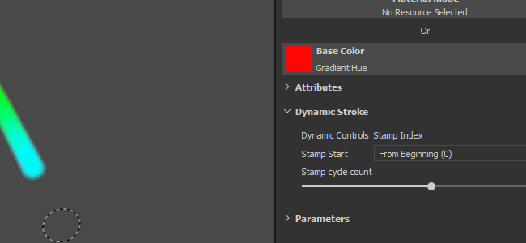
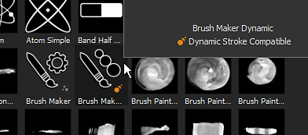
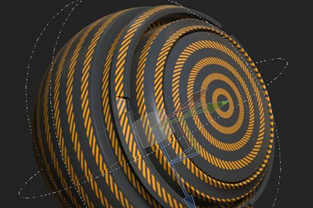
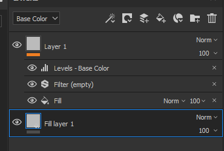
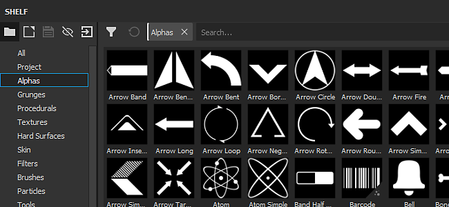
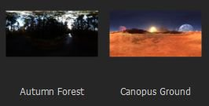

# Versão 2019.1

O **Substance Painter 2019.1** expande seus recursos existentes e também apresenta novas ferramentas artísticas. Esta versão também se concentra em fornecer muitos conteúdos novos.

Data de lançamento: *23 de abril de 2019*

## Principais recursos

### Traçados dinâmicos

Com esta versão, nosso mecanismo de pincel agora oferece suporte ao que chamamos de Traçados dinâmicos. Esses tipos de traços criam variações e novos efeitos graças à geração de novas versões de Substance em tempo real. Agora é possível ter um novo material de Substance ou alfa para cada novo traçado de pincel pintado no ativo.

Quando um recurso compatível com Traçado dinâmico for carregado na ferramenta Pintura (Pintar, Borracha, Borrar ou Clonar), um novo grupo de parâmetros será exibido:

Traçados dinâmicos suporta as seguintes propriedades (se expostas no gráfico de Substance):

* **Índice de Carimbo** : ID / Número de um carimbo dentro de um traço.
* **Distribuição aleatória**: pode ser alterada por carimbo ou por traço.
* **Tempo**: o tempo decorrido da pintura de um traçado de pincel, pintando rápido ou mais lento, produz resultados diferentes.

O Índice de carimbos vem com dois outros parâmetros:

* **Início do Carimbo** : *Do Início* (sempre iniciar o índice a partir de 0) ou *Do Índice Aleatório* (escolha uma posição aleatória entre 0 e o máximo definido pela **Contagem de Ciclos de Carimbo**).
* **Contagem de Ciclos de Carimbo** : este parâmetro define a quantidade total de variações de Substance que será gerada. Para otimizar os desempenhos, este parâmetro funciona como um limite. Substance Painter use-o para reciclar o que já foi gerado em vez de criar algo novo.

Você pode encontrar recursos compatíveis com este novo recurso simplesmente navegando na prateleira e vendo os novos ícones que agora estão ao lado deles:

Os recursos compatíveis com o recurso também obtêm automaticamente uma nova marca chamada “**dynamicstroke**” para facilitar sua filtragem por palavras-chave na prateleira.

Também adicionamos várias **predefinições de ferramenta** novas para brincar:

{width="450px"}

>[!NOTE]
>
> Para saber mais sobre este recurso (e seu impacto no desempenho), confira a [documentação dedicada](../../painting/dynamic-strokes/dynamic-strokes.md).

### Deslocamento e mosaico

O Substance Painter agora oferece suporte a **Deslocamento** e **mosaico de malha** em seu visor em tempo real e no Iray. Ambos podem ser controlados na janela **Configurações do sombreador** abaixo dos parâmetros do sombreador.

* **Canal de Origem** : canal no qual a deformação de malha é baseada. O padrão é Height, mas também pode ser definido como Deslocamento.
* **Escala** : controla a quantidade de deformação aplicada à malha no projeto.

* **Modo de Subdivisão**: comprimento uniforme ou de borda. Determina como o valor de subdivisão é calculado.
* **Contagem de Subdivisões** : (Modo Uniforme) De 1 a 32. Um valor alto produz mais polígonos, fornecendo mais detalhes, mas podendo apresentar problemas de desempenho.
* **Comprimento Máximo** : (Comprimento De Borda De Modo) 1 / Valor. Cada borda do polígono é dividida até que cada segmento seja igual ou menor que esse número, sendo 1/1 o tamanho da cena.

Carregue o projeto de amostra “**Material de revestimento**” (em **Arquivo > Carregar Amostra**) para experimentar esse novo recurso rapidamente:

{width="450px"}{width="450px"}

>[!NOTE]
>
> Um novo filtro chamado “**Height To Normal**” foi adicionado à Prateleira e pode ser usado para obter o mapa normal final (caso a conversão nativa por Substance Painter não seja forte o suficiente).

### Comparar efeito de máscara

Criar e mesclar materiais pode ser um pouco difícil, às vezes, e é por isso que criamos um novo efeito chamado “**Comparar máscara**”. Esse efeito permite comparar dois canais de maneira rápida e fácil e, como resultado, produzir uma máscara.

O efeito Comparar máscara tem as seguintes propriedades:

* **Canal** : o canal a ser comparado entre a origem e o destino para criar uma máscara.
* **Comparar**: três parâmetros estão disponíveis aqui para escolher como a máscara deve ser calculada. A lista suspensa no meio define a operação de comparação (menor que, dentro da tolerância, maior que).
* **Constante** : valor a ser comparado quando a configuração de comparação estiver definida como “constante”.
* **Dureza** : controla o smoothness/dureza da comparação de máscara resultante.
* **Histograma** : forneça uma exibição de histograma da origem e do destino. Útil para saber se eles se sobrepõem um pouco ou não se sobrepõem (se não se sobrepuserem, a máscara estará vazia).

Para facilitar ainda mais a configuração, você pode clicar com o botão direito do mouse em uma camada e escolher o atalho “**Adicionar máscara com combinação de height**” para adicionar rapidamente essa nova máscara à camada. Esse atalho também alterará o modo de mesclagem do canal de Height para “Normal” em vez do padrão “Subexposição Linear (Adicionar)”.\

### Simetria radial

Expandimos as capacidades da nossa ferramenta de simetria para lidar com a simetria radial. Agora existe um novo modo no menu de configurações de simetria para ativá-lo (disponível na barra de ferramentas contextual).

As seguintes configurações estão disponíveis:

* **X / Y / Z** : controla a direção do eixo de simetria usado pela simetria radial.
* **Contagem** : o número de pontos duplicados.
* **Extensão de Ângulo**: o local dos pontos duplicados do original. Esta configuração pode ser usada para fazer um círculo completo ou um quarto dele, etc.

Também adicionamos uma pequena visualização para facilitar o ajuste das configurações antes de começar a pintar:

### Novos modos de projeção de camada de preenchimento

Dois novos modos de projeção foram adicionados com camadas de preenchimento e efeitos de preenchimento: **Planar** e **Esférico**. Também adicionamos muitos parâmetros novos para controlar ainda mais os comportamentos das projeções 3D.

* **Novo modo de Projeção Planar**\
  Agora é possível projetar um avião com esse novo modo. Pode ser útil para criar faixas em veículos ou colocar decalques em um local específico.

  
* **Ferramenta de superfície para projeção planar**\
  Para facilitar a manipulação da projeção planar, também adicionamos um novo controle para o Manipulador 3D que chamamos de **Ferramenta Superfície**, que pode ser acessada com o atalho “**Shift+W**”. Ele também pode ser acessado pela Barra de ferramentas contextual. Observe que esse novo modo só está disponível com a Projeção planar.

  

  
* **Remoção/Atenuação da Projeção Planar**\
  Várias configurações estão disponíveis para tornar a projeção planar contínua ou finita. Quando uma configuração de remoção está ativada, a caixa pontilhada ao redor do manipulador indica a caixa delimitadora da projeção e a linha do meio é onde a projeção começa. Dimensionar a projeção permite controlar até onde ela vai e quando começa a esmaecer.

  {width="500px"}

  
* **Novo modo de Projeção esférica**\
  O Projeção esférica agora pode ser executado com esse novo modo. Com ele, você pode alcançar padrões avançados ou seguir superfícies curvas mais facilmente.

  {width="350px"}
* **Novas configurações de Corte de Formas**\
  Projeções 3D agora têm uma configuração que controla a repetição da projeção. Muito útil, por exemplo, para que um decalque seja repetido apenas em uma área específica sem precisar mascará-lo manualmente.

  {width="500px"}
* **Configurações existentes movidas e renomeadas**\
  Por causa dessas novas projeções, nós retrabalhamos um pouco o funcionamento de algumas configurações. Por exemplo, “**Divisão em blocos gráficos**” foi renomeado como “**Envoltório UV**”. Agora, a divisão em blocos gráficos pode ser definida apenas vertical ou horizontalmente. A Escala, Rotação e Deslocamento agora fazem parte de um novo grupo de parâmetros chamado “**Transformações UV**” para serem mais consistentes entre os modos de projeção.

  

  
* **Modo de todos os eixos do Manipulador de rotação aprimorado** Em vez de desenhar uma esfera explícita, agora ela está oculta para evitar a ocultação da texturização abaixo. Clicar entre os eixos selecionará a esfera que permite girar todos os eixos de uma vez.\
  

### Várias melhorias

* **Seleção Múltipla para Conjunto de Textura**\
  Agora é possível selecionar vários Conjuntos de textura para alterar sua resolução todos de uma vez por meio das configurações do Conjunto de textura.\
  No modo de seleção múltipla ainda há a noção de um conjunto de textura “principal”, e é por isso que os elementos adicionais são selecionados em cinza. Se você precisar alternar para um conjunto de textura diferente ao manter a seleção atual, use o botão do meio do mouse para fazer isso.
* **Mostrar/ocultar rapidamente na Lista de Conjuntos de Texturas**\
  Agora você pode clicar e arrastar (como na pilha de camadas) para ocultar ou mostrar Conjuntos de texturas.
* **Interface do Usuário Aprimorada para Pilha de Camadas**\
  Alteramos o ícone do estado oculto/exibido de uma camada para que seja mais consistente e mais fácil de entender. Também alteramos a maneira como as camadas selecionadas são exibidas para facilitar a comparação com a seleção de seus efeitos e outras camadas.\
  
* **Nova posição de efeito com base na seleção atual** Qualquer novo efeito adicionado a uma camada agora será colocado logo acima da camada selecionada atualmente.\
  
* **Alternância rápida de botões de canal de Material**\
  Agora você pode pressionar ALT e clicar em um botão de canal para isolá-lo. Clicar novamente ativará todos os canais de volta.\
  
* O pontilhamento **na exportação** agora pode ser desabilitado por meio de uma configuração dedicada na janela de exportação ao lado do formato de arquivo e da profundidade de bits. Para obter mais informações sobre como e quando o pontilhamento é aplicado, [consulte a documentação de exportação](../../export/export-window/export-window.md).\
  
* **Histogramas Melhores**\
  Nós retrabalhamos nosso gerador de histograma. Os histogramas agora devem exibir informações mais precisas e ser atualizados corretamente após uma alteração na pilha de camadas.\
  
* **Melhores instâncias de camadas**\
  As camadas em instância agora têm seu modo de mesclagem definido como “Passagem”, em vez do modo de mesclagem padrão. Esse modo de mesclagem melhorará a compatibilidade de alguns efeitos quando as camadas forem instanciadas em Conjuntos de Texturas.

### Novo conteúdo

Nesta versão, também adicionamos muito conteúdo novo: de predefinições a alfas e até mesmo novos filtros avançados.

* **Novas predefinições de pincel e ferramenta**\
  Esta versão apresenta o novo recurso Traçados dinâmicos. Com ele, adicionamos algumas predefinições de pincel e ferramenta prontas para uso.

  * 10 novas predefinições de pincel:
    * Tinta Suja
    * Tinta aleatória
    * Folha Curvada Pesada
    * Folha Curva
    * Leaf Messy
    * Folha Simples
    * Redemoinho de folha
    * Ziguezague longo
    * Ziguezague Curto
    * Etapa em ziguezague
  * 11 novas predefinições de ferramenta:
    * Folhas de outono
    * Rachaduras
    * Pegadas
    * Matiz de gradiente
    * Unha
    * Seixos
    * Arranhões
    * Spray Colorido
    * Spray de luz da pele
    * Pele de spray vermelha
    * Zíper
* **93 novos Alpha**\
  Há muitos para enumerar todos, então dê uma olhada na seção “Alpha” da Prateleira e você verá muitas novas setas, triângulos, sinais e outros tipos de formas.
* **13 novos filtros**\
  Temos muitos filtros novos nesta nova versão que podem ser muito úteis em caso de perda de situações:

  * **Inclinação de desfoque**: um novo filtro de desfoque foi adicionado à família. Esse filtro funciona de maneira semelhante ao filtro de distorção: use a entrada existente ou uma personalizada para desfocar o canal de destino.
  * **Chanfro** : cria uma borda de gradiente ao redor de uma forma, útil se você quiser expandir sua máscara, por exemplo.
  * **Correspondência de Cores**: este filtro tenta corresponder uma cor de Origem a uma cor de Destino. Útil para ajustar cores em um material.
  * **Curva de gradiente**: este filtro fornece uma lista de predefinições de curva que podem ser aplicadas em qualquer entrada em tons de cinza para alterar sua aparência.
  * **Dinâmica de Gradiente** : remapeia uma entrada em tons de cinza por uma nova imagem de entrada (tons de cinza ou cor).
  * **Ajuste de Height**: este filtro fornece duas configurações para manipular facilmente o canal de height: Deslocamento e Multiplicação.
  * **Height para Normal** : Este filtro converte o canal do Height em Normal e o alimenta no canal Normal. Ele tem controles de intensidade diferentes dependendo das necessidades.
  * **Contorno da Máscara**: este filtro cria uma borda branca em preto ao redor de uma entrada em tons de cinza. Isso é mais útil em Máscara para criar bordas ao redor das formas.
  * **Validações do PBR**: adicionamos este filtro para verificar se as cores do material PBR estão nos intervalos corretos. Para obter mais informações, consulte o [Guia de PBR](https://www.allegorithmic.com/pbr-guide) !
  * **Pintura de Descascamento MatFX** : simula a pintura antiga começando a descascar. Esse filtro gera alfa, o que facilita a mesclagem com materiais abaixo dele.
  * **Gotas de Água MatFx** : simula gotas de água na superfície de um objeto. Como água em um carro depois da chuva.
* **7 novos Geradores**\
  Com esta versão, adicionamos alguns novos geradores:

  * **Oclusão de ambiente** : gerador de máscara que oferece controles sobre o mapa de malha de Oclusão de ambiente. Com base no Editor de máscara.
  * **Normais do Espaço Mundial** : gerador de máscara que oferece controles sobre o mapa de Malha de Normais do Espaço Mundial. Com base no Editor de máscara.
  * **Posição** : gerador de máscara que oferece controles sobre o mapa de malha de posição. Com base no Editor de máscara.
  * **Curvatura** : gerador de máscara que oferece controles sobre o mapa de malha de curvatura. Com base no Editor de máscara.
  * **Titcher automático** : gerador de máscara que cria pontos perto das bordas UV, da Curvatura de malha ou ao redor de uma entrada de máscara personalizada.
  * **Densidade de texel UV**: auxiliar que gera um gradiente colorido com base na Densidade de texel dos polígonos da malha.
  * **Cor Aleatória UV** : gera uma cor aleatória por Ilha UV (ou com base em uma entrada de gradiente personalizada).
* **2 novos mapas de ambiente**

  * Floresta de outono
  * Canopus Ground

    
* **5 novos procedimentos**

  * Matiz de gradiente
  * Construtor de degradê
  * Tremulação de cores por índice
  * Tremulação de cor por semente
  * Difusão estilizada

    

## Tutorials

Confira nosso tutorial que aborda os recursos mais recentes:

Também temos um tutorial em Instituto Substance sobre como criar um Traçado dinâmico: [Criando um Traçado dinâmico personalizado para o Substance Painter](https://academy.allegorithmic.com/courses/Creating-a-custom-Dynamic-Stroke-for-Substance-Painter)

## Notas de versão

### 2019.1.3

*(Lançado Em 01 De julho De 2019)*\
Resumo: **Correção de erro com 2 novos recursos**

**Corrigido:**

* “Seguir caminho” não funciona o tempo todo
* O mapeamento de canal não funciona com SBSAR usado em slots de canal único
* [Pilha de camadas] Baixo desempenho ao rolar com camadas ocultas
* [TextureSet] Falha ao clicar entre máscaras
* [SVT] O Deslocamento não é exibido corretamente e pisca em alguns casos
* [Alembic] Falha com malha usando normais de ponto em vez de normais de vértice
* [Alembic][Log] Relata um erro no Log se o arquivo Alembic não for suportado durante a importação

### 2019.1.2

*(Lançado Em 21 De maio De 2019)*\
Resumo: **HotFix**

**Corrigido:**

* Falha ao selecionar dois recursos com uma entrada de imagem

### 2019.1.1

*(Lançado Em 20 De maio De 2019)*\
Resumo: **HotFix**

**Adicionado:**

* Atualize para a versão mais recente do Substance Engine com a última versão do Substance Designer 2019.1

**Corrigido:**

* [Substance] Visível Se não for levado em consideração para Imagens de entrada
* [SVT][Mecanismo] Alterar a resolução do conjunto de texturas leva a uma falha em alguns casos
* [Engine] Texturas pretas aleatórias aparecem em alguns casos
* [Pilha de camadas][IU] Alternar uma máscara com SHIFT pode selecionar várias camadas ao mesmo tempo
* [Pilha de camadas] A opacidade não tem efeito no efeito Pintura com o modo de mistura Passagem
* [Pilha de camadas] A entrada do filtro Height para normal não é atualizada corretamente com o traçado do pincel de borracha
* [LayersStack] Falha ao desfazer o soltar de uma máscara inteligente
* Wireframe piscando com sombras e suavização de borda temporal ativada
* [Deslocamento] Atraso na AMD com algumas malhas pesadas
* [Windows] Falha ao abrir alguns projetos por meio do explorador de arquivos
* [Histograma] Falha ao remover a máscara com o ponto de ancoragem em alguns casos
* Falha na geração de visualização em alguns casos raros
* [Falha] Não é possível reabrir um projeto usando muitas ferramentas de clonar e borrar
* Nenhuma malha exibida no modo de material após salvar em alguns casos
* [Scripting] alg.mapexport.documentStructure() retorna valores incorretos para pastas

**Problemas Conhecidos:**

* Clicar duas vezes no nome do conjunto de texturas o selecionará antes de entrar no modo de renomeação

### 2019.1

*(Lançado Em 23 De abril De 2019)*\
Resumo: **Traço dinâmico com novo conteúdo dedicado, Deslocamento e mosaico em tempo real e Iray, efeito Comparar máscara, simetria radial, Planar e Projeção esférica**

**Adicionado:**

* [Ferramenta] Traçado dinâmico: variação de Substance ao lado de um traçado de pincel
* [Traçado dinâmico] Expor novo parâmetro de índice de carimbo com opções
* [Traço dinâmico] Leve em consideração o parâmetro $time
* [Traço dinâmico] Gera novo parâmetro $randomseed por traço e por carimbo
* [Traçado dinâmico] Iniciar um índice de traçado dinâmico a partir de um número aleatório
* [Dynamic stroke][Prateleira] Ajuda a encontrar um recurso de traçado dinâmico com novo ícone dedicado
* Deslocamento e mosaico em viewport em tempo real
* Deslocamento e mosaico em Irlanda
* [Configurações do sombreador][IU] Nova guia para controlar deslocamento e mosaico
* [Pilha de camadas] Novo efeito CompareMask: gerar uma máscara comparando dois canais
* [Pilha de camadas][IU] Nova entrada no menu do botão direito do mouse “Adicionar máscara com combinação de height” para inserir um efeito CompareMask
* [Simetria] Novo modo de simetria: pintura radial
* [Configurações de simetria] Expande as duas seções “Configurações” e “Exibição”
* [Configurações de simetria][IU] Visualização para pintura radial
* Exponha dois novos modos de projeção: planar e esférico
* [Proj] Novo modo de corte de forma para todas as projeções
* [Proj] Modo planar com novo manipulador: ferramenta Superfície
* [Proj][Atalho] Atalho SHIFT+W para a ferramenta Superfície
* [Proj] Máscara de projeção planar com seleção de profundidade e abate de backface
* [Manipulador] Melhoria do manipulador de rotação nos três eixos para triplanar
* [Tool][UX] Clicar com a tecla Alt pressionada em um canal focaliza esse canal (ativa ou desativa todos os outros)
* [Engine] Atualização para a versão mais recente do Substance Engine
* [Conjunto de textura] Seleção múltipla e resolução de alteração
* [Conjunto de textura] Ativação e desativação rápidas dos conjuntos de textura
* [Conjunto de texturas] Combina solo e todas as opções em um novo menu
* [Conjunto de texturas][Pilha de camadas] Novo ícone para ativação e desativação
* [Pilha de camadas][UX] Inserir efeitos acima dos já selecionados
* [Pilha de camadas][IU] Retrabalhar o estilo de seleção da exibição da pilha de camadas
* [Pilha de camadas] O modo de mesclagem para camadas instanciadas agora está no modo de Passagem por padrão
* [Exportar] Opção para ativar e desativar o pontilhamento
* [Plug-in] Suporte ao modificador de precisão para controles deslizantes (SHIFT)
* [Plug-in][IU] Novo ícone para salvamento automático
* [Scripts] Lista o conteúdo de uma pasta
* [Script] Permitir exclusão de arquivos
* [Scripts] Ler todas as informações da pilha, inclusive os recursos usados
* [Conteúdo][Traçado dinâmico] Novas ferramentas e predefinições de pincel
* [Conteúdo][Traço dinâmico] Dois novos gradientes de procedimento: Matiz de gradiente e Construtor de gradiente
* [Content] 11 novos filtros: Pintura de descascamento MatFx, gotas de água MatFx e muito mais
* [Content] 7 novos geradores: Auto Stitcher, Cor aleatória UV, Densidade de texel UV e muito mais
* [Content] 93 novos alfas: novos textos, setas e várias outras formas
* [Conteúdo] 2 novos procedimentos: Matiz de gradiente, Construtor de gradiente e muito mais
* [Content] 21 novas predefinições de ferramenta e pincel para Traçados dinâmicos: Pebbles, Footprints, Spray e muito mais
* [Content] 2 Novos HDRis: Canopus Ground e Floresta de outono
* [Content] Atualizar conteúdo com curadoria de semente aleatória na prateleira
* [Content] Ícone novo com parâmetro semente aleatório exposto na prateleira

**Corrigido:**

* [Pilha de camadas] A pilha de camadas continua arrastando para sempre
* [Mac] “Mostrar no Finder” pode levar ao congelamento
* [Script] As configurações salvas por meio da interface do usuário personalizada são perdidas se o arquivo de sombreador for movido
* [Scripting] O número de versão da API está incorreto e não está atualizado
* [Efeito] O conteúdo do histograma não é exibido corretamente
* [Efeito] O efeito do histograma não é atualizado em alguns casos
* [Prateleira] Os pontos não estão corretamente alinhados no material “Pirâmide de tecido plástico”

**Problemas Conhecidos:**

* Clicar duas vezes no nome do conjunto de texturas o selecionará antes de entrar no modo de renomeação
* [Pilha de camadas][IU] Alternar uma máscara com SHIFT pode selecionar várias camadas ao mesmo tempo
