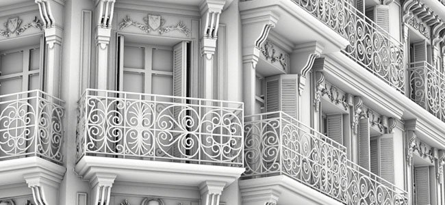

# Versão 2019.2

O **Substance Painter 2019.2** traz novos recursos poderosos para seus Baker e oferece um novo conjunto de Materiais inteligentes e Máscaras inteligentes na Prateleira.

Data de lançamento: *25 de julho de 2019*

## Principais recursos

### Melhorias no fluxo de trabalho para Baker

O fluxo de trabalho de cozimento foi aprimorado com esta versão com alguns novos recursos. Essas melhorias agilizarão e facilitarão o trabalho diário com o Substance Painter.

* **Fazendo bake visualização de processo**\
  Por padrão, com essa nova versão, qualquer processo de fça bake agora ficará visível no visor. Ele permite visualizar o resultado dos baker em tempo real e até mesmo cancelá-lo, se necessário, sem esperar até o final do processo para oferecer iterações mais rápidas. Este comportamento pode ser desabilitado acessando as configurações principais e desmarcando a configuração “**Habilitar processo de fça bake de visualização ao vivo**” na seção “**Opções de Fça bake**”.

  

  {width="500px"}
* **Caixa de diálogo de fça bake aprimorada**\
  A caixa de diálogo de fça bake foi reformulada e agora exibe um status melhor do processo de fça bake atual. Agora há um contador para indicar quantas texturas serão computadas, bem como uma lista explícita por padeiro e Conjunto de texturas do que está sendo computado. Em caso de erro, uma cruz vermelha é exibida ao lado do nome do baker. No final do processo, um novo botão permite abrir rapidamente a janela de registro para saber mais sobre o problema.\
  
* **Cancelando faz bake em andamento** O processo de faz bake não bloqueia mais o aplicativo. O Substance Painter agora é mais responsivo, o que significa que é possível cancelar um faço bake que está em andamento atualmente sem aguardar o término desse processo. No entanto, o cancelamento não é imediato e pode levar alguns segundos para entrar em vigor. Isso ocorre porque internamente o processo de fça bake funciona em texturas em blocos e não pode parar enquanto um bloco está sendo calculado. Ao cancelar o processo de fça bake, a janela de Fça bake será reaberta automaticamente.\
  

### Melhorias de desempenho para Baker

Com a melhoria do fluxo de trabalho, também aproveitamos a oportunidade para atualizar nossos Baker e melhorar seu desempenho. Também adicionamos o suporte de DXR e Optix para permitir Rastreamento de raios do GPU que permite fazer bake muito mais rápido do que antes. Observe, porém, que o Rastreamento de raios do GPU afeta apenas a Oclusão ambiente e o Thickness.

* **O Rastreamento de raios da CPU foi aprimorado**\
  O cálculo de Rastreamento de raios na CPU agora é de 2 a 3 vezes mais rápido do que antes. Portanto, mesmo que sua GPU não seja compatível com Rastreamento de raios do GPU, você ainda obterá melhorias de desempenho em geral.
* **Suporte a Rastreamento de raios do GPU com DXR e Optix**\
  Com hardware compatível, os baker agora podem computar diretamente na GPU, o que reduz drasticamente o tempo de computação, especialmente quando a suavização de borda está ativada e muitos raios estão definidos. DXR é a opção padrão quando disponível, caso contrário, o Optix será usado. É possível desabilitar o Rastreamento de raios do GPU entrando em [configurações principais](../../interface/settings/settings.md) e procurando por “**Opções de Preparação**” :

  

>[!NOTE]
>
> Para habilitar o recurso Rastreamento de raios do GPU, atualize para os seguintes drivers: **Drivers Nvidia 430.86**.\
> O DXR está disponível nas GPUs RTX e [GPUs GeForce GTX 10xx](https://www.nvidia.com/en-us/geforce/news/geforce-gtx-dxr-ray-tracing-available-now/). O DXR também requer que o Windows 10 esteja atualizado para ser acessível (versão 1809). Consulte esta página para obter mais informações.

>[!WARNING]
>
> Ao usar o Rastreamento de raios do GPU, o baker pode falhar se a malha de alto-polígono não couber em VRam. Quando isso acontecer, é aconselhável entrar nas [configurações principais](../../interface/settings/settings.md) e desabilitar a configuração “**Rastreamento de raios do GPU**” na seção “**Opções de Fça bake**”. Depois disso, basta reiniciar o processo de fça bake.

### Novos recursos e aprimoramentos diversos

Nesta versão, também adicionamos e retrabalhamos algumas coisas para melhorar a qualidade de vida dentro do Substance Painter.

* **manipulador de rotação aprimorado**\
  O manipulador de rotação era um pouco lento no passado, tornando as rotações às vezes tediosas para executar. A velocidade de rotação agora está vinculada à câmera e ao tamanho da cena.
* **Desempenho aprimorado em telas High DPI com downscaling de viewport**\
  Nas [configurações principais](../../interface/settings/settings.md), agora há um novo parâmetro chamado “Dimensionamento de Viewport” com o valor “**Nenhum**” e “**Automático**” (padrão). Quando o Substance Painter detecta que uma tela usa dimensionamento HDPI (como telas de retina no MacOS), ele automaticamente divide a resolução da viewport por 2. Esse comportamento evita o tamanho excessivo da viewport e melhora o desempenho geral sem nenhuma perda perceptível de qualidade.

  
* **Novo plug-in de console para scripts**\
  Criamos um novo plug-in para executar facilmente comandos da nossa API de script. Está disponível no Github: <https://github.com/AllegorithmicSAS/painter-plugin-console>. O console também suporta o preenchimento automático.

  

### Novo conteúdo

Um novo conjunto de Materiais inteligentes e Máscaras inteligentes foi adicionado à Prateleira padrão para cobrir vários usos. Aqui está a lista completa de ativos que foram adicionados:

* **40 novos Materiais inteligentes**

  * Tecido
    * Tela de tecido amassada
    * Tecido composto reforçado usado
    * Tecido Denim Lavado Para Fora
    * Tecido Flanela Tartan
    * Linho de tecido amassado
    * Tecido de linho desgastado
    * Pontos sintéticos de tecido
    * Tecido Sintético Esporte Usado
  * Couro
    * Grão de bezerro de couro
    * Couro vincado
    * Couro de cor natural
    * Couro áspero escuro
  * Mármore - granito
    * Mármore Verde Alpi
  * Metal
    * Ouro danificado
    * Ferro forjado velho
    * Aço pintado, lascado, sujo
    * Aço pintado em bruto danificado
    * Aço Pintado Rascunhado Sujo
    * Aço Pintado Rascunhado Verde
    * Aço pintado desgastado
    * Aço Arruinado
  * Orgânico
    * Pele de criação Alien Blue
    * Suavidade de verde da pele da criatura
    * Dentes da Criatura
    * Língua das Criaturas
  * Plástico - Borracha
    * Plástico empoeirado
    * Plástico brilhante arranhado
    * Plástico Brilhante Colorido
    * Plástico granulado suave
    * Áspero de plástico arranhado
    * Plástico termoformado
    * Plástico espesso rachado
    * Ferramenta de plástico gasta
    * Plástico Usado Macio
  * Pedra
    * Corindo de safira
  * Translúcido
    * Filme de vidro Dirty Mirror
  * Madeira
    * Carvão
    * Madeira de Acajou
    * Casco de navio de madeira nórdico
    * Casco de navio de madeira antigo
* **20 novas Máscaras inteligentes**

  * Amarrotado
  * Cavidades do dirt
  * Dirt térreo
  * Vazamento de dirt seco
  * Bordas Suaves do dirt
  * Respingos de dirt
  * Dirt Spots
  * Plástico dust
  * Bordas Suaves do dust
  * Superfície do dust
  * Bordas largas do dust
  * Edge Dirty Rachadura
  * Rachaduras de Pedra de Borda
  * Bordas fortes arranhadas
  * Thread de tecido
  * Tinta danificada
  * Tinta de arranhão sutil
  * Cavidades de areia
  * Dust de areia
  * Gotas de água

## Notas de versão

### 2019.2.3

*(Lançado Em 23 De outubro De 2019)*\
Resumo: **Correção de erros**

**Adicionado:**

* [Texture Set List] Adicionar botão para ativar/desativar rapidamente o modo de foco
* [Log] Adiciona o número de versão do Windows 10 no arquivo de log
* Atualize para a versão mais recente do Substance Engine
* [MacOS] Autenticação do software para atender aos novos requisitos de distribuição do MacOS Catalina

**Corrigido:**

* [Plug-in] A origem do plug-in não funciona
* [MacOS]&#x200B;[Sombreador] Mac OS 10.14.5 e AMD: a disposição em camadas de material não funciona conforme o esperado

**Problemas Conhecidos:**

* Arquivos Alembic com subdivisões não podem ser importados
* Falhas raras ao importar alguns arquivos Alembic
* A interface não responde temporariamente ao fazer bake com DXR em GPUs Pascal

### 2019.2.2

*(Lançado Em 20 De setembro De 2019)*\
Resumo: **Correção de erros**

**Corrigido:**

* A importação de recursos por scripts pode causar uma falha
* [Plug-in] Baixar material da origem pode levar a uma falha

### 2019.2.1

*(Lançado Em 17 De setembro De 2019)*\
Resumo: **Correção de erros**

**Corrigido:**

* [Mac]&#x200B;[USD] Os arquivos USDZ exportados do MacOS não podem ser abertos
* [Conjunto de texturas] Não é possível isolar um conjunto de texturas com o modificador ALT
* [Prateleira] Predefinições, Materiais inteligentes e Máscaras inteligentes são sempre modificados ao sair do aplicativo
* [Pilha de camadas] Não é possível selecionar o efeito após excluir outro efeito
* Cintilação ao usar um controle deslizante dentro do painel de propriedades da ferramenta
* Falha ao exportar predefinições para prateleira
* Falha ao exportar uma predefinição com espaço insuficiente
* Falha ao criar uma predefinição com espaço insuficiente

**Problemas Conhecidos:**

* Arquivos Alembic com subdivisões não podem ser importados
* Falhas raras ao importar alguns arquivos Alembic
* A interface não responde temporariamente ao fazer bake com DXR em GPUs Pascal

### 2019.2

*(Lançado Em 25 De julho De 2019)*\
Resumo: **Versão principal com atualizações dos baker em termos de desempenho e um novo modo de pré-visualização + novo conteúdo**

**Adicionado:**

* [Baker] Suporte adicionado para Rastreamento de raios do GPU com DXR e OptiX (Oclusão de ambiente, Thickness)
* [Baker] Otimizações e acelerações para Rastreamento de raios da CPU
* [Baker]&#x200B;[Modo Vis]&#x200B;[IU] Novo modo de visualização de fça bake no visor
* [Baker]&#x200B;[Preferências]&#x200B;[IU] Nova opção de fça bake para ativar/desativar o Rastreamento de raios do GPU
* [Baker]&#x200B;[IU] Retrabalho da caixa de diálogo da barra de progresso
* [Baker] Aprimoramento das mensagens de aviso e erro
* [Baker] Permitir cancelamento mais responsivo do processo de fça bake
* [Baker] Reabrir a janela fazer bake após clicar em cancelar
* [Proj]&#x200B;[UX] Melhoria da usabilidade do manipulador de rotação
* [Settings] Opção para melhorar o desempenho reduzindo a resolução do visor para telas HDPI
* [Script] Alterar resolução do conjunto de texturas
* [Script] Obter conjunto de textura selecionado
* [Script] Permite que o usuário selecione um conjunto de texturas
* [Scripting] Função para saber quando a seleção do conjunto de texturas foi alterada
* [Prateleira] Adicionados 40 novos materiais inteligentes
* [Prateleira] Adicionado 20 novas máscaras inteligentes

**Corrigido:**

* [Pilha de camadas] Congelamento da interface ao selecionar várias camadas
* [Pilha de camadas] Agrupar muitas camadas congela a interface por mais tempo do que o normal
* [Pilha de camadas] Uma camada e um efeito podem ser selecionados ao mesmo tempo em alguns casos
* os gráficos de Substance usados nas ferramentas de pintura não são gerados na resolução correta
* [Baker] O botão “Cozinhar todos os conjuntos de textura” não é desativado quando nenhum padeiro está selecionado
* [MacOS] Desativar a mensagem de aviso sobre o mosaico
* A ferramenta de projeção não tem visualização quando usada com uma máscara
* Falha e projetos corrompidos ao tentar salvar com espaço em disco insuficiente
* [Shelf] Falha ao importar um recurso no disco via shelf com espaço insuficiente
* [Prateleira] Falha ao restaurar a predefinição de sessão
* [Prateleira] Importar uma predefinição com um nome que termina com um espaço leva a uma falha
* [Prateleira] Importar um recurso com um prefixo que termina com um espaço vazio leva a uma falha

**Problemas Conhecidos:**

* Arquivos Alembic com subdivisões não podem ser importados
* Falhas raras ao importar alguns arquivos Alembic
* A interface não responde temporariamente ao assar com DXR em GPUs Pascal
