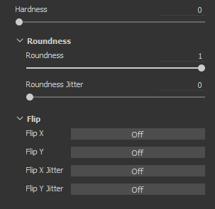
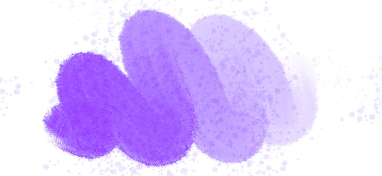
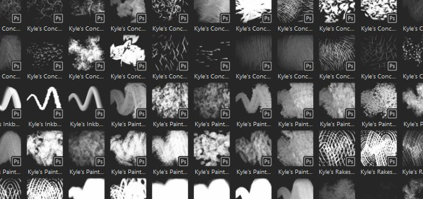
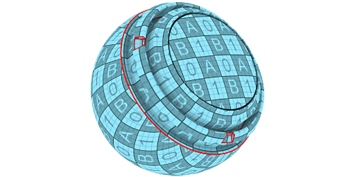

# Versão 2019.3

O **Substance Painter 2019.3** apresenta suporte a predefinições de pincel do Photoshop e desencapsulamento UV automático para suas malhas, além de fornecer várias melhorias de qualidade de vida, como melhor manipulação de tablets gráficos.

Data de lançamento: *17 de dezembro de 2019*

## Principais recursos

### Suporte a predefinições de pincel do Photoshop (ABR)

Agora você pode usar os pincéis do Photoshop no Substance Painter. Ao simplesmente exportar suas predefinições como um arquivo ABR, agora é possível importá-las como predefinições de pincel normais. As predefinições contidas em arquivos ABR aparecerão na prateleira como predefinições de pincel individuais.

Se você não tiver arquivos ABR para importar, poderá encontrar muitos deles online:

* [Predefinições do pincel de Kyle no Adobe](https://www.adobe.com/products/photoshop/brushes.html)
* [Predefinições de pincel em ArtStation](https://www.artstation.com/marketplace?q=photoshop%20brush&sort_by=trending)
* [Predefinições de pincel em DeviantArt](https://www.deviantart.com/search?q=photoshop%20brush)
* [Predefinições de pincel em Pincel de cubo](https://cubebrush.co/marketplace?categories=354,57)

Para oferecer suporte aos pincéis do Photoshop, vários novos recursos foram adicionados às propriedades da ferramenta de pintura:

* **Novos parâmetros de Tamanho e Fluxo**\
  Agora você pode especificar o tamanho mínimo e o fluxo mínimo da ferramenta quando a Pressão da caneta está ativada. Esse parâmetro funciona como uma porcentagem com base no tamanho/fluxo máximo atual definido. Essas configurações são calibradas automaticamente ao usar uma predefinição de pincel do Photoshop.\
  
* **Novos parâmetros de tremulação de posição**\
  Para combinar com o comportamento do pincel do Photoshop, adicionamos algumas novas configurações. Agora é possível definir a qual eixo a tremulação é aplicada e como as posições aleatórias são distribuídas (escolha **Uniforme** para corresponder ao Photoshop).\
  \
  
* **Novo modo de mesclagem alfa**\
  O Photoshop não compõe seus traçados de pincel da mesma forma que o Substance Painter, portanto, adicionamos um novo modo de mesclagem (Clarear) para melhor corresponder ao resultado da pintura. Esse modo de mesclagem não acumula demais quando os carimbos se sobrepõem, o que pode melhorar a sensação de pressão ao pintar com um valor de Fluxo/Opacidade baixo.\
  \
  
* **Suporte para arredondamento e inversão**\
  Um novo Alpha Substance chamado **Photoshop do Criador de Pincel** foi adicionado para oferecer suporte a parâmetros como Arredondamento (dimensionar o height do Alpha) e Virar (espelhar uma imagem em ambos os eixos). Esse Alpha Substance é carregado automaticamente quando se clica em uma predefinição de pincel proveniente de um arquivo ABR.\
  \
  
* **Nova correção de gama para o canal alfa de camadas**\
  O Photoshop não mescla seus traçados de pincel no espaço de gama linear, o que significa que a mesclagem e a opacidade podem parecer erradas ao pintar com uma predefinição de pincel do Photoshop. Uma nova configuração pode ser ativada em camadas para corresponder a esse comportamento e aplicar uma correção de gama. Isso afetará o alfa usado para pintar traçados de pincel, bem como a forma como a máscara da camada é usada para mesclar com outras camadas. No entanto, os modos de mesclagem da camada ainda operarão no espaço gama linear.\
  Para **ativar esta configuração**, basta clicar com o botão direito do mouse em uma camada e escolher **Alfa/máscara corrigida por gama**. Um novo ícone aparecerá ao lado da camada para indicar quando essa configuração estiver ativada.\
   \
  
* **Valor máximo aumentado para Espaçamento e Tremulação de Posição**\
  Para corresponder corretamente os parâmetros das predefinições de pincel do Photoshop, o valor máximo dos seguintes parâmetros foi aumentado:

  * **Espaçamento**: o máximo agora pode ser definido como 1000.
  * **Tremulação de posição**: o máximo agora pode ser definido como 1000.

Para obter mais informações, como exportar arquivos ABR e importá-los, consulte a documentação das [Predefinições de pincel do Photoshop](../../painting/presets/photoshop-brush-presets/photoshop-brush-presets-abr.md).

>[!NOTE]
>
> Nem todos os parâmetros de pincel Photoshop são suportados no momento, consulte a [lista de compatibilidade](../../painting/presets/photoshop-brush-presets/photoshop-brush-parameters-compatibility.md) para obter mais informações.

### Melhorias no suporte a pintura e tablet gráfico

Além do suporte às predefinições de pincel do Photoshop, vários aprimoramentos e correções foram feitos relacionados ao uso de tablets gráficos.

* **O primeiro carimbo de Linha Reta não é mais duplicado**\
  Ao pintar uma Linha reta, a primeira estampa não é mais duplicada (não é necessário desfazer a estampa somente para posicionar a Linha reta).\
  
* **Interpolação de pressão em linha reta**\
  As linhas retas agora suportam a pressão. O valor de pressão será interpolado entre o primeiro carimbo e o último carimbo.\
  
* **Novos modos de visualização de pincel**\
  A visualização do pincel no visor agora pode ser alterada para diferentes modos de visualização. Para alterar o modo, basta clicar no novo botão suspenso na barra de ferramentas contextual.

  
* **Curvas de pressão da caneta**\
  Na barra de ferramentas contextual, agora é possível definir como a pressão da caneta deve ser interpretada. Essas novas configurações controlam a rapidez do acúmulo de pressão, que permite diferentes estilos de pintura.

  * **Linear**: sem transformação, a pressão recuperada conforme fornecida pela caneta da mesa digitalizadora. Use essa configuração caso uma curva de pressão da Caneta já esteja definida nas configurações de drivers do Tablet.
  * **Acelerar** (padrão): reduza a velocidade no início da pressão, tornando mais fácil pintar traçados finos ou esmaecidos.
  * **Aumentar suavização**: diminua a velocidade do início da pressão e aumente sua velocidade final, facilitando a pintura de traçados suaves ou fortes.

  
* **O botão de pressão não é mais uma lista suspensa**\
  Alteramos os controles de pressão da caneta para serem botões de ligar/desligar simples. Isso torna a ativação e desativação da pressão muito mais fácil e rápida.

  
* **Suporte aprimorado para tablets gráficos e para a opção Windows Ink**\
  Reformulamos a maneira de lidar com tablets gráficos. Isso deve melhorar a compatibilidade em geral com modelos recentes de tablets gráficos e reduzir o número de problemas que tivemos no passado. No Windows, também mudamos para Windows Ink em vez de Wintab para melhorar a compatibilidade.

  >[!NOTE]
  >
  > Verifique se os drivers Wacom estão atualizados e se a opção “Windows Ink” está ativada nas configurações de tablet.

### Desempacotamento automático de UV (beta)

O Substance Painter agora desembrulhará automaticamente as malhas que têm coordenadas UV ausentes. Isso possibilita importar qualquer tipo de geometria e começar imediatamente a pintar. Nosso sistema de desempacotamento UV gerará uma Ilha UV por sub-malha enquanto ainda segue a atribuição do material para criar conjuntos de textura. Este recurso está atualmente em versão beta e evoluirá em versões futuras. O Desencapsulamento Automático será aplicado apenas a projetos que **não usam o fluxo de trabalho UDIM**.

* **Desencapsulamento UV automático**\
  Por padrão, o Substance Painter agora irá gerar automaticamente coordenadas UV para malhas que estão faltando. Isso se aplica à criação de projetos e à reimportação de malha. No entanto, é possível desabilitar esse comportamento acessando as [configurações principais](https://helpx.adobe.com/substance-3d/unlisted/documentation/spdoc/general-71008262.html) e desabilitando a **Habilitar o desencapsulamento automático de UV** em **Opções de importação**.

  
* **Barra de Progresso de Desencapsulamento UV**\
  Ao importar uma malha, agora há uma barra de progresso para indicar o estado atual do processo. Isso também inclui o processo de desempacotamento UV.

  
* **Problemas Conhecidos No Momento**\
  Como esse novo recurso está atualmente em versão beta, alguns problemas são esperados. Consulte as notas de versão abaixo para obter uma lista dos problemas conhecidos no momento. Se o aplicativo travar e produzir resultados incorretos, sugerimos que nos envie uma falha ou um relatório de erro pelo aplicativo para nos ajudar a investigar o problema e melhorar o processo.

>[!NOTE]
>
> Um novo **gerador** foi adicionado à Prateleira para ajudar a visualizar o desencapsulamento automático. Para usá-lo, basta criar uma nova camada, adicionar um efeito gerador e carregar o novo recurso **Verificador UV** nele.

### Melhorias na integração de Substance

Continuamos melhorando a integração do formato Substance, oferecendo suporte a alguns recursos muito aguardados, mas também melhorando o sistema existente, como o recurso Traçado dinâmico.

* **Não fixados com controles deslizantes de intervalos suaves**\
  Até agora, os controles deslizantes expostos do gráfico de Substance sempre se comportavam como se fossem apertados. Significando que os valores que podem ser inseridos não podem ir além dos valores mínimo e máximo padrão definidos pelo parâmetro.

  
* **Suporte da Etapa definida nos parâmetros**\
  O gráfico de Substance que tem parâmetros com uma etapa definida agora será levado em consideração ao ajustar o controle deslizante.
* **Precisão de dígitos aumentada para controles deslizantes de flutuação**\
  O controle deslizante Flutuante agora pode ter valores de entrada que diminuem para 6 decimais. No entanto, isso é limitado pela precisão de ponto flutuante, o que significa que o valor de entrada pode ser arredondado em alguns casos.
* **Novo controle de Distribuição Aleatória com Traçados dinâmicos**\
  Agora é possível solicitar vários valores de propagação aleatória com um intervalo definido. Isso permite criar variações de Substance exclusivas e aleatórias, ao mesmo tempo em que obtém um bom desempenho, beneficiando-se da reciclagem do cache.\
  No grupo Traço dinâmico, alterne o parâmetro **Tipo de propagação aleatória** para **Aleatório por traço** ou **Aleatório por carimbo** para acessar o novo parâmetro. O **Valor de Amostra Aleatório** define quantas variações de Substance serão geradas no total. Uma variação aleatória será selecionada dentro do conjunto assim que o valor selecionado tiver sido gerado.

  
* **Traçados dinâmicos estáticos de novos dados de usuário**\
  Uma nova otimização foi adicionada, permitindo especificar quando um Substance pode ser considerado um traçado dinâmico. Semelhante ao If visível, agora é possível adicionar condições no campo userdata para especificar sob qual Substance Painter de condição deve gerar novas variações de Substance com o recurso Traçado dinâmico. Consulte a [documentação de userdata](../../content/creating-custom-effects/user-data.md) para obter mais informações.
* **Novos dados de usuário para designar um nó de saída como máscara para todos os canais**\
  Um novo userdata agora pode ser adicionado a um nó de saída para usá-lo como uma máscara alfa para todos os outros canais. Isso é semelhante ao sistema existente de **canais\_Alpha**, mas sem a necessidade de criar uma nova saída dedicada no gráfico de Substance. Consulte a [documentação de userdata](../../content/creating-custom-effects/user-data.md) para obter mais informações.

### Melhorias diversas

Várias melhorias foram feitas no restante da aplicação, que deve ajudar para o trabalho diário dentro do Substance Painter.

* **Foco em viewports independentes**\
  O foco 2D e 3D (atalho F) foi modificado com o seguinte comportamento:

  * **Passe o mouse sobre a exibição 2D**: pressionar F focalizará apenas a exibição 2D.
  * **Passe o mouse sobre a exibição 3D**: pressionar F focalizará apenas a exibição 3D.
  * **Mouse fora das viewports**: pressionar F focalizará a exibição 2D e 3D.

  {width="400px"}
* **Atalho de teclado e menu da Janela de Preparação**\
  A assadeira pode ser aberta por duas novas maneiras diferentes:

  * Pressionando **Ctrl+Shift+B**.
  * Acessando o menu Editar e clicando em **Criar mapas de malha**.

  
* **Rolar Docks e Windows com o atalho Ctrl+Alt+Clique com o Botão Esquerdo**\
  Foi adicionado um novo atalho que permite rolar janelas e encaixes sem a necessidade da roda do mouse. Que este atalho agora é possível rolar com a caneta da mesa digitalizadora gráfica.

  
* **Melhorias de desempenho**\
  Ao fundo, muitas otimizações foram postas em prática, o que deve melhorar o desempenho geral do Substance Painter (de projetos de aberturas a pintura).

### Novo conteúdo

Nesta versão, muito conteúdo novo foi adicionado:

* **Projeto de exemplo “Meet Mat” atualizado**\
  O Mat foi atualizado com uma nova topologia, tornando-o mais amigável com o deslocamento. O mapa de IDs foi reformulado para oferecer mais possibilidades de mascaramento, e um novo conjunto de câmeras está disponível no projeto para oferecer novos ângulos de visualização.

  {width="500px"}
* **Novos filtros**\
  Três novos filtros foram adicionados para facilitar o conteúdo estilizado:

  * **Catálogo em quadrinhos do MatFx**\
    Esse filtro simula linhas de hachura e aresta com base nos dados fornecidos (da cor de base/difusa à curvatura).

    
  * **MatFx Watercolor**\
    Esse filtro simula a pintura em aquarela com sangria de cor e absorção de papel lendo a cor de entrada.

    
  * **Pintura a óleo MatFx**\
    Inspirado no trabalho do [Emrecan Cubukcu](https://www.artstation.com/emrecancubukcu), esse filtro leu as informações de cores da entrada e as converte em traçados de pincel com base em vários parâmetros. Várias predefinições estão disponíveis para testar variações facilmente. Recomendamos combiná-lo com o filtro **Ambiente de iluminação baked** ou assar/pintar manualmente sombras em suas texturas para maximizar seu efeito.

    

    

    >[!NOTE]
    >
    > Este é um filtro muito caro que pode levar algum tempo para ser calculado. Ao iterar, é recomendado desativar a camada que contém o efeito antes de ajustar as camadas abaixo dela.
* **Novas predefinições de pincel**

  * **102 predefinições de pincel para Photoshop**\
    Com a introdução da compatibilidade com o pincel do Photoshop, um novo conjunto de predefinições foi incluído para exibi-lo. Essas predefinições foram selecionadas nos pacotes de Kyle T. Webster disponíveis no [site do Adobe](https://www.adobe.com/products/photoshop/brushes.html).

    {width="500px"}
  * **18 novas predefinições de pincel**\
    Além das predefinições de pincel do Photoshop, novas predefinições mais regulares foram adicionadas:

    * Pressão Sólida Básica
    * Carvão Fino
    * Quadro completo de carvão
    * Luz de carvão
    * Carvão médio
    * Carvão natural
    * Rampa de carvão
    * Wiggle Stroke Dense
    * Pontos ondulados
    * Traçado Ondulado Com Divisão
    * Traçado sinuoso
    * Pintar seta do cilindro
    * Grampeamentos do cilindro de pintura largos
    * Grampos do cilindro de pintura
    * Pontos do cilindro de pintura
    * Stripe do cilindro de pintura
    * Pintar veia do cilindro longa estreita
    * Texto de aviso do cilindro de pintura

    {width="500px"}
* **Novas predefinições de ferramenta**\
  2 novas predefinições de ferramenta foram adicionadas para simular a pintura guache.

  * Guache Dense.
  * Guache Desbotado.

  
* **Novos alfa**\
  Além dos alfas usados para criar as novas predefinições de pincel (veja acima), duas novas Alpha importantes foram integradas:

  * **Photoshop do Criador de Pincéis**\
    Esse novo gráfico de Substance replica alguns parâmetros específicos de pincel disponíveis no Photoshop por meio do recurso Traçado dinâmico. Com, é possível controlar o Arredondamento e a opção Virar ou uma imagem de entrada. Alguns parâmetros de tremulação também estão disponíveis para criar mais variações. Esse gráfico de Substance é inserido automaticamente na seção Alpha ao clicar em uma predefinição de pincel Photoshop proveniente de um arquivo ABR.

    
  * **Cilindro de pintura do criador de pincéis**\
    Este novo gráfico de Substance simula um cilindro de pintura (ou ferramenta de fita simples) para pintar padrões contínuos com curvas sem quebra. Para facilitar a configuração, examine as predefinições existentes ou consulte a descrição do gráfico. Recomendamos habilitar o [Mouse preguiçoso](../../painting/lazy-mouse.md) para fazer o pincel de rolagem desenhar corretamente sem criar quebras.

    

    {width="290px"}
* **Novo gerador de “Verificador UV”**\
  Um novo gerador chamado “verificador UV” foi integrado para ajudar a analisar as coordenadas UV da malha. Isso torna os UVs gerados pelo nosso Desencapsulamento automático de UV mais fáceis de entender.

  
* **Novo modelo e predefinições de exportação**

  * **Keyshot 9+**\
    Essa predefinição de exportação torna as texturas exportadas compatíveis com o novo recurso Keyshot 9, que simplifica o carregamento e a atribuição de texturas e materiais. Para obter mais informações, consulte a [documentação sobre captura de teclas](https://luxion.atlassian.net/wiki/spaces/K9M/pages/1124335675/Material+Importer).
  * **Spark AR Studio**\
    Este novo modelo de projeto e esta predefinição de exportação facilitam o trabalho com o [Spark AR Studio](https://sparkar.facebook.com/ar-studio/).

>[!WARNING]
>
> * Esta versão não é mais compatível com o MacOS 10.11 (El Capitan).
> * Esta versão não é mais compatível com o CentOS 6.x.
> * No CentOS 7.5 (ou versões anteriores), o aplicativo pode não iniciar devido a alguns problemas de dependência. Para corrigir o problema, atualize o sistema ou copie a [seguinte biblioteca](https://centos.pkgs.org/7/centos-x86_64/freetype-2.8-12.el7.x86_64.rpm.html) na pasta de instalação.

## Notas de versão

### 2019.3.3

*(Lançado Em 06 De fevereiro De 2020)*\
Resumo: **Correção de erro com atualização para o Iray 2019.3**

**Adicionado:**

* Atualização para o Iray 2019.3
* [Log] Indica bios desatualizado para CPU Ryzen levando a falha durante a cozedura
* [ABR] Extrair alfa ABR para prateleira

**Corrigido:**

* [Baker] Falha na cozedura se a malha de alto-poli não tiver UVs
* [Linux] Os atalhos de mouse personalizados não são salvos
* [Pincel] O contorno desaparece com algumas formas alfa
* [Tablet] Detecção incorreta ao mover controles deslizantes
* [Atalhos] Não é possível configurar nenhum atalho com “Ctrl+Alt+Clique do Mouse”
* [Prateleira] Não é possível ver a dica de ferramenta do recurso ao usar um tablet com caneta
* [2D View][Export] A predefinição de exibição 2D não leva em consideração as informações normais
* Congela ao pintar em alinhamento UV com determinados pincéis
* Pintar sob um filtro cria artefatos no traçado em andamento
* [Visor] Cache de textura incorreto no visor após a reimportação de uma malha
* [Falha] Erro ao salvar após exportar para o Photoshop
* [Falha] Gravar símbolos especiais no prefixo ao importar recursos
* [Falha] Clique na referência em Propriedades de ponto de ancoragem
* [Pontos de ancoragem] O canal não é atualizado quando há um filtro entre o ponto de ancoragem e a referência
* O link de URL do Iray no menu Ajuda não funciona

**Problemas Conhecidos:**

* [Desempacotamento UV] O processamento de malhas de alta polarização pode demorar muito tempo
* [Desempacotamento UV] Os vértices exatamente nas mesmas coordenadas são mesclados
* [UV Unwrapping] A geração de UV pode falhar em algumas partes da malha em alguns casos raros
* [Desempacotamento UV] Proporção de texel não uniforme ou altamente distorcida em uma única Ilha UV em alguns casos
* [Desempacotamento UV] Relação de texel não uniforme entre conjuntos de textura
* [UV Unwrapping] A Ilha UV gerada pode ser muito alongada e não se encaixar no espaço UV em alguns casos
* [Desempacotamento por UV] Faces degeneradas ou faces de malha não triangulares com bordas pequenas ou sobrepostas podem não ter o UV desempacotado

### 2019.3.2

*(Lançado Em 21 De Janeiro De 2020)*\
Resumo: **Correção de erros**

**Corrigido:**

* Abrir um projeto que foi salvo no modo de canal individual não exibe a malha
* A janela de visualização nem sempre é atualizada ao pintar sob uma camada usando a ferramenta clone

**Problemas Conhecidos:**

* [Bakers] Falha relacionada a multi-threading em CPUs Ryzen
* [Desempacotamento UV] O processamento de malhas de alta polarização pode demorar muito tempo
* [Desempacotamento UV] Os vértices exatamente nas mesmas coordenadas são mesclados
* [UV Unwrapping] A geração de UV pode falhar em algumas partes da malha em alguns casos raros
* [Desempacotamento UV] Proporção de texel não uniforme ou altamente distorcida em uma única Ilha UV em alguns casos
* [Desempacotamento UV] Relação de texel não uniforme entre conjuntos de textura
* [UV Unwrapping] A Ilha UV gerada pode ser muito alongada e não se encaixar no espaço UV em alguns casos
* [Desempacotamento por UV] Faces degeneradas ou faces de malha não triangulares com bordas pequenas ou sobrepostas podem não ter o UV desempacotado

### 2019.3.1

*(Lançado Em 20 De dezembro De 2019)*\
Resumo: **Hotfix**

**Corrigido:**

* Falha ao trabalhar em malhas com Projeções UV específicas
* [ABR] Falha ao alternar entre predefinições Photoshop
* [Linux] Não é possível iniciar o Substance Painter no CentOS 7.4 devido a um problema de dependência do libGLX
* [Padeiros] Falha ao assar após usar Arquivo > Limpar
* [Padeiros] A caixa de diálogo de progresso da cozedura congela após o cancelamento
* [Padarias] A malha de cozimento após a exportação de texturas não funciona
* [Padarias] O uso da opção “Corresponder por nome” resulta em mapas de malha pretos
* [Padeiros] A gaiola não é tida em conta
* [Prateleira] Importar arquivos de PSD leva a imagens quebradas
* [Amostra] O projeto de amostra “Mat” possui câmeras quebradas e predefinição de exportação incorreta

**Problemas Conhecidos:**

* [Bakers] Falha relacionada a multi-threading em CPUs Ryzen
* [Desempacotamento UV] O processamento de malhas de alta polarização pode demorar muito tempo
* [Desempacotamento UV] Os vértices exatamente nas mesmas coordenadas são mesclados
* [UV Unwrapping] A geração de UV pode falhar em algumas partes da malha em alguns casos raros
* [Desempacotamento UV] Proporção de texel não uniforme ou altamente distorcida em uma única Ilha UV em alguns casos
* [Desempacotamento UV] Relação de texel não uniforme entre conjuntos de textura
* [UV Unwrapping] A Ilha UV gerada pode ser muito alongada e não se encaixar no espaço UV em alguns casos
* [Desempacotamento por UV] Faces degeneradas ou faces de malha não triangulares com bordas pequenas ou sobrepostas podem não ter o UV desempacotado

### 2019.3.0

*(Lançado Em 17 De dezembro De 2019)*\
Resumo: **Versão principal com melhoria na experiência do usuário de pintura manual, trabalho com tablets, desencapsulamento automático de UV em beta (0.3.0) e conteúdo novo diversificado para pintura manual**

**Adicionado:**

* Integrar a versão 0.3.0 de desenrolamento automático de UV no Substance Painter
* [Desencapsulamento UV] Desencapsulamento UV automático em Substance Painter quando nenhum UV presente ou UVs parciais
* [Desencapsulamento UV] Uma configuração global para ativá-lo e desativá-lo
* [Desencapsulamento UV] Versão relatada no arquivo de log
* [Desencapsulamento UV][IU] Indicar progresso do desencapsulamento UV
* [UI] Novas configurações na barra de ferramentas contextual para selecionar a visualização do pincel: visualização completa, contorno e mira
* [Ferramenta] Novo modo de mesclagem avançado na seção alfa: Clarear (máximo) além de Normal
* [Pilha de camadas] Opção de correção de gama por camada para alfa ou máscara (menu do botão direito do mouse)
* [Pilha de camadas][IU] Adicionar ícone &#39;i&#39; quando um alfa de camada for corrigido para a gama
* [Tablet][Ferramenta] Expor a pressão mínima para tamanho e fluxo
* [Tablet][IU] Nova configuração na barra de ferramentas contextual para selecionar a pressão da curva: linear, fácil de entrar, fácil de sair
* [Tablet][UX] Adicionar Ctrl+Alt+clique para rolar
* Importar predefinições de pincel do Photoshop (formato ABR)
* [ABR] Suporte a parâmetros de forma
* [ABR] Suporte a parâmetros de dinâmica de forma
* [ABR] Parâmetros de transferência de suporte
* [ABR] Parâmetros de dispersão de suporte
* [ABR][Traçados dinâmicos] Redondez e giro de suporte
* [ABR][Prateleira] Expor a estrutura de pastas de pincéis no Editor de filtros
* [ABR][Prateleira] Adicionar ícone do Photoshop em miniaturas
* [ABR][Prateleira] Adicionar lista de parâmetros não suportados na miniatura detalhada do ABR
* [Ferramenta][Traçados dinâmicos] Nova configuração de traçado dinâmico para controlar a quantidade de semente aleatória a ser gerada
* [Ferramenta][IU] Adicionar nova distribuição e configurações de eixo para dispersão de tremulação
* [Atalho] Adicione Ctrl+Shift+B para abrir a janela Cozimento
* [UI][Menu] Adicionar entrada no menu “Editar” para abrir a janela Cozimento
* [UI][Configurações] Aprimoramento do alinhamento da lista de atalhos
* [IU] Substituir ícones de controles de pressão (tamanho e fluxo) por botões de ligar/desligar
* [Janela de visualização] Permitir focalizar as portas de visualização 2D e 3D separadamente
* Atualize para QT 5.12.5
* [IU] Indicar progresso do carregamento de malha
* [Substance] Adicione suporte para faixa suave e não fixa com controles deslizantes
* [Substance] Aumente a precisão dos parâmetros de Substance até 6 decimais
* [Substance] Considere a etapa definida por um parâmetro
* [Substance] Otimizar a geração de traço dinâmico com suporte a condições nos dados do usuário
* [Substance] Permitir designar uma saída de gráfico como uma máscara para todos os canais via userdata
* [Content] Atualizar projeto de amostra &#39;Mat&#39; com topologia amigável ao deslocamento, novo mapa de ID e novas câmeras
* [Conteúdo] Integrar 3 novos filtros (MatFx): Quadrinhos, Aquarela, Pintura a óleo (inspirada no trabalho de Emrecan Cubukcu)
* [Conteúdo] Integrar 102 predefinições de pincel Photoshop dos pacotes de Kyle T. Webster
* [Content] Integrar 18 novas predefinições de pincel: Seta de rolo de pintura, Texto de aviso de rolo de pintura, Carvão fino e muito mais
* [Content] Integrar 9 novas alfas: rolo de pintura do criador de pincel, Photoshop do criador de pincel, padrões de pincel e muito mais
* [Content] Integrar 2 novas predefinições de ferramenta: Gouache Dense e Gouache Faded
* [Conteúdo] Integrar 1 novo gerador : verificador UV (destacar Ilhas UV e costuras)
* [Content] Integrar 2 novas predefinições de exportação: Keyshot 9+ e Spark AR Studio
* [Content] Integrar 1 novo modelo de projeto: Spark AR Studio (Facebook)

**Corrigido:**

* [Tablet] Desfazer traçados da caneta (Ctrl + Z) atrasa mais do que desfazer traçados do mouse
* [Tablet] A pressão inicial e final não é considerada ao desenhar uma linha reta
* [Tablet] O primeiro carimbo é desenhado duas vezes ao usar uma linha reta
* [Tablet] Aprimorar o suporte para atalhos de tablet Huion
* [Tablet] Aprimorar o suporte para botões de caneta Huion
* [Tablet] Deslocamento entre a visualização do pincel e o carimbo desenhado
* [Tablet] Os atalhos para modificar pincéis com caneta resultam em baixo desempenho em casos raros
* [Tablet] Atraso ao pintar em uma camada específica
* Texturas desfocadas podem ocorrer em casos raros ao alternar entre viewport
* [UI][Substance] As entradas de imagem nem sempre são exibidas
* Limpar não remove as predefinições da prateleira que foram importadas em um projeto
* [Tool][Dynamic Stroke] Problema de desempenho ao ajustar a contagem de ciclos de carimbo
* Problemas de atualização ao pintar no modo de visor 3D/2D em casos raros
* Pintar um traçado muito longo pode causar congelamento
* [Ferramenta] Problema de desempenho ao pintar com traçados dinâmicos específicos
* [UI] A barra de ferramentas contextual ainda exibe as propriedades do pincel ao selecionar uma pasta
* Os valores do eixo de simetria não são redefinidos
* A importação de texturas EXR com valores de ponto flutuante é totalmente preta
* Alt+clique em um canal para isolar não funciona para filtro e gerador
* [Export] Falha específica do projeto na exportação
* [Substance] Valor padrão incorreto no menu suspenso se o parâmetro estiver oculto por Visible If
* [Shader] Os canais definidos por meio da Camada de material não são classificados da mesma maneira na interface do usuário
* [Prateleira] Os metadados de predefinições não são salvos no disco

**Problemas Conhecidos:**

* [Desempacotamento UV] O processamento de malhas de alta polarização pode demorar muito tempo
* [Desempacotamento UV] Os vértices exatamente nas mesmas coordenadas são mesclados
* [UV Unwrapping] A geração de UV pode falhar em algumas partes da malha em alguns casos raros
* [Desempacotamento UV] Proporção de texel não uniforme ou altamente distorcida em uma única Ilha UV em alguns casos
* [Desempacotamento UV] Relação de texel não uniforme entre conjuntos de textura
* [UV Unwrapping] A Ilha UV gerada pode ser muito alongada e não se encaixar no espaço UV em alguns casos
* [Desempacotamento por UV] Faces degeneradas ou faces de malha não triangulares com bordas pequenas ou sobrepostas podem não ter o UV desempacotado
* A amostra do metamat tem alguns problemas com câmeras importadas
