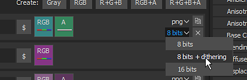
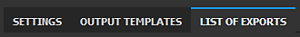
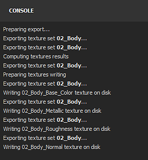
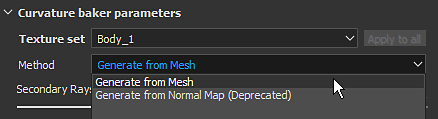

# Versão 2020.1 (6.1.0)

O **Substance Painter 2020.1 (6.1.0)** oferece um novíssimo exportador, scripts python, um novo criador de curvatura, novo conteúdo e muitas outras melhorias de fluxo de trabalho.

Data de lançamento: *22 de abril de 2020*

>[!NOTE]
>
> A partir desta versão, o número de versão do aplicativo começará a alterar seu formato. O **2020.1** agora se torna **6.1.0**.

## Principais recursos

### Nova Janela de Textura de Exportação

A janela de exportação foi totalmente reformulada para oferecer uma maneira mais fácil e direta de configurar e exportar texturas de um projeto. Ele também traz algumas novas funcionalidades que tornam a exportação muito mais conveniente. A nova janela de exportação agora está dividida em três guias:

**Configurações**

Essa guia controla as configurações gerais e específicas de cada conjunto de textura.

* **Novas Configurações Globais**\
  As Configurações globais são um conjunto de parâmetros compartilhados em todos os Conjuntos de texturas. Eles podem ser usados para atribuir ou atualizar parâmetros rapidamente sem ter que editar manualmente cada conjunto de texturas individualmente. As Configurações globais têm os seguintes parâmetros:

  * **Diretório de saída**: define o local de destino onde as texturas serão geradas.
  * **Modelo de saída**: define a predefinição a ser usada para configurar o nome e a embalagem das texturas exportadas.
  * **Tipo de arquivo**: define o formato de arquivo e a profundidade de bits das texturas exportadas.
  * **Tamanho**: define a maior resolução de textura em que um Conjunto de Texturas será exportado.
  * **Preenchimento**: define como as informações fora das Ilhas UV serão geradas.
  * **Exportar parâmetros de sombreadores**: se habilitado, exporta um arquivo json armazenando as configurações do sombreador e suas atribuições de conjunto de texturas.

  
* **Substituição de configurações e parâmetros por Conjunto de Textura**\
  Abaixo das Configurações globais está a lista de Conjuntos de textura do projeto aberto atualmente. A seção Parâmetros Gerais de Exportação exibe as configurações herdadas de Parâmetros Globais. Também é possível escolher uma **predefinição de exportação diferente por conjunto de textura**.

  

  Clicar no ícone de Caneta permite substituir um parâmetro específico para alterar seu valor. Clicar nele novamente desativará a substituição e redefinirá o valor de volta ao padrão (herdado das Configurações globais).

  
* **Escolha quais texturas exportar**\
  Abaixo dos parâmetros de exportação dos Conjuntos de texturas, há uma lista de texturas que serão geradas. Com esta lista, é possível escolher com precisão qual arquivo deve ser gerado, marcando-os ou desmarcando-os. A lista também exibe o formato de arquivo e a profundidade de bits de cada textura, herdados da configuração de exportação ou do modelo de saída. Use o ícone de caneta para substituir o formato de arquivo e profundidade de bits uma textura específica.
* **Salvar configurações sem exportar**\
  Agora é possível salvar a configuração de exportação do projeto sem ter que exportar texturas usando o novo botão **Salvar configurações**. Isso é útil quando você deseja ajustar um projeto sem regenerar texturas, o que pode levar algum tempo.

  
* **Clique e arraste para habilitar/desabilitar exportações rapidamente**\
  Use o clique com o mouse e arraste para ativar ou desativar rapidamente os Conjuntos de texturas e texturas:

  

  

**Modelos de saída**

Esta guia permite criar predefinições de configuração para nomear as texturas exportadas.

* <b>Criar predefinições de exportação</b>\
  A guia <b>Modelo de saída</b> é idêntica à guia <b>Configuração</b> do exportador antigo. Ele pode ser usado para criar predefinições de exportação para nomear e empacotar rapidamente texturas. Para saber como criar predefinições de exportação personalizadas, confira nossa página de documentação.
* **Configurar formato de arquivo e profundidade de bits em predefinições de exportação**\
  Uma nova adição às predefinições de exportação é a possibilidade de definir o formato do arquivo e a profundidade de bits por textura para tornar o compartilhamento de uma configuração ainda mais fácil entre projetos.

  
* **Controlar texturas exportadas do modelo de saída**\
  Ao configurar o processo de exportação, use a nova opção **Com base no modelo de saída** para definir propriedades de textura da predefinição de exportação.

  

**Lista de Exportações**

Esta guia exibe o processo de exportação em andamento, bem como um resumo global de toda a textura exportada.

* **Lista de texturas exportadas**\
  A guia lista cada textura individual a ser exportada por Conjunto de texturas, levando em consideração os parâmetros substituídos e as texturas ignoradas/excluídas. Essa é uma boa maneira de garantir que tudo esteja bem antes de iniciar o processo de exportação. A interface mudará automaticamente para essa guia quando o processo de exportação for iniciado.

  
* **Exportar processo e log**\
  À direita da guia há um console que fornece detalhes sobre o processo de exportação em andamento. Ela indicará quais texturas foram exportadas com êxito, bem como todos os avisos e erros. A parte inferior da interface também exibe uma barra de progresso que fornece o status atual do processo:

  

  

### Novo modo de camada de decalque

Há um novo modo de **decalque** disponível ao arrastar e soltar um material de [Ativos](../../interface/assets/assets.md). Isso cria uma nova camada de preenchimento no modo **Projeção planar** que permite posicionar padrões e imagens com mais facilidade. Para usá-lo, basta **arrastar e soltar** qualquer material da Prateleira enquanto pressiona o **atalho de teclado ALT** para visualizar o manipulador e soltar o mouse quando o decalque estiver onde você deseja. Ao soltar o botão do mouse, uma nova camada de preenchimento será criada.

Para esta ocasião, também incluímos 5 decalques na prateleira padrão selecionada de Substance Source. Se você quiser saber mais sobre este novo fluxo de trabalho de decalques, confira [este artigo](https://magazine.substance3d.com/effortless-grunge-look-with-new-substance-source-parametric-decals/).

>[!NOTE]
>
> Para facilitar o uso de decalques, implementamos uma nova [palavra-chave user-data](../../content/creating-custom-effects/user-data.md) que permite especificar o modo de mesclagem padrão para cada canal ao criar camadas.

### Novo script Python

Agora é possível gravar e executar scripts e módulos **Python** com o Substance Painter. Integramos o Python 3.7 e o PySide2 com o Substance Painter. Também fornecemos uma API Python personalizada por meio do módulo **substance\_painter** dedicado. Além disso, aproveitamos a oportunidade para repensar nossa API a partir da versão JavaScript para torná-la mais clara e fácil de usar. Eles compartilham semelhanças que devem tornar a criação de plug-ins Python simples para os usuários existentes.

Para saber mais sobre a API Python, consulte a documentação acessível pelo menu Ajuda dentro do aplicativo.

* **Instalando um módulo Python**\
  Os módulos Python podem ser instalados na pasta Documentos dedicada na conta do usuário, mas também oferecemos uma maneira de adicionar locais de caminho suplementares por meio de uma variável de ambiente dedicada para facilitar a configuração em um estúdio.
* **sub-módulos Python do Substance Painter**\
  Os seguintes submódulos foram expostos (outros estarão disponíveis posteriormente):

  * substance\_painter.display
  * substance\_painter.event
  * substance\_painter.exception
  * substance\_painter.export
  * substance\_painter.logging
  * substance\_painter.project
  * substance\_painter.resource
  * substance\_painter.textureset
  * substance\_painter.ui
* **Intérprete Python**\
  Uma nova janela de console Python está disponível para testar módulos e/ou executar scripts python:

  {width="500px"}

### Padarias aprimoradas

Nesta versão, o padeiro Curvatura foi melhorado e o padeiro Oclusão ambiente recebeu alguns novos parâmetros.

* <b>Nova curvatura do padeiro de malha</b>\
  O antigo padeiro de curvatura agora está obsoleto e foi substituído pela nova versão “de malha”, que foi recentemente adicionada ao Substance Designer. Para saber mais sobre as novas configurações do padeiro, confira a página de documentação.\
  O novo padeiro tem as seguintes características:

  * <b>Mais precisão</b>: a curvatura calculada é muito mais precisa e produz valores realistas.
  * <b>Contato de malha</b>: a interpenetração entre malhas agora produz informações de curvatura (o que não era o caso do padeiro anterior).
  * <b>Malha de polígono alto</b>: os detalhes agora são cozidos diretamente da malha de polígono alto em vez de serem convertidos do mapa normal.
  * <b>Desempenho</b>: o novo padeiro usa o rastreamento de raios para calcular detalhes, o que significa que ele se beneficia da aceleração do Rastreamento de raios do GPU (RTX/Optix).

  {width="500px"}

  Ainda é possível acessar o antigo padeiro de curvatura por motivos de compatibilidade através das configurações do curvatura. Escolha a configuração **Gerar do mapa normal** para usar o padeiro antigo.

  
* <b>Oclusão de ambiente aprimorada</b>\
  O padeiro de Oclusão ambiente foi aprimorado para suportar novas configurações:

  * <b>Plano terrestre</b>: simula um plano abaixo da malha para criar sombreamento proveniente do solo. Para obter mais informações, consulte a documentação Oclusão ambiente.
  * <b>Ignorar face de fundo</b>: há um novo sufixo de nome de malha para ignorar um objeto específico ao preparar a Oclusão Ambiente. Por exemplo, permite ignorar detalhes de geometria flutuante. Para obter mais informações, consulte a documentação Correspondência por nome

  {width="500px"}

### Exportação de malha aprimorada (com mosaico)

A malha de exportação foi aprimorada com novos recursos e configurações:

* **Exportar a topologia de malha original ou exportar a malha com mosaico**\
  Ao exportar a malha, agora é possível optar por aplicar o mosaico gerado para efeitos de deslocamento. As configurações possíveis são:

  * **Sem deslocamento/mosaico**: exporte a malha base sem subdivisões de malha. Se a **Triangulação aplicada** estiver desabilitada, os triângulos de malha, quads ou n-gonos originais serão exportados.
  * **Com deslocamento/mosaico**: exporte a malha com subdivisões. Se **Recalcular normais de vértice estiver habilitado**, os normais de malha serão ajustados para corresponder aos deslocamentos de deslocamento.

  
* **Hierarquia de cena e nomes de malha**\
  A hierarquia de cena original e os nomes de objeto da malha importada agora são preservados e reaplicados à malha exportada.
* **Exportar com formato de arquivo FBX**\
  A malha do projeto agora pode ser exportada em FBX, juntamente com outros formatos de arquivo.\
  **Observação**: dados incompatíveis com Substance Painter ainda são descartados durante a importação (por exemplo: camadas, junções).

### Desencapsulamento Automático UV Aprimorado

O desembrulho automático UV agora pode ser mais facilmente controlado com a ajuda de novas configurações:

* **Usar o Desencapsulamento UV Automático durante a criação do projeto**\
  Ao criar um projeto, agora há uma nova configuração que permite ativar ou desativar o novo processo de desencapsulamento UV automático. Essa configuração também está disponível ao reimportar uma malha 3D para um projeto existente.

  
* <b>Configurações avançadas de desencapsulamento</b>\
  Ao lado da caixa de seleção para habilitar o Desencapsulamento UV Automático, há um novo botão <b>Opções</b>. Ele abre uma nova janela com configurações avançadas para controlar o processo de desencapsulamento, permitindo preservar as informações de malha existentes em diferentes partes do processo em vez de sempre recalcular tudo como antes. Para obter mais informações, consulte a documentação dedicada. As configurações atuais são:

  * <b>Faixas</b>: define se as feixes existentes são preservadas ou regeneradas.
  * <b>Ilha UV</b>: define se a quebra de UV existente é preservada ou regenerada.
  * <b>Embalagem</b>: define se a embalagem de Ilha UV é preservada ou regenerada.
  * <b>Tamanho da margem</b>: define o espaçamento entre cada Ilha UV (porcentagem).

  

### Novo conteúdo

Nesta versão, incluímos alguns novos materiais, bem como atualizamos muitas das nossas predefinições de exportação para corresponder às novas versões de software.

* **5 novos materiais de decalque**\
  Adicionamos 5 novos materiais provenientes diretamente do Substance Source para experimentar o novo recurso de decalque:

  * Vazamentos de Ferrugem Grande
  * Líquen médio de Acarospora
  * Vazamentos de sangue escassos
  * Pequenos Impactos De Bala Na Parede De Concreto
  * Tag de pintura de spray

  
* <b>Novo sombreador Vray, modelos de projeto e predefinições de exportação</b>\
  Em colaboração com o [Chaos Group](https://www.chaosgroup.com/), integramos dois novos shaders que replicam os comportamentos do VrayMtl. Eles devem fornecer uma aparência mais precisa ao tentar corresponder renderizações feitas com Vray. Use os modelos de projeto para configurar facilmente qualquer novo projeto para o Vray. Consulte a documentação para saber mais sobre isso.

  
* <b>Novos modelos de projeto e predefinições de exportação do Maxwell</b>\
  Em colaboração com o [Próximo limite](http://www.nextlimit.com/), integramos novos modelos de projeto e exportamos predefinições para o renderizador Maxwell.
* **Predefinições de exportação atualizadas**\
  Muitas predefinições de exportação foram atualizadas, principalmente para usar o novo formato de arquivo e as novas configurações de profundidade de bits, mas também para corresponder às novas versões do software.

## Tutorials

Confira nossos novos tutoriais em vídeo que abrangem os novos recursos:

## Notas de versão

### 2020.1.3

*(Lançado Em 16 De junho De 2020)*\
Resumo: **Correção de erros**

**Adicionado:**

* [Exportar] Adicionar configurações de deslocamento no arquivo json de parâmetros do Sombreador

**Corrigido:**

* [Falha][Mecanismo] Falha ao tentar apagar e substituir canais existentes
* [Falha] Alterar o sombreador após pintar uma máscara em camadas de material
* [Falha][Mecanismo] Falha com alguns projetos pesados
* [Padeiros] A correspondência por nome não funciona com OBJs exportados do zBrush
* [Deslocamento][SVT] As texturas não são exibidas na abertura do projeto quando o deslocamento está ativado
* [Exportar] Algumas texturas são exportadas com cinza uniforme
* [Exportar] Os conjuntos de textura desativados não devem ser exportados para predefinições de exportação de Dimension e Sketchfab
* [Scripting][JavaScript] Falha ao usar a API JavaScript para acessar a configuração de exportação no evento onProjectOpened
* [Scripting][Javascript] onExportFinished() não é chamado após uma exportação

### 2020.1.2

*(Lançado Em 28 De maio De 2020)*\
Resumo: **Correção de erro com atualização de Substance Engine e Padeiros**

**Adicionado:**

* [Padeiros] Atualização para a versão mais recente
* [Padarias] Novo método de amostragem em Oclusão ambiente, curvatura, panificação de Thickness
* Atualize para a versão mais recente do Substance Engine
* [Scripting][Python] Permitir a criação de ResourceID para recursos do projeto
* [Scripting][Python] Permitir consulta de informações de canal
* [Scripting][Python] Adicione funções dryrun e callback para simular a exportação de textura

**Corrigido:**

* [Bakers] Normais incorretos no padeiro World Space Normals usando um mapa normal tangente em casos específicos
* [Bakers] Erro ao assar Oclusão ambiente com Optix quando não há alta poli
* [Traçados dinâmicos] Atraso ao carregar um conjunto de texturas específico
* [Exportar] Não deve exportar os conjuntos de texturas desativados para USD, glTF
* [Script][JavaScript] Não é possível editar novas configurações do Criador de curvatura
* [Scripting][JavaScript] alg.texturesets.addChannel() não retorna um erro em alguns casos
* [Scripting][JavaScript] Erro de digitação na documentação da API Javascript para setProjectExportOptions()
* [Scripts][JavaScript] Sempre exporta todos os conjuntos de texturas
* [Scripting][Python] sys.executable retorna um caminho para python.exe em vez de Substance Painter
* Cache de textura não compatível com o sistema operacional Mac e Windows/Linux
* [Livelink UE4] Somente o último material é usado para todos os conjuntos de texturas em uma malha combinada

**Problemas Conhecidos:**

* [Export][Dimension][Skecthfab] Não deve exportar os conjuntos de textura desativados
* [Falha] Alterar sombreador depois de pintar uma máscara em camadas de material

### 2020.1.1

*(Lançado Em 05 De maio De 2020)*

**Adicionado:**

* [Exportar] Feedback visual de estado substituído no TextureSet

**Corrigido:**

* [Export] Tamanho da janela do exportador muito grande no monitor de resolução especial e não pode ser redimensionado
* [Exportar] As opções não são salvas após a exportação
* [Exportar] Falha ou não é possível exportar com a predefinição de exportação “do cache”
* [Exportar] O cancelamento da exportação gera um mapa vazio adicional inesperado
* [Exportar] Corrigir configurações de predefinição de exportação virtual
* [Python] A variável env PYTHONPATH não é levada em conta
* [Python][Exportar] O cancelamento da exportação via Python retorna um erro de exceção
* [Python][Exportar] exportar\_projeto\_texturas resultado incorreto com formato de arquivo psd

**Problemas Conhecidos:**

* [JavaScript] Não é possível editar as novas configurações do criador de curvatura
* [JavaScript][Exportar] Sempre exporta todos os conjuntos de texturas
* [Bakers] Falha no Linux com Rastreamento de raios do GPU
* [Export][USD] Não deve exportar os conjuntos de textura desativados

### 2020.1.0

*(Lançado Em 22 De abril De 2020)*

**Adicionado:**

* Novo exportador de textura e malha
* [Exportar] Interface de novo exportador
* [Exportar][guia Exportar] Permite a seleção dos canais de mapas que são exportados por conjunto de textura
* [Exportar][Guia Exportar] Permite a modificação do tamanho do Conjunto de texturas para todos os Conjuntos de texturas em uma ação
* [Exportar][guia Exportar] Permite um modelo diferente por conjunto de textura (exceto USD, glTF, Sketchfab e Dimension)
* [Exportar][guia Exportar] Ativação e desativação rápidas de mapas e conjuntos de texturas
* [Exportar][Guia Exportar] A resolução de exportação 8192 x 8192 não é mais experimental
* [Exportar][guia Exportar] Permite a modificação do formato de arquivo e a profundidade de bits por mapa
* [Exportar][guia Exportar] Permite redefinir os valores dos parâmetros padrão
* [Exportar][guia Exportar] Permite que as configurações sejam salvas sem exportar
* [Exportar][guia Modelos de saída] Renomeie a guia “Configuração” para a guia “Modelos de saída”
* [Exportar][guia Modelos de saída] Permite a definição de formato de arquivo e a profundidade de bits por mapa predefinido
* [Exportar][Guia Lista de exportações] Nova guia de visualização para resumir e visualizar o processo de exportação
* [Malha de importação/exportação] Otimização de desempenho de tempo de importação/exportação
* [Exportar malha] Exportar malha em FBX
* [Exportar malha] Exportar malha com deslocamento e mosaico
* [Exportar malha][IU] Novas configurações para recalcular vértice normal, aplicar triangulação
* [Exportar malha] Exporte a topologia de malha original com novos UVs gerados pelo desencapsulamento automático
* Desencapsulamento automático UV atualizado com mais controles
* [Desempacotamento UV][IU] Adicionar configuração para ativar o desempacotamento UV automático na nova janela do projeto
* [UV Unwrapping][UI] Novas opções para controlar os passos de abertura (costuras, abertura, embalagem)
* [UV Unwrapping][UI] Permitir a conservação de emendas de abertura/desembrulho/embalagem existentes
* [UV Unwrapping][UI] Novas opções para recalcular totalmente as etapas de desencapsulamento
* [UV Unwrapping][UI] Nova opção para controlar o tamanho da margem (nenhum, pequeno, médio e grande)
* Novos Panificadores
* [Padarias] Substituir a curvatura antiga pela nova curvatura da malha
* [Padeiros] Adicione a opção de correspondência por nome para ignorar a face traseira no padeiro “Oclusão ambiente”
* [Padeiros] Adicionar opção de plano de chão no padeiro “Oclusão ambiente”
* Nova API de script do Python (3.7.6)
* [Python][UI] Novo menu de scripts para o Python
* [Python][UI] Nova documentação do Python no menu Ajuda
* [Python] Expor módulos Substance Painter python: substance\_painter, alg, display, project.setting, project, texturesets, ui
* [Python] Expor novo módulo Python “substance\_painter”
* [Python] Expor novo submódulo Python: alg, display, log, project, resource, texturesets, ui
* [Python] Ouvinte para alterações de projeto
* [Python] Novos exemplos na documentação do Python
* [JavaScript][UI] Menu de plug-ins substituído pelo JavaScript
* [Visor] Permite a criação de uma projeção de decalque “arrastando/soltando + ALT” um recurso da prateleira
* Novo conteúdo
* [Content] 5 novos materiais de decalque do Substance Source
* [Content] Adicionar novos modelos de projeto e predefinições de exportação para o renderizador Maxwell
* [Content] Adicionar modelo de projeto para exportação do Keyshot 9
* [Content] Atualize a predefinição de exportação Keyshot 9 para oferecer suporte a deslocamento e emissivo
* [Conteúdo][Exportador] Atualização de todas as predefinições de exportação para corresponder às versões mais recentes de mecanismos e renderizadores de jogos
* [Conteúdo][Exportador] Atualizar arquivos de predefinições de exportação para usar o novo formato e configurações de pontilhamento
* [Content] Novos modelos e sombreadores para suportar material VRay (VRayMtl)
* [Pilha de camadas] Permitir exclusão de efeitos de camada usando o ícone de lixeira ou o atalho de teclado Excluir
* Remover o Substance Source de plug-in (use o iniciador com a funcionalidade “enviar para”)
* [Windows] Não exibir aviso de TDR em GPUs de alta capacidade

**Corrigido:**

* Problemas de tradução na caixa de diálogo Novo arquivo de projeto
* [Padeiros] A configuração “Salvar arquivo de cena pré-processado” não funciona mais
* [Padeiros] Falha ao assar com optix quando não alto poli
* [Projeção planar] A projeção não funciona em malhas com UVs repetidos
* [Decalque] Diferença de comportamento no canal normal ao usar diferentes modos de projeção de camada de preenchimento
* [Borrar][Clonar] O artefato pode aparecer ao pintar em uma máscara
* [Engine] Falha com conteúdo de camada específico
* [Engine] Falha aleatória ao pintar em alguns casos
* [Ponto de ancoragem] A referência a uma máscara vazia sempre retorna branco
* [Exportar] Camada não considerada em algumas configurações de pilha específicas
* [Exportar malha] Não é possível exportar com caminho que contém caracteres especiais
* [Exportar malha] Não é possível ler arquivos glTF quando exportado do Linux ou MacOS
* [Importar malha] A reimportação do DAE, PLY ou glTF não funciona conforme o esperado
* [Falha] Alterar sombreador depois de pintar uma máscara em camadas de material

**Problemas Conhecidos:**

* [Script][JavaScript] Não é possível editar novas configurações do Criador de curvatura
* [Bakers] Falha no Linux com Rastreamento de raios do GPU
* [Export][USD] Não deve exportar os conjuntos de textura desativados
