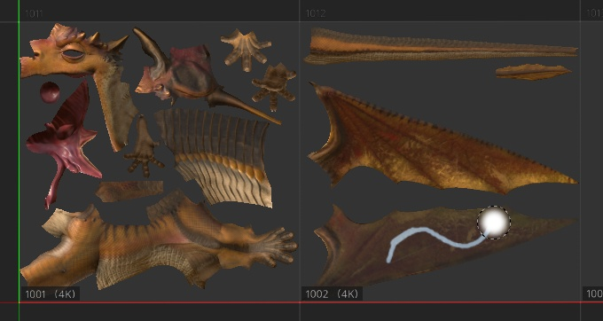
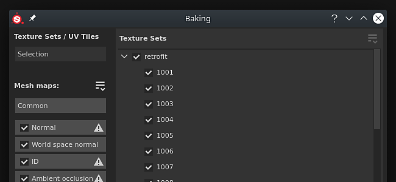

# Versão 2020.2 (6.2.0)

O **Substance Painter 2020.2.0 (6.2.0)** apresenta o novo fluxo de trabalho de Bloco UV que permite pintar em UDIMs. Também inclui várias melhorias de desempenho e tamanho de projeto para qualquer tipo de projeto.

Data de lançamento: *23 de julho de 2020*

&#x200B;>> 

Créditos do artista: Dragon de [Damien Guimoneau](https://www.artstation.com/damz) e Robot de [Jason Huang](https://www.artstation.com/jasonhuang).

## Principais recursos

### Novo fluxo de trabalho de bloco UV com pintura em UDIMs

Nesta versão, apresentamos o novo fluxo de trabalho Blocos UV para Substance Painter, que permite pintar em blocos UDIM.

Com o novo fluxo de trabalho, os **UVs não são mais divididos em conjuntos de texturas individuais**. Em vez disso, os ladrilhos UV estão contidos dentro de um único conjunto de textura com base na atribuição de material da malha. Os Blocos UV que estão dentro do mesmo Conjunto de Textura podem ser **pintados sem emendas**, nas portas de visualização 2D e 3D.

UV Tile é o termo usado para descrever de maneira genérica esse novo fluxo de trabalho, pois o UDIM é principalmente uma convenção de nomenclatura. Embora o UDIM seja atualmente a única convenção disponível, temos planos para expandi-lo no futuro (como suporte ao Mudbox ou à nomeação do ZBrush). Também estamos pensando em apoiar ladrilhos com coordenadas negativas, o que não é possível com o esquema UDIM. É por isso que escolhemos um termo mais amplo para este fluxo de trabalho.

Esta é uma visão geral das alterações introduzidas com este novo fluxo de trabalho:

* **Criando um projeto de Bloco UV**\
  Ao criar um novo projeto, há uma nova configuração para especificar se o novo fluxo de trabalho deve ou não ser usado.

  Observe que, uma vez que o fluxo de trabalho foi decidido e o projeto criado, ele não pode ser alterado posteriormente, ao contrário de outras configurações.

  
* Blocos UV em Janela de visualização 2D

  Ao usar o novo fluxo de trabalho Bloco UV, a exibição 2D agora exibirá uma nova grade em que cada Bloco UV tem um número UDIM dedicado. Cada ladrilho pode ser pintado individualmente.

  
* Pintura em blocos UV

  Blocos UV

  que estão dentro do mesmo conjunto de texturas podem ser pintadas perfeitamente. Isso permite aumentar a resolução geral e a qualidade de um ativo simplesmente multiplicando o número de blocos UV.
* Blocos UV na janela Lista de conjuntos de texturas

  O

  A Lista de Conjuntos de Texturas tem

  foi atualizado para listar os ladrilhos UV relacionados ao material encontrado na malha importada. Cada Bloco UV é exibido com seu nome com base na convenção UDIM.

  
* Alterando a resolução por Bloco UV

  Embora a resolução padrão de cada bloco UV seja baseada em seu conjunto de textura principal, é possível substituí-lo por bloco. Basta selecionar os blocos na Lista do conjunto de textura e ir para a janela Configurações do conjunto de textura para alterar a resolução. Quando um ladrilho tiver sua resolução substituída, a nova resolução será exibida na Visualização 2D ao lado do número.

  
* Novos ícones de pilha de camadas

  A pilha de camadas apresenta novos ícones para as camadas de pintura e preenchimento. Como os Blocos UV apresentam muito mais conjunto de texturas, não foi possível exibir todos eles nessa pequena área. Isso ajuda no desempenho, pois não há mais necessidade de calcular miniaturas específicas. Este novo conjunto de ícones também pode ser usado para projetos regulares ativando uma configuração nas configurações principais (veja abaixo).

  
* Nova máscara de bloco UV em camadas

  A Máscara de bloco UV é uma nova maneira de mascarar camadas de entrada/saída que é mais eficiente do que o mascaramento normal. Oferece melhores desempenhos, uma vez que permite descartar totalmente o cálculo de telhas UV específicas. Esta é uma ferramenta que recomendamos usar para obter uma experiência confortável ao trabalhar em um projeto com muitos blocos UV. Para obter mais informações, consulte a [página dedicada](../../interface/layer-stack/geometry-mask.md) na documentação.

  {width="550px"}
* **Pintando pelos ladrilhos UV mascarados**\
  Com vários ladrilhos UV no mesmo conjunto de texturas, pode ser difícil pintar certas áreas de uma malha porque outras partes da geometria estão no caminho. Para contornar essa situação, uma nova configuração de pintura foi adicionada à barra de ferramentas contextual chamada **Os traçados de tinta ignoram blocos UV mascarados**. Quando esta configuração estiver ativada, qualquer Bloco UV excluído pela Máscara de bloco UV ficará oculto na janela de visualização, permitindo que os traçados de tinta passem por/ignorem-nos. Modificar a Máscara de bloco UV recalculará os traçados do pincel, pois permite reimportar uma malha que pode ter modificado o bloco UV ou uma nova geometria que também precisa ser excluída. Isso evita refazer os traçados de tinta.

  

  
* Assar ladrilhos UV

  Os padeiros também suportam azulejos UV e agora há uma lista de seleção na janela de cozimento

  para especificar quais ladrilhos e conjuntos de texturas devem ser assados. A seleção pode ser alterada rapidamente clicando e arrastando sobre a caixa de seleção ou usando os novos menus suspensos.

  

  
* Exportando texturas de blocos UV com a nova tag $udim

  Uma nova tag foi adicionada aos modelos de saída, permitindo exportar arquivos com o número do Bloco UV em seus nomes de arquivo. Atualmente, apenas a convenção UDIM está disponível. Também é possível usar parênteses para definir elementos opcionais em um nome de arquivo quando uma tag não está disponível. Isso permite, por exemplo, criar nomes de arquivo que só anexam o número UDIM quando disponíveis em projetos UV Tile, tornando as predefinições de exportação compatíveis com qualquer tipo de projeto.

  
* **Importar sequências de imagens** Uma sequência de imagens é uma série de texturas em que cada uma corresponde a um Bloco UV específico. Para importar uma sequência de imagens, basta arrastar e soltar o primeiro arquivo da sequência na Prateleira ou usar a janela de recursos de importação. Os arquivos restantes na sequência também serão importados automaticamente. As sequências serão exibidas na Prateleira como um único recurso com um número indicando quantos arquivos eles contêm. Para usar a sequência, basta arrastá-la e soltá-la em uma camada de preenchimento. O modo de projeção será definido automaticamente como **Preenchimento (Corresponder por Bloco UV)**.

  {width="600px"}

  
* Suporte de Facesets com malhas Alembic

  Facesets alêmicas agora são importadas como materiais a serem divididos em Conjuntos de texturas. Essa alteração torna as malhas Alembic compatíveis com o novo fluxo de trabalho de ladrilhos UV. Se uma malha Alêmica contiver faces que não estão em Facesets, elas serão colocadas automaticamente em um Conjunto de texturas chamado DefaultMaterial.

Para saber mais detalhes sobre o novo fluxo de trabalho de Bloco UV, confira a [documentação dedicada](../../features/uv-tiles/uv-tiles.md).

>[!NOTE]
>
> O fluxo de trabalho UV Tile pode ser muito exigente. Recomendamos trabalhar com SSDs para armazenar o cache e um arquivo de projeto para reduzir os tempos de carregamento e obter uma experiência tranquila.

### Novo Mecanismo de Pausa

Agora é possível pausar o mecanismo de Substance Painter enquanto trabalha. Com o mecanismo pausado, qualquer cálculo de textura, atualização de viewport ou traçado de pintura é registrado, mas não calculado.

Essa nova ação permite configurar e ajustar pilhas de camadas complexas e atrasar o cálculo até o último momento. A principal vantagem de pausar o motor é evitar cálculos intermediários e, em vez disso, calcular apenas o resultado final. Isso torna o aplicativo mais responsivo e a atualização mais rápida em geral. O ponto de equilíbrio é que não há feedback visual até que o motor não esteja pausado.

Para pausar o mecanismo, basta clicar no **botão na barra de ferramentas contextual** acima do visor ou usar o **atalho Shift + Escape** (pode ser modificado nas Configurações). Para cancelar a pausa do mecanismo, desative o botão ou reutilize o atalho.

### Melhorias de desempenho

* **Exportação mais rápida de texturas**\
  A exportação de texturas deve ser significativamente mais rápida, especialmente com projetos pesados que geram muitas texturas. Várias melhorias foram feitas na maneira como as texturas são geradas e escritas. Em nossos testes internos em projetos com muitos conjuntos de texturas ou pilhas de camadas complexas, vimos o processo de exportação ser geralmente até **4 ou 5 vezes mais rápido**.
* **Cálculo de cache atrasado ao abrir projetos** O Substance Painter usa um sistema de cache para permitir o ajuste e a mesclagem rápidos de camadas. Nas versões anteriores, esse cache era calculado sempre que um projeto era aberto (visível pela barra de carregamento verde na parte inferior da viewport). Agora, o cálculo do cache só é acionado ao tentar editar uma camada (pintando ou ajustando um parâmetro de camada de preenchimento, por exemplo). Essa alteração permite abrir projetos sem aguardar e alternar para os conjuntos de texturas desejados antes de começar a trabalhar. A computação também é mais granular, o que permite calcular apenas o que é necessário. Por exemplo, com um projeto que contém ladrilhos UV, somente os ladrilhos que precisam ser modificados são computados.
* **Carregamento assíncrono de mapas de malha** Os mapas de malha agora são carregados de forma assíncrona. Isso significa que o aplicativo não será mais bloqueado enquanto aguarda o carregamento dos mapas de malha. Isso é especialmente visível ao exibir o mapa de malha na viewport (como na imagem abaixo). Isso também torna os projetos de abertura mais rápidos, já que não há mais espera pelos mapas de malha.

  
* **Edição do modo de exibição de máscara aprimorado**\
  Ao usar ALT+Clique em uma máscara (ou no modo de exibição dedicado) para exibi-la na janela de visualização, as atualizações de textura agora são executadas apenas para a máscara. Isso significa que os efeitos de pintura e edição são muito mais suaves ao usar esse modo de visualização, pois qualquer outro cálculo é atrasado até que a janela de visualização seja definida de volta ao modo de material.

  
* **Novas miniaturas de pilha de camadas**\
  Como mencionado anteriormente, a pilha de camadas agora pode usar um novo conjunto de ícones. O uso desses ícones pode melhorar o desempenho geral, pois nenhuma miniatura precisa ser calculada. Embora isso seja automático para projetos de Bloco UV, os projetos regulares também podem optar por usar esses ícones indo até **Editar > Configurações** e habilitando **Substituir miniaturas de pilhas de camadas por ícones**.

  
* **Salvamento incremental mais rápido** Como o projeto pode ser menor e o processo de salvamento é mais granular em relação aos dados que foram alterados, o salvamento incremental (pressionando CTRL+S) agora é muito mais rápido. Isso é especialmente perceptível em projetos pesados.
* **Desempenho aprimorado na inicialização do Iray**\
  Alternar para o modo de renderização com o Iray deve ser mais rápido, pois melhoramos a maneira como gerenciamos a memória compartilhada no aplicativo.

### Melhorias no tamanho do projeto

Os arquivos de projeto são notórios por terem [uma área ocupada por arquivo](../../technical-support/workflow-issues/project-issues/projects-are-really-big.md). Dedicamos um tempo para investigar a causa raiz desse problema e criamos algumas soluções. Esta versão apresenta um primeiro conjunto de alterações:

* **Alternar as saídas de preparadores para imagens em tons de cinza**\
  Em versões anteriores, os padeiros emitiam imagens de RGB em todos os casos. Agora, os padeiros em tons de cinza (curvatura, oclusão ambiente) imprimirão apenas imagens em tons de cinza. Essa simples mudança pode reduzir o tamanho dos projetos de 20% para 60%. Para aproveitar essa mudança, os mapas de malha dos projetos existentes precisam ser regenerados.
* **Alterando as configurações padrão de difusão e dilatação para padeiros**\
  Anteriormente, os padeiros geravam uma dilatação de 1 pixel e, em seguida, um padrão de difusão (pixels borrados fora das Ilhas UV). Essa configuração gera texturas bastante pesadas, pois é difícil compactar o gradiente. As configurações padrão foram, portanto, alteradas para reduzir esse problema. Por padrão, a difusão agora está desativada e a dilatação foi definida como 32 pixels (que devem corresponder às resoluções 4K). Recomendamos mudar o projeto existente para essas novas configurações e reassar para aproveitar essa melhoria.

### Melhorias diversas

Esta nova versão inclui algumas alterações adicionais:

* **Preparando seleção**\
  Para facilitar as coisas com o novo fluxo de trabalho de Bloco UV, a janela de cozimento foi ligeiramente modificada para incluir uma nova lista de seleção, que inclui a lista de Bloco UV por Conjunto de textura. O botão “Preparar conjunto de texturas atual” foi removido. Para manter a seleção do que assar conveniente, várias opções foram adicionadas nos menus suspensos:

  

  
* **Instância do sombreador nas configurações do conjunto de textura**\
  Com o retrabalho da lista Conjunto de texturas para incluir blocos UV, algumas pequenas alterações foram feitas para tornar a interface menos confusa. A funcionalidade que anteriormente permitia criar e alternar para diferentes instâncias de sombreador agora foi movida para as configurações de Conjunto de Textura.

  

## Tutorials

Abaixo, seguem nossos novos tutoriais em vídeo, que abrangem os novos recursos. Mais vídeos estão disponíveis no [Substance Academy](https://www.youtube.com/playlist?list=PLB0wXHrWAmCx1fWbUyBFcjtfL8xhxZFnv) sobre o novo fluxo de trabalho de Bloco UV.

## Notas de versão

### 2020.2.0

*(Lançado Em 23 De julho De 2020)*

**Adicionado:**

* Blocos UV (UDIMs)
* [Blocos UV] Pintar em blocos UV
* [Blocos UV] Permitir a escolha entre o fluxo de trabalho novo e herdado para Blocos UV
* [Blocos UV] Importar sequências de imagem de blocos UDIMs/UV como um recurso
* [Blocos UV] Adicionar lista de blocos UV por conjunto de textura na janela Lista de conjuntos de textura
* [Blocos UV] Permitir a edição da resolução de vários blocos UV de uma só vez nas Configurações do conjunto de textura
* [Blocos UV][Exibição 2D] Exibir Blocos UV como uma grade
* [UV Tiles][2D View] Novo botão de visor para exibir ou ocultar informações de UV Tiles
* [Ladrilhos UV] Alternar a ferramenta de pintura para canal único por padrão para projetos de Ladrilho UV
* [Blocos UV] Novo botão na barra de ferramentas contextual para ignorar blocos UV mascarados ao pintar
* [Blocos UV][Pilha de camadas] Novos ícones de pilha de camadas para melhorar o desempenho
* [Blocos UV][Pilha de camadas] Aprimorar ícones de pintura e preenchimento na barra de ferramentas
* [Máscara de bloco UV][Visualização 2D] Permite incluir ou excluir vários blocos UV de uma vez (clique com o botão esquerdo, CTRL+clique com o botão esquerdo)
* [Máscara de bloco UV] Nova máscara de bloco UV para incluir, excluir blocos por camada com um novo ícone
* [Máscara de bloco UV][Pilha de camadas] Exibir o número de blocos UV no ícone de máscara de blocos UV quando nem todos estiverem incluídos
* [Máscara de bloco UV][Visualização 2D/3D] Adicionar efeito hover para visualizar blocos UV sob o cursor
* [Blocos UV][Padeiros] Permitir selecionar e assar blocos UV específicos
* [Blocos UV][Padeiros] Adicionar opções de seleção para Conjuntos de textura/Blocos UV
* [Blocos UV][Padeiros] Clique com o botão direito do mouse na opção de menu para selecionar Blocos UV em um conjunto de textura
* [Blocos UV][Padeiros] Permitem a seleção rápida no Conjunto de textura/Blocos UV arrastando
* [Blocos UV][Padeiros] Substituir os botões “Todos” e “Nenhum” nos Mapas de malha por opções de seleção mais explícitas
* [Blocos UV][Padeiros] Exibir o número de texturas a serem assadas
* [Blocos UV][Exportar] Permite selecionar e exportar blocos UV específicos
* [Blocos UV][Exportar] Permitir a seleção rápida de blocos UV arrastando
* [Blocos UV][Exportar] Adicionar opções do menu suspenso para Blocos UV
* [Blocos UV][Exportar] Torne algumas predefinições de exportação indisponíveis se não funcionarem com Blocos UV (Adobe Dimension, Sketchfab, glTF, USD)
* [Blocos UV][Conteúdo] Atualizar predefinições de exportação para usar a nova tag $udim
* [Blocos UV] Aprimorar o relatório de erros ao importar malhas com Ilhas UV sobrepostas
* [UV Tiles] Telhas UV compatíveis em Iray
* [UV Tiles][Scripting] Adicionar documentação de exportação de UV Tile ao documento Python
* Desempenho
* [Desempenho] Botão Novo na barra de ferramentas contextual para pausar o cálculo do mecanismo ao trabalhar (SHIFT+ESC)
* [Desempenho] Abertura mais rápida do projeto com o atraso do cálculo do cache do Conjunto de texturas
* [Desempenho] Não espere os mapas de malha serem carregados ao abrir o projeto
* [Desempenho][Exibição 2D/3D] Não calcular o canal da Máscara no visor quando não estiver em uso
* [Desempenho] Não bloqueia o aplicativo ao carregar mapas de malha exibidos nas viewports
* [Desempenho] Melhorar a velocidade de salvamento incremental ao salvar um projeto
* [Performance][Bakers] Alterar as configurações de dilatação padrão para melhorar a economia de tempo e tamanho do projeto
* [Performance][Bakers] Migre para tons de cinza em padeiros específicos para melhorar a economia de tempo e tamanho do projeto
* [Desempenho][Exportar] Aprimorar o desempenho do mecanismo para exportar texturas mais rapidamente
* [Desempenho][Exportar] Melhore a capacidade de resposta ao abrir a caixa de diálogo de exportação com muitos conjuntos de texturas
* [Desempenho][Exportar] Melhorar o desempenho ao mudar para a guia “Lista de exportações”
* [Performance][Iray] Reduzir o tempo de inicialização do Iray
* Outro
* [Padeiros] Adicionar opções de seleção para Conjuntos de textura
* Mover gerenciamento de instância de sombreador para Configurações de Conjunto de Textura
* [Exibição 2D/3D] Adiciona uma mensagem na parte inferior da viewport para indicar qual tipo de máscara está editado
* [Pilha de camadas] Nova opção nas configurações para alternar entre miniaturas antigas e novas
* [Pilha de camadas] Adicionar feedback visual para indicar o estado de carregamento das miniaturas
* [Proj] Novo modo de projeção “Fill (Match Per UV-Tile)” para carregar sequências de imagens
* [Proj] Altere o modo de projeção das camadas de preenchimento para “Preencher (corresponder por bloco UV)” em casos específicos
* [Conteúdo] Otimizar as predefinições do pincel a carvão para melhorar o desempenho
* Atualize o Iray para a versão 2020.0.0
* [Exportar] Desative a guia Lista de exportações quando nada estiver selecionado
* Desempacotar automaticamente
* [Desempacotamento automático] Melhorar a qualidade da colocação de costuras
* [Desempacotamento automático] Parametrização aprimorada para aumentar a velocidade e estabilidade

**Corrigido:**

* [Alembic] Os facesets são ignorados ao importar arquivos
* [Alembic] Tempo de carregamento infinito com arquivos específicos
* [Importar] A sequência de imagens UDIM incorreta é importada quando apenas a extensão do arquivo é diferente
* [Falha] A tentativa de abrir um projeto bloqueado por outro processo leva a uma falha
* [Exportar] O canal emissivo não é exportado com o formato USD
* [Content] Material inteligente “Carvão” contém traçados de tinta

**Problemas Conhecidos:**

* [Lista de Conjuntos de Texturas] Não é possível ocultar a descrição
* Problemas de interface do [Texture Set List]
