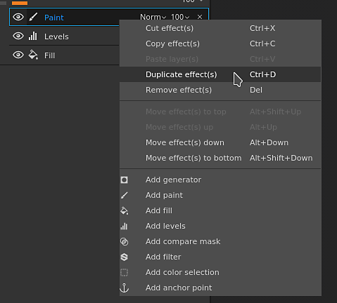
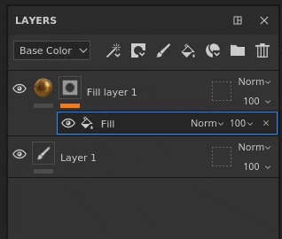
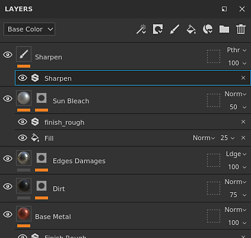
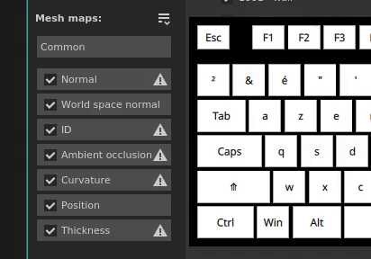

# Versão 2021.1 (7.1.0)

O **Substance Painter 2021.1 (7.1.0)** apresenta vários novos recursos e melhorias, como a máscara de geometria e a cópia e colagem de efeitos na pilha de camadas.

Dados da versão: *28 de janeiro de 2021*

>[!NOTE]
>
> Esta versão aumenta a versão mínima compatível com o Ubuntu para 18.04 e o MacOS para 10.14. Para obter mais detalhes, consulte os [requisitos técnicos](../../getting-started/system-requirements.md).

## Principais recursos

### Nova máscara geométrica

A Máscara de geometria é uma nova ferramenta de mascaramento na pilha de camadas que permite ocultar a geometria com base em nomes de malha ou blocos UV. É uma evolução da Máscara de bloco UV, anteriormente chamada de geometria mascarada com base em números UDIM.

Essa nova ferramenta é uma maneira melhor de mascarar a geometria do que a pintura normal (ou ao usar o [Preenchimento de polígono](../../painting/tool-list/polygon-fill.md)), pois ela se beneficia de várias otimizações de mecanismo. Também não é destrutivo, pois não armazena informações de geometria (como faces ou vértices), mas apenas o nome da malha ou o número do bloco UV, portanto, reimportar uma malha não quebrará a máscara. Outro benefício é que ocultar a geometria permite pintar em superfícies que não eram acessíveis antes em um conjunto de texturas, o que evita a necessidade de dividir um objeto em vários conjuntos de texturas, por exemplo.

* **Nova máscara de geometria em camadas**\
  A máscara de geometria está automaticamente disponível em qualquer camada na [pilha de camadas](../../interface/layer-stack/layer-stack.md). Por padrão, ela não tem efeito, o que significa que a camada está totalmente visível.\
  A Máscara de geometria tem seu próprio menu contextual que permite selecionar ou desmarcar rapidamente todos os seus itens, mas também copiar seus valores para outra camada.

  

  

* **Edição das propriedades da máscara de geometria** A máscara de geometria segue a mesma lógica dos contextos das outras camadas (como editar uma máscara ou propriedades de instância). Para entrar no modo de edição de máscara de geometria, basta clicar no quadrado pontilhado à direita de uma camada. Para sair da máscara de geometria, clique no conteúdo ou na máscara de pintura da mesma camada.

  

* **Mascaramento por nomes de malha ou por blocos UV**\
  Na parte superior das propriedades da Máscara de geometria está uma lista suspensa que controla o modo de mascaramento. É possível escolher entre mascaramento por número de bloco UV ou por nome de malha. Este menu suspenso é desativado e definido como nome da malha apenas no caso de um projeto não usar o fluxo de trabalho de Bloco UV.

  

* **Mascarando a geometria por meio das propriedades**\
  Ao editar a Máscara de geometria, a janela de propriedades exibirá uma lista dos nomes da malha (ou blocos UV) com base na geometria relacionada ao Conjunto de texturas atual.

  * O número acima da lista indica quantas malhas/blocos UV estão desmascarados sobre o total disponível.
  * O menu ao lado do número fornece controles rápidos para selecionar todos ou nenhum dos itens e até mesmo inverter a seleção atual.
  * A lista abaixo define quais itens estão mascarados ou não. Como qualquer outra lista no aplicativo, é possível clicar e arrastar para habilitar/desabilitar vários itens de uma só vez ou usar **ALT+Clique** para isolar um item.

   

* **Mascaramento de geometria por meio da viewport**\
  A seleção da Máscara de geometria também pode ser alterada nas visualizações 2D e 3D. Basta mover o mouse sobre a parte que deve estar visível/oculta e clicar nela para alternar seu estado. Ao editar a Máscara de geometria, a geometria mascarada é exibida com um efeito de linhas cinza e diagonais. Também é possível fazer seleções retangulares clicando e arrastando para selecionar vários itens de uma vez.\
   

* **Pintando geometria oculta/inacessível.**\
  Depois de selecionar a geometria para mascarar na Máscara de Geometria, é possível habilitar o botão **Ocultar/Ignorar geometria excluída** na parte superior da viewport (ou pressionando o atalho **ALT+H**). Quando ativada, a geometria excluída será ocultada (bem como outros conjuntos de texturas) para mostrar apenas a geometria que está incluída/pode ser pintada com a camada atual. Essa opção permite pintar áreas que foram bloqueadas anteriormente ou que estavam fora de alcance. Essa opção também se aplica a qualquer tipo de camada.

  >[!NOTE]
  >
  > Pintar com geometria mascarada permanece dinâmico: se alguma geometria que bloqueia a pintura tiver sido inicialmente ocultada quando o traçado de pincel foi feito e, em seguida, for desmascarada, ela bloqueará novamente o traçado de pincel feito anteriormente.

  

### Nova cópia e colagem de efeitos de pilha de camadas

Os efeitos agora podem ser copiados entre camadas e pilhas de camadas, da mesma forma que as camadas normais.

Agora, também é possível selecionar vários para oferecer a possibilidade de copiar e colar vários efeitos de uma só vez.

Para sua conveniência, copiar ou mover um efeito de uma máscara em uma camada sem uma adicionará automaticamente um efeito. Isso ocorre porque os efeitos do conteúdo da camada e da máscara não são compatíveis entre si. Isso significa que copiar um efeito de uma máscara para o conteúdo de uma camada alternará automaticamente para a máscara (ou criará uma).

* **Copiar e colar pelo menu contextual**\
  Clique com o botão direito do mouse em qualquer efeito na pilha de camadas de um Conjunto de texturas e escolha a ação de recortar ou copiar. Em seguida, clique com o botão direito do mouse novamente em qualquer camada e escolha colar para mover ou criar uma cópia dos efeitos desejados. Aproveitamos também a oportunidade para reformular o menu contextual e dar acesso a mais funcionalidades:

  

* **Copiar e colar com os atalhos de teclado**\
  Igual a qualquer camada, os atalhos de teclado **CTRL+C** (copiar)/**CTRL+X** (recortar) e **CTRL+V** (colar) podem ser usados para copiar efeitos com base na seleção atual. Assim como com as camadas, os efeitos são inseridos acima da seleção atual.

  

* **Duplicar rapidamente o efeito com atalhos de teclado**\
  Use **CTRL+D** para duplicar a seleção atual ou pressione e mantenha **ALT ao arrastar** qualquer efeito para duplicá-lo no local desejado:

  

* **Mover efeitos entre camadas**\
  Além da cópia e duplicação, agora é possível mover um efeito simplesmente arrastando e soltando-o de uma camada para outra:

  

### Novos recursos e melhorias gerais

Várias melhorias foram feitas nesta versão:

* **Adicionar uma descrição por Bloco UV**\
  Uma descrição agora pode ser adicionada para cada bloco UV por meio da Lista de conjuntos de texturas. Isso facilita a navegação no projeto, especialmente ao exportar e assar, pois as descrições também podem ser vistas nesses contextos.\
  Para adicionar ou editar uma descrição, basta clicar em um Bloco UV na janela Lista de conjuntos de texturas e, em seguida, ir para a janela Configurações do conjunto de texturas para editá-lo.

  

   

* **Novas miniaturas de pilha de camadas**\
  As miniaturas otimizadas de pilha de camadas foram aprimoradas. Agora, uma esfera de material é exibida para camadas de preenchimento, facilitando a navegação e a visualização das propriedades principais de cada camada, mesmo ao trabalhar com o fluxo de trabalho [Blocos UV](../../features/uv-tiles/uv-tiles.md). A miniatura é gerada a partir das informações da camada, mas não leva em conta os efeitos para evitar que sejam recalculadas com muita frequência.

  

* **Saída da Máscara de geometria aprimorada na pilha de camadas**\
  Sair da Máscara de geometria (anteriormente chamada de Máscara de bloco UV) pode ser difícil com pastas na pilha de camadas se não tiver uma máscara. Isso ocorre porque não havia outro contexto para ativar além da seleção de outra camada. Agora é possível clicar na miniatura da pasta para sair da Máscara de geometria. Também é possível arrastar e soltar materiais ou materiais inteligentes da prateleira para o visor ao editar a Máscara de geometria.

  

  

* **Nova seleção Alt-Clique na janela de Preparação**\
  A lista de mapas de malha na janela de cozimento agora pode ser isolada com o **Alt + clique do mouse** para isolar um mapa específico para cozimento, em vez de ter que excluí-los manualmente. O mesmo atalho pode ser usado para reativar todos os mapas de malha.

  

* **Novo botão Preparar conjunto de texturas atual**\
  Um novo botão foi adicionado na parte inferior da janela de cozimento para tornar rápido e fácil reassar um conjunto de texturas. Usar esse botão não afetará a seleção personalizada que foi definida anteriormente e, em vez disso, preparará todo o Conjunto de texturas (incluindo todos os seus blocos UV, se houver).

  

### Nova atualização de Substance Engine

O Substance Engine foi atualizado para sua versão 8 para suportar o formato de arquivo de Substance mais recente e suas funcionalidades.

Para obter mais detalhes sobre os novos recursos Substance Engine, confira [esta página de documentação](https://helpx.adobe.com/substance-3d/unlisted/documentation/sddoc/version-2020-2-10-2-0-200574252.html).

### Nova compatibilidade com Nvidia RTX 3000 no Iray

O [renderizador Iray](../../features/iray-renderer/iray-renderer.md) foi atualizado para a versão mais recente e agora oferece suporte às novas GPUs Nvidia Ampere (séries RTX 3000 e Quadro A).

>[!NOTE]
>
> Com essa atualização, as GPUs Kepler (GeForce séries 600 e 700) não são mais compatíveis, a renderização no Iray será feita na CPU.

### Novo conteúdo

Três novas ferramentas de costura foram adicionadas nesta versão e podem ser usadas para criar padrões complexos e pontos realistas. Para encontrá-los, basta ir na seção Ferramenta da Prateleira e procurar:

* Pontos complexos
* Costuras de costura
* Costura em linha reta

É recomendável ativar o recurso [Mouse lento](../../painting/lazy-mouse.md) na barra de ferramentas contextual para aumentar a qualidade dos pontos pintados.

Confira abaixo uma visão geral de todas as predefinições contidas nessas novas ferramentas:

{width="800px"}

### Novas funcionalidades do Python

A API Python recebeu várias novas funcionalidades. A documentação também foi reformulada, nomeadamente seus exemplos, para facilitar a compreensão e o aprendizado da API.

* **Gerenciamento de recursos e prateleiras**\
  O módulo de recursos foi aprimorado e agora pode:
  * Criar e gerenciar prateleiras.
  * Pesquise ou importe recursos em prateleiras e projetos.
  * Saiba se uma prateleira está sendo rastreada (permitindo saber quando os recursos estão prontos para uso).
  * Atribuir miniaturas personalizadas aos recursos de uma prateleira.

* **Informações de Blocos UV**\
  Agora é possível consultar a lista de Blocos UV de um Conjunto de texturas. Isso abre a possibilidade de criar exportações personalizadas em um intervalo específico de blocos UDIM, por exemplo.

* **Status de edição do projeto**\
  Uma nova função e eventos foram adicionados para saber se um projeto pode ser editado. Isso é útil para saber se um cálculo está em andamento e se não é possível modificar as propriedades de um projeto.

>[!NOTE]
>
> A documentação da API Python pode ser acessada no menu Ajuda do aplicativo.

## Tutorials

Veja abaixo nossos tutoriais em vídeo que abrangem os novos recursos:

## Notas de versão

### 2021.1

*(Lançado Em 28 De Janeiro De 2021)*\
Resumo: **Versão principal, nova Máscara de Geometria que permite selecionar e pintar partes da geometria, efeitos de cópia/colagem na pilha de camadas, melhoria do fluxo de trabalho de Bloco UV, atualização do Iray, Padeiros, Substance Engine e novo conteúdo**

**Adicionado:**

* Nova máscara de geometria e pintar partes selecionadas da geometria
* [Máscara de geometria] Permite pintar partes selecionadas da geometria por nomes de malha
* [Máscara de geometria] Seleção retangular em ambas as viewports
* [Máscara de geometria] Permite ocultar/ignorar a geometria excluída em qualquer camada
* [Máscara de geometria]&#x200B;[Propriedades] Seleção rápida de caixas de seleção com clicar e arrastar
* [Máscara de geometria]&#x200B;[Propriedades]&#x200B;[IU] Incluir/Excluir tudo com um menu suspenso na janela Propriedades
* [Máscara de geometria]&#x200B;[Propriedades] Permite selecionar rapidamente um item em uma lista com ALT+CLIQUE ESQUERDO
* [Máscara de geometria]&#x200B;[Propriedades] Sobreposição em viewports ao passar o mouse sobre nomes de malha/blocos UV na janela Propriedades
* [Máscara de geometria]&#x200B;[Pilha de camadas] Adicionar opções de copiar/colar à máscara de geometria
* [Máscara de geometria] Novo ícone do botão Ocultar/ignorar geometria excluída
* [Máscara de geometria] Nova dica de ferramenta para Ocultar/ignorar geometria excluída
* [Máscara de geometria] Atalho de teclado ALT+H para ativar/desativar o botão “ocultar ignorar geometria excluída”
* [Blocos UV]&#x200B;[Pilha de camadas] Nova miniatura de visualização da esfera da camada de preenchimento para blocos UV e modo simplificado
* [Blocos UV]&#x200B;[Pilha de camadas] Permitir sair facilmente da máscara de bloco UV
* [Blocos UV]&#x200B;[Lista de conjuntos de texturas] Permite dar uma descrição por Bloco UV
* [Blocos UV]&#x200B;[Configurações do conjunto de textura]&#x200B;[IU] Dois novos títulos de seção no menu suspenso para alterar a resolução do bloco UV
* [Blocos UV]&#x200B;[Visor] Sair da Máscara de bloco UV ao arrastar um material para o visor
* [Pilha de camadas] Adicionar opções de copiar/colar para efeitos
* [Pilha de camadas] Permitir copiar/colar efeitos de um conjunto de texturas para outro
* [Pilha de camadas] Permitir várias seleções de efeitos
* [Pilha de camadas] Adicionar opções de copiar/colar como atalhos para efeitos de camada
* [Pilha de camadas] Alternar automaticamente entre máscara e conteúdo ao arrastar efeitos para outra camada
* [Pilha de camadas] Criar automaticamente uma máscara ao colar uma máscara de outra camada
* [Pilha de camadas] Adicionar ações de efeito de movimento dentro do menu contextual de clique com o botão direito do mouse dos efeitos
* [Pilha de camadas] Permite arrastar e soltar efeitos de uma camada para outra
* [Pilha de camadas] Arrastar itens para uma pasta os coloca na parte superior da pasta
* Atualize o Iray para a versão 2020.1.0
* [Padeiros] Atualize os Padeiros para a versão 2.5.4
* [Padeiros] Exibir blocos UV individuais na janela de progresso da cozedura
* [Padeiros]&#x200B;[IU] Permita preparar rapidamente o conjunto de textura atual com um novo botão
* [Padeiros] Permite ao usuário selecionar rapidamente um dos padeiros com ALT + CLIQUE ESQUERDO
* Atualize o Substance Engine para a versão 8.0.8
* [Substance Engine] Suporte à cor padrão em novos arquivos .sbsar
* [Desempacotamento automático] Melhoria de desempenho
* [Exportar] Adicionar feedback visual para indicar qual resolução do bloco UV difere do padrão do projeto
* [Exportar] Adicionar o fator de tamanho da cena no arquivo shader json exportado
* [Idioma] Adicionar tradução para japonês
* [UI] Janela Atualizar sobre com controle de versão de dependências internas
* [Scripting]&#x200B;[Python] Permitir gerenciar recursos de prateleira
* [Scripting]&#x200B;[Python] Permitir saber quando um projeto está pronto para assar e exportar
* [Scripting]&#x200B;[Python] Permitir saber quando uma prateleira terminou de rastrear recursos no disco
* [Scripting]&#x200B;[Python] Permite consultar a lista de blocos UV por conjuntos de textura
* [Scripting]&#x200B;[Python] Permitir a atribuição de visualização personalizada aos recursos de prateleira
* [Scripting]&#x200B;[Python] Permitir gerenciar prateleiras personalizadas
* [Scripting]&#x200B;[Python] Adicionar um índice de método em cada submódulo na documentação
* [Scripting]&#x200B;[Python] Novo estilo para a documentação
* [Scripting]&#x200B;[Python] Aprimoramento de recursos e documentação de prateleira
* [Conteúdo] Três novas predefinições de ferramenta para fazer pontos
* [Prateleira] Remova temporariamente a opção “Exportar para Substance share” durante a transição para a nova plataforma de Substance share

**Corrigido:**

* Falha ao usar monitores com diferentes resoluções
* Falha no Substance Engine com alguns projetos raros
* A atualização do visor falha com a opção Ocultar/Ignorar geometria excluída ao alternar as camadas
* [Visualização 2D] A viewport 2D pode estar ausente em alguns projetos
* [Preparação] “Corresponder pelo nome da malha” ignora partes do objeto
* [Pilha de camadas] Clicar em um efeito de camada abre a pasta
* [Máscara de geometria] O bloco UV ainda é contado na máscara mesmo ao reimportar a malha sem ele
* [Máscara de geometria] O menu do botão direito no visor não fornece as ferramentas corretas
* [Motor] Grandes atrasos em projetos específicos
* [Scripting] Alta latência com solicitações remotas de POST JSON no Windows
* [Linux] A quantidade de Vram não é detectada corretamente com GPUs integradas específicas
* [Desfazer quebra automática] Falha ou desquebra longa em alguns projetos
