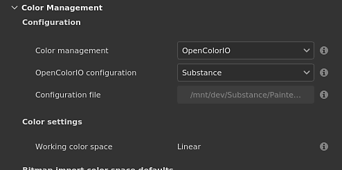
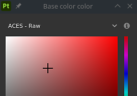
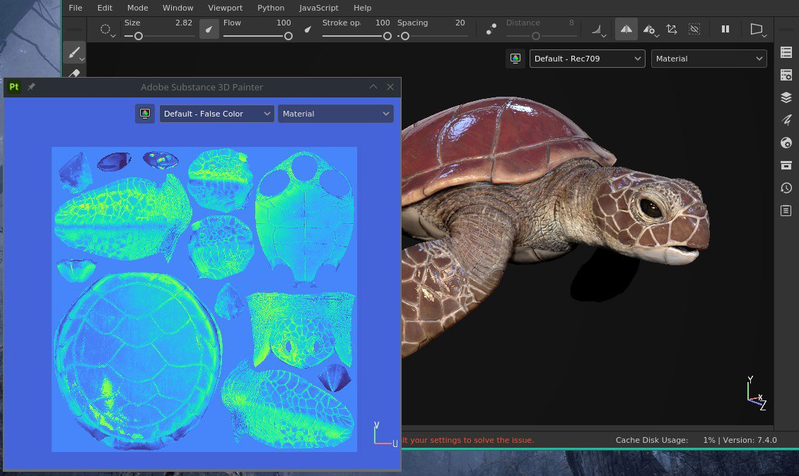
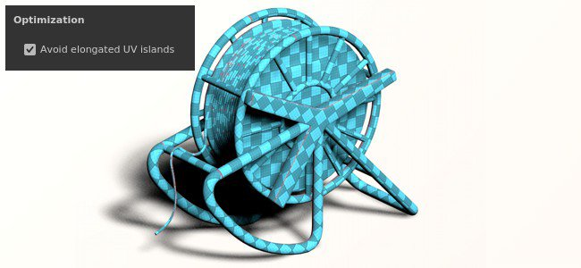

# Versão 7.4

O **Substance 3D Painter 7.4** adiciona suporte para o OpenColorIO com a introdução do novo fluxo de trabalho de Gerenciamento de Cores.

Data de lançamento: *24 de novembro de 2021*

## Principais recursos

### Novo gerenciamento de cores

Esta versão apresenta o gerenciamento de cores com o suporte do [OpenColorIO](https://opencolorio.org/) (OCIO para versão curta) versão 2.

Esse novo fluxo de trabalho permite gerenciar e calibrar cores da importação à exportação e dentro da viewport também, permitindo corresponder mais facilmente qualquer conteúdo entre diferentes aplicativos.

* **Configurações do projeto**\
  Ao criar um novo projeto, agora é possível ativar o gerenciamento de cores. O projeto existente também pode ativar o gerenciamento de cores por meio das configurações do projeto.\
  Para habilitar o gerenciamento de cores, alterne de **Legado** (padrão) para **OpenColorIO** e use uma das configurações padrão ou uma personalizada.

  {width="400px"}

* **Configurações de exibição do visor**\
  Na parte superior das visualizações 2D e 3D estão dois controles para gerenciamento de cores:\
  **Botão de cores**: habilite ou desabilite a transformação de cores do visor.\
  **Menu suspenso de transformação de exibição**: selecione qual transformação de exibição usar para converter as cores.

  {width="500px"}

* **Configurações do seletor de cores**\
  Quando o gerenciamento de cores está ativado, os seletores de cores oferecem novos controles. As cores são editadas no espaço de cores de trabalho especificado pela configuração.\
  Abaixo dos controles deslizantes HSV/RGB é exibido o valor da cor final, transformado do espaço de trabalho para o espaço da cor de exibição.

  

  

* **Importar bitmaps e materiais de Substance com espaço de cores personalizado**\
  Configurações dedicadas estão disponíveis para especificar como os recursos devem ser tratados, incluindo como a saída de materiais Substance deve ser interpretada.\
  Também é possível saber qual espaço de cor um recurso está usando analisando seu nome de arquivo.

  

* **Configurações de exportação**\
  Ao exportar texturas, os canais gerenciados por cores exibirão em seus nomes de arquivo o nome do espaço de cores usado com a ajuda da nova palavra-chave **$colorSpace**.

  {width="250px"}

  

>[!NOTE]
>
> Para saber mais sobre como o gerenciamento de cores funciona dentro do aplicativo, consulte a [página dedicada](../../features/color-management/color-management.md).

### Nova desencaixe de viewport 2D e 3D

A exibição 2D e 3D agora pode ser desencaixada para ser movida para outro lugar. Por exemplo, ter a visualização 3D em uma tela principal enquanto a visualização 2D está em outra tela.

Trabalhar com uma exibição desencaixada é mais fácil de organizar o layout do aplicativo e ficar de olho nas coisas sem perder muita área de pintura.

* **Desencaixar uma exibição**\
  Para desencaixar uma vista, basta abrir o menu de visualização e escolher uma das duas opções. Cada opção abre uma nova janela com a sua visualização dentro, enquanto a outra visualização permanece encaixada dentro da interface principal.

  

* **Trocar par por uma exibição desencaixada**\
  Quando uma exibição está desencaixada, a ação de troca no menu Exibir pode ser usada para trocá-la.

  {width="500px"}

* **Compatível com o gerenciamento de cores**\
  A visualização desencaixada tem sua própria transformação de exibição de gerenciamento de cores, facilitando o gerenciamento em diferentes monitores.

  {width="500px"}

### Novo suporte para SpaceMouse® por 3Dconnection

O **SpaceMouse®** é um dispositivo por conexão 3D que permite manipular a câmera do visor 3D de uma maneira mais intuitiva e amigável. Agora, ele é compatível de forma nativa e direta com o Painter.

Para obter mais informações, consulte a [página de documentação](../../features/spacemouse-by-3dconnexion.md) dedicada.

>[!NOTE]
>
> * Disponível com a versão 7.4.2 e posterior.
> * Instale os drivers SpaceMouse® mais recentes para se beneficiar do esquema de controle da Painter.

### Novo conteúdo

Um novo conjunto de ativos foi adicionado ao conteúdo padrão disponível com o aplicativo:

* Novos decalques, predefinições de ferramenta e filtro (por **Käy Vriend**):
  * **Decalques**
    * Cicatriz simples e reta
    * Correção de Bolso Normal
  * **Predefinições**
    * Fita avançada com zíper
    * Interrupção avançada do zíper
    * Controle deslizante avançado do zíper
    * Renda de cabo de aperto
    * Ilhó do cabo de aperto
    * Brilho estrelas dourado
    * Festa de Brilho
    * Pontos Brilhantes Pastel
  * **Gerador**
    * Inflar Redução/Quebra automática

* Novos bitmaps de desgaste (de **Emiel Sleegers**):
  * Tinta de gesso de desgaste
  * Gesso de desgaste desbotado
  * Pintura de desgaste Descascada
  * Umidade do desgaste
  * Desgaste Fluff
  * Desgaste Cobweb
  * Desgaste Bush
  * Madeira de desgaste macia
  * Papel de desgaste rasgado
  * Desgaste rachado profundo
  * Dust escovado para desgaste

### Desencapsulamento UV automático aprimorado

O desencapsulamento automático de UV foi atualizado com uma nova opção que melhora o suporte de modelos 3D com superfícies estendidas.

Esta nova configuração chamada **Evitar Ilhas UV alongadas** aproveite melhor o espaço UV dividindo Ilhas UV que podem ser muito longas.

Veja a seguir um exemplo dessas novas configurações sem usá-las em vez de usá-las:

{width="500px"}

### Script Python aprimorado

A API Python tem um novo método que permite chamar a API Javascript.

Esse novo método facilita a migração de plug-ins antigos para a nova API Python. Também desbloqueia alguns recursos, como o gerenciamento de **Preparação** e **Sombreador**, que ainda não foram expostos no Python.

Para executar um comando Javascript em Python, use a função **evaluation()** do novo submódulo **js**. Mais informações podem ser encontradas na documentação da API (disponível no menu Ajuda do aplicativo).

## Notas de versão

### 7.4.2

*(Lançado Em 08 De março De 2022)*

**Adicionado:**

* [SpaceMouse][Windows] Suporte ao SpaceMouse 3Dconnection na Janela de Visualização 3D para navegação
* [SpaceMouse][Windows] Atalhos/teclas básicos para modelos Pro e Enterprise SpaceMouse no visor 3D
* [SpaceMouse][Windows] Ícone do centro de rotação dedicado no visor 3D
* [Gerenciamento de cores] Use funções da configuração OCIO para alterar as configurações padrão
* [Gerenciamento de cores] Gerenciamento de cores na janela de propriedades dos widgets de cores
* [Gerenciamento de cores] Gerenciamento de cores na janela de propriedades para visualização de material
* [Gerenciamento de cores] Amostras de gerenciamento de cores no seletor de cores
* [Gerenciamento de cores] Adicionar uma configuração para definir o espaço de cores sRGB padrão
* [Gerenciamento de cores] Adicionar o espaço de cores sRGB padrão da configuração OCIO no seletor de cores Lista de seletores de exibição
* [Gerenciamento de cores] Melhorias para o menu de substituição do espaço de cores
* [Gerenciamento de cores] Permitir substituição do espaço de cores do mapa de ambiente nas Configurações de exibição
* [Gerenciamento de cores] Desenhar gradientes do seletor de cores com base na exibição atual
* [Gerenciamento de cores] Valores HDR do suporte por padrão no editor de cores
* [Gerenciamento de cores] Usar passagem (sem espaço de cores) para filtros no modo Legado
* [Gerenciamento de cores] Limitar a exibição de gradientes no editor de cores para corresponder ao intervalo [0-1]
* [Gerenciamento de cores] Ocultar seletor de exibição no seletor de cores no modo Legado
* [Gerenciamento de cores] Tornar o seletor de cores hexadecimal sempre no espaço de cores sRGB
* [Gerenciamento de cores] Desativar menu suspenso Exibição do seletor de cores para canais de dados
* [Otimização] A grade de distorção recalcula apenas blocos UV cobertos
* [Exportar] Permitir a exportação de projetos de Bloco UV para Sketchfab, USD e glTF
* [Scripting][Python] Permitir a alteração da função de mapeamento de tom

**Corrigido:**

* [Sketchfab] A atualização do modelo existente acaba criando um novo modelo
* [Sketchfab] Falha ao procurar modelo atualizado anteriormente
* Falha ao exportar para USD
* Falha ao criar uma nova ocorrência de sombreador na Máscara de geometria ou quando a geometria está oculta
* [Janela Importar ativo] Falha ao alterar o tipo de recursos importados
* Os mapas de malha normal são invertidos quando usados em uma pilha de camadas
* [Substance] O modo de mesclagem de dados do usuário não é levado em consideração
* [Gerenciamento de cores] Bitmaps com espaço de cor no nome do arquivo são importados como sequências de Bloco UV
* [Gerenciamento de cores] As saídas gerenciadas por cores do gráfico de Substance estão no espaço de cores incorreto
* [Gerenciamento de cores] A ferramenta Preenchimento de polígono exibe a cor errada
* [Gerenciamento de cores] O mapeador de tons ACES é aplicado a canais no modo solo
* [Gerenciamento de cores] A visualização da ferramenta de iluminação da esfera não é gerenciada por cores
* [Gerenciamento de cores][Exportar] Mapas convertidos aplicam uma conversão incorreta
* [Scripting][Python][Color Management] Os projetos criados com o modelo e a variável de ambiente OCIO estão no modo Legado
* [Scripting][Python] Não é possível usar a função de avaliação JavaScript na inicialização
* [Oferta de Adobe 3D] Não é possível iniciar o Painter ao usar configurações regionais com idiomas não compatíveis por padrão

**Problemas Conhecidos:**

* Espaço de conexão 3Dsem suporte para mouse no MacOS
* [UI] Barra de rolagem horizontal com gerenciamento de cores exibida em alguns casos em uma nova janela do projeto
* [Bakers] A configuração “Average normals” não tem efeito em projetos de blocos UV
* [Mac M1] Os materiais inteligentes não são exibidos corretamente
* [Gerenciamento de cores] Os recursos usados no modo de projeção não são gerenciados por cores na sobreposição

### 7.4.1

*(Lançado Em 14 De dezembro De 2021)*

**Adicionado:**

* [Gerenciamento de cores] Usar função de dados em nomes de arquivos exportados
* [Gerenciamento de cores] Expanda a seção Gerenciamento de cores, por padrão, quando o OCIO for selecionado nas novas janelas de configurações do projeto e do projeto
* [Gerenciamento de cores] Adicionar o mapeador de tons ACES no modo herdado
* [Gerenciamento de cores] Ajuste as configurações padrão
* [Gerenciamento de cores][Exportar] Preencher $colorSpace nos nomes de arquivos para canais de dados
* [Exportar] Exportar projeto de Bloco UV para o Stager
* [Interoperabilidade] Não disponível para as edições Steam e Substance
* [Interoperabilidade] Permitir o envio de um projeto de Bloco UV para o Stager

**Corrigido:**

* [MacOS][Falha] O Painter não começa com o Catalina
* [Gerenciamento de cores][Falha] Falha aleatória ao reproduzir o tipo de dados/gerenciamento de cores no canal do usuário
* [Gerenciamento de cores] Recursos usados como tons de cinza no novo menu Espaço de cores de exibição de máscara
* [Gerenciamento de cores] O canal do usuário é mais escuro na viewport no modo legado + visualização individual
* [Gerenciamento de cores] O mapa de ambiente é sempre linear quando usado no iRay
* [Gerenciamento de cores] O seletor de cores não seleciona o valor correto para o canal de dados no modo herdado
* [Gerenciamento de cores] O seletor de cores está quebrado dentro de um Substance no modo herdado
* [Gerenciamento de cores] Alternar entre exibições de canal solo na viewport não é exibido com o espaço de cor certo ao usar o menu suspenso
* [Gerenciamento de cores] Exportar aplica a conversão incorreta em canais de usuário com gerenciamento de cores no modo herdado
* Os traçados feitos na máscara de exibição individual não são exibidos ao voltar para a exibição de material
* [Exportar] Mapas convertidos não são exportados como canais com gerenciamento de cores
* [Texture Set] A dica de ferramenta com o nome original está ausente em canais de usuário renomeados
* [Steam] Arquivos ausentes ao verificar a integridade do arquivo com o Steam

**Problemas Conhecidos:**

* [Mac M1] Os materiais inteligentes não são exibidos corretamente

### 7.4.0

*(Lançado Em 24 De novembro De 2021)*

**Adicionado:**

* [Gerenciamento de cores] Suporte ao gerenciamento de cores OpenColorIO versão 2
* [Gerenciamento de cores] Adicionar configurações de gerenciamento de cores às configurações do projeto
* [Gerenciamento de cores] Janela de aviso sobre as alterações de configuração do Gerenciamento de cores ao abrir um projeto
* [Gerenciamento de cores] Exibe uma mensagem de erro se um arquivo de configuração OCIO inválido for selecionado
* [Gerenciamento de cores] Permite substituir a configuração pela variável de ambiente OCIO
* [Gerenciamento de cores] Várias configurações OCIO integradas por padrão ao aplicativo
* [Gerenciamento de cores] Extrair o nome do espaço de cores do nome de arquivo bitmap importado
* [Gerenciamento de cores] Permite substituir o espaço de cores por um espaço de cores da configuração na janela Propriedades
* [Gerenciamento de cores] Adicione opções de gerenciamento de cores nas Configurações do conjunto de texturas
* [Gerenciamento de cores][Janela de visualização] Permita o gerenciamento de cores de exibições 2D e 3D separadamente
* [Gerenciamento de cores] Carregue e converta o mapa de ambiente para o espaço de cores de trabalho
* [Gerenciamento de cores] Ajustar o seletor e editor de cores com o espaço de cores atual
* [Gerenciamento de cores] Permite selecionar o espaço da cor de transformação de vídeo no visor com um novo menu suspenso
* [Gerenciamento de cores] Aplicar transformação de exibição com resultados de renderização de matriz
* [Gerenciamento de cores] Exportar texturas com espaços de cores diferentes
* [Gerenciamento de cores][Python] Aplicar configurações de gerenciamento de cores da variável de ambiente (OCIO) aos novos projetos
* [Visor] Permite desencaixar o visor 2D ou 3D
* [Desempacotamento automático] Nova opção para evitar ilhas alongadas
* [Scripting Python] Chamar funções JavaScript da API Python
* [Janela Novo projeto] Tornar a seção de mapas importados flexível
* [Projeção][Distorcer] Permite ocultar normais como uma opção nas configurações de Distorção
* [Conteúdo] 11 novos mapas de desgaste
* [Conteúdo] 8 novas predefinições de ferramenta (zíper, cabo de aperto, brilho)
* [Conteúdo] 8 novos materiais (cicatriz, bolso, ...)
* [Conteúdo] 1 novo gerador (inflar deformação)

**Problemas Conhecidos:**

* [Mac M1] Os materiais inteligentes não são exibidos corretamente
* [Gerenciamento de cores][Falha] Falha aleatória ao reproduzir o tipo de dados/gerenciamento de cores no canal do usuário
* [Gerenciamento de cores] O seletor de cores não seleciona o valor correto para o canal de dados no modo herdado
* [Gerenciamento de cores][Iray] Salvar a renderização em EXR ou TIFF enquanto o Gerenciamento de cores está ativado na janela de visualização sempre será salvo em linear
* [Gerenciamento de cores] Os recursos usados como tons de cinza na máscara exibem o menu Espaço de cores errado
* [Color Management][Iray] O mapa de ambiente é sempre linear quando usado em Iray
* [Gerenciamento de cores][Exportar] Os mapas convertidos não são exportados como canais gerenciados por cores
* [Gerenciamento de cores][Exportar] A exportação ignora se o canal do usuário é gerenciado por cores ou não com o modo legado
