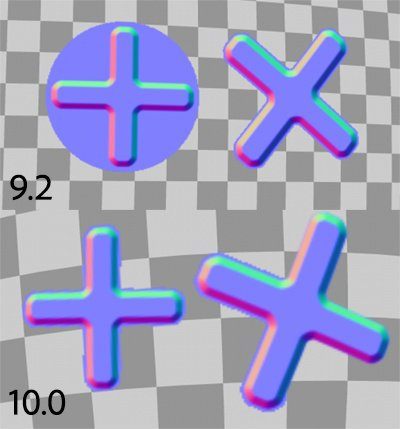
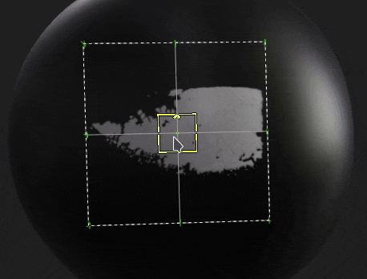

# Versão 10.0

O <b>Substance 3D Painter 10.0</b> oferece compatibilidade com arquivos Illustrator (.ai), integra Substance 3D Assets, importa Fontes por meio de recursos de Texto, adiciona funcionalidades de pilha de camadas na API Python e diversas melhorias na qualidade de vida.

Data de lançamento: *16 de maio de 2024*

## Principais recursos

### Novo recurso de texto

Esta nova versão apresenta o <b>Recurso de texto</b>, que é uma maneira de carregar arquivos de fonte para gravar texto em diferentes contextos (pincel, projeção de preenchimento, entradas de imagem de Substance etc.) para embelezar suas texturas.

* <b>Procure suas fontes na janela Ativos</b>\
  As fontes agora são listadas na janela Ativos com seu próprio filtro. Eles são coletados de diferentes locais no sistema operacional (e também das Bibliotecas).

  
* <b>Arraste e solte fontes como qualquer outro recurso</b>\
  As fontes podem ser usadas como recursos de texto como qualquer outro tipo de recurso. Arraste e solte-os para criar automaticamente uma projeção de preenchimento. Eles também podem ser usados em pincéis ou como entrada em filtros de Substance.

  
* <b>Parâmetros do recurso de texto</b>\
  Ao criar um recurso de texto, você pode ajustar alguns parâmetros para ajustar a aparência do texto: alinhamento vertical e horizontal, tamanho automático ou manual, espaçamento de caracteres e linhas, cor etc.

  
* <b>Há suporte para a ampla variedade de caracteres e recursos</b>\
  O recurso Texto oferece suporte para escrita da direita para a esquerda, bem como para [ligaduras](https://en.wikipedia.org/wiki/Ligature_(writing)). (Para escrever caracteres não latinos, é necessária uma fonte compatível.)

  
* <b>Importar fontes personalizadas como recurso regular</b>\
  Você pode importar seus próprios arquivos de fontes diretamente para a sua biblioteca ou projeto como qualquer outro recurso. No entanto, não há suporte para alguns tipos de fontes. Para obter mais informações, consulte esta [página de documentação](../technical-support/workflow-issues/shelf-issues/font-import.md).

>[!NOTE]
>
> Para obter mais informações sobre o <b>recurso de texto</b>, consulte a [página de documentação dedicada](../painting/text-resource.md).

### Nova importação de arquivos do Illustrator (.Ai)

Após o suporte para arquivos <b>.svg</b>, esta nova versão também adiciona a capacidade de importar arquivos Illustrator (<b>.ai</b>).

* <b>Suporte ao arquivo do Illustrator (.Ai)</b>\
  Nessa nova versão, os arquivos .ai agora podem ser importados e renderizados no Painter para serem usados como recurso em pincéis, projeções de preenchimento ou como entradas de imagem Substance.
* <b>.svg e arquivos .ai compartilham configurações comuns</b>\
  Os documentos SVG e Illustrator compartilham configurações semelhantes, notavelmente os parâmetros de resolução, área de corte e seleção de escopo. Isso significa que o recurso vetorial pode ser gerenciado de maneira semelhante.

  
* <b>Seleção da prancheta</b>\
  Os documentos do Illustrator são compatíveis com pranchetas. Ao usar um arquivo .ai, você também pode escolher entre diferentes pranchetas disponíveis por meio da configuração dedicada.

  
* <b>Seleção de escopo aprimorada</b>\
  A janela de seleção de escopo foi aprimorada com o suporte de miniaturas, facilitando a navegação e a seleção apenas de elementos específicos.\
  Por motivos de desempenho, as miniaturas estão desativadas por padrão e podem ser habilitadas com a caixa de seleção <b>Mostrar miniaturas</b>.

  

>[!NOTE]
>
> No momento, só há suporte à importação de arquivos do Illustrator (<b>.ai</b>) no Windows e no MacOS.

### Nova integração do Substance 3D Assets

Uma nova janela está disponível para incorporar o site do Substance 3D Assets diretamente no Painter. Essa integração facilita a navegação e o download de recursos diretamente na sua própria biblioteca.

* <b>Nova janela do Substance 3D Assets</b>\
  Um novo encaixe está disponível na interface para procurar no Substance 3D Assets. Se o encaixe não estiver visível e fechado, ele poderá ser encontrado novamente na barra de ferramentas do encaixe à direita da interface.

  
* <b>Gerenciador de downloads</b>\
  Você pode ver os ativos que estão sendo baixados no momento por meio do gerenciador dedicado usando o botão inferior esquerdo da janela. Os ativos cujo download pode falhar podem ser iniciados novamente nesta lista.

  
* <b>Encontre facilmente os ativos baixados</b>\
  O botão na parte inferior direita da janela abre um menu com algumas ações para ajudar a navegar no site, mas também para mostrar onde os ativos foram baixados.

  

>[!NOTE]
>
> Ao fazer o login na sua conta pela primeira vez, será necessário fazer o download dos ativos. Esse login será então armazenado em cache para uso futuro.

>[!NOTE]
>
> A Substance 3D Assets não está disponível na versão Steam.

### Novo módulo de pilha de camadas na API Python

Esta versão apresenta a adição do novo módulo de pilha de camadas em nossa API Python. Esta API permite controlar a pilha de camadas de um projeto, abrindo a porta para a criação de plug-ins avançados de pilha de camadas e ferramentas personalizadas.

* <b>Nova API de pilha de camadas</b>\
  O novo módulo <b>layerstack</b> permite controlar a pilha de camadas de um projeto de várias maneiras. Você pode:

  * Consulte e defina a seleção de camadas e efeitos.
  * Crie camadas, pastas e efeitos (incluindo filtros, pontos de ancoragem etc.).
  * Criar instâncias de camadas.
  * Obtenha e defina parâmetros de camadas e efeitos, carregue recursos nelas.
  * Obter e definir parâmetros de Substance.
* <b>Modificações no escopo e pausa do mecanismo</b>\
  Manipular a pilha de camadas pode levar a longos cálculos. É por isso que também expomos a possibilidade de pausar e despausar o mecanismo da API (como na interface do usuário). Também possibilitamos agrupar modificações, por ambos os motivos de desempenho, mas também para desfazer uma única vez várias operações.
* <b>Gerenciamento básico de cores</b>\
  Com a exposição da pilha de camadas, precisávamos introduzir a noção de gerenciamento de cores em nossa API. Um novo módulo <b>colormanagement</b> foi adicionado para criar, ajustar cores e escolher o espaço de cores de bitmaps. (Esta parte da API ainda não está completa e será expandida em versões futuras.)
* <b>Consultar informações de predefinição de exportação</b>\
  As predefinições de exportação agora são expostas em nossa API, permitindo consultar a lista de predefinições (predefinidas e personalizadas). Seu conteúdo também pode ser recuperado em um formato semelhante ao da nossa API de texturas de exportação existente.
* <b>Novas possibilidades à frente!\
  </b> Esta nova parte da API permite fazer muitas coisas novas, como salvar e restaurar uma seleção de camadas ou alterar a propagação aleatória de todos os recursos em um projeto, por exemplo:

  

>[!NOTE]
>
> Para obter mais informações sobre a API, consulte a documentação incluída com o aplicativo (por meio de <b>Ajuda > Documentação de scripts > API Python</b>), que inclui muitos snippets de código para começar facilmente.

>[!NOTE]
>
> Exemplos de plug-ins de pilha de camadas também podem ser encontrados em nossa [documentação online](https://adobedocs.github.io/painter-python-api/).

### Aprimoramento da pintura de mapa normal

Nesta versão, retrabalhamos o fluxo de trabalho normal de pintura de mapa. Mudamos notavelmente a maneira como acumulamos e misturamos os carimbos de pincel normais. Essas alterações foram feitas para abordar questões relacionadas aos mapas de fluxo de pintura.

* <b>Problema de acumulação corrigido</b>\
  Pintar sobre e sobre uma área no canal normal não irá mais saturar ou prender e criar furos ou artefatos. Alternar o canal normal para RGB32F também não é mais necessário.

  
* <b>Desfazer traçados pintados de quebra corrigidos</b>\
  Desfazer um traçado de pincel não quebra mais os outros traçados já pintados.

  
* <b>Transparência em alfa zero</b>\
  Carimbos de pincel feitos com uma textura com um alfa em zero agora serão desenhados como transparentes. O exemplo abaixo mostra uma carimbo de pincel (à esquerda) em comparação a uma projeção planar (à direita).

  

>[!NOTE]
>
> Para obter mais informações sobre o mapa de fluxo de pintura, consulte a [página de documentação](../painting/advanced-channel-painting/flow-map-painting.md).

### Manipuladores de transformação aprimorados

Várias melhorias foram feitas para aprimorar o uso dos manipuladores de transformação.

* <b>Modo de precisão com CTRL</b>\
  Pressionar o controle enquanto arrasta em um manipulador agora entrará em um novo modo de precisão que permite operações mais meticulosas. Essa alteração se aplica aos manipuladores de conversão, rotação e escala.\
  Veja um exemplo antes e depois de pressionar CTRL ao arrastar:

  
* <b>Novo comportamento de escala</b>\
  A intensidade da escala agora se baseia no próprio valor de escala atual e não no tamanho da cena. Isso torna as alterações relativas mais fáceis de serem feitas, especialmente em valores pequenos. Combinado com o modo preciso, torna o dimensionamento muito mais agradável.\
  Outra alteração está sendo reduzida até que 0 não vá mais para valores negativos. Isso evita a questão de querer reduzir uma projeção e virar por acidente.

  
* <b>Rotação do manipulador de superfície aprimorada</b>\
  O manipulador de decalque de superfície agora é muito mais estável ao arrastar ao redor de uma superfície. Ele não aumenta sua rotação quando apenas faz traduções para frente e para trás.\
  Aqui está o comportamento <b>antigo</b> comparado ao <b>novo</b>:

  

  
* <b>Projeção alinhada à câmera ao arrastar e soltar</b>\
  Arrastar e soltar um recurso na viewport permite criar uma projeção de distorção diretamente na superfície da malha. Essa projeção foi girada incorretamente anteriormente. Agora está alinhada à câmera.

  

Foram acrescentadas algumas outras melhorias, nomeadamente:

* <b>Tile Generator atualizado</b>\
  O parâmetro de modo de mesclagem <b>Tile Generator</b> agora pode ser alterado e modificará o resultado conforme esperado. O recurso também foi atualizado para a versão mais recente disponível no <b>Substance 3D Designer</b>.
* <b>Problemas de faixas/qualidade corrigidos em alguns filtros</b>\
  Vários filtros foram presos na precisão de 8 bits em vez de 16 bits, levando a bandas/artefatos ao usá-los (como a digitalização do histograma ou desfoque direcional). Esse problema já foi corrigido.
* <b>Espaço de cores na saída SBSAR</b>\
  Quando o fluxo de trabalho de gerenciamento de cores Legado ou OCIO estiver ativado, a exportação SBSAR agora fará referência aos nomes dos espaços de cores usados no projeto nas respectivas saídas.
* <b>Descoberta mais rápida de recursos</b>\
  Com a introdução do <b>recurso de texto</b>, adicionamos um novo cache para tornar o rastreamento de recursos no disco mais rápido na próxima inicialização. Isso é bastante notável quando os recursos são instalados em um HD ou quando uma biblioteca tem gigabytes de recursos. Este novo cache pode ser desabilitado com uma linha de comando. Consulte a [página de documentação](../pipeline-and-integration/configuration/command-lines.md) dedicada para obter mais informações.

Muito obrigado ao site [é este árabe?](https://isthisarabic.com/) o que foi de grande ajuda durante o desenvolvimento desta versão.

Referência a ilustrações usadas nas mídias acima:

* [Homem com camisa preta](https://unsplash.com/photos/man-wearing-black-shirt-aoEwuEH7YAs) de Lucas Gouvêa
* [Rosa e verde](https://unsplash.com/photos/pink-and-green-abstract-art-ruJm3dBXCqw) de Pawel Czerwinski
* [Desenhar ilustrações](https://undraw.co/illustrations)
* Claude Monet

## Tutorials

## Notas de versão

### 10.0.0

Data de lançamento: <b>5/2024/16</b>\
Resumo: <b>Versão principal, edição da pilha de camadas com a API Python, leitura de arquivos nativos do Illustrator, integração de ativos 3D e novo recurso de texto</b>

<b>Adicionado</b>:

* [Illustrator] Usar arquivos do Illustrator com painéis de arte no Painter
* [Illustrator][SVG] Adicionar visualizações na seleção de escopo
* [Substance 3D Assets] Procure, selecione e baixe ativos 3D diretamente no Painter
* [Substance 3D Assets][IU] Novo painel
* [Substance 3D Assets] Mapas e materiais do ambiente de suporte
* [Substance 3D Assets] Permitir recarregamento e navegar e abrir a pasta de local em novo painel do Substance 3D Assets
* [Substance 3D Assets] Adição de um gerenciador de downloads
* [Recurso de texto] Permitir o uso de fontes incorporáveis
* [Recurso de texto] Permite renderizar uma fonte/texto em uma malha
* [Recurso de texto] Exibir fontes do usuário e outros caminhos compartilhados no painel Ativos com uma nova categoria
* [Recurso de texto][Propriedades] Adicionar suporte para propriedades avançadas de fonte
* [Recurso de texto] Permitir pesquisar/exibir fontes em miniprateleiras
* [Recurso de texto] Adicionar mensagem/caixa de diálogo de erro ao importar uma fonte incompatível
* Diversos
* [Preencher projeção] Melhorar o comportamento do manipulador de escala ao usar valores pequenos
* [Manipuladores] Adicionar novo modo preciso ao pressionar o atalho CTRL
* [Manipuladores] Melhoram a estabilidade do manipulador de superfície ao traduzir
* [Exportar] Adicionar o nome do espaço de cores nas saídas SBSAR
* [Desempenho] Melhorar o tempo de descoberta da biblioteca de ativos em disco
* [Substance] Atualização do mecanismo de Substance versão 9.1.2
* [Arrastar e soltar] Alinhar a rotação do decalque na câmera ao soltar no visor
* [Python] Edição da pilha de camadas
* [Python] Permitir selecionar camada, efeito, máscara, máscara geográfica na interface do usuário
* [Python] Permitir modos de mesclagem de camada get/set
* [Python] Permitir obter/definir configurações de projeção da camada de preenchimento
* [Python] Permitir consultar a cor do material de Substance de uma camada de preenchimento
* [Python] Permitir consultar e definir cores e recursos uniformes em camadas e efeitos
* [Python] Permitir a criação e edição de recursos de texto na pilha de camadas
* [Python] Permitir a edição de canais ativos em camadas e efeitos
* [Python] Permitir que ações em lote tenham uma única operação de desfazer/refazer
* [Python] Permitir carregar/editar parâmetros de origem vetorial
* [Python] Permitir a edição de propriedades de cores de camadas e efeitos com o gerenciamento de cores
* [Python] Permitir consultar e criar camadas instanciadas
* [Python] Permitir a adição do efeito de seleção de cor
* [Python] Permitir o controle do gerenciamento de cores de imagens de bitmap
* [Python] Permitir pausa/cancelamento de pausa no mecanismo
* [Python] Permitir a navegação para nós irmãos e pai
* [Python] Permitir a criação do efeito filtro/gerador
* [Python] Permitir a adição de efeito de nível
* [Python] Permitir a adição de máscara inteligente em uma camada
* [Python] Permitir a criação/edição de pontos de ancoragem
* [Python] Permitir obter/definir máscara em camadas
* [Python] Permitir a criação do efeito de máscara de comparação
* [Python] Permitir consultar e usar predefinições de recursos Substance
* [Python] Permitir listar predefinições e seus valores por meio da função internal\_properties para recursos Substance
* [Python] Permitir listar predefinições de exportação predefinidas
* [Python] Permitir listar predefinições de exportação disponíveis na biblioteca
* [Python] Permite recuperar o conteúdo das predefinições de exportação

<b>Corrigido</b>:

* [Falha] Desfazer “Remover instância do sombreador” com Ctrl-Z
* [Falha] Criar uma camada em uma pilha vazia se a última seleção tiver sido um efeito
* [SVG] Problema com o valor personalizado da área cortada
* [Desembaçamento automático] Recomputar apenas a embalagem sem qualquer alteração na orientação UV resulta em falha
* [Arrastar e soltar] Atraso devido a recursos externos pré-carregados várias vezes
* [UI] Arrastar e soltar a miniatura de recurso pode ocultar a mensagem de aviso na pilha de camadas
* [Desempenho] Os blocos UV mascarados ainda são computados
* [USD] Destaque incorreto para seleção de escopo
* [Recurso] A imagem de bitmap é corrompida após pintar no canal normal e salvar o projeto
* [USD] Suporte a ordenação de malha de vértice com a mão esquerda
* [Substance] Redefinir para o padrão sempre voltar a zero para o widget de ângulo
* [Engine] Pintar com um SVG em um estêncil não funciona
* [Engine] Os traçados de pincel de mapa normais se quebram após uma ação de desfazer
* [Conteúdo] O filtro Gráfico para material tem mesclagem alfa e espaço de cores incorretos
* [Conteúdo] Os modos de mesclagem no Tile Generator não estão funcionando
* [Conteúdo] O filtro de exame de histograma produz faixas em alguns casos
* [Conteúdo] Iluminação cozida estilizada não leva em conta height pintado
* [Python] Erro inesperado ao recuperar informações de camada instanciadas após alteração do sombreador

<b>Problemas Conhecidos</b>:

* [Gerenciamento de cores] As conversões do espaço de cores HDR com ACE no Linux produzem cores vivas
* [Crash][Linux][AMD] Arrastar e soltar recursos na pilha de camadas no sistema operacional Wayland
* [Regression][UI] O menu do clique com o botão direito é muito pequeno em telas HD
* [Crash][Python] Exportação de USD acionada por TextureStateEvent
* [Salvar] O arquivo de projeto Spp é perdido quando “salvar como” falha
* [MacOS Intel] Falha ao importar algumas predefinições
* [Illustrator] Não é possível importar arquivos Ai após o travamento do servidor sem reiniciar o Painter
* [Import] Ativos com o mesmo nome, mas extensões diferentes, são substituídos
