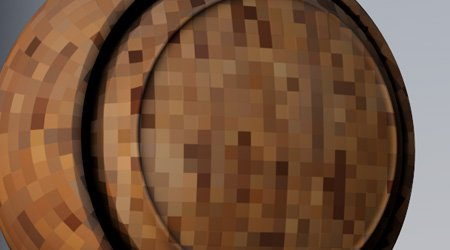
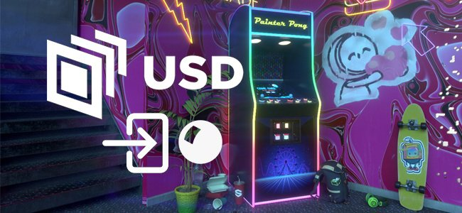

# Versão 10.1

O <b>Substance 3D Painter 10.1</b> adiciona novos filtros avançados, funcionalidades aprimoradas de USD e suporte atualizado para VFX Platform e Linux.

Data de lançamento: *17 de setembro de 2024*

>[!NOTE]
>
> Esta versão do Painter agora usa a versão 6 do Qt, que afeta o suporte de plug-ins Python e JavaScript. Veja abaixo para obter mais detalhes.

## Principais recursos

### Novos filtros padrão

Nesta versão, vários novos filtros foram adicionados para expandir significativamente o processo de texturização:

* <b>Novo material de decalque de bordado</b>\
  Dentro da seção Materiais da janela Ativos você pode encontrar um novo material de decalque para bordados. Arraste-o e solte-o em qualquer lugar sobre sua malha, conecte qualquer recurso (como uma textura ou até mesmo uma fonte) e você poderá criar facilmente novos detalhes de malha.

  
* <b>Novo filtro de cor/máscara da área de preenchimento</b>\
  Esses dois novos filtros permitem preencher quaisquer caminhos ou contornos fechados. Isso é útil, por exemplo, para preencher rapidamente caminhos 3D. Por serem filtros, eles também podem ser usados para traçados manuais ou em outras situações.

  
* <b>Novo filtro FXAA</b>\
  Esse novo filtro pode reduzir rapidamente o alias, especialmente em arestas sólidas que podem aparecer após um nível, por exemplo, ou em máscaras criadas com o efeito de seleção de cores.

  
* <b>Novo filtro highpass</b>\
  Com esse filtro genérico, é possível gerar uma textura em tons de cinza para usá-la em efeitos mais avançados (como suavização, desfoque ou detalhes de nitidez).

  
* <b>Novo filtro de pixelização</b>\
  O filtro de pixelização pode simular uma redução na resolução, o que pode ser útil para estilizar cores e padrões.

  
* <b>Novo filtro de posterização</b>\
  Esse filtro pode ser útil para reduzir o número de cores em uma imagem, o que pode ajudar a criar contrastes nas formas e criar efeitos estilizados.

  
* <b>Novo filtro de limite</b>\
  O filtro de limiar é uma maneira rápida de criar máscaras binárias em preto e branco nítidas a partir de uma entrada em tons de cinza.

  
* <b>Novo filtro de etapa suave</b>\
  O filtro de etapa suave é outra maneira de nivelar ou contrastar para refinar informações em tons de cinza. Esse filtro também aplica uma curva exponencial ao resultado, possibilitando a conversão de gradientes lineares em curvas suaves.

  
* <b>Filtros Espelho e Transformação Aprimorados</b>\
  O filtro de transformação foi atualizado para oferecer suporte a dimensionamento não uniforme, giro horizontal ou vertical e parâmetros mais simples de usar. O filtro espelhado também foi atualizado com parâmetros mais simples.

  
* <b>Ícones aprimorados</b>\
  Para tornar os filtros padrão mais visíveis e mais fáceis de localizar, seus ícones foram recriados. Os ícones coloridos de amarelo devem ser usados no conteúdo de uma camada, enquanto os ícones em tons de cinza são genéricos e podem ser usados tanto em camadas de conteúdo quanto em máscaras.

  
* <b>Pequenas correções em filtros</b>\
  Alguns outros filtros foram ajustados para corrigir alguns problemas:

  * O filtro de ajuste de height estava afetando o alfa de uma camada, dificultando o uso em alguns casos.
  * O filtro de desfoque não estava usando um espaço de cores linear no modo de gerenciamento de cores herdado, criando cores incorretas ao mesclar/misturar sua entrada.

### Atualização do suporte da plataforma USD e VFX

Nesta versão do Painter, muitos componentes de terceiros foram aprimorados e atualizados:

* <b>Exportar texturas com material padrão da Adobe em dólares americanos\
  </b>Ao exportar texturas do Painter para um arquivo do USD, agora você receberá as propriedades do material padrão da Adobe com elas. Isso torna esses arquivos USD prontos para serem usados em aplicativos que também oferecem suporte a essas propriedades.
* <b>Importar texturas de arquivos do USD</b>\
  Agora, importar um arquivo do USD também importará sua textura no projeto que ele cria, facilitando o deslocamento entre aplicativos. Se o arquivo USD usar o Material padrão da Adobe, isso também definirá as configurações do sombreador, fazendo com que o resultado na viewport corresponda ao outro aplicativo de origem.
* <b>Alterações De Gltf\
  </b>Após a atualização do USD, foram necessárias algumas alterações de comportamento para o formato GLTF para garantir a paridade. Ao importar um arquivo gltf, o Painter agora presumirá que o mapa normal estará no formato OpenGL.\
  Alguns arquivos gltf podem usar o formato DirectX. Portanto, uma nova configuração foi adicionada à janela do novo projeto para levá-la em consideração (observe que o formato normal também pode ser substituído pela pilha de camadas).

  
* <b>Dependências atualizadas</b>\
  Várias bibliotecas usadas pelo Painter foram atualizadas, notavelmente para corresponder à referência de plataforma VFX. Estas são as novas versões usadas no Painter 10.1:

  * Qt 6.5.6 (e PySide6 6.5.6)
  * Substance Engine 9.1.3
  * OpenEXR 3,2
  * Python 3.11
  * OCIO 2.3.2
  * OpenSubdiv 3.6.0
* <b>Suporte atualizado para Linux\
  </b>Esta nova versão do Painter agora oferece suporte ao Red Hat Enterprise Linux (RHEL) versão 8.6 como o mínimo, mas também deve ser compatível com a versão 9.x.

### Desempenho aprimorado

Algumas áreas do aplicativo receberam algumas melhorias de desempenho:

* <b>Melhoria no tempo de abertura de projetos\
  </b>O projeto que usou muitos traçados de pincel agora deve ser mais rápido de abrir no Painter. A economia de tempo destes projetos também deve ser ligeiramente melhorada.\
  Em alguns de nossos projetos de teste, observamos uma redução de 50s para apenas 6s de tempo de carregamento ao abrir um projeto. O consumo de memória ao abrir projetos antigos e convertê-los para a versão mais recente também foi aprimorado.
* <b>Desempenho de mosaico aprimorado\
  </b>Agora empregamos uma otimização automática quando o mosaico está habilitado nas configurações do Sombreador. Triângulo menores que um pixel na tela não serão mais tesselados, levando a menos triângulos a serem desenhados e, portanto, a tempos de renderização mais rápidos.\
  Essa alteração não produz diferenças visuais e não afeta o processo de exportação de malha.
* <b>Miniaturas simplificadas agora são o padrão</b>\
  Na versão 6.2, introduzimos as miniaturas simplificadas para projetos de blocos UV para melhorar o desempenho, mas os projetos regulares ainda poderiam usar a maneira antiga de calcular miniaturas de camadas. Esse comportamento foi controlado por meio de uma configuração do aplicativo.\
  Agora, essa configuração usa como padrão as miniaturas otimizadas para ajudar no desempenho de qualquer projeto. Ele pode ser revertido nas preferências principais, se desejado.

  

### Notas de migração do Painter 10.1

>[!NOTE]
>
> * Os plug-ins Python talvez precisem ser atualizados após a atualização para o Qt6. Consulte [esta página para obter mais detalhes](https://adobedocs.github.io/painter-python-api/guides/qt6-migration/).
> * <b>Os </b>plug-ins JavaScript agora foram movidos para uma subpasta dentro do diretório Documentos do Usuário. Os plug-ins existentes não aparecerão mais no aplicativo, pois precisam ser movidos manualmente para essa pasta.
> * No Steam/Ubuntu, uma biblioteca de sistema é necessária para fazer o Painter funcionar corretamente. Certifique-se de que o cursor libxcb esteja instalado antes de iniciar o aplicativo.

## Notas de versão

### 10.1.0

Data de lançamento: <b>09/2024/17</b>

Resumo: <b>Versão principal, conteúdo novo: máscara de área de preenchimento/filtro de cores, filtro de decalque de bordado e seis filtros de Substance genéricos, importação de USD com propriedades de material e sombreador, melhoria de desempenho, compatibilidade com a plataforma VFX 2024 e migração para Linux RedHat</b>

<b>Adicionado</b>:

* [Conteúdo] Adicionar novo filtro de máscara/cor da área de preenchimento
* [Conteúdo] Adicionar novo filtro de decalque de bordado
* [Conteúdo] Adicione 6 novos filtros de Substance genéricos (FXAA, pixelate, highpass, posterize, smoothstep, threshold)
* [USD] Exportar camada USD com um material ASM definido
* [USD] Importar USD com propriedades de material e sombreador
* [Desempenho] Ativar miniaturas otimizadas de pilha de camadas por padrão
* [Desempenho] Reduzir o tempo de abertura do arquivo de projeto e o consumo de memória (decodificação de dados)
* Compatível com a plataforma VFX 2024
* [VFX Platform 2024] Atualização para Python 3.11
* [VFX Platform 2024] Atualização para OpenEXR 3.2
* [VFX Platform 2024] [USD] Atualização do OpenSubdiv 3.6.0
* [VFX Platform 2024]&#x200B;[Gerenciamento de cores] Atualização para OCIO 2.3.2
* [Linux] Migração para o Linux RedHat
* [Linux] Atualize a versão mínima do driver Nvidia para 535.171.04
* [Importar] Adicionar uma opção para inverter o mapa normal ao importar uma malha GLTF
* [UI] Usar o valor padrão do sistema operacional para a distância de detecção de eventos de arrastar
* [Substance Engine] Adicionar função de faixa de chamada para remover os símbolos do executável
* [Tela inicial] Atualização para o novo formato de tela inicial
* Atualize o Substance Engine para a versão 9.1.3
* [Python] Mostrar link para exemplos no menu de documentação da pilha de camadas
* [JavaScript] Mover plug-ins Javascript para a subpasta javascript/plugins

<b>Corrigido</b>:

* [Illustrator] Falha ao exportar um bloco UV com gráfico .ai em casos específicos
* [Traçados dinâmicos]&#x200B;[Caminho] O aleatório por traçado não funciona em um caminho
* [UI]&#x200B;[Propriedades] O bloqueio é habilitado quando a divisão em blocos gráficos não é uniforme
* &#x200B;O arquivo TXT de depuração é criado ao clicar duas vezes no projeto do Painter
* [USD]&#x200B;[Export] Algumas texturas podem estar ausentes
* [ASM] O canal de dispersão de cores ignora metais
* [Conteúdo] O filtro de desfoque não funciona no espaço de cores “trabalho”
* [Conteúdo] O filtro Ajustar Height também modifica o alfa da camada

<b>Problemas Conhecidos</b>:

* [Gerenciamento de cores] As conversões do espaço de cores HDR com ACE no Linux produzem cores vivas
* [Win]&#x200B;[Crash] [ACE] Não usar espaço da cor sRGB ICE para transformação de exibição
* [Regression]&#x200B;[UI] O menu do botão direito do mouse é muito pequeno em telas HD
* [Crash]&#x200B;[Python] Exportação de USD acionada por TextureStateEvent
* [MacOS Intel] Falha ao importar algumas predefinições
* [Falha] Realocar recurso e salvar projeto
* [Engine] Pintar com a ferramenta Clonar em cores normais de deslocamento de canal incorretamente
* [Python] O widget fantasma aparece excluído pelo script ainda em funcionamento
* [RedHat] Problemas no seletor de cores
