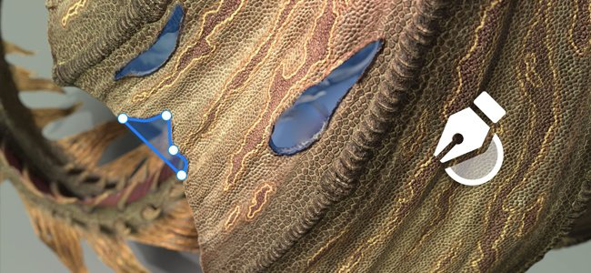
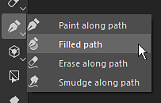
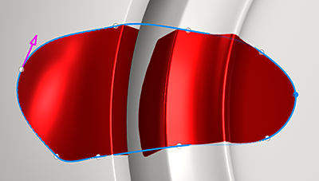
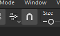

# Versão 11.0

O <b>Substance 3D Painter 11.0</b> adiciona um novo fluxo de trabalho de atualização automática de recursos, uma ferramenta de caminho preenchido, além de melhorias gerais para caminhos, um compartimento automático para assar e vários novos filtros para criar texturas estilizadas.

Data de lançamento: <b>11 de março de 2025</b>

>[!NOTE]
>
> Esta versão do Painter remove o suporte das configurações Mac Intel. Veja abaixo para obter mais detalhes.
> 
> Esta versão também aumenta a versão mínima suportada do Windows 10 para 22H2.
> 
> Para obter mais informações, confira nossa [página de requisitos do sistema](../getting-started/system-requirements.md).

## Principais recursos

### Nova atualização automática de recursos

Agora é possível manter bibliotecas e projetos atualizados com as versões mais recentes de seus recursos com o novo fluxo de trabalho de atualização automática. Com esse novo processo, a Painter pode monitorar recursos no disco para procurar alterações, recarregá-las automaticamente e substituí-las por suas bibliotecas e projetos.

* <b>Habilitando a Atualização Automática na janela Ativos</b>\
  Na parte inferior direita da janela Ativos agora há um botão e um menu disponíveis para configurar o sistema de atualização automática (o pequeno ícone de setas duplas). Habilite a opção <b>Painel de ativos</b> para monitorar bibliotecas e recarregá-las.

  
* <b>Atualizando recursos em projetos</b>\
  Recarregar um recurso não atualizará automaticamente a versão usada em um projeto por meio da pilha de camadas, configurações de exibição, configurações de sombreadores etc. Para fazer isso, habilite também a opção <b>Recursos usados no projeto</b>.

  
* <b>Frequência de atualização </b>\
  A frequência com que o Painter deve procurar uma atualização de recursos pode ser definida em minutos por meio de uma configuração dedicada. O uso de 0 minutos fará com que o aplicativo seja atualizado a cada poucos segundos. Observe, no entanto, que esse valor baixo pode levar a problemas de desempenho. O aplicativo também será atualizado automaticamente ao recuperar o foco.
* <b>Atualização manual de recursos</b>\
  O processo de atualização também pode ser acionado manualmente usando os botões dedicados na parte inferior do menu de atualização automática. Isso pode ser mais conveniente do que usar e aguardar o início do processo automático.

  
* <b>Incompatibilidade e erros na janela de log</b>\
  Atualizar recursos, especialmente se a diferença entre a versão antiga e a nova for importante, pode levar a problemas. Por exemplo, os resultados de texturização podem ser muito alterados ou interrompidos devido a parâmetros ausentes/alterados em um recurso de Substance. É por isso que <b>Ignorar ativos quando seus parâmetros não correspondem</b> está habilitado por padrão. Os problemas serão relatados na janela de registro.\
  Para forçar uma atualização, basta desativar esta configuração.

  

  
* <b>Disponível na API Python para automatizar a manutenção do projeto </b>\
  O fluxo de trabalho de atualização automática também foi exposto ao Python. Novas funções foram adicionadas para ajudar a listar recursos desatualizados e substituí-los.\
  Para obter mais informações, consulte a documentação dedicada por meio do menu Ajuda do aplicativo.

>[!NOTE]
>
> Para obter mais informações, consulte a [página de documentação dedicada](../features/auto-update.md).

### Nova ferramenta de caminho preenchido

A ferramenta Caminho preenchido é um novo tipo de ferramenta de caminho que permite criar formas na superfície do modelo 3D preenchidas com uma cor uniforme. Possibilita a criação de padrões complexos.

* <b>Nova ferramenta para criar um caminho com uma cor preenchida</b>\
  Uma nova ferramenta chamada <b>Caminho preenchido</b> está disponível no menu Caminho. Essa ferramenta pode preencher a área interna de um caminho quando fechada. O preenchimento é feito com uma cor uniforme para cada canal do conjunto de texturas.

  
* <b>Adaptar à superfície automaticamente</b>\
  A ferramenta Caminho preenchido pode ajustar qualquer tipo de superfície, não está restrita a áreas planas. Ele pode cruzar espaços e limites de objetos.

  
* <b>Compatível com simetria espelhada e radial</b>\
  Essa nova ferramenta também é compatível com as propriedades de simetria, o que abre possibilidades para criar formas complexas.

  
* <b>Alternância fácil entre ferramentas de caminho</b>\
  Uma nova maneira de alternar entre os diferentes tipos de ferramentas de caminho foi adicionada à janela Propriedades. Isso facilita o teste de ferramentas e a duplicação de caminhos. Por exemplo, crie um contorno de caminho e duplique-o para convertê-lo em um caminho preenchido, possibilitando criar rapidamente uma forma com contorno.

  

### Ferramentas de caminho aprimoradas com ajuste, linhas retas e muito mais

Nesta nova versão, muitas melhorias de comportamento e qualidade de vida foram adicionadas para facilitar o uso das ferramentas de caminho:

* <b>Visualização do caminho (alterne com Shift+P)</b>\
  Ao editar um caminho, uma nova linha pontilhada aparecerá para indicar como o caminho reagirá ao adicionar um novo ponto no final da curva. Isso torna as alterações mais previsíveis. Essa visualização pode ser desabilitada por meio do menu de configurações dedicado ou usando o atalho de teclado <b>Shift+P</b>.

  
* <b>Ajuste de linha reta e de ângulo</b>\
  O modificador de teclado <b>Shift </b> agora pode ser usado para criar linhas retas entre pontos automaticamente. A manutenção da <b>Ctrl </b> também pode ser usada para aplicar o ajuste de ângulo, que ajuda a criar formas geométricas.\
  As configurações de ajuste de ângulo podem ser modificadas por meio do menu de configurações do caminho na barra de ferramentas contextual.

  
* <b>Encaixar pontos de caminho em polígonos de malha</b>\
  Para facilitar a colocação de pontos, um novo encaixe (ícone de ímã) pode ser ativado. Essa opção permite colocar pontos nos vértices do modelo 3D e seguir uma superfície ou uma aresta.\
  O encaixe pode ser feito de três maneiras diferentes:

  * Ajustar aos vértices
  * Ajustar às bordas
  * Ajustar ao centro das bordas

  Todos esses modos estão disponíveis por meio do menu de configurações de caminho na barra de ferramentas contextual.

  

  
* <b>Fechar automaticamente ao clicar no último vértice</b>\
  Para facilitar o uso da <b>ferramenta Caminho preenchido </b>, clicar no primeiro vértice enquanto o último está selecionado agora fechará automaticamente o caminho. Para selecionar um ponto em vez de fechar o caminho, você pode usar a tecla <b>CTRL </b>. (Esse comportamento foi invertido na versão anterior.)

  
* <b>Copiar posições de vértices de caminho do conteúdo para a máscara</b>\
  Agora é possível fazer <b>Copiar</b> um caminho no modo de material e usar <b>Colar todos os vértices</b> em um caminho em uma máscara. Isso possibilita a sincronização de caminhos diferentes entre materiais e máscaras.

  
* <b>Comportamento de exibição aprimorado da interface do usuário para mostrar/ocultar</b>\
  Pressionar os atalhos de teclado dos manipuladores de visor (<b>L</b>, <b>S</b> ou <b>D</b>) agora os alternará em tempo real. Eles também podem ser ativados/desativados nos botões dedicados da barra de ferramentas contextual. Essa alteração permite mostrar ou ocultar rapidamente os elementos visuais na janela de visualização (como a curva de caminho e os pontos).

  
* <b>Girar e dimensionar agora acessível em vértices de caminho</b>\
  Nesta versão, a ferramenta <b>Girar </b> e <b>Escala </b> agora pode ser usada quando vários vértices são selecionados. Isso abre a possibilidade de ajustar e alinhar vértices juntos.

  
* <b>Mostrar informações de caminho na janela Propriedades</b>\
  A janela de propriedades agora tem uma nova seção quando uma ferramenta de caminho é selecionada. Essa nova seção agrupa informações e ações específicas de caminhos, como o comprimento de um caminho, a profundidade de projeção e ações para alternar entre os tipos.

  
* <b>Edição Tangent aprimorada quando visualizada de um ângulo</b>\
  A edição de tangentes personalizadas pode ser difícil dependendo do ângulo de visualização. Isso foi alterado para que as tangentes sejam restritas ao seu próprio plano.

  
* <b>Manter a lista Caminho aberta entre camadas</b>\
  Ao alternar entre diferentes camadas e efeitos de pintura, se o painel Caminho na viewport fosse fechado, ele também permaneceria fechado em outras camadas. O painel agora permanecerá aberto para ficar mais conveniente quanto às opções para frente e para trás.

  
* <b>Foco no caminho atualmente selecionado </b>\
  Pressionar o atalho de teclado <b>F</b> agora focalizará um caminho em vez de todo o modelo 3D ao editar um caminho.
* <b>Excluir caminho com backspace </b>\
  Agora, os caminhos podem ser excluídos rapidamente pressionando o atalho de teclado <b>Backspace </b>.

### Novos filtros de Substance e geradores de textura

A nova versão introduz alguns novos filtros, bem como alguns padrões de procedimento.

<b>Filtros:</b>

* <b>Estilização</b>\
  Esse novo filtro pode ser usado para converter uma texturização existente em uma versão mais estilizada. Ele simula traçados de pincel no espaço 3D e pode aplicar alguns outros efeitos para obter uma aparência de pintura. Ele contém várias predefinições para facilitar a reprodução.

  
* <b>Quantizar</b>\
  O filtro quantizar pode ser usado para reduzir o número de cores em uma imagem e criar áreas planas com limites rígidos. Também pode ser usado para estilizar texturas.

  
* <b>Kuwahara anisotrópico</b>\
  Este filtro aplica o [filtro Kuwahara](https://en.wikipedia.org/wiki/Kuwahara_filter "https://en.wikipedia.org/wiki/Kuwahara_filter"), que pode ser usado para redução de ruído e também para estilização de texturas.

  
* <b>Distância direcional</b>\
  É um filtro simples para esticar pixels em uma determinada direção em um espaço 2D. Ele pode ser usado para borrar traçados de pincel ou criar vazamentos com facilidade.

  
* <b>Suavizações de chanfro</b>\
  A suavização de chanfro é uma nova versão do filtro de chanfro, fornecendo melhores resultados e controles. Ela está disponível em adição ao filtro existente.

  
* <b>Conversão em tons de cinza </b>\
  Esse novo filtro pode ser usado para converter convenientemente imagens ou canais em tons de cinza, fornecendo controle sobre os canais Vermelho, Verde e Azul, se necessário.

<b>Geradores de textura e ruídos</b>:

* <b>Gerador de Scratches </b>\
  Um gerador de arranhões aprimorado que simula threads finos com vários controles para aleatoriedade.
* <b>Triangle Grid </b>\
  Um ruído criado a partir das conexões de triângulos, com controles para aleatoriedade e smoothness.
* <b>Bloco Aleatório </b>\
  Um gerador de texturas adaptado para a construção de padrões de ladrilhos.
* <b>Ruídos fractais de Voronoi e Voronoi </b>\
  Já disponíveis como ruídos 3D, essas novas versões 2D podem ser usadas para trabalhar e colocar blocos gráficos no espaço 2D ou UV.
* <b>Ruídos atualizados para a versão mais recente do Designer </b>\
  A maioria dos ruídos disponíveis no Painter foi atualizada com a versão mais recente do Substance 3D Designer. Os parâmetros de ruídos não estão mais ocultos em um grupo para torná-los mais rápidos de editar.

### Nova gaiola automática para panificação (experimental)

Ao assar uma malha de alto polígono em malhas de baixo polígono, agora você pode selecionar uma nova opção <b>Automático </b> ao especificar o modo de gaiola. Esse novo método tenta calcular uma malha de gaiola automática que se adapte melhor às malhas de alto-polígono para evitar artefatos.

* <b>Nova configuração nos parâmetros de preparo comuns </b>\
  Dentro do parâmetro de cozedura comum, o parâmetro “gaiola” foi substituído por uma seleção entre três opções:\
  <b>Com base na distância</b>: as configurações padrão de distância frontal/traseira.\
  <b>Automático (experimental)</b>: a nova gaiola automática.\
  <b>Arquivo personalizado</b>: a maneira anterior de carregar um arquivo de malha personalizado como uma caixa.

  

>[!NOTE]
>
> Esse recurso é considerado experimental. Planejamos melhorar o algoritmo em versões futuras. Também estamos procurando feedback sobre a qualidade dos resultados e possíveis erros.

### Renderização com Metal no sistema operacional Mac

Alterações específicas relacionadas à plataforma do Mac foram feitas nesta versão:

* <b>A API gráfica Metal agora é usada em vez do OpenGL no Mac </b>\
  A partir desta versão, o Painter agora usa a API gráfica <b>Metal </b> no Mac, para renderizar a viewport e computar texturas. Esse switch melhora muito o desempenho e a estabilidade do aplicativo. Também facilitará a integração de novas funcionalidades no futuro, pois o OpenGL foi descontinuado no MacOS.
* <b>Remoção do suporte para a arquitetura Intel no sistema operacional Mac </b>\
  Com esta versão, a compatibilidade com as CPUs Intel no MacOS foi removida. A arquitetura do ARM (M1, M2 etc.) agora é o único compatível.

### Diversos

Alguns outros recursos também foram adicionados nesta versão:

* <b>Habilitar somente o canal de Cor base em nova camada/efeito de preenchimento</b>\
  Agora, por padrão, ao criar uma nova camada ou efeito de preenchimento, somente o canal Cor base será habilitado. (Essa alteração não se aplica ao arrastar e soltar um recurso que criaria para si mesmo uma camada/efeito de preenchimento.)\
  Com base no feedback da comunidade, fizemos essa alteração para melhorar o desempenho, evitando acionar o cálculo de canais que são desativados posteriormente. Isso deve ajudar na capacidade de resposta ao trabalhar em alta resolução ou com blocos UV.\
  Observe que você pode reabilitar rapidamente todos os canais clicando no botão Cor de Base enquanto mantém o atalho de teclado <b>ALT </b>.

  
* <b>Renomear blocos UV para exportar texturas</b>\
  Na janela da lista Conjunto de texturas, não é possível adicionar um nome personalizado em Blocos UV. Ao contrário da descrição, o nome personalizado pode ser recuperado nas predefinições de exportação por meio da marca dedicada <b>$uvTileName</b>.\
  Essa nova funcionalidade permite substituir números UDIM em nomes específicos durante a exportação.

  
* <b>Novo botão de exportação disponível na barra de ferramentas do Dock</b>\
  As ações de <b>Enviar para</b> que permitem a exportação para outros aplicativos foram movidas para uma janela dedicada, agora disponível na barra de ferramentas do Dock no lado direito do aplicativo.

  
* <b>Aprimorar o nome de caminhos e camadas copiados/colados</b>\
  O esquema de nomenclatura das camadas ao duplicar ou copiar/colar camadas e caminhos foi aprimorado para ser mais consistente e previsível.

  

## Tutorials

## Notas de versão

### 11.0.0

Data de lançamento: <b>3/2025/11</b>\
Resumo: <b>Versão principal, novo recurso Atualização automática, ferramenta Caminho preenchido e outras melhorias de caminho, bem como novos filtros e uma geração experimental de gaiola automática para cozimento</b>

<b>Adicionado</b>:

* Atualização automática
* [Atualização automática] Atualizar automaticamente os ativos modificados no painel Ativos
* [Atualização automática] Atualizar automaticamente os ativos modificados em todo o projeto
* [Atualização automática] Manter a atualização automática desativada por padrão
* [Atualização automática] Tornar a atualização opcional se os parâmetros de recurso não corresponderem (.sbsar, .glsl, .ai, .svg)
* [Atualização automática] Adicionar variável de ambiente para desativar o recurso de atualização automática
* [Atualização automática][SBSAR] Tornar a atualização opcional se os parâmetros de recurso não corresponderem
* Caminho preenchido
* [Caminho][Preenchimento] Adiciona nova ferramenta para criar caminhos preenchidos
* Melhorias de caminho
* [Caminho] Criar um caminho que se ajusta aos polígonos
* [Caminho] Permite alternar tipos de caminho
* [Caminho] Permite copiar e colar dados de vértice de caminho entre conteúdo e máscara
* [Caminho] Permite restringir o ângulo ao criar um novo ponto
* [Caminho] Permite restringir a criação de pontos a uma linha
* [Caminho] Feche a forma com um único clique
* [Caminho] Exibir informações de caminho
* [Caminho] Permite dimensionar e girar vértices de caminho
* [Path][UX] Facilitar o acesso aos gizmos de transformação
* [Caminho] Adicionar visualização de caminho
* [Caminho] Desativar a visualização do caminho com Shift + P
* [Caminho] Melhorar a edição da tangente da vista lateral
* [Caminho] Permitir foco em um caminho 3D
* [Caminho] Os vértices devem manter o status da seleção ao ativar e desativar a interface novamente
* [Caminho] Permite excluir o caminho usando Backspace
* [Caminho] Mantém a lista de caminhos aberta se o usuário a expandir
* [Caminho][Pilha de camadas] Renomear duplicatas corretamente ao copiar/colar
* Melhorias na interface do usuário [Caminho] e nas dicas de ferramenta
* Desempenho
* [Desempenho] Aprimorar o desempenho do visor ao usar um alto nível de mosaico
* [Desempenho] Habilita somente o primeiro canal em novas camadas/efeitos de preenchimento
* [Desempenho] Paralelizar o cálculo do traçado do pincel
* Baking
* [Cozimento] Adicione uma nova opção de geração de gaiola totalmente automática para assar com malhas de alto polietileno (experimental)
* Conteúdo
* [Conteúdo] Adicione 6 novos filtros: estilização, quantize, kuwahara anisotrópico, suavização de chanfro, distância direcional, conversão em tons de cinza
* [Conteúdo] Atualize Noises and Grunges para a versão mais recente do Designer (com o novo 2D Voronoi)
* [Content] Adicione 3 novos geradores de textura (Tile Random, Triangle Grid, Scratches Generator)
* [Conteúdo] Renomear modelo do Unreal Engine e exportar predefinições
* Python
* [Shelf][Python] Salvar material inteligente ou máscara inteligente em disco do Python
* [Python] Adicionar gaiola automática de cozimento à API do Python
* [Python] Permitir a edição de nomes e descrições de Conjuntos de texturas/Blocos UV
* [Python] Compartilhar configurações de resolução em fontes vetoriais e de fonte
* [Atualização automática][Python] Expor as funcionalidades de atualização automática do projeto no Python
* Diversos
* [Exportar] Facilite o acesso às opções de Enviar para com um novo painel
* [Nvidia] Adicionar aviso sobre os drivers Nvidia mais recentes (572.16)
* O encaixe de ângulo deve ser afetado pela seleção de espaço Objeto/Mundo&#x200B;
* [Lista de conjuntos de texturas] Permite adicionar um nome personalizado aos blocos UV e usá-los na exportação
* Mac
* [Mac] Usar Metal em vez de OpenGL para renderização de gráficos
* [Mac] Soltar o suporte ao Mac Intel

<b>Corrigido</b>:

* [Nvidia][Preparação] Os resultados do padeiro de oclusão ambiente têm artefatos
* [Falha] Pressione a tecla Alt e clique para alternar a visibilidade de um conjunto de textura desativado leva a uma falha
* [Cozimento] Gaiola é tida em conta com poli baixo como alto poli param
* [Cozimento] A cor do material para o padeiro do mapa de ID não funciona com o formato de arquivo USD
* [Desempenho] Renderização lenta no visor com malhas e muitos objetos sobrepostos
* [Qt] O seletor de cores personalizado não tem as configurações de gerenciamento de cores
* [Visor] Os manipuladores 3D piscam quando a Suavização de borda está ativada
* Slot em tons de cinza da borracha no estado do pincel de blocos de máscara
* [Log] Mensagens de erro muito longas não são relatadas ao importar malhas
* [Conteúdo] Erro de digitação na lista de nomes predefinidos dentro da predefinição da ferramenta Tópicos
* [Python] Substituir um arquivo SVG/Ai por outro não atualiza suas propriedades
* [Python] A ID da prancheta do recurso vetorial fica vazia em alguns casos quando consultada no Python
* [Python] O erro impresso no log às vezes tem muitas devoluções de linha

<b>Problemas Conhecidos</b>:

* [Gerenciamento de cores] As conversões do espaço de cores HDR com ACE no Linux produzem cores vivas
* [Regression][UI] O menu do botão direito do mouse é muito pequeno em telas HD
* [Crash][Python] Exportação de USD acionada por TextureStateEvent
* [Engine] Pintar com a ferramenta Clonar em cores normais de deslocamento de canal incorretamente
* [Python] O widget fantasma aparece excluído pelo script ainda em funcionamento
* [RedHat] Problemas no seletor de cores
