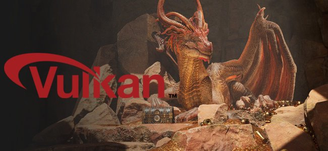

# Versão 11.1

O <b>Substance 3D Painter 11.1 </b>traz a nova ferramenta de Caminho da faixa com conteúdo dedicado, simetria em camadas e efeitos de preenchimento, tamanho físico para o deslocamento e suporte da API gráfica Vulkan.

Data de lançamento: <b>18 de novembro de 2025</b>

>[!NOTE]
>
> Esta versão do Painter alterna a API gráfica de OpenGL para Vulkan. Essa alteração pode afetar quais GPUs são compatíveis com o aplicativo, principalmente para assar com rastreamento de raios baseado em GPU.
> 
> Para obter mais informações, confira nossa [página de requisitos do sistema](../getting-started/system-requirements.md).

## Principais recursos

### nova ferramenta Faixa de Opções

O <b>Caminho da faixa</b> é uma nova ferramenta na família de ferramentas de caminho. Uma fita transformará e repetirá uma textura ao longo de um caminho sem cortes, com controle extra para o início e o fim, bem como opções para cantos acentuados.

Essa nova ferramenta abre as portas para novos comportamentos, como colocar texto ao longo de caminhos, inserir um gradiente perfeito ao longo de um caminho e criar facilmente seus próprios acabamentos avançados para envolver uma malha.\
Resumindo, a fita é uma ferramenta mais limpa para desenhar com caminhos mais precisos.

* <b>Nova ferramenta de Faixa de Opções disponível ao lado de outras ferramentas semelhantes a caminhos</b>\
  A nova ferramenta Faixa de opções está disponível ao lado do outro caminho, como as ferramentas na interface. Ele pode ser selecionado na barra de ferramentas ou nos atalhos de tipo de caminho.

  

  
* <b>A Faixa de Opções é um caminho contínuo que funciona em todos os tipos de superfícies</b>\
  ElaA Faixa de opções é uma ferramenta que permite repetir ou esticar uma textura ao longo de um caminho. Ele funciona em qualquer tipo de superfície e geometria, mesmo quando as partes da malha não estão conectadas.

  
* <b>Criação de gradientes e padrões repetidos</b>\
  Essa nova ferramenta pode repetir imagens de várias maneiras sem emendas ou cortes, o que é adequado para gradientes e padrões limpos.

  
* <b>Esticar imagens com início e fim personalizados</b>\
  A configuração <b>esticar entre deslocamentos</b> permite isolar partes de uma imagem para usá-las como seções de início e fim em um caminho, enquanto a seção do meio é esticada ao longo do resto do caminho. Isso pode ser útil para usar rapidamente bitmaps simples e colocá-los ao longo de um caminho sem distorções, como setas.

  
* <b>Tipos de canto diferentes disponíveis</b>\
  Ao quebrar tangentes para criar cantos, várias formas estão disponíveis dependendo das necessidades, desde a quebra clássica até a rotação suave.

  
* <b>Controles de amplificação e divisão em blocos gráficos</b>\
  As imagens podem ser facilmente repetidas ou ampliadas ao longo de uma Caminho da faixa, de forma automática ou manual.

  
* <b>Texto ao longo do caminho</b>\
  Os recursos de fonte podem ser usados diretamente em uma Caminho da faixa. O texto se ajusta automaticamente ao caminho para se deformar ao longo das curvas. As configurações de alinhamento podem ser usadas para adaptar melhor o texto a qualquer situação.

  
* <b>Proporção e recursos não quadrados</b>\
  Os recursos não quadrados são ajustados automaticamente para se ajustarem ao comprimento do Caminho da faixa, o que o torna ideal para padrões alongados, como decorações e guarnições repetidas.

  
* <b>Compatível com o fluxo de trabalho de traçados dinâmicos do Substance</b>\
  Caminhos da faixa também são compatíveis com o sistema de traçado dinâmico baseado em Substance, possibilitando a criação de resultados complexos. Um exemplo notável é a capacidade de ter extremidades/extremidades personalizadas e cantos esquerdo/direito.\
  Duas novas predefinições de ferramenta chamadas <b>Escala de cinza da faixa personalizada</b> e <b>Material da faixa personalizada</b> também são fornecidas para tornar essa funcionalidade facilmente acessível.

  
* <b>Compatível com simetria</b>\
  Como outros tipos de ferramentas, o Caminho da faixa também é compatível com o recurso de simetria.

  
* <b>Modos de mesclagem quando autosobrepostos</b>\
  Quando um Caminho da faixa se cruza com ele mesmo, ele pode levar a resultados inesperados. O modo de mesclagem dedicado para os canais Alpha, Normal e Height pode ajudar a obter melhores resultados.

  

Melhorias adicionais foram feitas em todas as ferramentas de caminho:

* <b>Separe o tamanho e a opacidade por vértice em caminhos</b>\
  Agora é possível ajustar o tamanho e a opacidade por vértice em um caminho e não está mais vinculado ao parâmetro de pressão. Essas duas propriedades agora são tratadas separadamente com controles deslizantes dedicados na interface.

  
* <b>Agrupamento de parâmetros na janela Propriedades </b>\
  A maioria das ferramentas no Painter agora tem grupos recolhíveis para seus parâmetros. Essa alteração facilita ocultar parâmetros em tempo real e reduz o comprimento da janela.

  

>[!NOTE]
>
> Para obter mais informações sobre a <b>ferramenta da Faixa de Opções</b>, confira a [página de documentação dedicada](../painting/tool-list/ribbon-tool.md).
> 
> Para obter mais informações sobre <b>traçados dinâmicos</b>, confira a [página de documentação dedicada](../painting/dynamic-strokes/dynamic-strokes.md).

### Novo conteúdo e categorias para a ferramenta Faixa de Opções

Esta versão inclui 75 novas predefinições de ferramenta que aproveitam os novos recursos da Faixa de opções. Para facilitar a descoberta das predefinições, novas categorias predefinidas foram adicionadas à janela <b>Propriedades</b>.

* <b>Novos atalhos de categorias predefinidas na janela Propriedades</b>\
  Uma série de novos botões agora fica na parte superior da janela <b>Propriedades</b> ao usar ferramentas de caminho. Cada botão oferece acesso a predefinições de ferramenta, classificadas por categorias. A categoria Favoritos agrupa as predefinições escolhidas.

  

  Clicar em um dos botões dará acesso rápido a algumas predefinições pré-selecionadas. Clicar em <b>Mostrar mais em Ativos</b> revelará mais predefinições de ferramenta de caminho na janela <b>Ativos</b>.

  
* <b>Alternância rápida entre predefinições</b>\
  Para facilitar a alternância de predefinições, clicar em uma predefinição não desmarca mais o caminho editado no momento.

  
* <b>Novo conteúdo</b>\
  75 novas predefinições de ferramenta dedicadas à ferramenta Faixa de opções foram adicionadas nesta versão como parte do conteúdo padrão. Essas predefinições estão disponíveis diretamente dentro da janela <b>Ativos</b> na seção de pincel ou por meio dos atalhos de novas categorias na janela <b>Propriedades</b>.\
  Essas predefinições incluem:

  * <b>Vestuário</b>: predefinições aprimoradas de emenda e topstitches, bem como zíperes e lágrimas de tecido.
  * <b>Básico</b>: traços simples, como linhas e traços, mas também gradientes e as predefinições da <b>Faixa personalizada</b> com base no sistema de <b>Traço dinâmico</b>.
  * <b>Desgaste</b>: 3 tipos de rachaduras para simular danos em vários tipos de superfícies.
  * <b>Superfície dura</b>: padrões de aderência, detalhamento de painéis e persianas, fitas e soldagem para usar ou objetos mecânicos.
  * <b>Orgânico</b>: faixas, limpas e sujas, para envolver a pele e outras superfícies.
  * <b>Pintura</b>: gradientes baseados em pincel e predefinições de guaches.
  * <b>Texto</b>: predefinições rápidas para configurar o texto ao longo de um caminho com a Faixa de Opções com diferentes modos de alinhamento e amplificação.
* <b>Nova palavra-chave de ferramenta para pesquisa na janela Ativos</b>\
  Digitar “fita”, “pintar”, “caminho” ou até mesmo “borrar” na janela <b>Ativos</b> agora é possível e pode ajudar a encontrar predefinições que corresponderão à ferramenta correspondente.

  

### Nova simetria para camadas de preenchimento e efeitos

As camadas e efeitos de preenchimento agora oferecem suporte à simetria com seus modos de projeção 3D. Pode ser habilitado por meio do menu de simetria na barra de ferramentas contextual ou por meio da seção de simetria recém-adicionada na janela <b>Propriedades</b>.

* <b>Simetria em camadas de preenchimento </b>\
  Ao usar modos de projeção baseados em 3D em efeitos de preenchimento e camadas, a simetria agora pode ser ativada. Tanto o espelho quanto a simetria radial estão disponíveis.

  
* <b>Habilitar simetria por meio da barra de ferramentas contextual ou da janela Propriedades</b>\
  A simetria pode ser ativada por meio do menu da <b>barra de ferramentas contextual</b>, de forma semelhante às ferramentas de pintura, ou por meio da janela <b>Propriedades</b> com a nova seção dedicada.

  

  
* <b>Inverter recurso de entrada para Textos e Logotipos</b>\
  A camada de preenchimento e a simetria de efeitos também se beneficiam de novas opções que permitem virar as imagens de entrada ou os eixos X/Y. Isso permite espelhar um texto, por exemplo, mas ainda torná-lo legível em ambos os lados.

  
* <b>Interface de configurações de simetria aprimorada</b>\
  A interface das configurações de simetria foi reformulada para ser mais fácil de ler e mais rápida de usar. Cada controle deslizante de eixos tem sua própria linha, por exemplo, o que ajuda a ser mais preciso. A tela radial também foi reduzida para ocupar menos espaço.

  

Para obter mais informações sobre a <b>simetria</b>, consulte a [página de documentação dedicada](../painting/symmetry/symmetry.md).

### Tamanho físico para deslocamento

O deslocamento agora pode ser definido com uma unidade específica. Essa alteração facilita o alinhamento e a correspondência da geometria deslocada entre outros aplicativos.

* <b>Nova opção de unidade de escala nas configurações de deslocamento</b>\
  Na janela <b>Configurações do sombreador</b>, ao ajustar a intensidade do deslocamento, há novas configurações de unidade de escala disponíveis. Essa configuração oferece as seguintes opções:

  * <b>Normalizado</b>: padrão, corresponde ao comportamento anterior do Painter. Esse tamanho se baseia na caixa delimitadora de malha dentro do projeto atual.
  * <b>Cena</b>: usa as unidades armazenadas dentro do arquivo de malha como o ponto de referência.
  * <b>Tamanho físico (cm)</b>: usa a unidade do projeto definida na janela <b>Configuração do projeto</b>.

  

### Nova infraestrutura gráfica Vulkan para Windows e Linux

Na continuação do trabalho iniciado em nossa versão anterior, que mudou de OpenGL para Metal no sistema operacional Mac, esta nova versão agora usa o <b>Vulkan</b> nas plataformas Windows e Linux.

* <b>A API de gráficos Vulkan agora é usada em vez do OpenGL no Windows e no Linux</b>\
  O Painter agora usa a API gráfica Vulkan para renderização na viewport e nas texturas de computação. Esse switch deve melhorar o desempenho geral do aplicativo. Facilitará também a integração de novas funcionalidades no futuro.
* <b>Rastreamento de raios do GPU para assar via Vulkan</b>\
  O DirectX raytracing (DRX) e o Optix foram substituídos em favor do raytracing através da API gráfica Vulkan em nossos padeiros. Essa alteração significa que o rastreamento de raios baseado em GPU agora está disponível em GPUs AMD, bem como no sistema operacional Linux.\
  Mudar para Vulkan também melhora os tempos de renderização, especialmente em altas resoluções.

### Diversos

Recursos e aprimoramentos adicionais foram adicionados nesta versão:

* <b>substituição de resolução de Substance</b>\
  Ao usar recursos de Substance em Ferramentas e camadas/efeitos de Preenchimento, um novo grupo de parâmetros <b>Resolução</b> estará disponível. Essas configurações podem ser usadas para alterar a resolução padrão selecionada pelo aplicativo.\
  Isso pode ser útil para aumentar ou reduzir a resolução em que um Substance é gerado, por motivos de qualidade ou desempenho.

  As configurações disponíveis são:

  * <b>Resolução</b>: defina o modo e o contexto usados para calcular a resolução. O padrão é Automático, mas pode ser definido como <b>Conjunto de texturas</b> ou <b>Personalizado</b>.
  * <b>Fator</b>: controle adicional sobre a resolução, para criar diferenças relativas. Por exemplo: usar metade da resolução de um determinado contexto.
  * <b>Tamanho de saída</b>: a resolução final calculada com base nas configurações anteriores.

  
* <b>Melhorias de desempenho em um único triângulo grande</b>\
  Até agora, a Painter lutava em malhas poligonais muito baixas ou malhas com triângulos muito grandes e/ou longos. Isso já não acontece. Trabalhar com malhas quádruplas únicas, por exemplo, para criar texturas de divisão em blocos gráficos, não deve ser mais um problema.
* <b>Forma de pincel padrão aprimorada</b>\
  A forma de pincel padrão foi atualizada com novas configurações para controlar seu tamanho e arredondamento, levando em consideração o comportamento da dureza.

  

## Tutorials

Aqui está o tutorial mais recente que aborda nosso novo recurso:

## Notas de versão

### 11.1.0

Data de lançamento: <b>2025/11/18</b>\
Resumo: <b>Esta atualização é uma versão importante. Ela contém a nova ferramenta Ribbon com conteúdo novo dedicado, suporte de simetria para camadas de preenchimento, parâmetro de tamanho físico para deslocamento, desempenho aprimorado por meio de padarias atualizadas, suporte completo a Vulkan para Windows e Linux e outras melhorias.</b>

<b>Adicionado</b>:

* Nova ferramenta da faixa de opções
* [Ferramenta] Adicionar nova ferramenta Faixa de opções para criar caminhos perfeitos
* [Faixa de opções] Adicionar atalhos predefinidos da Faixa de opções na janela Propriedades
* [Ribbon] Permite alterar a opacidade da Faixa de Opções por vértice no caminho
* [Ribbon] Permite alterar o tamanho da Faixa de Opções por vértice no caminho
* [Ribbon] Remover o início/fim definido em um Substance quando os caminhos são fechados
* [Ribbon] Remover visualização Caminho/Material na janela de propriedades das ferramentas Pintar/Borracha/Borrar caminho
* [Faixa de opções] Adicione modos de mesclagem para o alfa e alguns canais quando houver autosobreposição
* Simetria de preenchimento
* [Preenchimento] Adicionar suporte para simetria em camadas e efeitos de preenchimento
* [Fill][UI] Expor configurações de simetria na janela de propriedades para camada de preenchimento e efeitos
* [Fill] Reprocessar a interface de configurações de simetria no menu do visor e na janela de propriedades
* [Fill] Reorientar adequadamente texturas normais ao projetar no modo de distorção
* deslocamento do tamanho físico
* [Deslocamento] Usar o tamanho físico como unidade de deslocamento
* Melhoria de desempenho
* [Desempenho] Melhorar a renderização de pequenos traçados de pincel em triângulos grandes
* [Desempenho] Melhorar o tempo de compilação do Sombreador
* [Performance] Suporte completo à Vulkan para Windows e Linux
* [Desempenho] Padeiros atualizados com renderização mais rápida de GPU e suporte a rastreamento de raios AMD
* [UI] Reorganizar propriedades de ferramentas em grupos e recolher algumas por padrão
* [Engine] Atualização do Substance Engine para a versão 9.2.5
* [Substance] Expor a substituição de resolução para recursos Substance em Ferramentas e Preenchimentos
* [Exportar] Atualizar predefinição de exportação de Mapas de malha para exportar texturas em tons de cinza
* Python
* [Panificação][Python] Indicar em changelog mudanças de quebra após atualização de padeiros
* [Python] Expor as configurações de simetria de preenchimento no Python
* Conteúdo e novo conteúdo
* [Conteúdo] Adicione 75 novas predefinições de ferramenta para a ferramenta Faixa de opções
* [Conteúdo] Atualize o recurso construtor de gradientes para que seja compatível com a Faixa de opções

<b>Corrigido</b>:

* [Falha] Carregar outro projeto enquanto o encaixe de caminho está ativado pode falhar
* [Falha] Clicar com o botão direito do mouse no painel Caminho com informações de outra sessão na área de transferência pode travar
* [UI] A interface rola para cima nas propriedades da ferramenta ao criar um caminho
* [UI] O cursor do mouse desaparece quando a visualização do visor do caminho está oculta
* [Caminho] Copiar/colar diferentes propriedades da ferramenta no painel Caminho leva a propriedades instáveis
* [Ferramenta] As predefinições da ferramenta Borrar nem sempre atualizam a seleção de canal
* [Ferramenta] O valor pintado é cinza, mas a interface do usuário mostra branco após carregar a predefinição de ferramenta colorida na máscara
* [Ferramenta] A predefinição criada a partir da máscara mantém os valores de canais carregados de outra predefinição
* [Substance] A substituição do espaço da cor normal definida no gráfico não é levada em consideração
* [Content] O recurso de forma de pincel padrão usa um Substance desatualizado

<b>Problemas Conhecidos</b>:

* O histórico da instância do sombreador não foi rastreado corretamente
* [Ribbon] Problema de desempenho com blocos UV
* [Ribbon] O caminho pode se sobrepor inesperadamente após um canto em alguns casos
* [Ribbon] As tangentes criam um loop indesejado quando o ponto é movido próximo das extremidades do caminho
* [Falha][Faixa de opções] Criar textos muito longos na Faixa de opções pode falhar
* [Ferramenta] A visualização de material não funciona quando a projeção é usada em uma máscara
* [Preparação] A configuração “Auto-oclusão” do AO é ignorada com vários conjuntos de texturas e a opção “corresponder pelo nome” ativada
* [Cozimento] O AO com normal tem artefatos nas bordas devido à falta de preenchimento
* [Gerenciamento de cores] As conversões do espaço de cores HDR com ACE no Linux produzem cores vivas
* [Regression][UI] O menu do botão direito do mouse é muito pequeno em telas HD
* [Crash][Python] Exportação de USD acionada por TextureStateEvent
* [Engine] Pintar com a ferramenta Clonar em cores normais de deslocamento de canal incorretamente
* [Python] O widget fantasma aparece excluído pelo script ainda em funcionamento
