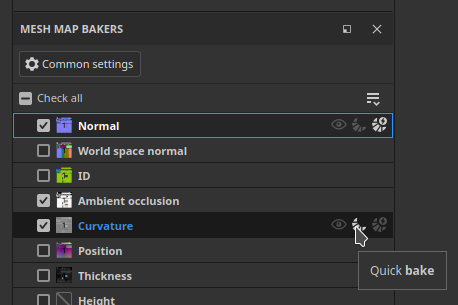
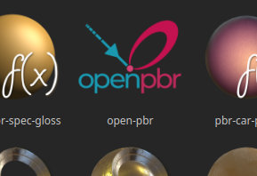

# Versão 12.1

O <b>Substance 3D Painter 12.1</b> apresenta um fluxo de trabalho de cozimento aprimorado com pintura de recozimento automático e correção de inclinação, suporte para a definição de material de OpenPBR e um novo modo de superfície dura para desencapsulamento automático de UV.

Data de lançamento: <b>22 de junho de 2026</b>

>[!NOTE]
>
> Esta versão aumenta a versão mínima compatível do macOS para 13.0 (Ventura). Para obter mais informações, confira nossa [página de requisitos do sistema](../getting-started/system-requirements.md).

## Principais recursos

### Fluxo de trabalho de cozimento aprimorado com pintura de inclinação

O fluxo de trabalho de cozimento foi reformulado para oferecer suporte a recozimento contínuo, pintura de correção de inclinação na malha, proteção de bordas e uma lista de mapas de malha redesenhada.

* <b>Recozimento automático</b>

  Um mapa de malha pode ser refeito continuamente à medida que seus parâmetros de cozimento são ajustados, removendo a necessidade de acionar manualmente um bolo após cada alteração. O Recozimento automático é alternado por mapa e se aplica a um único mapa de cada vez. Isso é especialmente conveniente para o fluxo de trabalho de pintura de inclinação, mas também para o ajuste de configurações gerais de cozimento.

  

* <b>Pintura de correção de inclinação</b>

  Quando a gaiola é definida para o modo <b>Baseado em distância</b>, as correções de inclinação podem ser pintadas diretamente na malha de baixo polígono para controlar a direção da projeção usada durante a cozedura. As ferramentas pincel, borracha e preenchimento de polígono estão disponíveis, com um seletor de valor de tons de cinza compacto, simetria e os controles de pincel comuns (<b>Pressione Ctrl + clique com o botão direito</b> para redimensionar o pincel, <b>X</b> para inverter o valor pintado). As ações de pintura de inclinação podem ser desfeitas.

  

* <b>Proteção de borda</b>

  Ao pintar a correção de inclinação, uma nova opção de proteção de borda preserva a suavidade de alto nível de polígonos projetada nas bordas sólidas. Seu resultado é controlado pelos parâmetros <b>Distância de Borda</b> e <b>Contraste de Borda</b>.

  

* <b>Lista de mapas de malha redesenhada</b>

  A lista de mapas de malha fornece controles por mapa: alternar um mapa como visor <b>visualização</b>, <b>cozimento rápido</b> um único mapa, alternar seu <b>recozimento automático</b> e <b>sincronizar</b> suas configurações em Conjuntos de Textura (disponíveis quando o projeto tem vários Conjuntos de Textura). Cada controle tem uma dica de ferramenta ao passar o mouse.

  

* <b>Botão de cozimento simplificado</b>

  O botão de cozimento do visor foi substituído por um único botão <b>Cozinhar</b> que exibe o número de mapas a serem cozidos (conjuntos de texturas x blocos UV x mapas de malha selecionados).

  

>[!NOTE]
>
> Para obter mais informações sobre panificação, consulte a [página de documentação dedicada](../baking/baking.md).

### Suporte a OpenPBR

O modelo de sombreamento de OpenPBR agora é suportado no Painter e é usado como o fluxo de trabalho padrão, fornecendo uma definição de material padronizada que pode ser transportada entre os aplicativos.

* <b>Novo sombreador de OpenPBR e fluxo de trabalho padrão</b>

  Um sombreador que implementa a especificação OpenPBR 1.1 está disponível e é usado por padrão. Um novo projeto criado sem um modelo usa o sombreador de OpenPBR, e a primeira entrada da janela do novo projeto agora é rotulada como <b>OpenPBR</b> em vez de <b>ASM</b>. Novos modelos de projeto para OpenPBR estão incluídos e os projetos de amostra foram atualizados para usá-los.

  

* <b>Sombreador selecionado no modelo de projeto na importação</b>

  Ao importar um arquivo USD ou GLTF, o sombreador agora é definido a partir do modelo do projeto, em vez de adivinhado a partir do conteúdo do arquivo. Uma mensagem é relatada no log quando um material e um modelo usam fluxos de trabalho incompatíveis.

  

* <b>convenção de nomenclatura de OpenPBR na exportação</b>

  A janela <b>Exportar Texturas</b> tem um novo menu suspenso para escolher a convenção de nomenclatura. O padrão é OpenPBR quando pelo menos um sombreador no projeto o usa e o esquema selecionado é refletido na lista de mapas de cada Conjunto de texturas.

  

* <b>Suporte a USD e MDL</b>

  Os materiais de OpenPBR são compatíveis com o formato USD. Uma nova MDL também foi adicionada para permitir a renderização de materiais de OpenPBR em Iray, fornecendo representações de materiais mais precisas.

>[!NOTE]
>
> Sombreadores personalizados podem precisar de atualização. A API de sombreamento foi alterada para suportar o OpenPBR. Consulte o changelog disponível no menu Ajuda do aplicativo para obter os detalhes.

### Nova abertura automática de superfície dura

Um novo modo de desempacotamento automático personalizado para ativos de superfície rígida foi adicionado.

* <b>Modo de desempacotamento da superfície rígida</b>

  Uma opção de <b>superfície dura</b> está disponível nas configurações de desencapsulamento automático. Ele minimiza a distorção UV e produz layouts UV alinhados ortograficamente, o que o torna mais adequado para malhas mecânicas e de superfície dura.

  

>[!NOTE]
>
> Para obter mais informações sobre o desencapsulamento automático, consulte a [página de documentação dedicada](../features/automatic-uv-unwrapping.md).

### Diversos

Recursos e aprimoramentos adicionais foram adicionados nesta versão:

* <b>Adicionar ou remover vários canais de uma vez</b>

  Após a introdução do OpenPBR, uma nova janela acessível a partir das <b>configurações do Conjunto de Texturas</b> permite selecionar vários canais de uma vez, o que é conveniente ao configurar a lista de canais grande usada pelo fluxo de trabalho do OpenPBR.

  * A nova janela é acessível nas configurações do Conjunto de Textura por meio do botão <b>Adicionar ou remover canais</b>.

    

  * A janela fornece uma visão geral de todos os canais que podem ser usados no Painter.

    

  * O botão <b>Aplicar a todos os Conjuntos de Textura</b> pode ser usado para editar a configuração de canal de todos os Conjuntos de Textura de uma vez.

    

* <b>Achatar todas as instâncias nos Conjuntos de Textura</b>

  Uma nova opção <b>Achatar todas as instâncias</b> está disponível em camadas e grupos instanciados. Produz um resultado nivelado em cada Conjunto de texturas no qual a ocorrência aparece, descendo por toda a árvore de ocorrências, e é gravado como uma única etapa de desfazer.

  

* <b>Histórico de desfazer unificado</b>

  Os modos de cozimento e pintura agora compartilham o mesmo histórico de desfazer. Alternar entre os modos Pintura e Pintura é gravado como uma etapa despossível, portanto, as ações podem ser desfeitas somente no modo em que ocorreram.

## Tutorials

Dê uma olhada em nosso tutorial mais recente no YouTube:

## Notas de versão

### 12.1.2

Data de lançamento: **08/2026/03**

Resumo: **Versão secundária**

**Corrigido:**

* \[Falha\] Alguns Substance podem levar a uma falha quando renderizados
* \[Falha\] Reimportar malha enquanto estiver no modo de cozimento
* \[Falha ao inicializar a exibição de gráficos pode levar a uma falha
* \[Falha\] A exportação de texturas pode falhar em alguns casos ao atualizar o registro
* \[Falha\] Falha no modo de cozimento em alguns casos ao carregar/atualizar o mapa do ambiente
* \[Preparação\] Reiniciar o bake após modificar o arquivo poli alto pode levar a um congelamento
* \[Enviar para o Photoshop\] Falha ao exportar a máscara da camada
* O resultado do ponto de ancoragem do \[Mecanismo\] não é renderizado entre uma máscara e um canal de cor

### 12.1.1

Data de lançamento: <b>07/2026/09</b>

Resumo: versão secundária

Adicionado:

* [Cozimento de inclinação] Expor o modo normal da base de inclinação: malha ou por triângulo
* [Propriedades] Faça com que as cores uniformes sejam sempre redefinidas para o valor padrão do canal
* [OpenPBR] Reagrupe canais por categorias na janela Exportar Texturas para criação de modelos de saída
* Atualize o mecanismo de Substance para a versão 9.4.5

Corrigido:

* [Projeto] Abrir e salvar alguns projetos pode demorar mais do que o normal
* [Falha] Recarregar várias malhas pode levar a uma falha
* [Falha] ao excluir um canal durante o modo de exibição de máscara, o que leva a uma falha
* [Falha] Alguns Substance podem levar a uma falha quando renderizados
* [Inclinação de pintura] A ferramenta selecionada na inclinação de pintura permanece selecionada após alternar para o Modo de Pintura
* [Preparando Configurações Comuns] As configurações de Distância da Gaiola não atualizam a visualização do wireframe e do sombreador da gaiola
* [O ] preenchimento UV do modo “Vizinho do Espaço 3D” não funciona bem em triângulos finos
* O resultado do ponto de ancoragem do [Mecanismo] não é renderizado entre uma máscara e um canal de cor

### 12.1.0

Data de lançamento: <b>2026/06/23</b>

Resumo: <b>Esta atualização é uma versão principal. Ela contém melhorias para PANELAS com Novo estado de interface de usuário padrão de cozimento, mapa de inclinação da pintura, retoque automático, nova opção de desencapsulamento automático UV para malhas de superfície dura e OpenPBR. Para obter mais detalhes, consulte as notas de versão completas.</b>

<b>Adicionado</b>:

* [Mastigar cozimento] Ferramentas de pintura de inclinação
* [Assoalho de inclinação] Adicionar sombreador de visualização de inclinação e visuais de vetor de direção de inclinação ao pintar mapa de inclinação
* [Mascarar cozimento] Opção Adicionar proteção de borda
* [Assobiar] Recozimento automático
* [Assoalho de inclinação] Interface do usuário de lista do mapa de malha de retrabalho
* [Assoalho de inclinação] Dividir as configurações do Mapa de malha/Preparação comum + Mover as configurações comuns para fora da lista de mapas de malha apenas com cor base ou máscara
* [Inclinar cozimento] Alterar botões da barra de ferramentas da viewport
* [Cozimento de inclinação] Mostrar alternância de simetria para o pincel na barra de ferramentas superior
* [Assoalho de inclinação] Opções de renomeação no menu de sincronização de lista do mapa de malha
* [Inclinação da montagem] Caixas de diálogo de sincronização de atualização e estado verificado
* [Assoalho de inclinação] Criar variante do seletor de cores em tons de cinza
* [Inclinar cozimento] Ícone Atualizar modo de cozimento
* [Desenvolver automaticamente] Opção Integrar superfície rígida
* [OpenPBR] Adicionar suporte para OpenPBR 1.1
* [OpenPBR] Tornar o OpenPBR o fluxo de trabalho e o sombreador padrão
* [OpenPBR] Importar materiais e texturas do OpenPBR via USD
* [OpenPBR] Exportar materiais e texturas do OpenPBR via USD
* [OpenPBR] Janela Atualizar Texturas de Exportação para mostrar a convenção de nomeação do OpenPBR
* [OpenPBR] Adicionar documentação sobre alterações para suportar o OpenPBR
* [OpenPBR][Iray] Adicione o novo MDL para suportar o OpenPBR 1.1 no Iray
* Várias pequenas melhorias nas exportações em USD
* [UI] Adicionar aviso no visor ao tentar pintar em outro conjunto de texturas
* [Nivelar] Permite nivelar todas as camadas da instância nos Conjuntos de textura
* [Configurações do conjunto de texturas] Permite selecionar vários canais de uma vez por meio de uma nova janela
* [History] Atualizar “valor” Desfazer a entrada de texto para refletir o nome do parâmetro
* [Pilha de camadas] Tornar efeitos de preenchimento em máscaras padrão em branco (1.0)
* [Substance] Adicionar nova entrada de mapa do mecanismo “mesh_hard_edges_triangle”
* [Substance] Adicionar nova entrada de mapa do mecanismo “mesh_hard_edges”
* [Shader] Impedir que instâncias de sombreador compartilhem os mesmos nomes
* [Shader] Use o sombreador do modelo do projeto ao importar um arquivo USD ou GLTF
* Atualize o Adobe Color Engine para a versão 7.0
* Atualização mínima da versão do MacOSX para a versão 13.0 (Ventura)
* [Conteúdo] Novos modelos de projeto para OpenPBR
* [Conteúdo] Atualizar projetos de amostra para usar o novo sombreador de OpenPBR
* [Python] Expandir a API da Máscara de geometria para permitir modos de inclusão e exclusão, como na interface do usuário

<b>Corrigido</b>:

* [Falha][Configurações de mapas de malha] Aplicar configurações a outros conjuntos de textura
* [Crash] Ao assar a curvatura do mapa sem espaço mundial normal
* [Falha][Preparação] Cozimento com caixa personalizada ativada, mas nenhum arquivo selecionado falha
* [Falha] Cancelando cozimento de AO
* [Caixa automática] Carga infinita quando o caminho de arquivo poli alto é inválido
* [Linux][Windows] O seletor de cores às vezes pode ser totalmente preto ou não aparecer
* [Ferramenta Preenchimento de polígono] A ferramenta não funciona com fontes não PBR
* [[Paint] Excluir canal de cor base não exclui a cor pintada anteriormente
* [USD] Nem todas as instâncias do sombreador foram detectadas corretamente
* [Substance] Somente o primeiro uso de um nó de entrada/saída é levado em consideração
* [Shader] A Oclusão ambiente é aplicada duas vezes com conjuntos de texturas usando diferentes métodos de mistura
* [Engine] Texturas normais com canal azul vazio (preto) podem levar a resultados incorretos de mesclagem
* [Importação de GLTF] a mesclagem de Alpha está ativada em todos os conjuntos de texturas
* [Exportação GLTF] A mesclagem de Alpha é sempre ativada na exportação
* [Exportar] A geometria de dupla face é sempre desativada ao importar um arquivo GLTF
* [Javascript] A modificação das configurações de sombreadores não contribui para o histórico de desfazer
* [Amostras] A dispersão da subsuperfície não está ativada nas configurações de exibição do fosco de reunião
