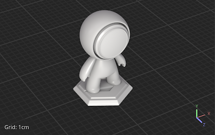
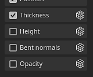
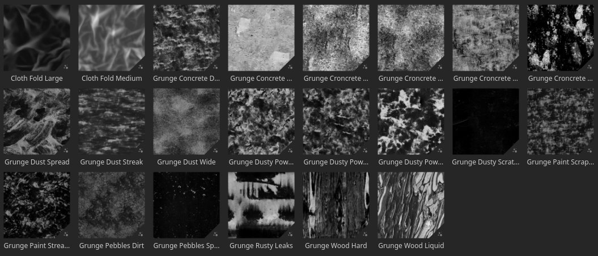
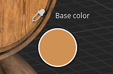

# Versão 8.1

O **Substance 3D Painter 8.1** integra o Adobe Color Engine (ACE) com suporte para perfis ICC, novos padeiros, novos ruídos 3D e 20 mapas de desgaste e um conta-gotas aprimorado.

Data de lançamento: *7 de junho de 2022*

## Principais recursos

### Novo gerenciamento de cores com Adobe Color Engine (suporte ICC)

Nesta nova versão, o sistema de gerenciamento de cores foi expandido com o suporte do Adobe Color Engine (ACE), que desbloqueia o uso de perfis ICC. Esse novo sistema permite combinar cores em uma ampla variedade de aplicativos, incluindo o Photoshop.

* **Novas configurações do projeto**\
  Ao criar um novo projeto, agora é possível especificar o mecanismo de gerenciamento de cores com o **Adobe Color Engine** (ACE) recém-adicionado.

  {width="400px"}

  O ACE vem com o seguinte espaço de cores de trabalho:

  * **sRGB linear**
  * **ACEScg**
  * **Adobe RGB Linear**
* **Monitorar o suporte ao perfil ICC**\
  Você pode usar seu perfil ICC para ajustar a aparência da viewport e fazer com que as cores correspondam ao monitor.

  {width="400px"}

* **Importação e exportação de imagens com perfis ICC incorporados**\
  Ao importar bitmaps, o perfil ICC pode ser extraído automaticamente. Também é possível substituir esse perfil nas propriedades da camada.\
  Ao exportar, é possível especificar o perfil ICC pretendido que será incorporado nos arquivos de textura.

  {width="400px"}

* **Novas configurações de modelo json** Para compartilhar e reutilizar configurações entre projetos, é possível especificar um arquivo de predefinição. Para saber mais sobre as especificações predefinidas, consulte a [documentação dedicada](../features/color-management/color-management-with-adobe-ace-icc.md).

>[!NOTE]
>
> Para obter mais informações, consulte a documentação do [gerenciamento de cores](../features/color-management/color-management.md).

### Suporte ao novo tamanho físico para materiais de Substance

O tamanho dentro dos materiais de Substance agora pode ser usado para orientar sua escala e revestimento dentro de projeções de camada de preenchimento. Essa é uma ferramenta útil para combinar adequadamente os materiais nas superfícies de acordo com seu tamanho real sem a necessidade de adivinhar.

* **Novos parâmetros de camada de preenchimento**\
  Uma camada de preenchimento (ou efeito) contém novos parâmetros para controlar a divisão em blocos gráficos/repetição de um material se este tiver um tamanho físico definido. Esses novos parâmetros estão disponíveis apenas com projeções 3D.

  {width="400px"}

* **Nova grade do visor**\
  Para facilitar o entendimento e a visualização do tamanho físico, agora é possível ativar uma grade no visor 3D por meio da janela [Configurações de exibição](../interface/display-settings/display-settings.md).\
  Uma vez ativada, a grade será automaticamente subdividida com base no nível de zoom. A unidade de grade é indicada na parte inferior esquerda da viewport.

  {width="400px"}

  {width="400px"}

>[!NOTE]
>
> Para obter mais informações, consulte a [documentação dedicada](../features/physical-size.md).

### Novos padeiros

Essas três novas adições fecham a lacuna entre o Designer e o Painter para estender as possibilidades de texturização e renderização.

Eles foram adicionados à lista de padeiros, mas estão desativados por padrão:

Os novos padeiros são:

* **Panificador de normais dobrados** O panificador de normais dobrados permite assar uma direção oclusão (como um vetor, semelhante a mapas normais). Esta textura pode ser usada para melhorar o sombreamento no visor ao habilitar a configuração **Normal Torto** na janela [Configurações do sombreador](../interface/shader-settings/shader-settings.md). Os normais tortos melhoram muito a precisão do sombreamento do visor em tempo real.\
  Para o **sombreamento difuso**, ele fornece uma oclusão mais precisa e pode até parecer uma iluminação global aproximada (primeiro exemplo abaixo).\
  Para **reflexos de specular**, permite simular a autosombra e reduzir a quantidade de luz que vaza, fazendo com que o objeto pareça muito mais aterrado, especialmente com superfícies metálicas (segundo exemplo abaixo).

  {width="350px"}

  {width="400px"}

* **Height**\
  O padeiro de Height permite assar a diferença entre a malha de baixo e alto-poli como uma textura em tons de cinza que poderia então ser usada para produzir deslocamento em malhas tesseladas. Por exemplo, ao assar informações de digitalização contra um plano.

  {width="400px"}

* **Panificador de opacidade**\
  O padeiro Opacity produz um mapa em preto e branco que mostra os buracos de uma malha de alto polímero. Por exemplo, pode ser usado para assar cercas ou mesmo furos dentro de uma superfície de tecido.

### Novo conteúdo

Uma variedade de novos conteúdos foi adicionada nesta versão, incluindo:

* **Ruídos 3D novos e aprimorados com mais de 100 predefinições**\
  Os ruídos 3D existentes foram reformulados e três novos foram adicionados. Cada um deles agora inclui configurações predefinidas que traz um total de 105 predefinições em 7 ruídos. Essas predefinições podem ser usadas como ponto de partida para mexer nos parâmetros e obter uma aparência específica. Como sempre, com os ruídos 3D, eles são perfeitos e podem ser repetidos facilmente sem um padrão perceptível.

  Para encontrar os ruídos 3D, basta ir para a seção procedimentos do painel Ativos:

  {width="400px"}

  Os ruídos fornecem uma ampla variedade de possibilidades. Estas são, por exemplo, as predefinições disponíveis com o **3D voronoi fractal**:

  {width="300px"}

* **20 novos bitmaps de desgaste e 2 padrões de tecido**\
  Um novo conjunto de degradês foi adicionado com o conteúdo padrão para expandir a gama existente de padrões. Eles podem ser encontrados em **Procedimentos > Bitmap Grunges**.\
  Dois padrões de pano também estão disponíveis em **Procedimentos > Tecido**.

  {width="400px"}

>[!NOTE]
>
> Alguns dos ruídos 3D podem levar alguns segundos para serem computados durante o primeiro uso.

### Conta-gotas e seletor de material aprimorados

Várias melhorias foram feitas no conta-gotas para facilitar a extração e o gerenciamento de cores.

* **Novo modo de separação**\
  Ao escolher as cores, não é mais necessário pressionar e manter o clique do mouse ao mover o mouse. Agora é possível clicar uma vez no conta-gotas, mover o mouse para o local desejado e clicar novamente para capturar uma cor.

* **Novos botões de conta-gotas**\
  Ao lado dos botões de cor, há um novo ícone de conta-gotas que pode ser usado para capturar cores sem precisar abrir o seletor de cores primeiro.

  {width="400px"}

* **Novo atalho de teclado do conta-gotas**\
  Quando a janela do seletor de cores estiver aberta, você também poderá pressionar **I** para entrar no modo de conta-gotas sem precisar clicar no ícone dedicado, o que facilita a iteração rápida entre separação e pintura.

* **Nova visualização durante a visualização**\
  Ao usar o conta-gotas para escolher uma cor, uma nova visualização não fica visível ao lado do mouse. Essa visualização também é gerenciada por cores.

  

* **Nova separação diretamente em um canal**\
  Com o novo comportamento de conta-gotas, agora é possível selecionar diretamente um canal na malha. Para fazer isso, basta pressionar e manter a tecla SHIFT pressionada para selecionar uma cor diretamente no canal. O canal é determinado a partir de onde o conta-gotas foi iniciado. Esse método ignora qualquer transformação de cor que seja importante com o gerenciamento de cores para recuperar cores precisas. Uma dica de ferramenta aparecerá para indicar o canal do qual a cor foi capturada.

  

* **Novas configurações de espaço de cores ao capturar uma cor**\
  Quando o gerenciamento de cores está ativado, uma nova configuração fica disponível no seletor de cores para especificar o espaço de cores usado ao capturar cores. Essa configuração é global para a sessão do Painter e será aplicada também ao botão Conta-gotas ao lado dos botões de cor na janela de propriedades.

  

* **Comportamento do seletor de material aprimorado**\
  O seletor de material da barra de ferramentas Ferramentas (atalho de teclado P) agora respeita a seleção de canal dentro da janela de propriedades. Ele não será mais ativado pelos canais em si.

  {width="400px"}

### Desencapsulamento automático aprimorado

O processo de desempacotamento automático de UV agora fornece uma segmentação mais natural.

Agora as malhas são cortadas em Ilhas UV separadas usando um método se aproxima do que pode ser feito à mão, especialmente em malhas orgânicas.

## Notas de versão

### 8.1.0

*(Lançado Em 07 De junho De 2022)*

**Adicionado:**

* [Gerenciamento de cores] Adicione suporte para perfis ICC com Adobe Color Engine (ACE)
* [Gerenciamento de cores] Adicione suporte para “Adobe 98 RGB” como espaço de cores de trabalho para ICC
* [Gerenciamento de cores] Permita definir as configurações de ACE/ICC por meio de um arquivo de configuração
* [Gerenciamento de cores] Permitir a entrada de valores de cor linear no Seletor de cores com o modo Legado
* [Gerenciamento de cores] Permite especificar o perfil de cores usado para escolher a cor fora da interface do usuário
* [Gerenciamento de cores] Lembrar o último valor de exibição escolhido na viewport
* [Gerenciamento de cores]&#x200B;[Substance] Faça com que os geradores/filtros funcionem corretamente com o Gerenciamento de cores
* [Gerenciamento de cores]&#x200B;[Substance] Adicionar novas palavras-chave de substituição colorspace $working e $standardsrgb
* [Tamanho físico]&#x200B;[Mecanismo] Extrair informações de tamanho físico da malha
* Cálculo do Tamanho físico [Tamanho físico]&#x200B;[Mecanismo]
* [Tamanho físico] Expor as opções para usar o tamanho físico na interface do usuário
* [Tamanho físico] Adicionar auxiliares visuais na viewport
* [Preparação] Adicionar Height
* [Cozimento] Adicionar padeiro de normais curvados
* [Preparação] Adicionar padeiro de opacidade
* [Conta-gotas] Nova visualização do seletor de cores
* [Conta-gotas] O painel Seletor de cores reaparece em sua última posição quando reaberto
* [Conta-gotas] Um novo ícone para o Seletor de materiais
* [Conta-gotas] Gerenciamento de cores da visualização do canal do seletor de cores
* [Conta-gotas] Adicionar a funcionalidade de clicar para selecionar ao conta-gotas
* [Conta-gotas] O seletor de material não ativa mais canais não ativos
* [Conta-gotas] Permitir o uso do conta-gotas com um atalho
* [Conta-gotas] O conta-gotas seleciona o canal relevante, quando aplicável
* [Conta-gotas] Entrar no modo de seletor de cores desativa todos os atalhos
* [Conta-gotas] Remove a seleção automática do campo hexadecimal
* [Conta-gotas] Não fechar o painel ao usar o seletor de material
* [Conta-gotas] Novo estado desativado quando o canal não está disponível para seleção
* [Exportar] Adicionar o atributo tangente à exportação de glTF
* Atualize o Substance Engine para v8.4
* Atualizar a quebra automática para 0. 9. 0
* Atualize para Qt 5.15.8
* Atualização para o Python 3.9
* [Shader] Adicionar suporte para sombreamento Bent Normals
* [MacOS] Suporte a 3DConnection SpaceMouse
* [Python] Documentar a versão Python usada na API
* [Conteúdo] Adicione 6 novos ruídos 3D com 105 predefinições
* [Content] 20 novos mapas de desgaste e 2 padrões de dobras de pano
* [Content] Atualizar a predefinição de exportação “Mapas de malha” para usar novos padeiros
* [Conteúdo] A Inclinação de desfoque e o filtro de distorção dependem da resolução do conjunto de texturas
* [Conteúdo] Atualize projetos de amostra para usar os 3 novos padeiros

**Corrigido:**

* [glTF] Não é possível abrir glTF com caractere especial
* [Engine] Artefatos com anisotropia e SVT desativados
* [MacOS]&#x200B;[M1] Os materiais inteligentes não são exibidos corretamente
* [Processamento de malha] Não é possível importar malhas do Modeler
* [UI] Barra de rolagem horizontal na janela do novo projeto com o Gerenciamento de cores ativado
* [Gerenciamento de cores] Valor do espaço de trabalho ausente no seletor de cores com algumas configurações OCIO
* [Gerenciamento de cores] A visualização do pincel na janela de visualização não é gerenciada por cores
* [SpaceMouse] A tabela dinâmica não é atualizada imediatamente com alteração de foco e às vezes fora do modelo
* [Export]&#x200B;[USD] Os arquivos USD exportados têm uma estrutura incorreta
* [USD] Problema de Oclusão ambiente ao exportar
* [Conteúdo] Atualizar a malha da miniatura para corresponder ao projeto de amostra da esfera de visualização

**Problemas Conhecidos:**

* Exportar texturas usando o preenchimento de difusão renderiza mapas em preto
* A mistura de Oclusão normal/ambiente está quebrada
* [MacOS] Falha ao iniciar o Iray em alguns casos raros
* [Visualizar miniatura] As miniaturas simplificadas não são atualizadas quando uma âncora é usada
* [Gerenciamento de cores] As conversões do espaço de cores HDR com ACE no Linux produzem cores vivas
