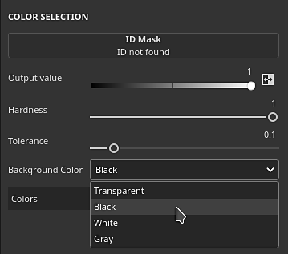
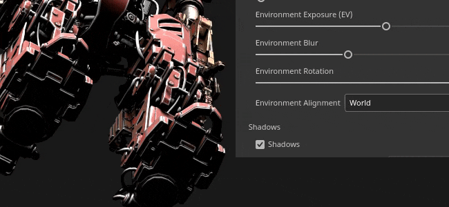
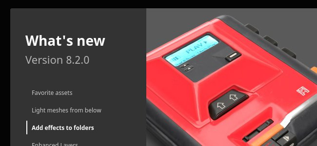
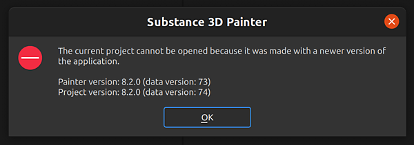

# Versão 8.2

O **Substance 3D Painter 8.2** concentra-se em muitas melhorias na qualidade de vida com recursos dedicados em várias áreas do aplicativo.

Data de lançamento: *6 de outubro de 2022*

## Principais recursos

### Novas opções para aplicar modos de mesclagem e opacidade

Vários atalhos e ações foram adicionados para tornar mais rápido e fácil copiar e aplicar modos de mesclagem e a opacidade em vários canais na Pilha de camadas.

* **Clique com o botão direito em um modo de mesclagem ou controle de opacidade**\
  Ao clicar com o botão direito do mouse em um modo de mesclagem ou em uma opacidade, selecione a ação **Aplicar a todos os canais** para usar esse modo de mesclagem em todos os outros canais da camada. Essa ação também está disponível em efeitos que têm controles de modo de mesclagem e opacidade.

  

* **Clique com o botão direito do mouse em uma camada e escolha Opções de mesclagem**\
  Também é possível clicar com o botão direito do mouse em uma camada (ou efeito) e escolher uma das seguintes ações:

  * **Aplicar mesclagem a todos os canais**: aplique o modo de mesclagem de canal atual a todos os outros canais da camada/efeito atual.
  * **Aplicar opacidade a todos os canais**: aplique a opacidade do canal atual a todos os outros canais da camada/efeito atual.
  * **Aplicar ambos a todos os canais**: aplique o modo de mesclagem de canal atual e a opacidade a todos os outros canais da camada/efeito atual.
  * **Copiar configurações de mesclagem de canal**: copie todos os modos de mesclagem e valores de opacidade da camada/efeito atual para a área de transferência.
  * **Colar configurações de mesclagem de canal**: aplique os modos de mesclagem e os valores de opacidade atuais na área de transferência à camada/efeito de destino.

  

### Novo modo de mesclagem e opacidade nos efeitos de filtro e seleção de cores

Os efeitos de filtro e seleção de cores agora têm a possibilidade de usar modos de mesclagem e controles de opacidade.

* **Modo de mesclagem e opacidade em filtros**\
  Os filtros agora podem usar modos de mistura e valores de opacidade. O padrão é **Substituir** para manter o mesmo comportamento de antes e evitar a duplicação das informações do componente alfa. Os modos de mesclagem nos filtros permitem calcular efeitos e combinar seus resultados diretamente em camadas, evitando a necessidade de usar pontos de ancoragem e efeitos de preenchimento para obter o mesmo resultado. Isso também evita a necessidade de implementar manualmente modos de mesclagem dentro do próprio filtro.

  

* **Modo de mesclagem e opacidade na seleção de cores**\
  O efeito de seleção de cor foi modificado para oferecer suporte a modos de mesclagem e controles de opacidade. Anteriormente, esse efeito estava gerando um resultado alfa e, para fazer os modos de mesclagem funcionarem como esperado, uma nova configuração foi adicionada para especificar a cor de fundo que está sendo gerada. É definido como preto em vez de transparente (que é o comportamento herdado).

  

  

* **Pilha de efeitos simplificada**\
  Anteriormente, quando havia a necessidade de combinar efeitos de determinadas maneiras (com a ajuda de modos de mesclagem, por exemplo), era necessário usar pontos de ancoragem e efeitos de preenchimento. Agora, com os modos de mesclagem diretamente nos filtros, não é mais necessário que isso reduza significativamente a complexidade da pilha de efeitos.

  {width="400px"}

### Novos efeitos em pastas

O conteúdo da pasta (a parte de cor de uma camada) agora pode receber efeitos de qualquer tipo. Antes era necessário criar configurações complexas de camada (como camadas de passagem ou pontos de ancoragem) para obter o mesmo resultado.

### Exportação do novo arquivo de Substance (SBSAR)

O formato de arquivo de Substance (SBSAR) agora está disponível ao exportar texturas. Um SBSAR é um container que pode ser aberto em muitos aplicativos com integração Substance, o que torna mais rápido e fácil “plug-and-play” de texturas personalizadas.

* **Exportando um arquivo de Substance (SBSAR)**\
  Agora é possível especificar o formato de arquivo SBSAR na lista de formatos de arquivo na janela **Exportar Texturas**. Isso exportará um único arquivo SBSAR contendo todas as texturas especificadas. A nomeação dos nós de saída e seus usos são definidos a partir da predefinição de exportação selecionada e seus tipos de canal.

  

* **Predefinições de exportação híbridas com formatos de arquivo PSD e SBSAR**\
  As predefinições de exportação agora podem especificar mapas de saída como PSD ou SBSAR, além de todos os outros formatos de imagem. Os formatos PSD e SBSAR são considerados “containers”, o que significa que várias texturas podem ser armazenadas dentro deles. Quando uma predefinição de exportação especifica formatos de contêiner e formatos de imagem independentes, todas as saídas no modelo direcionado a um arquivo SBSAR serão agrupadas enquanto as outras saídas serão exportadas como arquivos individuais.

  

### Nova opção de ambiente para acender sob modelos 3D

Uma nova configuração em [Configurações de Exibição](../interface/display-settings/environment-settings.md) permite alinhar o mapa de ambiente à câmera, possibilitando ajustar o ângulo de iluminação e iluminar partes abaixo do modelo 3D.

Para usar esta nova configuração, vá para [Configurações de Exibição](../interface/display-settings/environment-settings.md) e altere a configuração de **Alinhamento do ambiente**:

* **Mundo**: o mapa de ambiente está alinhado à cena.
* **Local**: o mapa de ambiente está alinhado à câmera.

As sombras se ajustarão automaticamente com base na configuração dessa configuração.

### Novos Favoritos e excluir/recarregar na janela Ativos

Novas ações foram adicionadas à janela [Ativos](../interface/assets/assets.md) para facilitar o gerenciamento de recursos.

* **Marcar recursos como favoritos para encontrá-los rapidamente**\
  Clique com o botão direito em qualquer recurso na janela Ativos para marcá-lo como favorito (ou removê-lo dos favoritos). Os recursos favoritos sempre aparecem primeiro na linha nas consultas de pesquisa com uma pequena tag de estrela no canto, tornando-os destacados e acessíveis. Uma consulta de pesquisa dedicada também foi adicionada, facilitando a exibição de todos os seus recursos favoritos.

  {width="350px"}

* **Excluir e recarregar recursos no disco**\
  Os recursos localizados nas bibliotecas do usuário agora podem ser excluídos, recarregados ou renomeados (exceto por parte dos recursos de um pacote, como gráficos de Substance ou pincéis ABR).

### Recursos e aprimoramentos diversos

Várias pequenas melhorias e recursos adicionais foram adicionados nesta nova versão:

* **Nova janela de Boas-vindas e Novidades**\
  Para nos mantermos informados sobre os novos recursos adicionados ao aplicativo, agora apresentamos uma nova janela de Boas-vindas e Novidades ao iniciar o aplicativo. Essa janela pode ser facilmente fechada e não reaparecerá nas próximas inicializações. Sempre é possível reabri-los por meio do menu **Ajuda**.

  {width="400px"}

  {width="400px"}

* **Nova ação para reimportar rapidamente um modelo 3D**\
  Um novo atalho de teclado (**CTRL+SHIFT+R** por padrão) foi adicionado e permite reimportar rapidamente o modelo 3D do projeto atual. Isso torna a iteração em um ativo mais fácil e rápida. Se o arquivo de origem não puder ser encontrado, uma mensagem de erro será gerada no log. Uma ação também foi adicionada ao menu **Editar**.

  

* **Suporte aprimorado a HDPI**\
  Foram feitas várias correções em relação às telas HDPI e ao dimensionamento do sistema. Agora oferecemos suporte a valores de escala intermediários (por exemplo, 125%), o que deve evitar que a interface seja muito grande ou muito pequena em determinadas telas. Mover janelas entre telas HDPI com diferentes valores de dimensionamento também deve se comportar corretamente.

* **Redefinir os parâmetros de Substance para o padrão**\
  Todo lugar em que um Substance gráfico é usado (como alfa, materiais, filtro etc.) agora é possível redefinir seus parâmetros para o padrão.

  * **Redefinir todos os parâmetros**: use o botão restaurar padrões abaixo da lista de parâmetros para redefinir todo o recurso Substance.
  * **Clique com o botão direito do mouse**: clique com o botão direito do mouse em um parâmetro específico para abrir um menu com uma ação de redefinição específica para esse parâmetro.

   

* **Exibir componentes RGBA individuais em viewports**\
  Ao observar um canal nas viewports, há uma nova configuração denominada **Canais de cores** em **Configurações de exibição > Exibição de canal** que permite examinar componentes RGBA individualmente. Isso pode ser útil para analisar texturas ou isolar componentes específicos nos canais do usuário.

  

  {width="450px"}

* **Colocando camadas de preenchimento lado a lado e efeitos além de 128**\
  O parâmetro de divisão em blocos gráficos de camadas de preenchimento e efeitos foi modificado para ter um intervalo flexível. Isso agora permite digitar qualquer valor de divisão em blocos gráficos desejado. O intervalo padrão do controle deslizante também foi reduzido de [-128,128] para [-32,32] para facilitar o arrasto.

  

* **Nova configuração de exportação de textura EXR 16f e 32f**\
  Anteriormente, a exportação de textura EXR era forçada para 32f bits na interface, mas dentro do arquivo real resultaria em dados de 16f bits (meio flutuante). Ela já foi corrigida, e há uma possibilidade explícita de escolher entre 16f e 32f bits. Projetos antigos e predefinições de exportação que usam EXR como formato de arquivo terão 16 f bits como padrão para respeitar o comportamento antigo (principalmente para evitar a produção de arquivos mais pesados do que antes).

  

* **Exportar e recarregar layouts de interface**\
  Novas ações para salvar e recarregar o layout da interface do usuário podem ser encontradas no menu do **Windows**. Isso torna mais conveniente alternar entre diferentes layouts ou salvar e reutilizar uma interface entre computadores. Os dois modos atuais do Painter (Renderização e Pintura) têm seus próprios layouts. Algumas funções também estão disponíveis em Python para permitir salvar e reimportar o layout da interface do usuário (veja abaixo).

  

* **Menu de arquivos reorganizado**\
  Reduzimos o menu de arquivos agrupando várias funcionalidades avançadas de salvamento. Algumas dessas ações também foram renomeadas para esclarecer seu comportamento.

  

* **Aprimoramento da mensagem de erro ao abrir projetos muito recentes.**\
  Uma mensagem mais útil agora é exibida ao abrir projetos feitos com uma versão mais recente do aplicativo. A mensagem agora inclui as versões do projeto e do aplicativo, o que permite estar mais bem informado sobre a versão necessária.

  {width="400px"}

### Script Python aprimorado

Várias funcionalidades novas foram adicionadas à API Python. Para obter detalhes completos, consulte a documentação disponível no menu Ajuda do aplicativo.

* **substance\_painter.resource**\
  O **substance\_painter.resource.Type** agora permite identificar mais tipos de recursos, como os pacotes de pincel Substance e Photoshop.\
  Objetos de recursos agora podem listar seus pais e filhos, permitindo navegar entre pacotes de Substance e gráficos de Substance, por exemplo.

* **substance\_painter.textureset**\
  Duas novas funções (e uma enumeração) foram adicionadas para obter e definir mapas de malha nas configurações do Conjunto de Texturas: **get\_mesh\_map\_resource()** e **set\_mesh\_map\_resource()**.

* **substance\_painter.ui**\
  Várias funções foram adicionadas para salvar e recarregar o layout da interface. Observe que o layout também depende do modo do aplicativo atual (Pintura ou Renderização).

* **substance\_painter.event**\
  Um novo **TextureStateEvent** foi adicionado para ajudar a rastrear a modificação na pilha de camadas de Conjuntos de Texturas, bem como outras alterações de parâmetro. Esse evento é acionado em traçados de tinta ou na adição/remoção de canais.

## Notas de versão

### 8.2.0

*(Lançado: 06 De outubro De 2022)*\
Resumo: **Versão principal com novos painéis de integração (novo painel de boas-vindas e painel de novidades), exportação para SBSAR, efeitos para pasta, várias melhorias na qualidade de vida e correções de erros.**

**Adicionado:**

* [Integração] Painel de integração para acolher novos usuários

  Adicionada uma nova tela de boas-vindas quando novos usuários da CC abrem o Painter pela primeira vez.
* [Integração] Painel de novidades para aprimorar a descoberta de novos recursos

  Adicionada uma nova tela Novidades que exibe os novos recursos principais. Ele é exibido automaticamente na primeira vez que o Painter é aberto após uma atualização importante e pode ser acessado novamente em Ajuda > Novidades.
* [Integração] Renomear antigo Bem-vindo à “Tela inicial”

  A tela de boas-vindas antiga foi renomeada para Tela inicial para evitar confusões com a nova tela de boas-vindas.
* [UI] Resolver problemas de dimensionamento para telas de alto DPI

  Adaptação aprimorada da interface do Painter em telas de alta definição com dimensionamento de exibição personalizado.
* [UI] Evitar mensagens de erro persistentes na interface do usuário

  As mensagens de erro de projetos anteriores agora são removidas da barra de status inferior.
* [UI] Menu de salvamento de retrabalho

  Opções adicionais de salvamento agora estão agrupadas em um submenu e algumas são renomeadas para fins de consistência.
* [UI] Salvar e exportar/compartilhar layouts de interface do usuário

  Dentro do menu Janela existem novas ações para salvar o layout da interface em arquivos e recarregá-los. Os layouts de Pintura e Renderização são salvos separadamente.\
  Várias funções foram adicionadas a “substance\_painter.ui” para salvar, redefinir e carregar os layouts de interface também.
* Adicionar ações de copiar/colar para modos de mesclagem/opacidade de uma camada

  Adicionada uma nova entrada “Opções de mesclagem” no menu de contexto camadas. Permite copiar e colar o modo de mesclagem e a opacidade de todos os canais de uma camada para outra.
* Aplicar modo de mesclagem/opacidade a todos os canais de uma camada

  Adicionada a funcionalidade de clicar com o botão direito do mouse ao modo de mesclagem de camadas e à opacidade, que permite aplicar a configuração atualmente clicada a todos os canais.
* Recarregar malha com um atalho de teclado (CTRL+SHIFT+R)

  Foi adicionado um atalho editável para recarregar o arquivo de malha com as últimas configurações disponíveis. Também pode ser acessada em Editar > Reimportar malha.
* Redefinir parâmetros de Substance para padrão

  Adicionado um novo botão em Propriedades na parte inferior dos recursos .sbsar que permite redefinir o recurso para padrão.
* Redefinir pincel para padrão

  Adicionado um novo menu à seção Pincel em Propriedades, o que permite redefinir para o pincel básico padrão.
* Clique com o botão direito do mouse para redefinir os parâmetros de Substance individuais como padrão

  Adicionada a possibilidade de redefinir parâmetros individuais em um recurso .sbsar com o botão direito do mouse.
* [Painel Ativos] “Fixe” ativos favoritos para aparecerem sobre o painel Ativos

  Adicionada a nova opção de clicar com o botão direito em ativos da biblioteca que permite fixá-los como favoritos na parte superior do painel. Você também pode exibir todos os seus ativos favoritos em Pesquisas salvas.
* [Painel Ativos] Excluir, recarregar e renomear ativos

  Adicionadas as opções do menu de contexto para excluir, recarregar e renomear ativos na biblioteca do usuário. Eles são excluídos diretamente do local da biblioteca no disco e recarregados do local original. Os ativos que fazem parte de um pacote como .abr ou .sbsar não podem ser editados individualmente.
* [Seleção de cores] Adicionar modos de mesclagem ao efeito Seleção de cores
* [Pilha de camadas] Adicionar modo de mesclagem e opacidade em filtros
* [Pilha de camadas] Permitir valores de divisão em blocos maiores que 128 para camada/efeitos de preenchimento
* [Pilha de camadas] Tampas de cilindro para projeção cilíndrica na camada/efeito de preenchimento

  A projeção cilíndrica nas propriedades da camada de preenchimento agora tem a opção de remover as tampas dos cilindros.
* [Log] Mostra uma mensagem de erro se as partes da malha estiverem em espaço negativo ao tentar criar um projeto de Bloco UV

  Adicionada uma mensagem de erro mais clara ao falhar ao criar um projeto de Bloco UV porque as partes UV são encontradas em espaços negativos.
* [Project] Indica a versão na mensagem de erro “dados muito recentes” ao abrir um projeto

  Ao abrir um projeto muito recente para o aplicativo, a mensagem de erro agora indicará a versão do projeto para facilitar a identificação da versão correta do aplicativo.
* [Janela de visualização] Permitir a iluminação da malha por baixo

  Foi adicionado um novo parâmetro de Alinhamento de ambiente em Configurações de exibição > Câmera > Configurações de ambiente para alinhar a iluminação do mapa de ambiente à câmera quando definida como “Local”.
* [Visor] Visualize R, G, B e Alpha no visor (modo de exibição individual)

  Em Configurações de exibição > Configurações do visor > Exibição de canal, há uma nova configuração de Canais de cores que permite exibir apenas o componente R, G, B ou Alpha de um canal quando estiver no modo de exibição única.
* [Shader] Permite definir canais do usuário como RGBA em sombreadores de camada de material

  Quando a configuração dos canais do Conjunto de texturas é definida dentro de um sombreador para camadas de material, agora é possível especificar o formato do canal para se desviar do valor padrão. Isso permite solicitar canais de usuário coloridos em vez de somente tons de cinza.
* [Exportar] Permite exportar texturas como SBSAR

  Ao exportar texturas por meio da janela Arquivo > Exportar texturas, o formato de arquivo SBSAR (Substance Archive) pode ser escolhido para reagrupá-los. O conteúdo do SBSAR é orientado pelo modelo de saída usado.\
  O formato de arquivo SBSAR também pode ser definido nas predefinições de exportação. Ao usar texturas de configuração híbrida (SBSAR + Outro formato) que se destinam a um SBSAR são agrupadas enquanto o restante é exportado junto.
* [Exportar] Opção Expor 16 bits para o formato de arquivo EXR

  Ao exportar arquivos de textura EXR, agora é possível escolher bit 16f (Half-Float) ou bit 32f (Float) na janela Exportar texturas (para configurações de exportação e predefinições de exportação). Projetos antigos e predefinições de exportação antigas terão o bit 16f como padrão para refletir o comportamento antigo.
* [Python] Adicionar evento para saber quando os conjuntos de texturas são modificados

  O novo “substance\_painter.event.TextureStateEvent” permite saber quando um conjunto de texturas foi modificado por causa de um traçado de tinta, um novo canal adicionado ou um canal removido.
* [Python] Permitir obter e definir recursos de Mapa de malha nas configurações de conjunto de textura

  Novas funções foram adicionadas ao módulo “substance\_painter.project” para obter e definir recursos de mapas de malha. Essas funções podem ser usadas para atualizar os mapas de malha referenciados pelas configurações do Conjunto de texturas.
* [Plugins] Remover a opção para obter outros plug-ins JS

  Remoção da opção para obter plug-ins Javascript, pois eles estavam hospedados no privado site Compartilhar.
* [Content] Adicionar novo modelo Roblox e exportar predefinição

  Um novo modelo de projeto e predefinição de exportação Roblox “Material Variant” e “Surface Appearance” foram adicionados para facilitar a exportação da textura PBR para Roblox. O modelo pode ser acessado pela janela Arquivo > Novo projeto.
* Atualize o Substance Engine para a última versão (8.6.3)
* [Steam] Compilação otimizada para o chipset Apple Silicon (Apple M1 / M2)

**Corrigido:**

* Falha ao usar exr 16k
* [Falha] Ctrl Z Após excluir uma instância de sombreador
* [Iray] IoR bloqueada em 1 para alguns sombreadores
* [Win][Panificação] Algum alto poli falha ao carregar
* [Gerenciamento de cores] Nome do espaço de cores incorreto na interface do usuário com filtros
* [Python] Os objetos de recurso retornados pela função de importação não têm um tipo

  Ao importar o pacote Substance em Python, a função estava retornando o pacote em vez de seu(s) gráfico(s). O módulo de recursos agora fornece funções e parâmetros para recuperar o(s) gráfico(s) de um pacote de Substance.

**Problemas Conhecidos:**

* [Gerenciamento de cores] As conversões do espaço de cores HDR com ACE no Linux produzem cores vivas
* [Pilha de camadas] Fonte de entrada não salva por camada
* [Pintura] A suavização temporal causa artefatos ao pintar em alguns casos
* [Exportar] 2DView exporta mapa aleatoriamente uniforme
