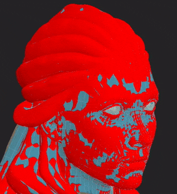
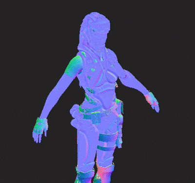
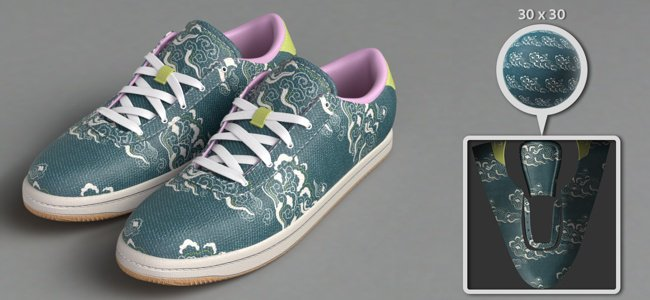

# Versão 8.3

O **Substance 3D Painter 8.3** apresenta um novo modo de preparo, importação de arquivos USD e suporte para o tamanho físico no modo de Projeção UV.

Data de lançamento: *10 de janeiro de 2023*

## Recurso principal

### Novo modo de cozimento

A antiga janela de cozedura foi substituída por um modo dedicado com vários novos recursos, nomeadamente com visualização do visor, como a exibição da gaiola e erros de correspondência.

* **Acessando e alternando entre modos**\
  A cozedura agora é um modo novo e separado, além dos modos de pintura e renderização já existentes do aplicativo. Para chegar ao modo de cozimento, basta usar o pequeno ícone do croissant na barra de ferramentas contextual. Alternar entre os modos também pode ser feito de outra forma: usando o menu de modo ou os atalhos de teclado. Para voltar para outro modo, basta usar o ícone dedicado do modo (Além disso, o botão **Criar mapas de Malha** dentro das [configurações do Conjunto de Texturas](../interface/texture-set/texture-set-settings.md) ainda pode ser usado para entrar no novo modo).

  

  

* **Nova interface de modo**\
  A janela de cozedura tradicional foi transformada num modo com docas dedicadas, nomeadamente:

  * A **lista do Conjunto de Texturas** pode ser usada para definir quais partes do projeto serão preparadas.
  * Os **Padeiros de mapas de malha** permitem selecionar entre as configurações comuns de cozimento e as configurações de panificação. É também onde você pode especificar qual processo de padaria será iniciado.
  * As **Configurações do Mapa de Malha** são o local em que todos os padeiros e configurações comuns estão localizados e podem ser modificadas, dependendo da seleção nas duas janelas anteriores.
  * O **Log de Preparação** agrupa informações diferentes sobre o processo de preparação, notadamente mensagens de erro.
  * **Visualização de cozimento**: este painel fica no visor e controla várias opções relacionadas à exibição das malhas polidas baixa e alta.

  {width="500px"}

* **Iniciar e cancelar o processo de cozimento diretamente do visor**\
  O botão para iniciar ou cancelar o processo de cozimento agora fica na parte inferior da viewport. Uma pequena seta também pode ser usada para especificar o modo de cozimento: com base na seleção da lista Conjunto de texturas ou usando o Conjunto de texturas ativo atualmente.

  

  

* **Exibir malha de alto polígono no visor**\
  Ao especificar uma malha de alto polígono nas configurações de cozimento, ela também será carregada na viewport (a menos que a configuração de visualização dedicada seja desativada). Isso permite verificar se a geometria de malha poli baixa e alta corresponde bem.

  {width="400px"}

* **Exibir malha do compartimento no visor com áreas perdidas como erro**\
  A malha do compartimento também pode ser exibida na janela de visualização. Se não estiver usando um arquivo de malha dedicado, uma caixa implícita será exibida e reagirá ao parâmetro Distância frontal máxima. Ao ajustar o tamanho da gaiola, qualquer parte da malha de alto-polígono que estiver fora da gaiola será mostrada como vermelha por padrão, permitindo encontrar facilmente parte da malha que será perdida pelo processo de cozimento.

  

* **Examine a malha ao carregar e assar**\
  Carregar malhas e assar não congela mais a aplicação, o que significa que é possível interagir com o visor durante essas operações. Isso pode ser útil para investigar a panificação em andamento, identificar problemas precocemente e cancelar a panificação, ajudando a economizar tempo no final. Da mesma forma, o conjunto de texturas mais visível no visor agora será assado primeiro, o que ajudará a verificar os resultados em áreas específicas com antecedência.

  

* **Configurações de material neutro e visor**\
  Para ajudar a focar nos resultados da panificação e procurar problemas, se houver, o modo de panificação não exibe texturas pintadas, usando um material neutro. As configurações deste material neutro podem ser ajustadas no painel de visualização de cozimento dentro do visor.

  

* **Exibir bordas sólidas sem emendas UV**\
  Uma fonte de artefatos ao assar é a presença de bordas duras que não têm costuras UV. Isso pode levar a linhas visíveis e quebrar o smoothness de sombreamento. Para essa finalidade, foram adicionadas configurações de visualização para destacá-las na visualização 3D e 2D, pois são muito fáceis de deixar passar o contrário.

  {width="450px"}

  {width="300px"}

* **Sincronizar e dessincronizar parâmetros**\
  A nova ação de sincronização permite especificar qual parte das configurações de Preparação é sincronizada nos Conjuntos de Textura. Caso contrário, seria tedioso definir configurações várias vezes de maneiras idênticas. Às vezes, é útil ter Conjuntos de texturas com configurações dedicadas e mantê-los não sincronizados é a melhor opção. Por exemplo, manter as configurações Comuns separadas agora permite usar uma Distância frontal máxima, Resolução e/ou lista de malhas de alto polígono que seriam diferentes por conjunto de textura.

  {width="400px"}

  {width="400px"}

* **Correspondência por verificador de nome**\
  A guia **Correspondência por nome** no **Log de Preparação** pode ajudar a localizar erros no processo de correspondência antes de assar, facilitando o aviso de malhas que não correspondem. As malhas correspondentes são agrupadas, enquanto outras são isoladas e exibidas em vermelho.

  {width="450px"}

>[!NOTE]
>
> Há muito mais configurações novas nesse novo modo. Para saber mais sobre, veja a [página de documentação dedicada](../baking/baking.md).

### Nova importação e exportação de arquivos em USD

Esta nova versão adiciona o suporte ao formato de arquivo do [Universal Scene Description (USD)](https://graphics.pixar.com/usd/release/intro.html). Agora é possível iniciar um projeto do Painter, exportando malhas e texturas usando o formato USD, o que torna o fluxo de trabalho mais consistente entre os aplicativos.

* **Importar arquivo USD com variantes, camadas e em um quadro específico**\
  Um formato de arquivo USD pode ser usado ao criar um projeto ou ao reimportar uma malha dentro de um projeto. Os arquivos do USD geralmente podem ser cenas complexas, portanto, um seletor de escopo e variante também está disponível para importar apenas um subconjunto do arquivo.

  {width="400px"}

  {width="400px"}

* **Exportar o USD como um novo arquivo ou vinculado ao USD original usado no projeto**\
  Quando a texturização estiver pronta, você poderá usar a janela **Arquivo > Exportar texturas** para exportar seu arquivo do USD junto com seus arquivos de textura. Basta habilitar a configuração **Exportar ativo USD** para fazer isso. Isso irá gerar vários arquivos USD que podem ser facilmente integrados em um pipeline posteriormente. Se você usou um arquivo não USD ou USD-file sem UVs, isso exportará um novo arquivo de geometria USD, além de mapas de textura e arquivo de material USD.\
  Além disso, também é possível usar o **Arquivo > Exportar malha** para exportar a geometria do projeto como um arquivo do USD.

  

  {width="400px"}

### Suporte aprimorado para o tamanho físico no modo UV

O suporte de materiais de Substance com tamanhos físicos embutidos foi estendido para projeções baseadas em UV.

* **Tamanho físico no modo UV**\
  Agora é possível definir o modo Dimensionar para Tamanho físico em vez de colocar a camada de preenchimento e os efeitos de preenchimento lado a lado usando o modo Projeção UV. O tamanho do UV é calculado automaticamente com base no tamanho médio dos triângulos do desencapsulamento UV.

  {width="400px"}

* **Alternar automaticamente para o tamanho físico** Uma nova configuração de projeto foi adicionada para definir automaticamente a configuração de escala como tamanho físico ao criar um material (ao arrastar e soltar um recurso para a janela Ativo, por exemplo). Isso permite usar um dimensionamento consistente em um projeto sem precisar alternar as configurações manualmente sempre que uma nova camada de preenchimento for criada. Para habilitá-lo em um projeto existente, vá para **Editar > Configuração do projeto** e habilite **Alternar o dimensionamento da camada de preenchimento para o Tamanho físico ao atribuir materiais**. Essa configuração também pode ser ativada ao criar um novo projeto.

  

## Informações de suporte da plataforma

Com este lançamento, aumentamos a versão mínima compatível do Painter no Steam para o Ubuntu 20.04.

## Tutorials

Para descobrir e aprender sobre o novo modo de cozimento, confira nosso tutorial mais recente:

## Notas de versão

*(Lançado: 10 De Janeiro De 2023)*\
Resumo: **Versão principal com novo modo de preparo, nova importação e exportação de arquivos USD e suporte de tamanho físico para Projeção UV**

**Adicionado:**

* [Modo de cozedura] Novo modo de cozedura dedicado ao processo de cozedura
* [Modo de cozimento] Defina o atalho para alternar para o modo de cozimento para F8
* [Modo de cozimento] Botão Adicionar início e Cancelar cozimento no visor
* [Modo de cozimento] Adicionar seleção de cozimento na lista Conjunto de textura
* [Modo de cozimento] Adicionar nova janela de padeiros de mapa de malha para selecionar padeiros
* [Modo de cozimento] Adicionar nova janela Configurações do mapa de malha para editar as configurações de cozimento
* [Modo de cozimento] Adicionar nova janela de registro de cozimento para seguir o processo de cozimento
* [Modo de cozimento] Adicionar parâmetros de cozimento e desfazer ações na janela Histórico
* [Modo Preparação] Adicionar trilhas nas Configurações do mapa de malha
* [Modo de cozimento] Adicione miniaturas de mapas de malha na janela Preparadores de mapas de malha
* [Modo de cozimento] Adicionar menu recolhível de configurações de visualização em uma janela de visualização 3D
* [Modo de cozimento] Adicionar configuração de visualização para mostrar/ocultar a malha de alto polímero
* [Modo de cozimento] Adicionar configuração de visualização para mostrar/ocultar a malha da gaiola e o wireframe
* [Modo de cozimento] Adicionar configuração de visualização para mostrar/ocultar a malha de baixo polímero
* [Modo de cozimento] Adicionar configuração de visualização para mostrar as bordas sólidas sem emendas UV como erros
* [Modo de cozimento] Informar na viewport sobre erros de malha e cozimento se o Registro de cozimento não estiver visível
* [Modo Preparação] Adicionar ação para sincronizar as configurações do padeiro em todos os Conjuntos de Textura

  Na janela Panificadores de mapa de malha, cada panificação (bem como as configurações comuns) pode ser sincronizada entre os conjuntos de textura clicando no ícone de link ao lado de seu nome. Esta ação abrirá uma janela que permite selecionar quais conjuntos de texturas compartilharão os mesmos parâmetros.
* [Modo de cozimento] Adicionar ações para copiar e colar configurações do padeiro

  Na janela Panificadores de mapa de malha estão disponíveis ações para copiar e colar cada configuração de panificação nos Conjuntos de textura por meio do menu dedicado na parte superior da janela ou do menu contextual do botão direito do mouse.
* [Modo de cozimento] Adicione o botão no Log de cozimento para pular do erro para as configurações corretas

  Quando um padeiro falha ou uma malha não é carregada corretamente, uma mensagem de erro aparece no registro de cozimento. Um botão ao lado da mensagem permite alterar a janela Configurações de pás e mapas de malha para mostrar as configurações relacionadas. Isso ajuda a isolar com mais facilidade a origem de um problema para corrigi-lo.
* [Modo Preparação] Adicionar menus para gerenciar conjuntos de texturas e seleções de pincéis

  Tanto na “lista de conjuntos de texturas” quanto na “PANELAS DE MAPA DE MALHA”, foi adicionado um pequeno menu de ação para ajudar a copiar e inverter as seleções.
* [Modo de cozimento] Dividir a lista de seleção do padeiro por conjunto de textura
* [Modo de cozimento] Dividir configurações comuns por conjunto de textura
* [Modo de cozedura] Carregue malhas de alto-poli e gaiola sem congelar a interface
* [Modo de cozimento] Use a barra de progresso do visor para mostrar a carga da malha
* [Modo de cozimento] Adicionar estado de carregamento de malha no Log de cozimento
* [Modo de cozedura] Permite girar a malha no visor durante a cozedura
* [Modo de cozedura] Definir a ordem de cozedura com base na visibilidade atual da janela de malha
* [Modo de cozimento] Exibir gaiola de cozimento implícita no visor

  Se não estiver usando um arquivo de malha de gaiola personalizado, uma malha de gaiola automática será gerada e exibida na janela de visualização. Seu tamanho será baseado no parâmetro Distância frontal máxima das configurações comuns de cozimento. A malha de gaiola é usada para indicar até onde a correspondência entre o poli baixo e alto irá.
* [Modo de cozimento] Mostrar lista correspondente de nomes de malha para correspondência por nome no Log de cozimento
* [Modo de cozimento] Usar material neutro para exibir o modelo 3D na viewport
* [Modo de cozimento] Desativa o cálculo do motor em modo de cozimento
* [Modo de cozimento] Exibir um aviso ao sair do aplicativo enquanto uma torta está em andamento
* [Padeiros] Atualizar rótulos de configuração de suavização de borda

  Os valores de configuração de suavização de borda foram renomeados para “Sobreamostragem” e com um número multiplicador explícito para esclarecer seu comportamento.
* [Padarias] Atualize as padarias para a versão 2.5.7.
* [USD] Importar e exportar arquivos do Universal Scene Description (USD)
* [USD] Adicione opções USD à janela Novo projeto ao selecionar um arquivo USD
* [USD] Adicionar nova janela de seleção de escopo e variantes

  Ao importar um arquivo USD, clicar no botão de alteração na janela Novo projeto ou Configuração de projeto permite selecionar qual parte e variantes de um arquivo USD importar.
* [USD] Opção Adicionar níveis de subdivisão

  Ao criar um novo projeto com um arquivo de malha do USD que contém subdivisões, é possível selecionar o nível de subdivisões usando um controle deslizante. O projeto será criado com a malha subdividida. O nível pode ser modificador por meio da Configuração do projeto.
* [USD] Importar malhas com pele em USD em um quadro específico

  Ao criar um novo projeto com um arquivo de malha USD que contém animação, é possível selecionar o quadro usando um controle deslizante que reflete a sequência de linha do tempo incorporada. O quadro pode ser modificador por meio da Configuração do projeto.
* [USD][Exportar] Adicione uma opção para exportar arquivos USD

  Nova caixa de seleção Exportar USD adicionada à janela Exportar texturas. Quando marcada, permite exportar arquivos USD, bem como mapas de textura usando qualquer modelo.
* [USD][Exportar] Adicionar formato de arquivo USD à exportação de malha
* [USD] Renomeie a predefinição de exportação “USD PBR Metal Roughness” existente para mais explícita

  O modelo de exportação para USD anteriormente conhecido como “USD PBR Metal Roughness” ainda é acessível por meio de Exportar texturas > Modelo de saída > USDz (Apple AR).
* [Abrir automaticamente] Adicionar orientação Bloquear para embalagem

  Nova opção para configurações de abertura automática que permitem preservar a orientação de Ilhas UV existentes ao usar o recurso de embalagem. Ele pode ser acessado em Novo projeto > Opções de quebra automática > Orientação da Ilha UV.
* [Tamanho físico] Adicionar configuração para usar Tamanho físico automaticamente no efeito/camada de preenchimento

  Foi adicionada uma nova opção para alternar automaticamente para a escala de tamanho físico ao usar um material com tamanho físico incorporado. Ele pode ser ativado por projeto por meio de Novo projeto ou de Editar > Configuração do projeto > Tamanho físico > Alternar o dimensionamento da camada de preenchimento para Tamanho físico ao atribuir materiais.
* [Tamanho físico] Expor tamanho físico para Projeção UV

  O dimensionamento de tamanhos físicos agora está disponível para Projeção UV. Ele ativa o redimensionamento automático de um material com base no tamanho físico de uma malha. Pode ser selecionado por meio de Escala > Tamanho físico na janela Propriedades da camada de preenchimento ou do efeito.
* [Scripting][Python] Permite consultar a versão do aplicativo
* [Script][JavaScript] Atualizar API para corresponder aos novos parâmetros de criação
* [Scripting][Python] Módulo de cozimento: editar parâmetros de cozimento
* [Scripting][Python] Módulo de cozimento: iniciar/cancelar cozimento
* [Scripting][Python] Módulo de preparo: selecionar o método de curvatura
* [Scripting][Python] Módulo de cozedura: seleção de padeiros / azulejos uv
* [Scripting][Python] Módulo de preparo: sincronizar as configurações do padeiro em todos os conjuntos de texturas
* [SVT] Habilitar suporte a hardware esparso em GPUs AMD

  A aceleração de hardware para o sistema de texturas virtuais esparsas agora pode ser ativada com as GPUs da AMD. Essa configuração é ativada automaticamente nas preferências gerais.
* [Projection] Renomear os parâmetros de projeção cilíndrica

  O parâmetro “Cylinder Cap Culling” foi renomeado para “Backface Culling” para melhor representar sua ação. A dica de ferramenta associada foi ajustada de acordo.
* [Project] Salvar a versão do aplicativo no projeto e recuperá-la por meio de scripts

  Desde a versão 8.2, a versão do aplicativo agora é armazenada dentro do arquivo spp ao salvar.\
  Esse número de versão pode ser recuperado com a função last\_saved\_substance\_painter\_version() no módulo do projeto da API Python.\
  Para projetos feitos antes de 8.2, o valor retornado será nulo.
* [Importar] Melhorar o tempo de importação geral de modelos 3D

  Melhoramos o tempo geral de importação das malhas. Por exemplo, reduzir o tempo de espera ao carregar malhas de alto-poli para cozimento. Essa otimização aplica-se em particular ao carregamento de arquivos OBJ.

**Corrigido:**

* [Falha] Alterar canais no filtro com pilha específica
* [Mac][M1] Falha ao criar uma camada de preenchimento e sair da pilha de camadas

  Esse problema pode ser corrigido atualizando para o Mac OS 13 (Ventura).
* [Scripting][Python] Falha ao usar ui.add\_dock\_widget() com tipo errado
* [Preparação] Mensagem de erro incompleta no log quando um bake falha
* [Preparação] A memória não é liberada quando a cozedura é concluída
* [Engine] O cache de textura não é atualizado ao alterar a visibilidade do efeito
* [Exportar] 2DView exporta mapa aleatoriamente uniforme
* [Project] Erro de alocação de memória ao salvar projeto com malha grande
* [Visor] O TAA causa artefatos ao pintar em alguns casos

**Problemas Conhecidos:**

* [Gerenciamento de cores] As conversões do espaço de cores HDR com ACE no Linux produzem cores vivas
* [Pilha de camadas] Fonte de entrada não salva por camada
* [Exportar] Mapa uniforme de exportações em 2D aleatoriamente
