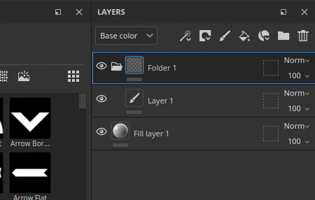

# Versão 9.1

O <b>Substance 3D Painter 9.1</b> adiciona controle tangente para a ferramenta Caminho, suporte para o formato de arquivo SVG, a capacidade de importar e aplicar recursos arrastando e soltando, e suporte para translucidez na viewport.

Data de lançamento: *7 de novembro de 2023*

## Principais recursos

### Novos controles de tangente e melhorias para a ferramenta Caminho

Nesta nova versão, continuamos o desenvolvimento da ferramenta Path (introduzida na versão 9.0) para adicionar bits e recursos ausentes solicitados pela comunidade.

* <b>Controlar tangentes de pontos de caminho manualmente</b>

  Agora é possível definir manualmente as tangentes de um ponto específico em um caminho. Isso permite substituir o comportamento automático para criar novas formas.

  
* <b>Editar pontos de caminho via manipuladores</b>

  Às vezes, apenas pontos de deslizamento na superfície do objeto não são suficientes. Os manipuladores permitem mover pontos além da superfície. Isso pode ser muito útil para mover vários pontos de uma vez, por exemplo, caso eles estivessem muito longe de uma superfície após uma reimportação de malha.

  
* <b>Alternar visibilidade de caminhos individualmente</b>

  A visibilidade dos caminhos agora pode ser alterada por caminho por meio do painel do visor dedicado. Desativar um caminho removerá suas contribuições das texturas finais sem ter que excluí-lo.

  
* <b>Copiar e colar posições e propriedades do caminho</b>

  Copiar e colar caminhos foi estendido para poder copiar apenas as posições de um ponto de caminho ou suas propriedades. Agora é possível sincronizar caminhos de diferentes maneiras, facilitando a criação de efeitos complexos (por meio das posições) ou o compartilhamento de uma aparência específica em diferentes locais (por meio das propriedades).

  

  

>[!NOTE]
>
> Para obter mais informações sobre a ferramenta Caminho, [consulte a documentação dedicada](../painting/tool-list/path.md).

### Novo suporte para translucidez, transparência e absorção no visor

O sombreador do <b>Adobe Standard Material</b> (ASM), que é o padrão ao criar um novo projeto, foi atualizado para oferecer suporte a propriedades de <b>Transparência</b>, <b>Transparência</b> e <b>Absorção</b>. Isso significa que agora é possível visualizar o resultado desses comportamentos de renderização na janela de visualização em tempo real (bem como dentro do renderizador Iray).

Portanto, materiais de criação como <b>vidro</b>, <b>folhagem</b> ou <b>plásticos</b> com uma fina absorção de luz agora são possíveis e diretamente visíveis no visor. Exportar para outros aplicativos da Substance 3D também resultará em uma aparência correspondente graças à definição do ASM.

* <b>Novas configurações do sombreador ASM</b>

  O sombreador ASM foi atualizado para suportar novas funcionalidades, que podem ser modificadas por meio da janela [Configurações do sombreador](../interface/shader-settings/shader-settings.md):

  * <b>Transparência</b> (opacidade): não é mais necessário alternar para outro sombreador para obter superfícies transparentes, como folhagens. Em vez disso, habilite o parâmetro <b>teste alfa</b> ou a <b>mistura alfa</b> no grupo <b>Geometria > Opacidade</b>. As configurações usuais, como pontilhamento, também estão disponíveis.
  * <b>Translucidez</b>: esta nova propriedade permite criar superfícies como vidro, tornando as formas transparentes enquanto mantém os reflexos do specular. Para usá-lo, adicione um canal de Translucência ao seu projeto e habilite o parâmetro <b>Translucência</b> no grupo <b>Interior</b>.
  * <b>Absorção</b>: esta nova propriedade permite simular a luz passando por um objeto e sendo absorvida, o que pode ser útil para simular plástico ou líquidos de uma maneira melhor do que usando dispersão abaixo da superfície. Para usá-la, habilite a configuração <b>Absorção</b> no grupo <b>Interior</b>.
* <b>Interface do usuário e dicas de ferramentas aprimoradas das configurações do sombreador</b>

  Com o retrabalho do sombreador, aproveitamos a oportunidade para melhorar a interface dos parâmetros, bem como adicionar muitas novas dicas de ferramentas para descobrir mais facilmente como ativá-los.

  A ordem dos parâmetros também deve corresponder melhor a outros softwares da Substance 3D, facilitando a execução de operações entre eles ao testar as configurações.

  
* <b>Novo projeto de amostra para demonstração do Material Padrão da Adobe</b>

  A princípio, pode ser difícil manipular as novas propriedades do ASM; portanto, um novo projeto de amostra que demonstra vários recursos do sombreador foi adicionado para facilitar sua aprendizagem.

  Este projeto chama-se <b>Tabela de restaurantes franceses</b> e pode ser encontrado por meio do menu <b>Arquivo > Abrir amostra</b>. Ele também usa muitos truques, então pode ser um ótimo recurso de aprendizado para descobrir novas maneiras de texturizar.

  
* <b>O canal de transparência agora tem como padrão uma cor preta</b>

  Para facilitar o uso das novas propriedades do sombreador e evitar resultados inesperados na janela de visualização, a cor padrão da transparência do canal foi alterada para preto (em vez de branco).

  Se esse canal já estava em uso no projeto, você pode obter o comportamento anterior simplesmente adicionando uma camada de preenchimento na parte inferior da pilha de camadas e definindo o valor do canal como branco. Talvez você queira habilitar a configuração <b>Usar translucidez como máscara de dispersão</b> no parâmetro de sombreador também para reaplicar a contribuição do canal ao resultado de dispersão abaixo da superfície.

### Nova compatibilidade com arquivos gráficos vetoriais (SVG)

Esta versão adiciona o suporte de arquivos de SVG como recursos que podem ser usados em camadas, ferramentas de pintura etc.

Os arquivos de SVG são bastante úteis para representar logotipos ou formas com precisão quando são muito leves. No Painter, eles podem ser renderizados em uma resolução desejada e facilmente atualizados, tornando-os perfeitos para o fluxo de trabalho não destrutivo.

* <b>Importar arquivos de SVG</b>\
  Os arquivos SVG podem ser importados como qualquer outro recurso, em projetos, em bibliotecas etc. O SVG <b>até a versão 1.1</b> pode ser importado; não há suporte para recursos de versões mais recentes.

  A importação também foi facilitada nesta versão (veja abaixo) para que o uso de arquivos de SVG possa ser feito simplesmente arrastando e soltando recursos de fora do Painter diretamente na malha ou na pilha de camadas.
* <b>Configurações de SVG dedicadas</b>\
  Ao usar um recurso SVG, algumas configurações estão disponíveis para controlar sua aparência:

  * <b>Resolução</b>: para usar uma resolução automática, uma definida no arquivo ou outra com um valor personalizado.
  * <b>Área de corte</b>: para definir a região específica da tela de SVG a ser usada.
  * <b>Escopo</b>: para selecionar todo o conteúdo do SVG ou apenas alguns elementos.

  
* <b>Novos materiais sob medida para SVG</b>

  3 novos recursos foram adicionados para ajudar no uso de arquivos SVG durante a texturização:

  * <b>Pintura a spray personalizada</b>: permite simular um decalque pintado em uma parede a partir de uma única imagem de entrada.
  * <b>Adesivo personalizado</b>: para criar um adesivo plástico em uma superfície. Possui várias configurações para simular danos e dobras.
  * <b>Gráfico para material</b>: permite criar várias propriedades de material a partir de uma única entrada de imagem. Esse recurso é inserido automaticamente ao arrastar e soltar um arquivo de SVG na viewport. Este recurso oferece uma maneira fácil de compartilhar a transparência de sua entrada em vários canais, tornando-o perfeito para decalques simples.

  

  

>[!NOTE]
>
> Para obter mais informações sobre o formato e as configurações de SVG, [consulte a documentação dedicada](../painting/vector-graphic-svg.md).

### Nova importação de recursos por meio da função arrastar e soltar

Essa versão permite arrastar e soltar um arquivo externo em diferentes contextos do aplicativo para importar automaticamente um recurso e usá-lo. Esse novo processo permite ignorar etapas tediosas relacionadas à importação de arquivos.

* <b>Importe via arrastar e soltar no visor</b>

  Arraste um arquivo externo para a viewport para poder colocá-lo diretamente na malha. Esta ação criará automaticamente uma nova camada. Dependendo da natureza do recurso (imagem, material de Substance, filtro de Substance, etc.) o resultado será adaptado em conformidade.
* <b>Importe via arrastar e soltar na pilha de camadas</b>\
  Da mesma forma que é possível soltar arquivos de recursos externos na janela de visualização, soltar arquivos na pilha de camadas permite criar camadas ou efeitos diretamente com o recurso dentro dela.
* <b>Importe via arrastar e soltar em um slot de recurso</b>

  Também é possível importar um recurso diretamente para uma camada ou ferramenta. Se já existir uma camada ou efeito de preenchimento com a configuração correta, basta soltar um arquivo externo em um dos slots de canal da janela Propriedades para importá-lo e aplicá-lo.

>[!NOTE]
>
> Para obter mais informações sobre como importar recursos, [consulte a documentação dedicada](../content/importing-assets/import-drag-and-drop.md).

### Novos comportamentos de arrastar e soltar recursos

As melhorias de arrastar e soltar não estão limitadas à importação de recursos. Arrastar e soltar um recurso da janela Ativos agora pode ser usado para criar novas camadas, efeitos e até máscaras imediatamente.

* <b>Arrastar e soltar vários tipos de recursos</b>

  Agora é possível arrastar e soltar tipos de recursos diretamente na viewport ou na pilha de camadas. Os seguintes tipos de recursos agora podem ser arrastados e soltos (quase) em qualquer lugar:

  * Alfas
  * Texturas
  * Procedimentos
  * Materiais
  * Materiais inteligentes
  * Máscaras inteligentes
  * Geradores
  * Filtros
  * Mapas do ambiente
* <b>Soltar recursos como nova camada ou efeito</b>

  Ao escolher onde um recurso é solto, o Painter criará automaticamente uma nova camada ou um novo efeito:

  
* <b>Escolha entre a pilha de efeitos de Conteúdo ou Máscara ao arrastar\
  </b>

  Ao arrastar um recurso sobre uma miniatura, o Painter alternará automaticamente para as pilhas de efeitos associadas. Depois disso, torna-se muito fácil simplesmente soltar o recurso em um local preciso dentro dessa pilha. Isso evita a necessidade de alternar para a pilha direita com antecedência.

  
* <b>Criar uma nova máscara preta imediatamente</b>

  Um novo ícone aparece em qualquer camada sem uma máscara ao arrastar um recurso. Quando um recurso é solto nessa máscara fantasma, ele cria automaticamente uma nova máscara e adiciona o novo recurso. É uma maneira rápida de configurar uma nova máscara e evitar cancelar a ação de arrastar e soltar para adicioná-la manualmente.

  
* <b>Solte no visor para criar novas camadas</b>

  Recursos de arrastar e soltar também podem ser feitos na viewport para criar novas camadas. Dependendo do tipo de recurso, o resultado pode ser alterado. Um filtro criará uma camada de pintura no modo de passagem, enquanto uma máscara inteligente criará uma camada de preenchimento com uma nova máscara.

  

  
* <b>Usar modificadores de teclado para comportamentos avançados</b>

  Ao soltar um recurso, manter o modificador do teclado CTRL ou ALT pode permitir comportamentos adicionais:

  * <b>CTRL</b> ao soltar na <b>pilha de camadas</b>: crie uma nova camada com o recurso em uma máscara preta. pode ser útil para forçar um material a ser colocado em uma máscara, por exemplo. Ou para ignorar o menu suspenso com uma letra alfa.
  * <b>ALT</b> ao soltar na <b>pilha de camadas</b>: aplica-se somente ao soltar sobre uma miniatura de camada. O recurso ALT removerá todos os efeitos anteriores. Isso pode ser usado como uma maneira rápida de experimentar diferentes recursos, especialmente máscaras inteligentes, sem ter que removê-los manualmente primeiro.
  * <b>CTRL</b> ao soltar no <b>visor</b>: crie uma nova camada com o recurso em uma máscara preta. O recurso será colocado em um efeito de <b>Seleção de ID de cor</b> que será definido com base na seleção feita no visor.
  * <b>ALT</b> ao soltar no <b>visor</b>: igual a antes, forçará um recurso a estar no modo de projeção de decalque.

### Melhorias diversas

Vários recursos e melhorias menores também foram adicionados nesta versão.

* <b>Compactação sem perdas de imagens de 16 bits</b>

  De agora em diante, quaisquer imagens contidas em um projeto com profundidade de bits de 16 serão compactadas com um algoritmo sem perdas, permitindo reduzir o tamanho sem perder a qualidade. Isso é somado ao arquivo de projeto que já está compactando seus próprios dados.

  Essa alteração se destina principalmente a <b>texturas de cozimento</b>, que geralmente são a razão pela qual os arquivos de projeto podem ser muito pesados no disco. Em média, vimos projetos serem <b>reduzidos em 30% a 50% de tamanho no disco</b>.

  Essa compactação é aplicada automaticamente ao salvar qualquer projeto (antigo ou novo) em recursos que ainda não estejam compactados. Isso significa que, para projetos antigos, salvar pela primeira vez nessa nova versão pode levar um pouco mais de tempo do que o normal. Economizar tempo deve voltar ao normal depois que isso for feito.
* <b>Novo conjunto UV para modo de projeção de preenchimento do conjunto UV</b>

  Um novo modo de projeção para camadas/efeitos de preenchimento foi adicionado chamado <b>Conjunto UV para projeção de conjunto UV</b>. Ele pode ser usado para projetar uma textura com base em diferentes UVs disponíveis na malha dentro do projeto. Ele pode ser usado para executar transferências de textura mais avançadas sem a necessidade de depender de ferramentas externas.

  O <b>conjunto UV 0</b> é o UV padrão usado para pintura pelo Painter. Se houver conjuntos UV adicionais disponíveis, eles estarão disponíveis no menu suspenso da configuração <b>Origem</b>:

  
* <b>A Suavização temporal está habilitada por padrão em qualquer novo projeto</b>

  Ao criar um novo projeto, a configuração de <b>Suavização temporal</b> disponível na janela Configurações de Exibição agora está habilitada por padrão para melhorar a qualidade da renderização no visor.
* <b>Novas melhorias na API Python</b>

  A API Python recebeu algumas adições nesta versão:

  * O Painter pode ser fechado/desligado via Python com a nova função </b>substance\_painter.application.close().<b>
  * A câmera do visor principal agora pode ser modificada por meio da API. Isso inclui sua posição, rotação, mas também suas outras propriedades, como Campo de visão, Abertura etc. Para facilitar o posicionamento da câmera em relação à malha, a API agora também expõe a caixa delimitadora de cena.
  * Agora é possível exportar a malha do projeto, com triangulação ou não e deslocamento ou não, por meio do módulo de exportação.
  * O caminho das texturas de exportação do projeto agora também pode ser recuperado da API.
* <b>Novo envio para o After Effects (beta)</b>

  Uma nova ação Enviar para está disponível para exportar uma malha e sua textura para o After Effects, tornando conveniente iterar em efeitos visuais. Este recurso requer o acesso ao After Effects versão 24.1 beta no mínimo.

## Tutorials

## Notas de versão

### 9.1.0

(Lançado em: 7 de novembro de 2023)\
Resumo: <b>Versão principal que apresenta suporte a SVG e transparência, bem como melhorias na ferramenta de arrastar e soltar e no caminho</b>

<b>Adicionado:</b>

* [SVG] Permitir a importação de arquivos vetoriais (SVG)
* [SVG][UI] Adicionar suporte para propriedades específicas de SVG
* [SVG] Adicione uma opção para preservar facilmente as proporções da imagem original
* [SVG] Permite usar automaticamente alfa de SVG com transparência
* [Interop] Permitir o envio de uma malha texturizada para o After Effects (Ae 24.1 beta)
* [Interoperabilidade] Adicionar configurações de Envio ao After Effects
* [QoL][Assets][UI] Importar ativo automaticamente ao arrastar e soltar no slot da interface
* [QoL] Permitir arrastar e soltar ativos externos na pilha de camadas
* [QoL][Pilha de camadas] Arrastar e soltar texturas do painel Ativos na Pilha de camadas
* [QoL][Janela de visualização] Permite arrastar e soltar o gerador, filtros na malha
* [QoL][Visor] Permitir soltar ativos externos na malha
* [QoL][Projeção] Adicionar novo conjunto UV ao modo de projeção do conjunto UV
* [QoL] Arrastar e soltar Máscaras inteligentes como novas camadas no visor e na Pilha de camadas
* [QoL] Adicionar seletor para Geradores com várias saídas quando usado em máscara
* [QoL] Permitir arrastar e soltar imagens de canal único sobre um efeito de preenchimento
* [QoL][Pilha de camadas] Use modificadores CTRL/ALT com arrastar e soltar para especificar onde/como criar efeitos/camada
* [Caminho] Alterna a visibilidade dos caminhos individualmente no painel Caminho
* [Caminho] Permitir o uso de manipuladores de transformação para pontos de caminho
* [Caminho] Permite controlar manualmente as tangentes por vértice
* [Caminho] Copiar/colar propriedades do caminho
* [Path] Introduzir um atalho vazio para o botão Quebrar tangente
* [Shader] Adicionar suporte para Opacidade e Translucidez no sombreador ASM
* [Shader] Adicionar suporte para canal de Cor de absorção com sombreador ASM
* [Shader] Melhorar dicas de ferramentas de parâmetros de sombreador ASM
* [Shader] Alterar a cor padrão do canal de transparência para preto
* [Configurações de exibição] Ativar Suavização temporal por padrão
* [Configurações de exibição] Ativar configuração de dispersão abaixo da superfície por padrão
* [Substance] Adicionar suporte para a propriedade ColorSpace a partir da entrada/saída do gráfico
* [Substance] Atualize o mecanismo de Substance para a versão 9.0.3
* [IU] Tornar acessível o botão contextual da barra de ferramentas, mesmo se a janela do aplicativo for pequena
* [Auto Unwrap] Controlar o número de ladrilhos UV com densidade de texel
* [Preparação] Desativar Rastreamento de raios do GPU em GPUs AMD por padrão
* [Desempenho] Aplique compactação sem perdas em imagens de 16 bits para reduzir o espaço ocupado pelo projeto
* [Python] Permitir manipular a câmera padrão na visualização 3D
* [Python] Expor a capacidade de exportar malha por meio de scripts
* [Conteúdo][Amostras] Adicionar novo projeto de amostra “Mesa de restaurante francês”
* [Content] Atualize o logotipo do Substance para a nova versão
* [Conteúdo] Adicione três filtros de material focados em SVG (adesivo personalizado, spray personalizado e gráfico para o material)

<b>Corrigido:</b>

* [Falha] Alterar o tamanho do manipulador quando não estiver usando a ferramenta de simetria
* [Falha] [Pilha de camadas] Criando camada quando nada está selecionado
* [Projeto] Mapas de malha podem ser corrompidos após a remoção de recursos não utilizados
* [Project] Corrupção de recursos após importar ou colocar novamente a imagem no forno
* [Assets] Recarregar um ativo o remove de Favoritos
* [Importar] Não é possível importar recursos quando “Nenhum resultado encontrado” no painel de ativos
* [UI] A seta da barra de ferramentas contextual não aparece em alguns casos
* [Substance] Botão lado a lado para valores booleanos não suportado
* [Level] Rótulo de canal incorreto quando usado na máscara
* [Export][glTF] Os arquivos glTF/GLB exportados do Painter não têm uma unidade de tamanho físico
* [Conteúdo] A intensidade do filtro de desfoque é fixada em 16
* [Conteúdo] A entrada da imagem de “cor de destino” do filtro Correspondência de Cores não está visível

<b>Problemas conhecidos:</b>

* [Gerenciamento de cores] As conversões do espaço de cores HDR com ACE no Linux produzem cores vivas
* [Crash][Linux] com Linux Wayland no AMD ao arrastar e soltar recursos na pilha de camadas
* [Crash][Mac] Alterar o valor da filtragem anisotrópica no sistema operacional Monterey
* [Falha] Exr usado como entrada de imagem
* [Falha] Usar o mapa de ambiente de 16K
* [Desbobinar automaticamente] Problema de interface do usuário para controle de densidade de texel
* [Regression][UI] O menu do clique com o botão direito é muito pequeno na tela hd
* [Python] Falha ao exportar USD acionada por TextureStateEvent
* [QoL] Arrastar e soltar o recurso Alpha no modo de decalque cria Projeção UV na máscara
