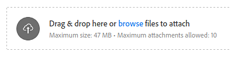

# Exportação do arquivo de registro

Esta página explica como localizar o arquivo de log do aplicativo e como compartilhá-lo para solicitar suporte.

## Recuperando o arquivo de log

Há duas maneiras de obter o arquivo de log:

### Exportando o arquivo de log do aplicativo

O arquivo de log pode ser exportado diretamente do aplicativo indo para o menu **Ajuda** e selecionando a ação **Exportar log**.

### Recuperando o arquivo de log manualmente no disco

Se o aplicativo não for iniciado, não será possível exportar o arquivo de log. Felizmente, o arquivo de registro pode ser localizado manualmente no disco. Navegue para a pasta correspondente ao seu sistema operacional abaixo e recupere o arquivo **log.txt** manualmente.

<table data-preserve-html="true"><colgroup> <col/> <col/> <col/> <col/> </colgroup><tbody><tr><th>Plataforma</th><th>Versão</th><th colspan="2">Caminho</th></tr><tr><td rowspan="4"><strong>Windows</strong></td><td rowspan="2"><strong>7.2</strong> ou mais recente</td><td colspan="1">Dados do aplicativo (local)</td><td colspan="1">C:\Users\[nome do usuário]\AppData\Local\Adobe\Adobe Substance 3D Painter</td></tr><tr><td colspan="1">Dados de Aplicativo (roaming)</td><td colspan="1">C:\Users\[nome do usuário]\AppData\Roaming\Adobe\Adobe Substance 3D Painter</td></tr><tr><td rowspan="2">Legado</td><td colspan="1">Dados do aplicativo (local)</td><td colspan="1">C:\Users\[nome do usuário]\AppData\Local\Allegorithmic\Substance Painter</td></tr><tr><td colspan="1">Dados de Aplicativo (roaming)</td><td colspan="1">C:\Users\[nome do usuário]\AppData\Roaming\Allegorithmic\Substance Painter</td></tr><tr><td rowspan="2"><strong>Mac</strong></td><td colspan="1"><strong>7.2</strong> ou mais recente</td><td colspan="2">/Users/[nome do usuário]/Library/Application Support/Adobe/Adobe Substance 3D Painter</td></tr><tr><td colspan="1">Legado</td><td colspan="2">/Users/[nome do usuário]/Library/Application Support/Allegorithmic/Substance Painter</td></tr><tr><td rowspan="2"><strong>Linux</strong></td><td colspan="1"><strong>7.2</strong> ou mais recente</td><td colspan="2">/home/[nome do usuário]/.local/share/Adobe/Adobe Substance 3D Painter</td></tr><tr><td>Legado</td><td colspan="2">/home/[nome do usuário]/.local/share/Allegorithmic/Substance Painter</td></tr></tbody></table>

>[!NOTE]
>
> Alguns dos diretórios nos caminhos mencionados acima podem estar ocultos por padrão. Digite o caminho manualmente no explorador de arquivos ou exiba arquivos ocultos para exibi-los.

## Anexando o arquivo de registro a uma mensagem da comunidade para suporte

Ao escrever uma mensagem, use a área de anexo para inserir o arquivo de registro:

