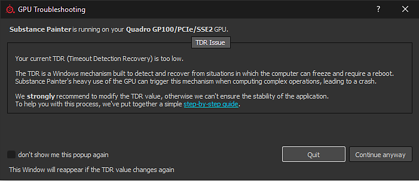
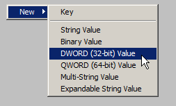

# Os drivers da GPU falham com cálculos longos (falha de TDR)

{zoomable="yes"}

No Windows, essa janela será exibida se o Substance 3D Painter detectar que o valor TDR atual está abaixo de um limite específico (10 segundos).

<table>
<tr style="border: 0;">
<td style="border: 0;" valign="top">

## Por que o driver da GPU trava?

</td>
<td style="border: 0;" valign="top">

### Como editar os valores TDR

</td>
<td style="border: 0;" valign="top">

### Reverter valores TDR para padrões

</td>
</tr>
</table>

## Por que o driver da GPU trava?

Para impedir que qualquer renderização ou computação de GPU **bloqueie o sistema**, o sistema operacional Windows **elimina o driver de GPU** sempre que uma renderização levar mais do que alguns segundos. Quando o driver é eliminado, o aplicativo que o utiliza trava automaticamente. Não é possível saber quanto tempo uma tarefa de renderização ou um cálculo pode levar (depende da GPU, dos drivers, do sistema operacional, do tamanho da malha, do tamanho da textura etc.), portanto, não é possível colocar um limite em quanto o computador deve processar e evitar a falha no nível do aplicativo.

No Windows, há uma **chave** **do Registro** que especifica quanto tempo o sistema operacional deve esperar antes de eliminar o driver de GPU. Os aplicativos não estão autorizados a modificar essa configuração diretamente, esse procedimento deve ser feito manualmente (veja abaixo).

Para obter mais informações, consulte a documentação oficial: <https://docs.microsoft.com/en-us/windows-hardware/drivers/display/tdr-registry-keys>.

### Lista de teclas que precisam ser alteradas

Para ajustar o TDR, basta aumentar o Atraso do TDR: altere **TdrDelay** e **TdrDdiDelay** para um valor mais alto (como 60 segundos).

{zoomable="yes"}

>[!NOTE]
>
> Observe que essas Chaves podem ser redefinidas para o valor padrão por atualizações do Windows ou atualizações de Drivers de GPU.

## Como editar os valores TDR

Siga este procedimento para alterar o valor do TDR.

***Observe que duas chaves diferentes deverão ser criadas/editadas.***

>[!WARNING]
>
> Observe que a edição do registro pode ter consequências graves e inesperadas que podem impedir o sistema de iniciar e exigir a reinstalação de todo o sistema operacional se você não tiver certeza de como modificá-lo. As chaves de registro mencionadas nesta página, no entanto, não devem criar esse tipo de problema.
> 
> O Adobe não se responsabiliza por quaisquer danos causados ao seu sistema ao modificar o registro do sistema.

### 1 - Abra a janela Executar

Clique em **Iniciar** e em **Executar** (ou pressione a tecla **Windows** e **R**). Isso abrirá a janela **Executar**.

{zoomable="yes"}

### 2 - Inicie o Editor de registro

Digite **regedit** no campo de texto e pressione **OK**.

{zoomable="yes"}

### 3 - Navegue até a chave de registro GraphicsDrivers

A janela do registro será aberta.\
No painel esquerdo, navegue na árvore até a tecla **GraphicsDrivers** acessando:

```
Computer\HKEY_LOCAL_MACHINE\SYSTEM\CurrentControlSet\Control\GraphicsDrivers
```


Certifique-se de **permanecer** em “GraphicsDrivers” e **não clicar** nas **chaves do Registro abaixo** antes de seguir para as próximas etapas.

+++&#39;GraphicsDrivers&#39; na árvore do Registro do Windows
{zoomable="yes"}


+++

### 4 - Adicionar ou editar o valor TdrDelay

>[!NOTE]
>
> Se o valor <b>TdrDelay</b> <b> ainda não existir</b>, clique com o botão direito do mouse no painel direito e escolha <b>Novo > Valor DWORD (32 bits)</b> . Nomeie-o “<b>TdrDelay</b>”. Caso seja importante, siga-o (e verifique se não há outros caracteres, como um espaço à direita).
> 
> 

No **painel direito**, clique duas vezes no valor **TdrDelay**. Altere a configuração **Base** para **Decimal**. Defina o valor para algo diferente do **2** padrão (recomendamos **60**).

Esse valor indica em segundos quanto tempo o sistema operacional aguardará antes de considerar que a GPU não responde durante um cálculo.

Valor DWORD de &#39;TdrDelay&#39; ![ no Editor de Registro do Windows Valor DWORD de &#39;TdrDelay&#39; no Editor de Registro do Windows "){zoomable="yes"}] (../../../assets/tdrdelay-edit.png "

### 5 - Adicionar ou editar o valor TdrDdiDelay

>[!NOTE]
>
> Se o valor <b>TdrDdiDelay</b> <b> não existir</b>, clique com o botão direito do mouse no painel direito e escolha <b>Novo > Valor DWORD (32 bits)</b> . nomeie-o como &quot; <b>TdrDdiDelay</b> “. Caso seja importante, siga-o (e verifique se não há outros caracteres, como espaços).
> 
> 

No **painel direito**, clique duas vezes no valor **TdrDdiDelay** . Altere a configuração **Base** para **Decimal**. Defina o valor para algo diferente do **5** padrão (recomendamos **60** ).

Esse valor indica em segundos quanto tempo o sistema operacional aguardará antes de considerar que um software levou muito tempo para deixar os drivers de GPU.

**Hexadecimal** é o valor padrão. Basta alternar para **decimal** para exibir o valor correto. Observe que **3C** (Hexadecimal) é igual a **60** (Decimal).

### 6 - Concluir e reiniciar

O painel direito agora deve ter esta aparência:

{zoomable="yes"}

**Feche** o Editor do Registro. **Reinicie** o computador usando **Iniciar** e **Reiniciar**.

O TdrValue é examinado somente quando o computador é iniciado, portanto, para forçar uma atualização, é necessário reinicializar.

Se o aplicativo ainda travar ao fazer um cálculo longo, tente aumentar o atraso (em segundos) de 60 para 120, por exemplo.

## Reverter valores TDR para padrões

Há duas maneiras de reverter o TDR para seus valores padrão:

* Defina o **TdrDelay** como **2s** e o **TdrDdiDelay** como **5s**, seguindo as etapas descritas acima.
* Ou **Remova** as chaves **TdrDelay** e **TdrDdiDelay** da entrada do Registro.
