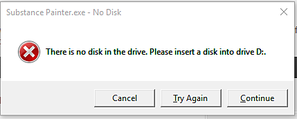

# Erro: não há nenhum disco na unidade

No Windows, às vezes você pode encontrar este erro:

“Não há nenhum disco na unidade. Insira um disco na unidade X.”

Há algumas coisas para verificar para se livrar deste erro:

* Verifique se a configuração das letras de unidade está correta (consulte <https://support.microsoft.com/en-us/kb/330137> )
* Verifique se qualquer local anterior usado no Substance 3D Painter é válido (como a lista “Arquivos recentes”)
