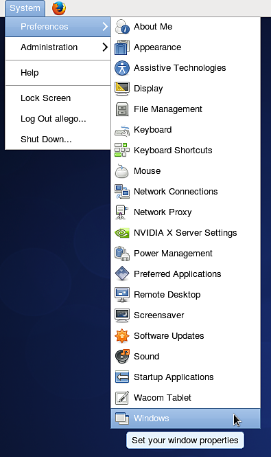

# Impossível usar o atalho de teclado ALT no Linux

Se você estiver executando uma distribuição Linux (**Ubuntu** ou **CentOS**) que usa o **Gnome** como interface do usuário, convém desabilitar o comportamento padrão da chave **ALT** para poder navegar no visor.

## CentOS

1 - Vá para **Sistema > Windows**

{width="250px"}

2 - Altere a configuração da “tecla de movimento” para algo diferente de &quot; **Alt** “. Por exemplo, use &quot; **Super** &quot; (para escolher a tecla “Windows” do teclado).

{width="350px"}

## Ubuntu

1 - Abra um terminal e execute o seguinte comando:

```
sudo apt-get install dconf-tools
```


Isso instalará uma ferramenta de configuração avançada; talvez seja necessário permitir a instalação de dependências adicionais para poder executá-la.

2 - Abra o menu Iniciar e procure &quot; **Dconf-tools** “. Abra-o.

3 - Expanda o menu de árvore à esquerda, indo para a seguinte rota: **org > gnome > desktop > wm > preferências**

4 - Edite o “modificador do botão do mouse” e altere seu valor. Defina-o ou, em vez disso, *não deixe-o vazio*. Super é um equivalente à tecla “Windows”.

{width="500px"}
