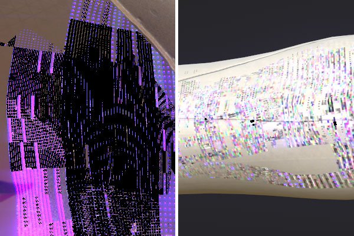
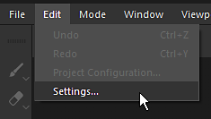
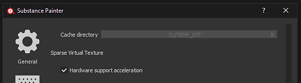
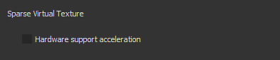
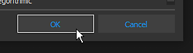
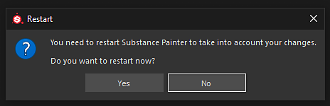

# Artefatos de blocos aparecem nas texturas da viewport

A partir da versão 2018.3.0, os seguintes tipos de artefatos podem aparecer no visor:

{width="400px"}

Esses artefatos estão relacionados a problemas com drivers de GPU Nvidia.\
Para evitar os artefatos, o suporte de hardware Texturas Virtuais Esparsas precisa ser desativado.

Os **Drivers 440.97** da GeForce agora **corrigiram esse problema**. Recomendamos atualizar para esses drivers e manter a SVT ativada para obter bons desempenhos.

Novos drivers estão disponíveis no site da Nvidia: <https://www.nvidia.com/Download/index.aspx>

## Desativando a aceleração de Hardware de Texturas Virtuais Dispersas

### 1 - Inicie o Substance 3D Painter e abra as Configurações

Abra as Configurações principais em Editar > Configurações.

### 2 - Localize a seção denominada “Texturas virtuais dispersas”

Dentro da seção “Geral”, role para baixo e encontre a subseção chamada “Texturas virtuais esparsas”

### 3 - Desmarque a configuração

Desative a configuração “Aceleração do suporte de hardware” desmarcando-a.

### 4 - Validar e reiniciar o Substance 3D Painter

Valide a alteração clicando no botão “OK”.

Reinicie o Substance 3D Painter clicando no botão “Sim” para aplicar a alteração.
