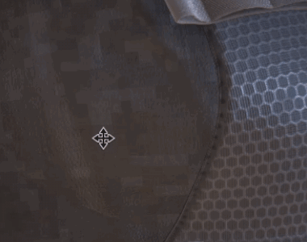

# A malha flash para branco ao mover a câmera

{width="300px"}

Com projetos antigos que se movem pela câmera no visor podem mostrar rapidamente flashes brancos criados por texturas brancas/vazias. Isso ocorre porque o sistema SVT (Texturas Virtuais Esparsas) [depende de configurações de sombreador específicas que shaders mais antigos não usam.](https://substance3d.adobe.com/display/DRAFTPAINTER/Sparse+Virtual+Textures)

Para se livrar do flash branco, basta **atualizar** o **sombreador do projeto**:

* Para **sombreadores padrão**: siga o procedimento passo a passo na página [Atualizando um sombreador](../../../interface/shader-settings/updating-a-shader.md).
* Para **sombreadores personalizados**: observe a(s) mensagem(ns) de erro no log e na página [API de sombreamento](https://helpx.adobe.com/br/substance-3d/unlisted/documentation/spdoc/custom-shader-api-89686018.html).
