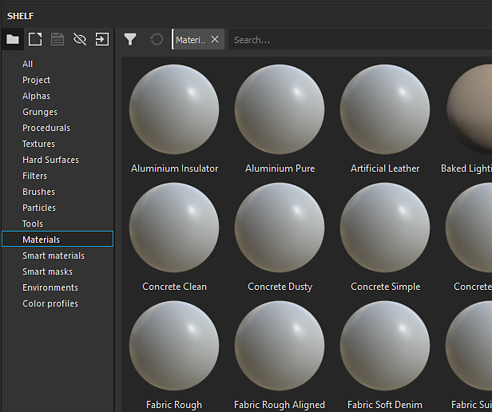
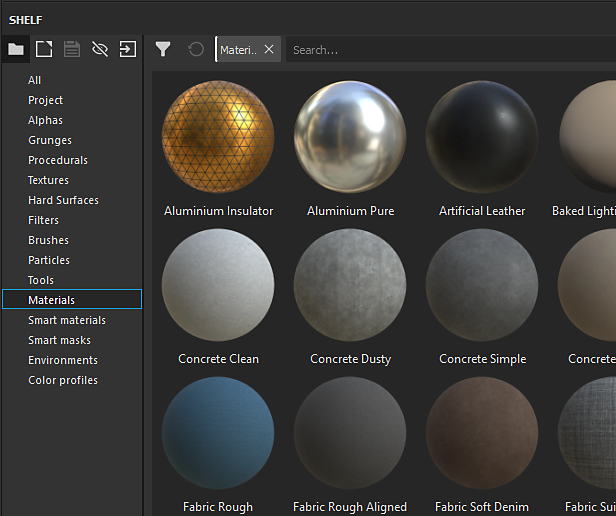
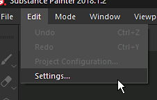
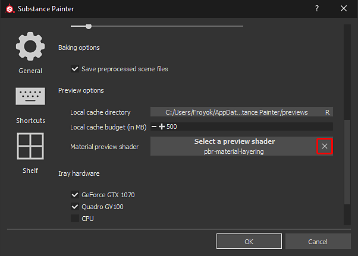

# As miniaturas na prateleira parecem incorretas

Se as miniaturas na prateleira parecem ser diferentes do habitual, pode ser por causa do sombreador usado para renderizar as visualizações.

| Miniaturas quebradas | Miniaturas normais |
| --- | --- |
| 

 | 

 |

## 1 - Abra a janela principal de configurações

Vá para **Editar** e clique em **Configurações**:

## 2 - Remover o sombreador de visualização da prateleira

Na exibição **Geral**, role para baixo até que a seção “Opções de visualização” esteja visível.\
Clique no botão **cruz** em frente ao &quot; **Sombreamento de visualização do material** &quot; para remover o sombreador atual especificado.

{width="450px"}

## 3 - Reiniciar o Substance 3D Painter

Para regenerar as miniaturas para que elas pareçam corretas, o Substance 3D Painter precisa ser reiniciado.
