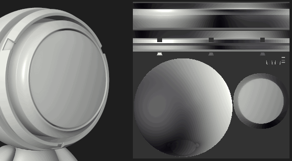

# Pintar sangrias da ferramenta em outras Ilhas UV

Alguns comportamentos padrão da [ferramenta de pintura](../../../features/effects/paint.md) podem parecer não intuitivos em algumas situações específicas. O Substance 3D Painter é um aplicativo que funciona principalmente no espaço 3D, o que também se aplica à pintura. A configuração padrão do pincel de pintura é tentar ser perfeita nos UVs ao pintar. É por isso que, ao interagir com a visualização 2D, alguns resultados podem parecer inesperados.

Para evitar a sangria em outras Ilhas UV ao pintar na exibição 2D, basta alterar a configuração **Alinhamento** nos parâmetros da ferramenta:

| *Modo de alinhamento* | *Visualizar* |
| --- | --- |
| **Quebra automática de tangente** | 

 |
| **UV** | 

 |
